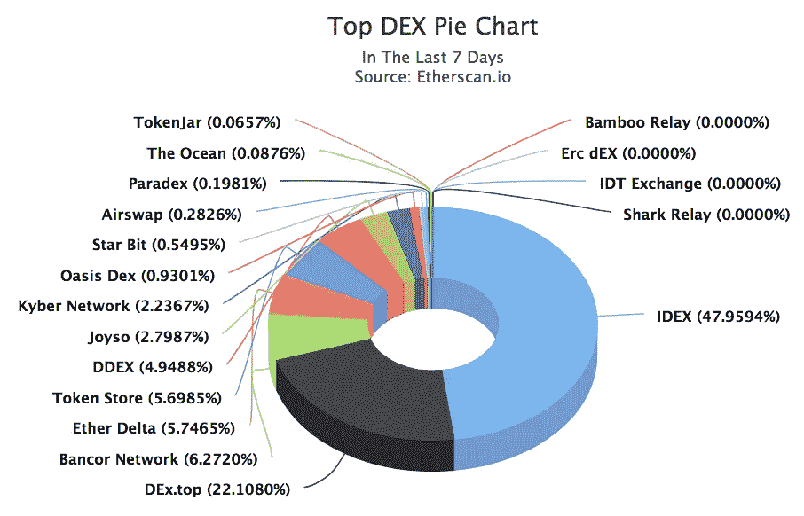
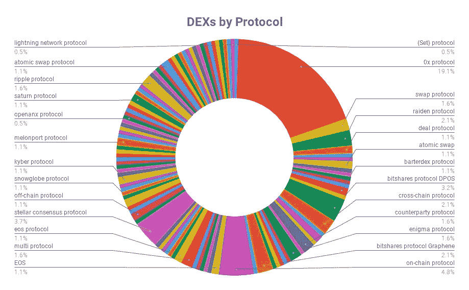

# 我分析了 258 个分散的交易所，这是我的发现

> 原文：<https://medium.com/hackernoon/who-will-run-the-decentralized-exchange-of-the-future-59e9cd29b1ba>

***TL；DR:现在世界上有超过 250 个分散的交易所。这些是成为第一的障碍。***

、交易量最大的收费集中式加密货币交易所[*日*10.7 亿美元](https://techcrunch.com/2018/09/25/binance-looks-to-the-future/)[最近宣布](https://techcrunch.com/2018/09/25/binance-looks-to-the-future/)其有意进入竞争异常激烈的分散式交易所(DEX)市场。尽管币安的规模和知名度很高，但它不会成为 2019 年领先的 DEX。

为什么？

币安肯定会邀请其现有用户使用其新的 DEX 来帮助启动流动性。然而，这不会成为竞争优势。如今，流动性问题已经通过 dex 聚合器得到解决，如[DEX DEX platform](https://medium.com/u/9eb2df0c22af?source=post_page-----59e9cd29b1ba--------------------------------)(DEX DEX)[easy trade . io](https://easytrade.io/)聚合来自多个 DEX 的订单。根据该网站:

> “Dexdex 搜索多个交易所、协议和做市商，确保您始终获得最佳价格。它还为任何人提供了产生自己流动性的工具。”

他们的技术也是开源的，在 GitHub 上。

# 进入 DEX 聚合器

这一点很重要，因为 Dexdex 实际上汇总了一些 0x 继电器订单，以添加到其自己的虚拟流动性池中。0x 是用于交易以太坊(ERC20)数字令牌和资产以及汇集流动性的协议。当今许多顶级 dex 都使用它的技术。RadarRelay(运行在 0x 协议上)和 ForkDelta 是其流动性来源之一。ForkDelta 已经从 EtherDelta 获得了大部分流动性。所以 Dexdex 就像是聚合器的聚合器。想象一下能够将所有指数的流动性相加。这不完全是一个零和游戏，而是一个不断扩大的馅饼:

The ultra-competitive race for the DEX market (by % of trade volume among DEXs).

# 流动性是一个滑坡

当今大多数 DEX 面临的两大挑战是流动性和 UX。在未来几年内，将赢得大众支持的指数将拥有币安和比特币基地 UX 的流动性。问题在于，整个 dex 缺乏标准化——没有共同的交易和流动性协议。这就是为什么大多数 dex 的流动性和交易量都很低——它们根本没有共享一个共同的流动性池。今天有许多项目试图解决这个协议问题。目前，该领域 DEX 集成合作伙伴数量最多的是 [0x 协议](https://0xproject.com/)，该协议很有可能在 2019 年成为该标准。

为什么？

我分析了一个 [Github 数据库](https://github.com/distribuyed/index)中现存的 258 个已知索引(是的，有 258 个！)并移除了 70 个 dex，而没有已知或公开发表的方案，留下 188 个 dex。然后，我在下面的饼状图中绘制了这一点，以便更好地可视化。这些交换缺乏标准化的协议是惊人的。有超过 24 种不同的协议！领先的是 0x，它使**今天的这些指数中超过 19%** :

DEXs by protocol (Source: [https://github.com/distribuyed/index](https://github.com/distribuyed/index))

当涉及到信任潜在的解决机制时，大多数人都不想做自己的尽职调查。交易结算是交易被确认并提交给以太坊区块链的方式)。 [0x](https://medium.com/u/109d6442eba6?source=post_page-----59e9cd29b1ba--------------------------------) 为任何使用 0x 协议的非连锁订单的继电器无缝地执行此操作。换句话说，0x 协议全面标准化了这种“DEX 即服务”功能，而不是数百种未来的 DEX 各自拥有自己的贸易结算技术。这让 0x 有机会成为以太坊智能合约的指数。

# 未来的挑战

我认为 Dexdex/EasyTrade 模式的一个主要挑战是 Expedia 在成为酒店价格搜索工具时遇到的同样问题。任何人都可以创建聚合器，但除非你有数百万美元的营销预算，否则你必须增加一些其他价值，否则任何人都可以成为聚合器。我相信 UX 将是几个关键的竞争优势之一。如果你从来没有交易过指数，它对用户来说并不友好。如果你是加密货币交易领域的新手，我不建议你这么做。

然而，随着币安进军 DEX 领域，它仍将是一个令人生畏的玩家。它计划通过拥有许多为自己的区块链供电的节点来赚钱。币安拥有知名度、营销资金和信任(如果我们可以将信任定义为他们已经为其用户处理了 140 万 TPS)。

我认为，在 2019 年，领先的指数将:
1)总流动性。
2)UX 有杀手锏。
不要轻信。
4)收费低廉甚至免费。
5)具备自动订单撮合和即时交易功能。
6)利用网络效应促进增长。

0x 提供了这种久经考验的协议，并允许从其继电器中聚合流动性。这使得 Dexdex(我与他们没有任何利害关系)处于一个可以与币安创造的任何“dex”竞争的位置，当然它可以获得更多的曝光。

今天的许多 DEX 的费用是双重的——首先是确认以太坊网络上的交易的汽油费和 DEX 费。币安 DEX 将要求以 BNB 代币支付其区块链交易的费用。福克德尔塔收费 0.03%。Radar Relay 只收取汽油费，尽管该公司表示，一旦获得更多牵引力，它将在未来收取费用。

未来成功且可持续的 DEX 将不会收取用户费用，就像 Expedia 不会收取用户费用一样。一旦交易所或 DEX 获得足够的交易量，新的盈利机会就会出现。与此同时，为了避免大量的天然气费用，订单的关键组成部分(竞价匹配、余额查询、交易历史、限价订单)可以被侧链(区块链的侧链技术，如 [Loom Network](https://medium.com/u/9f7a25569a7c?source=post_page-----59e9cd29b1ba--------------------------------) ZombieChain 将是一个很好的选择)。再加上算法或机器人交易等高级功能缺乏速度和功能，大多数 dex 可能还不是高频或日内交易者的选择，他们的需求比普通散户更复杂。

DEX 的发展仍处于早期阶段，IDEX、科莫多和 Stellar 等主要公司已经开始采用巧妙的替代解决方案，如混合交换和原子交换。

2019 年哪个 DEX 会获得市场的大头？现在下结论还为时过早。指数的技术突破正在成为新的常态。就目前而言，我们预测未来指数的最佳方法可能就是跟着钱走。最好还是跟随流动性。