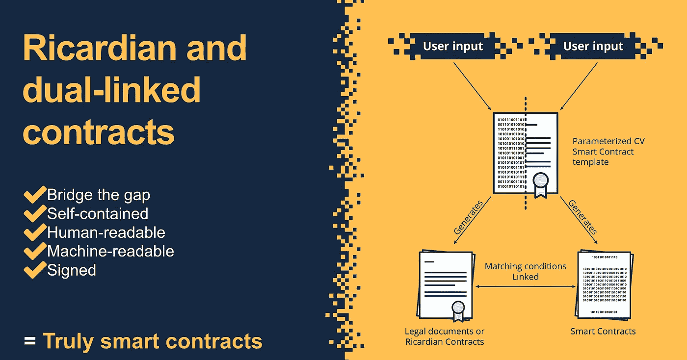

# 谁会害怕又大又坏的智能合同呢？

> 原文：<https://medium.com/hackernoon/whos-afraid-of-the-big-bad-smart-contract-3f174d50708e>

你肯定听说过他们——提到他们时，既敬畏又害怕。

智能合约。oooooooh…

纯代码驱动的技术奇迹，由以太坊、Vitalik Buterin、Joe Lubin、Gavin Wood 等人的天才发明并推广。

以太坊智能合约的原始潜力在去年得到了展示，因为它们推动了 ICO 热潮，全球各地的初创公司都在探索如何使用它们来处理从旅游保险到租赁押金的一切事情。

然而……

在所有炒作和惊叹的背后，隐藏着对智能合约的怀疑:

“我这会让我失业吗？”会计师说。

“它们真的合法吗？”律师说。

真的，你不能相信这样的一段代码这位保险业高管说。

是的——智能合约听起来很危险——在很多层面上。对许多人来说，他们就像一只大灰狼——准备吞噬他们的生意、金钱和生计。

**【提示:有人正在努力让智能合约少一些可怕，多一些有用。下面有更多关于契约金库的信息…]**

但这不是真的——你(或其他任何人)都不必害怕它们。

原因如下…

# 法律上的事情

先说事情的法律方面。

智能合同(本身)没有法律约束力。

> 换句话说，代码不是法律。

句号。

要使合同具有法律约束力，它必须对人——律师、法官和同意它的当事人——是可读和可访问的。

所以——律师可以松一口气了，对吧？

算是吧。

# 另一个

虽然律师和有大量协议的企业可能不必担心代码会突然将他们从地球上消除——但这并不意味着他们不应该担心。

使用智能合同技术实现自动化的潜力是真实的。目睹了法律技术崛起的有远见的律师们已经知道了这一点。

> 这让他们彻夜难眠。

硬币的另一面是，那些为自己看到智能合同潜力的人——但没有技术技能——害怕潜入区块链科技这个勇敢的新世界……这是理所当然的。

毕竟，在应用程序中加入智能合约并不是一件容易的事——如果出错的话还会非常危险！

# 消除恐惧因素

一个小小但重要的安慰，尤其是对法律专业人士来说，是智能合同本身并不具有法律约束力。换句话说，如果它被用作双方之间合同协议的唯一来源，它在法庭上是站不住脚的。

这意味着大规模脱离传统法律协议的危险微乎其微。所有合同突然被转换成一堆杂乱无章的代码，只有少数人能够访问和理解，这种前景是不会发生的。

顺便说一下，这是契约库的**基本原则之一:智能契约不是真正智能的，也不是真正的契约，除非它们以双重链接(李嘉图)契约的形式链接到法律散文。**

如果我们采取这种方法——目前，这是唯一合理的方法——那么更容易理解的是，更小、更简单的智能合同元素被添加到人类和机器可读的数字协议中，并以完美的和谐方式运行。

此外，还有另一个步骤来消除智能合约附带的恐惧因素 Contract Vault 使这一步骤变得容易。

许多怀疑和恐惧经常伴随着智能交易合同的使用——毕竟你把金钱和价值托付给了代码(我们都知道代码可能会被黑客攻击……)。

这就是为什么审计智能合同以确保其安全性是绝对必要的。

由于与瑞士创业公司[**chain security**](http://www.chainsecurity.com)的合作，Contract Vault 平台将为用户提供安全可靠的智能合同模板。

# 契约保险库的真正智能

但是什么能真正让人们“度过难关”,不再害怕使用智能合同技术呢？

简单—使其易于使用。

## 聪明——真正的聪明。

实际上，这就是契约跳马的意义所在。Contract Vault 平台的每个组件都被设计为“智能的”:

1.  **SmartEdit**—Contract Vault 的合同构建功能，允许用户将法律散文转换为数字形式，自定义条款，并向*李嘉图合同*中添加智能合同元素，这些合同元素可以被人类和机器阅读
2.  **SmartML** —用于创建双重链接“真正智能”合同的开源合同库标记语言。用户不需要自己学习 SmartML，而是利用它作为 SmartForm 界面中合同定制的基础
3.  **smart form**—一种易于使用的合同草案模式，用于输入变量和触发条件，以根据合同模板创建合同。
4.  **SmartTemplates** —使用 SmartEdit 功能的用户工作输出。SmartTemplates 可以上传到 Contract Vault marketplace，在 Contract Vault 平台的私有实例中流通(适用于使用白标解决方案的律师事务所或企业)
5.  **智能档案** —该功能为可能使用多个合同作为业务解决方案一部分的企业提供服务。SmartTemplates 及其变量链接在一起，因此只需输入一次。

虽然上面列出的功能可能看起来是一个普通的数字用户界面，但它实际上比那要强大得多。它允许 Contract Vault 用户将智能合同添加到正在创建的数字合同中，而无需成为技术向导。

# 变聪明

那么它到底是如何工作的呢？

让我们想象一下，一家软件公司 **(SoftPro)** 想要将其软件授权给不同的经销商。

为此，他们需要一份经销商协议，一旦最终用户开始使用基于云的服务，该协议就会触发支付。由于这将是**一项基于使用的服务**，支付给经销商的费用由登录软件门户触发。

> SoftPro 希望实施智能合同来记录服务的登录和使用情况，并以不变的方式跟踪其各个经销商的使用情况。

该公司认为，虽然支付可能不会以加密货币进行，但利用智能合同来记录软件登录的时间戳将有助于它跟踪经销商的收入，并帮助它根据业绩更好地与他们谈判条款。

然而，SoftPro 没有一个人是区块链开发者。他们宁愿不花钱请律师来创建和检查他们需要的每一份经销商协议。

## 所以——他们使用[契约金库](http://www.contractvault.io) …

## **第一步。**

SoftPro 客户经理(或内部法律顾问)将登录合同库平台。在仪表板上，他或她将搜索 SoftPro 管辖区(在这种情况下，让我们说德国)的软件许可协议。基于附加到 CV 平台中模板的元数据，他找到了一个。

## **第二步。**

使用 SmartEdit 功能，客户经理可以处理协议条款，以反映他或她需要的条款。得益于易于使用的界面，经理不必手动操作合同库 SmartML(标记语言)。

SmartEdit eliminates the need for users to dig into too much code.

## **第三步。**

仍然使用 SmartEdit 功能，客户经理将智能合同调用添加到条款中，定义每次使用软件要支付的条款和金额。

SoftPro 需要的智能合约代码片段(模板形式)是一个通用片段，由为平台做出贡献的智能合约开发人员创建。(由于 SoftPro 付费创建其智能模板，**开发人员将因其贡献给**合同库平台的智能合同代码而得到补偿。)

如前所述，SoftPro 客户经理不是开发人员，因此编辑智能合约的代码以反映所需的参数和变量是不可能的。

## **第四步。**

现在合同的法律条文已经准备好了，根据 SoftPro 的需求进行了定制，整个模板是数字形式的，这意味着它可以被人和机器阅读。

## **第五步。**

当然，创建的 SmartTemplate 还不是一个协议。它必须用于创建实际的合同。这就是智能表单草稿模式的用武之地，它允许经理快速输入与实际协议相关的必要数据(姓名、日期、金额等)。例如，在 SmartForm 字段“辖区”的情况下，Contract Vault 系统会自动更改法律提案中包含的必要条款，以便与合同将被使用的辖区相匹配。

## **第六步。**

从 Contract Vault 仪表板中，SoftPro 客户经理选择使用 ChainSecurity 自动审计服务审计 SmartTemplate 的智能合同元素。

## **第七步。**

SoftPro 现在有一个具有法律约束力的协议，它可以下载为 PDF 格式(如果需要，出于备份原因)，自己进行数字签名，并发送给经销商进行数字签名。SoftPro 将为其创建的智能模板支付一笔费用(使用 VLT 代币)—这笔费用的一部分将支付给法律内容提供商，由其上传协议的框架法律散文，另一部分将支付给智能合同开发人员，由其将代码模板添加到合同库市场。

> **特别说明:**该 SmartTemplate 可在每份经销商协议中重复使用，SoftPro 甚至可以从协议集合中创建 smart filoral。
> 
> 如果其定价模式发生变化，SoftPro 客户经理可以在 SmartTemplate 中更改一次变量，从而“更新”smart filoral 中的所有协议。

这就是你想要的——没有恐惧，没有烦恼！只需 **#trulysmart** 合同按照业务发展速度工作，就像他们需要的那样！

## *跟随契约金库上* [*推特*](https://twitter.com/Contract_Vault)*[*电报*](https://t.me/cvchat)*[*中型*](https://medium.com/contract-vault)*[*领英*](https://www.linkedin.com/company/11293132/) *和* [*脸书*](https://www.facebook.com/contractvault.io/) *！****

## ***在这里阅读* [*白皮书*](https://www.contractvault.io/files/Whitepaper.pdf) *。***

# ***支持* [*金库代币出售*](https://www.contractvault.io/token/) *为好！***