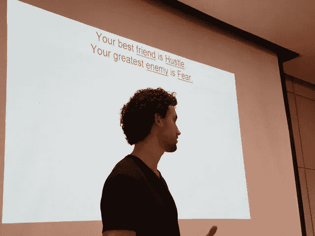

# 谁在你们的共同进步俱乐部里？没有人吗？2019 年—开始一个。

> 原文：<https://medium.com/hackernoon/whos-in-your-mutual-improvement-club-no-one-in-2019-start-one-29d483e878dc>

## 这篇文章的一个版本曾出现在《福布斯》杂志上。

Sieva Kozinsky

我以前的一个学生，Sieva Kozinsky， [StudySoup](https://studysoup.com/) 的联合创始人兼首席执行官，最近与我在[加州大学圣巴巴拉分校](https://tmp.ucsb.edu/)的学生分享了他对创业的见解。Sieva 目前正在沃顿商学院学习企业家精神，同时在一个学生领导的风险投资基金担任普通合伙人。

在他引人入胜的演讲中，他向我的学生提出了一系列令人信服的建议。然而，让我印象深刻的是，在毕业和开始创业生涯之前，管理他们的同龄人群体是非常重要的。他举例描述了 Junto Club，这是他参与创建的一个湾区组织，其目标是促进成员的职业和个人发展。Sieva 的俱乐部是基于本杰明·富兰克林创建的一个类似团体。

**“你是和你相处时间最长的五个人中的平均水平”**吉米·罗恩，励志演说家

像西瓦一样，本·富兰克林知道维护友谊的重要性。他在他的传记中描述了他的 Junto 俱乐部，如下:*“…我把我的大多数聪明的朋友组成了一个共同进步的俱乐部，我们称之为 Junto；我们在星期五晚上见面。我起草的规则要求每个成员，在轮到他的时候，应该提出一个或多个关于道德、政治或自然哲学的问题，由公司讨论；每三个月写一篇文章，读一读自己写的，关于任何他喜欢的话题。我们的辩论将在一位总统的指导下，本着真诚的探索真理的精神进行，不喜欢争论，也不渴望胜利……”*

Sieva 的 Junto 俱乐部的更新版本没有 Franklin 先生的正式，尽管他的相互启发的目标是相同的。像 Franklin 一样，Sieva 培养了一批兴趣和专业领域各异的初创公司创始人和技术高管，从非洲最大的公用事业公司之一的创始人，到以超过 1 亿美元的价格出售企业的首席执行官(了解更多关于湾区 Junto Club 的 tweet Sieva[@ SievaKozinsky](https://twitter.com/search?f=users&q=%40SievaKozinsky))。

富兰克林 21 岁时就和他的四个商业朋友成立了共同进步俱乐部。它最终扩展到 12 个人，包括一个鞋匠，橱柜制造者，职员和富有的，退休的“绅士”这个小组每周五在一家酒馆聚会，酒精让他们的讨论变得轻松愉快。

**那又怎样？企业家为什么要关心？**

《好主意从何而来》一书的作者斯蒂芬·约翰森指出，在启蒙时代，咖啡店作为想法萌发中心的重要性。他的研究表明，大多数突破来自于小想法的碰撞，通过好奇、聪明的人之间的一系列对话，组合成大想法。这与孤独的发明家被关在实验室里体验顿悟的神话形成了对比。

约翰逊还指出，成功地将不同学科联系起来的创新者通常有多种爱好、不同的兴趣和多样化的个人网络。这些因素增加了将不同的预感组合成重大机遇的可能性。

Junto 俱乐部是为内心年轻的人设立的

圣巴巴拉城市学院的前院长和朋友彼得·麦克杜格尔是一个类似 Junto 俱乐部的成员，成员的年龄从 50 年代末到 80 年代初不等。虽然大多数成员都退休了，但他们以前和现在的职业包括教育工作者、律师、作家和建筑师。

他们每月聚会一次，就像富兰克林的小组一样，其中一名成员的任务是选择一个主题，进行研究，确定讨论问题，并在会议之前向小组分发材料。这个人然后领导讨论。最近的话题包括英国退出欧盟、朝鲜和川普总统任期。

根据彼得的说法，“这个群体也是衰老过程的‘现实试验场’。两名成员的去世，包括该组织的创始人，促使我们将‘生命终结问题’作为我们整体讨论的一部分。”

在管理你的 Junto 俱乐部时，个人和职业问题的结合是一个关键的考虑因素。严肃、正式的问题为讨论奠定了坚实的基础，但为了最大限度地提高相互改善的程度，这些小组应该有一种鼓励脆弱性以及讨论个人、隐私问题的亲和力。

彼得说:“我每周还会见六个人，一个房地产经纪人，三个心理学家/精神病学家和两个教育家。这个小组追踪我们生活中发生的社会和情感动态。我加入这个团体大约有 15 年了。这个团体比我每月聚会的“Junto”成员年轻，它为成员适应退休、家庭关系变化和日常生活带来的挑战提供了特殊的支持。这是一个很棒的团队，很受重视，也是对我每月一次以问题为导向的聚会的一个很好的补充。”

**我的 Junto 组**

我很幸运有两组朋友，他们挑战我，娱乐我，让我保持精神上的刺激。[过去我写过几次关于我的自行车教练的文章。](http://johngreathouse.com/entrepreneurs-feel-young-no-matter-your-age/)这群人包括两位退休的小学校长和一位高级工程主管，尽管他们有时会有错误的政治观点(是的，鲍勃，我说的就是你……)，但他们的人生经验和智慧不断激励和启发着我。

我也很荣幸成为每月午餐小组的一员，该小组包括两位已退休的《财富》500 强(Fortune 500)首席执行官、一位以近 2 亿美元出售一家企业并带领另一家企业成功 IPO 的企业家、一位多白金唱片制作人、一位编剧和一位前音乐行业高管。我们的非正式讨论包括当地和全国的政治、当天的事件、体育、娱乐新闻和一些彻头彻尾的八卦。

虽然我的两个小组都没有像彼得或富兰克林先生的聚会那样的正式议程，但它们确实为我提供了良好的幽默、智慧和友谊，这对充实的生活至关重要。

**DIY——创建自己的俱乐部**

列出五个你认为适合活跃的 Junto 俱乐部的朋友。优化以下人员:

*   有趣的
*   适意的
*   经历各异
*   合群且足够自信，能够坚定地分享他们的想法
*   谦虚到知道什么时候该安静

聚在一起，没有任何议程，除了玩得开心，交换一些挑衅性的想法，也许喝几杯成人饮料。根据小组的目标，议程可能会变得更加正式，由预先确定的主题驱动，或者仍然是自由交流随机想法。不管是哪种方式，通过一点管理，这个团体将成为一个由相互支持的朋友组成的大学网络，很像富兰克林先生的俱乐部，目的是追求“*共同进步。*”

*可以在推特上关注约翰:*[***@ johngreathouse***](https://twitter.com/#!/johngreathouse)*。*

*图片来源:作者*