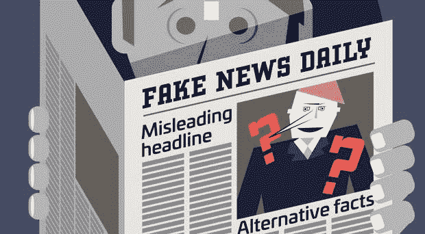

# 谁负责杜绝假新闻？

> 原文：<https://medium.com/hackernoon/whos-responsible-for-stomping-out-fake-news-39c1e2be81d6>

数百年前，当我们第一次开始组织自己进入城市时，每个相关人员的主要信息来源是通过参观寺庙、教堂和市场获得的。

人们会去当地的寺庙或在市场上与人们交谈，了解他们的国王的军队是否在下一个省赢得了战争，国王的家庭情况如何，是否有机会在国王的宫殿工作，以及国王是否善良和公正。

国王确保寺庙和教堂以及市场上的人们对他有好感，向寺庙提供大量捐款，并组织嘉年华会、集市和有利于市场商贩的游戏。

随着我们在技术上的进步和城市人口规模的增长，我们组建了政府和私营企业，发明了书籍、电视和广播，它们的生产和发行有时是私营的。

现在，收集信息的新形式是通过书籍、报纸、电视和广播。政府和其他有关人士和公司向这些平台的所有者支付大笔捐款(通过购买广告)，从而确保他们得到有利的报道。

今天，我们有类似的消费渠道，但创作和管理并不集中。任何人都可以在互联网上发布信息供其他人消费。这使得政府、公司和有影响力的内容创作者更难正面报道它们。

几百年前，我们可能不会得到太多的假新闻，因为如果人们发现他们在说谎，传播消息的牧师和市场商贩将在同胞中失去信誉，这可能导致他们失去工作和生计。但是，与此同时，人们去寺庙和市场不仅仅是为了新闻，还有许多其他的事情，比如买羊和向上帝祈祷。如果没有太多的选择，人们仍然会去消费假新闻和谎言，因为他们别无选择。

在电视、收音机和报纸的时代，我们可能没有太多假新闻，因为如果人们发现他们在说谎，所有者和出版商就会失去信誉，失去观众，从而失去收入。但是，与此同时，人们不仅消费大众媒体上的新闻，他们也花了很多时间消费娱乐。人们会继续这样做，即使他们发现这些媒体在说谎。

今天，谷歌和 T2【脸书也发生了同样的事情。人们仍然会涌向这些网站寻求联系和娱乐，即使他们发现自己被兜售假新闻。

因为，在一天结束的时候，很多人并不真的那么在乎他们听到的消息是真的还是假的。他们相信他们消费的东西。

假新闻有两个过滤器。

一个是在新闻发布者手中，他们可以选择客观地报道新闻，目的是告知和传播真相，而不是为自己获取权力或制造混乱。传统上，每当有一个脖子要掐的时候，比如一个寺庙牧师或一份大报，这种方法就很管用。因为他们害怕受到报复，失去收入、工作或影响力。

第二是在消费者手里，他们可以深入挖掘，从观点中辨别事实，提出好奇的问题并得出自己的结论。这在传统上并不奏效。

当两个过滤器都激活时，这是理想的情况，一切都很好。当发行商的滤镜打开，消费者的滤镜关闭的时候，还是够好的。虽然消费者自己无法辨别真实和虚构，但出版商只选择真实仍然会导致一个正确知情的社会。

当出版商的过滤器关闭而消费者的过滤器打开时，社会中就会出现广泛的无知，权力就会集中在出版商手中。从经验上看，当科学家质疑地球中心论或者地球不是平的或者上帝和来世的存在时，这种情况就会发生。这导致了对戴着过滤器的消费者的粗暴对待，确保许多人远离过滤器，只相信他们遇到的事情。虽然今天的后果不是直接的暴行，但它仍然是通过无效(或完全有害)的法律和政策的间接暴行。

当出版商的过滤器和消费者的过滤器都关闭时，只有主人和奴隶。在这种情况下，消费者是在奴役她的思想而不是她的身体。

这些年来，在消费者的过滤器方面，我们几乎一直处于相同的状态。许多人没有带滤镜，而有些人带了。

但近年来发生的变化是，出版商的过滤器已经脱落。因为出版商现在可以躲在所谓的分销商(谷歌，脸书)后面，永远不会暴露自己，以获得他们的消费者面前。这给兜售假新闻带来了很多好处，但实际上没有坏处。

出于这个原因，我支持政府强迫谷歌和脸书承担更多责任，成为一个瓶颈。

## 在你走之前…

如果你喜欢这个，请支持我的工作。你需要做的就是鼓掌。

[*跟我讨论美好生活的错综复杂。*](http://eepurl.com/cqwJZT)

[*读我的书*](https://www.amazon.com/s/ref=nb_sb_noss?url=search-alias%3Daps&field-keywords=mayantuyacu)