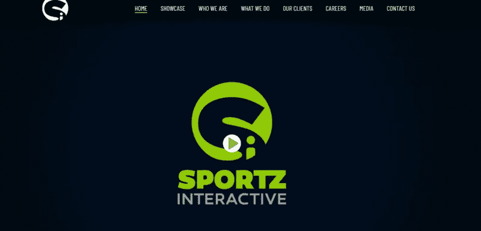

# 为什么 2019-20 是推出梦幻板球应用的最佳季节

> 原文：<https://medium.com/hackernoon/why-2019-20-is-best-season-to-launch-a-fantasy-cricket-app-b120e71480ad>

长久以来，板球爱好者一直对这项运动着迷。事实上，你会发现许多人认为它是一种宗教，而不仅仅是一种游戏。它的狂热在印度非常明显。难怪，梦幻板球平台 Dream 11 成功地在人们中间创造了如此巨大的存在。

## **梦幻板球应用的兴起**

Fantasy cricket 移动应用程序的平台充满了乐趣、兴奋、激情、期待，是的，最重要的是，球迷可以获得现金奖励和奖金。

印度是板球被崇拜的地方，球员被视为神一样的存在，所以当一个像 Dream 11 这样的**梦幻板球应用程序在板球爱好者和移动用户中获得巨大成功并不令人惊讶。**

这类游戏中的第一个，梦幻板球应用，Dream 11 是由孟买一家名为 [**Dream11 Inc.**](https://www.dream11.com) 的公司开发和概念化的。它实际上是一个虚拟游戏，球迷可以通过选择他们认为会比其他人表现更好的球员组成自己的球队。它使应用程序用户能够参与世界各地发生的板球比赛。虽然它作为梦幻板球应用程序获得了巨大的声望，但这款移动应用程序也提供 Kabbadi &足球梦幻运动。

*在全球范围内，梦幻体育移动应用已经成为一种趋势，70%的梦幻应用用户使用移动应用玩梦幻体育联盟，现在梦幻板球应用的趋势也在全球范围内迅速赶上。现在可能有一些幻想板球应用程序，如威廉希尔的* ***和梦想 11 的*** *，但现在越来越多的企业正计划推出自己功能丰富的幻想板球应用程序* ***。事实上，在接下来的几天里，板球爱好者们肯定会有很多关于梦幻板球的惊喜。***

# **梦幻板球移动应用的市场机遇**

Indian is the most prominent market

***“2017 年全年幻想 app 用户增长 18 到 20%。现在，预计到 2019 年，移动应用下载量将达到 3529 亿，而移动应用收入预计将在 2019 年达到 900 亿美元。”***

板球是一项在世界范围内成为十亿美元产业的运动，支撑着一个庞大的生态系统。事实上，今天的板球不仅仅是一项运动，而是一项大业务，包括板球赌博、联赛、企业、数十亿球迷、大品牌、名人等等。英格兰、印度、南非、新西兰、澳大利亚是重量级板球中心，紧随其后的是斯里兰卡、西印度群岛和巴基斯坦。

这些应用取得如此巨大成功的原因是，每个球迷不仅仅是一个爱好者，也是一个专家，没有比在幻想板球应用上展示这种专业知识更好的平台了

# **梦幻运动 app 如何工作**

用户喜欢这款在线游戏，它允许他们创建自己的板球梦之队，参加特定的比赛，然后应用程序用户可以根据所选球员在实际比赛中的表现来获得积分。当游戏结束时，分数被计算出来，然后用户可以将他们的表现与联盟中其他玩家的表现进行比较。

# 现在投资梦幻板球移动应用的有力理由

**永无止境的机会:**每年都会组织大量的板球赛事、锦标赛，如 IPL、Big Bash、ODI 比赛、测试赛等。因此，这类应用有着巨大的发展空间。

**竞争较小:**梦幻板球应用程序的概念仍然是新的，在这个竞技场的应用程序商店中没有太多可用的应用程序。因此，如果你在这个时候创建一个幻想板球移动应用程序，它将更容易让你感觉到你的存在，并赢得一个忠实的用户群。这样，你也可以在短时间内赚很多钱。

**合法:**在很多国家，像印度，板球赌博的概念是不合法的，然而，幻想板球应用程序被认为是合法的。因为它不是基本上，但实际上是一个技能游戏，因此被认为是合法的。这是 Dream11 获得如此巨大成功的最大原因之一，因为它获得了越来越多板球爱好者的支持。

**通过吸引新用户赚钱:**这些应用程序允许应用程序所有者每天吸引新客户，尤其是在板球联赛举办期间。在这个虚拟板球游戏中，应用程序用户选择球员，这些用户为他们虚拟创建的球队支付一定金额。通过这种方式，应用程序所有者可以赚钱，因为用户的中奖金额小于特定联盟收取的入场费。这种方式有一个很好的机会来创造一个巨大的客户群，赚很多钱。

# **为什么现在是投资幻想板球移动应用的正确时机？**

现在是开发一款梦幻板球手机应用的最佳时机。2019-20 年期间有许多板球赛事，因此，要想利用这种狂热并获得飙升的收入，你必须从幻想板球应用程序的**开发开始。**

# 重要的板球赛事将于 2019-20 年举行

***印度超级联赛:*** *IPL，由 BCCI 举办，每年举办一次，2019 年联赛第 12 赛季将于 3 月 29 日至 5 月 19 日期间举行。通常，20-20 IPL 在印度举行，但是，由于印度大选，预计 2019 年比赛的一部分也可能在阿拉伯联合酋长国举行。然后，明年 2020 年，将举行 IPL 第 13 赛季。*

*同样在 2018 年，由于全球观众的广泛参与，梦幻板球联赛的业务飙升，预计未来的联赛将有更高的参与率。*

## ***板球世界杯 ODI:***

*最大的板球赛事之一，国际 ODI 板球世界杯将于 2019 年举行。这将是第 12 届板球世界杯，由英格兰和威尔士主办，时间为 5 月 30 日至 7 月 14 日。这项活动每四个月举行一次，预计将打破所有与幻想板球业务相关的记录。*

## ***大痛击联盟:***

*本次澳大利亚职业 T-20 板球联赛第八赛季于 2018 年 12 月 19 日开始，将于 2019 年 2 月 17 日结束。这又是一次重要的板球赛事，预计在这次联赛中会有大量的板球爱好者参加。此外，它每年都举行，因此在这个舞台上也有巨大的机会。*

## **世界杯 T-20:**

这项赛事每两年举行一次，下一届比赛将是第七届世界杯 T-20，将于 2020 年举行。此次由 ***澳大利亚主办，时间为 2020 年 10 月****18 日至 11 月 15 日。*

随着众多板球赛事的到来，是时候投资一个梦幻板球应用程序，并在梦幻板球应用程序开发领域获得巨大的人气了。

# 开发梦幻板球应用程序之前要考虑的事情

*目前，Fantasy cricket 应用享有大量用户参与，也享有投资者的参与。所以，万一你打算进入梦幻板球行业，那么这里有几件事可以让你开始成为下一个梦想 11。*

## **研究&分析**

对 Fantasy cricket 应用程序领域的竞争对手进行彻底的研究，如他们提供的功能类型、用户满意度，并查看应用程序用户在应用程序商店评论部分提供的评论，因为它允许您找到他们缺乏的地方，以便您可以相应地准备您的应用程序，丰富新的和令人兴奋的功能。

## **规划好**

在开始之前规划你的生意也是不可或缺的一步。就像在幻想板球应用程序方面，你已经知道你的利基受众，现在你需要计划你的团队，功能列表，你的预算&是的，最后期限。

## **订婚平台**

接下来，是时候决定你是希望只提供一个网络界面还是只提供一个移动界面，或者两个界面都提供给你的用户，让他们参与到你的应用中来。在幻想板球应用的情况下，建议将重点放在移动界面上，因为与台式电脑相比，移动用户更多。此外，用户在手机上玩会更方便，因为他们可以随时随地玩游戏。

然而，拥有一个设计精美的网络和移动界面的组合对你的业务是有益的。

## **游戏规则&格式**

在开发一个梦幻板球应用程序时，将由“你”来决定你的业务的格式和游戏规则，因此确保让你的观众参与到你的应用程序中，并在这个虚拟板球平台上提供真实板球的刺激。与此类似，Dream 11 提供了广泛的游戏形式，用户可以参与其中，例如它提供了免费竞赛、特色竞赛、练习竞赛、奖金高达 500，000 印度卢比(7，500 美元)的赛季特别内容。

> **相关—** [**十大奇幻运动 App 开发者**](https://hackernoon.com/top-10-fantasy-sports-app-development-companies-927d508fe532)

# **幻想板球移动应用有哪些有前景的市场？**

梦幻板球移动应用的受众群体显然是板球爱好者，因此有希望的市场将是这项板球运动非常受欢迎的国家

> [**前景广阔的梦幻蟋蟀美联社**](https://www.ukbusinessforums.co.uk/xfa-blog-entry/promising-markets-for-fantasy-cricket-mobile-apps.4383/) **p**

# **幻想**板球手机 app 有哪些基本功能:****

****

**一旦你决定**开发一款梦幻板球应用**，现在是时候关注需要整合到应用中的特性了。首先，我们讨论下面的基本功能，包括用户面板和管理面板。**

## ****用户面板特征:****

****注册:**在这里，板球球迷可以使用他/她的登录凭证或电子邮件 ID 登录应用程序。此外，您还可以整合社交媒体登录，以简化注册过程。**

****查看球员统计:**在这个部分，用户可以查看每个球员过去的表现统计。这将有助于他们为特定的锦标赛或比赛选择球队。**

****我的个人资料:**此部分包含用户的基本信息，应用程序用户也可以编辑或修改这些信息。**

****我的优惠/我的奖金:**在这里，用户可以找到有关新优惠和他的奖金数额的信息。**

****加入联赛&锦标赛:**从这个部分，应用程序用户可以加入即将到来的锦标赛和联赛，以便进一步创建团队。**

****选择联赛/锦标赛:**用户需要到这里来选择他们想玩的联赛和锦标赛。**

****创建团队页面:**这个部分展示了一个特定团队的信息，比如每个球员的技能、在团队中的位置、积分、他们在格式中的表现等。**

## **用户面板中的高级功能:**

****实时群聊:**该功能允许用户与其他应用程序用户互动，就像他们可以分享他们对比赛和他们球队的看法一样。在这里，他们也可以讨论他们的策略。**

****社交媒体分享:**社交媒体分享集成到应用程序中，用户可以分享他们的排名、新成就等。**

****现场解说提要:**这为应用程序用户提供了比赛的现场比分、球员的表现以及每个用户的当前排名。**

## ****管理面板的功能:****

****管理员登录:**从这里，fantasy cricket 移动应用程序的管理员可以登录并执行需要由管理员执行的操作。**

****管理成绩和积分:** Admin 管理本版块每个用户的成绩和积分，需要不断实时更新。**

****支付/交易管理:**这是管理员根据排名处理需要支付给每个获胜者的款项的部分。接下来，当用户希望将中奖金额转移到他/她的银行帐户时，管理员将需要验证用户的银行帐户详细信息以及 Pan 卡详细信息。这是一次性的过程。**

****奇幻积分管理:** Admin 将从该版块管理每个用户在游戏过程中获得的积分。**

****通知&请求管理:**在这里，管理员管理发送给用户的关于免费参赛、联赛报名、即将到来的比赛、即将到来的锦标赛、截止日期、获奖通知等的通知。管理员在此管理收到的参与用户请求。**

****管理联赛，球员&球员分配:**从这里，管理员将管理所有参加比赛的联赛和球员，根据给每个球员的分数分配球员。**

****查看&管理用户列表:**在这个部分，管理员可以查看注册用户，并对他们进行管理。**

****获奖历史:**管理员在这里管理每个应用程序用户的获奖历史。**

## ****管理面板的高级功能****

****仪表板分析:**在这里，管理员可以查看和管理仪表板，就像他可以检查每个用户获得的积分和管理用户配置文件一样。**

****其他体育项目整合:**尽管它是板球幻想应用，但其他体育项目如橄榄球、棒球、篮球&足球也可以整合到应用中，以瞄准大量观众群并最终增加收入。**

****每个应用程序用户活动的新闻提要**:该功能向管理员提供每个应用程序用户的活动。这样就更容易管理应用程序。**

****用于球员统计的 API 集成:**现在要提供正在进行的比赛的现场比分和球员统计，应用程序提供商肯定不能与板球委员会连接，如 BCCI、ICC、CIA 等。因为那会很贵。因此，更简单的方法是从 Cricbuzz、ESPN、Cricinfo 等公司购买 API。**

****管理优惠券&优惠:**管理员从这里不时向应用程序用户提供和管理优惠券和优惠，以鼓励他们参与。**

****等级管理:**管理员将为每个升级等级的用户提供奖金。就像，如果一个用户加入越来越多的付费联赛，他的级别会相应地增加，这将由管理员管理。**

# ****选择合适的应用开发合作伙伴非常重要****

****

**由于您正在投资梦幻板球应用业务，您需要联系一家顶级的**梦幻板球应用开发公司**，他们将满足您的应用相关需求，并确保提供卓越服务。这家公司必须在创建这类应用程序方面拥有丰富的经验，并擅长创建一个脱颖而出的最佳板球幻想应用程序。这个应用程序必须兼容所有的设备和操作系统，像 iOS 和 Android。**

# **顶级梦幻体育应用开发者**

**[**八进制 IT 解决方案**](https://www.goodfirms.co/company/octal-it-solution)**——****

****

**Octal IT Solution**

**[**ARKASoftwares.com**](https://www.arkasoftwares.com/fantasy-sports-app-development.html)**

****

**[**Mobiwebtech.com**](https://www.mobiwebtech.com/fantasy-sports-website-development/)**

****

**[**SportsInteractive.net**](https://www.sportzinteractive.net/)**

****

******:-******

********

> ******相关—** [**顶级梦幻运动 App 开发公司**](https://hackernoon.com/top-10-fantasy-sports-app-development-companies-927d508fe532)****

# ******梦幻板球移动应用的团队结构******

****为了开发一个幻想板球移动应用程序，你需要一组专家来帮助幻想板球应用程序的开发过程。应用程序开发流程中需要的专家团队包括:****

********

*******需求分析师* *项目经理* *手机 App 开发者(前端&后端)* *UX/UI 设计师* *质量分析师*******

## ******开发一个梦幻板球手机 app 要多少钱？******

********

****为 Android 和 iOS 平台开发一个 Cricket Fantasy 移动应用程序的**成本大约为 **$20000-$25000** ，然而，如果你选择将更高级的功能集成到应用程序中，成本将相应增加。******