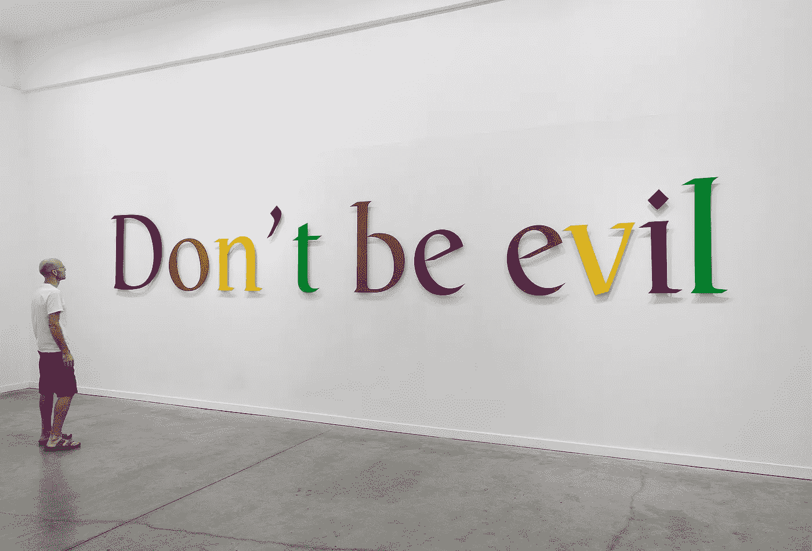
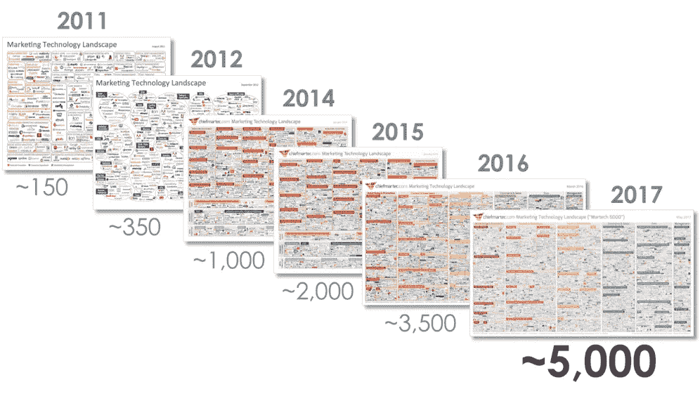

# 为什么广告交易商起诉谷歌，为什么大多数广告客户可能再也没有这样的机会

> 原文：<https://medium.com/hackernoon/why-adtrader-is-suing-google-and-why-most-advertisers-might-never-get-that-chance-again-2bc3ee376d0c>

Source: [https://artsy-media-uploads.s3.amazonaws.com/u7WURhlNBCjk3ztJLiPeAQ%2Fdon%27t+be+evil.jpg](https://artsy-media-uploads.s3.amazonaws.com/u7WURhlNBCjk3ztJLiPeAQ%2Fdon%27t+be+evil.jpg)

# TL；博士:

2017 年 12 月，AdTrader 对谷歌提起了个人损害赔偿案和集体诉讼。这两起案件都是基于长达七个月的调查，在此期间发现谷歌一直非法挪用广告商的资金。与此同时,《华尔街日报》正在进行的一项独立调查也得出了同样的结论。作为《华尔街日报》文章的结果，谷歌迅速修改了数百万份 AdWords 合同，以防止广告商获得赔偿。

几家媒体争相报道这起诉讼，不幸的是，由于过于狭隘地关注 AdTrader 的潜在损害，它们错过了要点。虽然它们可能会引起特定读者群的兴趣，但我们个人的损失对公众来说肯定不是很重要。然而，谷歌的系统性盗窃是，这就是为什么我们决定分享我们调查的更多细节，并邀请所有受影响的广告商加入我们的集体诉讼。

# 我们的任务。

***为日益拥挤和不透明的广告生态系统带来简单和透明。***

AdTrader 的使命一直是让数字广告领域成为一个更健康、更高效的生态系统。在一个被无止境的中介、压倒性的复杂性和极大的低效率所困扰的行业中，我们准备提供一个替代的解决方案。四年前，我们决定建立一个广告平台，为出版商和广告商带来更多的简单性、透明度和责任，最重要的是，为用户带来更有用和愉快的广告体验。我们与一些主要的广告公司合作，以扩大我们的覆盖范围和产品，并开始建立我们需要的技术和团队，最终实现我们的愿景。

在过去的六年里，中间商的数量增加了五倍多:

Source: Scott Brinker, [http://chiefmartec.com/2017/05/marketing-techniology-landscape-supergraphic-2017/](http://chiefmartec.com/2017/05/marketing-techniology-landscape-supergraphic-2017/)

不断扩张的中介格局过去是、现在仍然是令广告商和出版商感到沮丧的一个持续来源。我们尽最大努力成功地跨越这一障碍，为我们的客户提供最佳结果。直到有一天，谷歌从我们来自 25 个不同国家的 200 多家出版商的收入中拿走了 50 万美元，我们的广告业务才得以稳步增长。

我们有意识地决定保持独立于风险投资基金，这使得我们在财务上很容易受到我们最大的商业伙伴的这种不可预见的不当行为的影响。然而，我们决心保护我们的出版商，并用我们自己的钱来补偿他们被没收的收入。这让我们几乎破产，但这无疑是正确的做法。我们最终渡过了难关，现在比以往任何时候都更加专注于我们面前的目标。

# 我们为什么要写这篇文章？

我们觉得有义务公开分享我们对谷歌系统挪用资金的发现。

虽然我们肯定有比咆哮我们的竞争对手更好的事情要做，但谷歌非法挪用资金对整个广告生态系统有着如此深远的影响，以至于我们觉得有义务公开分享我们的发现。过去一年，谷歌的垄断不当行为在新闻中被广泛报道，从其在购物搜索中的[反竞争行为](http://europa.eu/rapid/press-release_IP-17-1784_en.htm)【1】，到[滥用其安卓智能手机垄断](http://www.telegraph.co.uk/business/2016/04/20/google-accused-of-abusing-android-smartphone-monopoly-in-new-bat/)【2】，以及[将 AdSense 出版商捆绑到抑制竞争对手的排他性协议](http://www.telegraph.co.uk/technology/2017/11/11/eu-closes-google-prepares-second-antitrust-fine/)【3】。然而，很少有人关注谷歌收入的关键驱动力之一——展示广告。这篇文章旨在带你了解我们调查中的一些步骤，并希望鼓励广告商更加批判地看待他们与谷歌的交易。

2017 年 5 月，我们与谷歌的 DoubleClick 广告交易所(AdX)的四年合作关系突然终止，我们的出版商客户产生的 476，622.69 美元被从我们的账户中扣押。尽管我们坚持要求解释，谷歌没有提供任何具体的原因。然而，它确实反复强调，出版商的所有收入都将返还给广告商。这一系列意想不到的事件和信息的缺乏迫使我们进一步调查此事，以了解出了什么问题。随着调查的深入，一些惊人的发现开始浮出水面。这些发现的意义远远超出了我们个人的情况。**我们通过谷歌内部和外部的多种渠道确认，通过我们的谷歌发票和从谷歌 API 收集的数据，谷歌实际上从未将任何被没收的出版商收入退还给广告商。事实上，谷歌自己的支持团队承认，他们从来没有这样的退款制度。**谷歌为广告商提供的需求端平台——双击竞价管理器(DBM)显然只能在向广告商收费之前实时过滤无效的展示。它没有追溯退款的机制。这一点后来得到了谷歌发言人的证实，他宣布他们只是在最近才开始为 DBM 制定退款措施。

我们的研究进行了四个月，我们惊讶地发现华尔街日报已经对这个主题进行了他们自己的调查，[报告了进一步巩固我们发现的事实](https://www.wsj.com/articles/google-issuing-refunds-to-advertisers-over-fake-traffic-plans-new-safeguard-1503675395)。最重要的是，在《华尔街日报》的文章发表六天后，谷歌迅速改变了他们的 AdWords 合同，**有效地迫使数百万广告客户放弃各自的陪审团审判权利，并禁止他们对谷歌提起任何集体诉讼。广告商现在将不得不通过昂贵的个人仲裁来解决争议。这一时机无疑是对《华尔街日报》文章的直接回应，目的是阻止中小广告客户起诉并获得赔偿。**

由于这些事件的深远影响，2017 年 12 月，我们没有仅仅提出个人损害索赔，而是对谷歌提起了集体诉讼。该案件引起了一些媒体的关注，但在[商业内幕](http://www.businessinsider.com/adtrader-class-action-lawsuit-vs-google-claims-millions-not-refunded-to-advertisers-2017-12)【5】、[《纪事报》](https://www.theregister.co.uk/2017/12/13/google_click_fraud_lawsuit/)【6】、[交易所](https://adexchanger.com/ad-exchange-news/friday-12152017/)【7】和其他媒体上发表的文章都没有真正抓住事件的本质。因此，我们决定澄清事实。此外，为了我们的出版商客户，我们应该最终与他们分享到底发生了什么。因为我们尽了最大努力来掩盖他们在谷歌的损失，他们中的大多数人对整个情况浑然不觉。具有讽刺意味的是，通过保护我们的出版商免受谷歌窃取，我们同时也保护了谷歌的声誉。

# 导致诉讼的事件。

通过位于谷歌广告交易的两边，我们可以很容易地检查钱是否返还给了广告商。

2017 年 5 月 19 日星期五，我们收到了 DoubleClick 广告交易团队自动生成的电子邮件，称我们的帐户已被禁用。我方不需要采取任何行动，也没有给出任何具体原因，我们被告知，我们的所有收入总计 476，622.69 美元已被扣缴，将被:

> 因出版商未能遵守广告交换协议而退还给广告商。

没有说明我们的哪个出版商违反了规定，也没有说明违反了什么规定。没有解释为什么所有的收入都被扣留，而只是被指控违反条款的出版商的收入。同样值得注意的是，产生这些收入的流量已经通过了谷歌的月度审计，其中只有 0.1%被标记为次质量——与行业平均水平相比，这是一个微不足道的数字。

我们的账户在一个周五的晚上被终止了，没有任何事先通知，就在支付周期结束时，就在我们的出版商应该收到他们的收入之前不久。坊间证据表明，这是谷歌终止出版商账户政策中的常见做法。

为了了解哪里出了问题，我们联系了谷歌的一些高管。在电话中，其中一名高管解释说，我们的账户因违规而被终止，他不知道违规的性质。他反复声明，我们收入的每一分钱都已经退还给了广告商，还强调说**即使我们成功地对谷歌终止我们账户的决定提出上诉，我们也不会收回任何被扣留的资金**。这最后的揭露是如此的荒谬，以至于它促使我们去挖掘一切关于谷歌退款给广告商的政策。有太多故意的监管混淆，我们在这篇文章中专门用了一整节来揭开广告退款的谜题。但在此之前，我们将首先尝试破译所谓的政策违规。

奇怪的是，在我们的双击发布账户中没有任何违规的通知。更重要的是，我们几乎所有的出版商客户仍然在通过谷歌从他们的库存中赚钱，要么通过 AdSense，要么通过他们自己的 AdX 账户。这不仅从出版商的网站上可以明显看出，谷歌广告仍然占据显著位置，而且谷歌自己的报告系统的数据也证实了这一点，显示谷歌广告交易继续提供这些出版商的库存。这很奇怪，因为根据谷歌的政策，AdX 账户被禁用的出版商不允许进一步参与谷歌的任何货币化产品。我们开始怀疑，事实上是否有任何违反。

谷歌对监管的条块分割显然导致了其产品生态系统中不同部门之间很少甚至没有内部沟通。因此，谷歌负责出版业务的高管们忽略了一点，那就是 AdTrader 是为数不多的几家同时涉足广告交易的公司之一。我们代表广告客户进行的一些投标活动是通过 DBM 进行的，而且是在我们 AdX 账户下的网站上进行的。**这意味着我们可以很容易地检查这笔钱是否真的返还给了广告商。这正是为什么谷歌很少容忍公司坐在其广告交易的两边。它为进出他们平台的资金提供了太多的透明度。**

看了几十份报告后，我们开始把事情联系起来。令我们惊讶的是，根据从谷歌自己的报告系统中提取的记录，没有退款或信用发放给广告商。为了证实这一点，我们在我们的客户组合之外，询问了不同市场的一些代理商和广告商，他们是否收到了谷歌的退款。他们证实没有。

我们调查得越深入，证据就越多。我们在下面简要概述了一些要点，更完整的记录请参考 [AdTrader 诉谷歌投诉](https://adtrader.com/downloads/AdTrader_v_Google_complaint.pdf)【8】。

*   谷歌服务协议，声明谷歌只有在以下情况下有权扣留支付给出版商的款项:( I)此类收入是无效活动的产物;( ii)扣留的款项退还给广告商。
*   AdX 帐户显示检测到少量无效流量。
*   双击显示没有 AdX 策略违规的发布者帐户。
*   所有出版商仍在运行谷歌广告，确认没有违规。
*   谷歌高管的声明坚称，我们出版商的每一分钱收入都已经退还给了广告商。
*   来自谷歌 API 的数据显示，我们的广告客户在我们的一些 AdX 出版商的竞价活动，这些出版商的收入被没收。
*   双击出价管理器发票显示没有退款给这些广告商。
*   DoubleClick Bid Manager 支持团队的声明，解释没有追溯退款系统。
*   谷歌发言人发表公开声明，承认谷歌只是最近才开始制定向 DBM 广告商退款的措施。
*   其他广告商和代理商确认没有收到退款。
*   [《华尔街日报》披露谷歌不向广告商提供全额退款。](https://www.wsj.com/articles/google-issuing-refunds-to-advertisers-over-fake-traffic-plans-new-safeguard-1503675395)
*   《华尔街日报》文章发表六天后，AdWords 的条款和条件发生了变化，禁止广告商寻求陪审团审判或提起集体诉讼。
*   在[谷歌的 AdWords 帮助中心](https://adwords.googleblog.com/2006/03/invalid-click-credits.html)【9】和[广告流量质量资源中心](https://www.google.com/intl/en_ALL/ads/adtrafficquality/invalid-click-protection.html)【10】发表多篇文章，声称谷歌对受无效流量影响的广告主进行补偿。
*   谷歌公司的广告计划条款，主张谷歌有义务为无效流量向广告商发放积分。
*   [谷歌 AdSense 博客](https://adsense.googleblog.com/2012/12/working-better-together-protecting.html)【11】中的文章，承认谷歌的政策有时会导致优秀的出版商在没有多少追索权的情况下禁用他们的账户。
*   [谷歌 AdWords 博客](https://adwords.googleblog.com/2014/01/busting-bad-advertising-practices-2013.html) [12]中的文章，称谷歌仅在 2013 年就终止了超过 25 万个出版商账户。

# 在这一点上，很明显，我们必须采取法律行动。

扣留出版商的收入并谎称要返还给广告商，这就是盗窃的定义。

我们开始与律师交谈，很快就清楚了，到目前为止我们所发现的已经超出了我们个人的主张。我们继续收集证据，最终建立起我们的个人和集体诉讼案件。

在没有任何不当行为警告的情况下，允许一名合伙人积累近 50 万美元的收入，一直等到支付周期结束，合伙人赚到了最多的钱，然后突然拒绝通过自动生成的电子邮件支付任何收入，这无异于邪恶。

另一方面，扣留出版商的资金并谎称将这些资金返还给受影响的广告商，这正是盗窃的定义。随着每年数十万出版商被终止合同，这可能意味着数十亿美元的非法挪用资金从未到达广告商手中。

# 广告退款难题。

虽然谷歌向出版商声称，它无法支付他们的收入，因为他们已经退还给广告商，但它同时向广告商声称，它只能退还其中的一小部分(他们的平台费)，因为其余部分已经支付给了出版商。

如果到现在，有些人仍然想知道为什么我们要公开这个案件，而不是悄悄地寻求我们个人的损害赔偿，这一部分旨在消除任何混乱。

谷歌一直声称，它会对通过其平台购买的任何无效流量进行退款或积分:

> [……]当通过分析和反应性调查发现无效活动时，我们会将这些点击标记为无效，并向受此活动影响的任何广告商发放积分。

在谷歌服务协议、谷歌广告计划条款、其 AdWords 和 AdSense 帮助中心的多个页面，以及我们与谷歌团队的直接沟通中，这种说法和类似的说法被反复提及。

直到 2017 年 8 月 25 日，[华尔街日报](https://www.wsj.com/articles/google-issuing-refunds-to-advertisers-over-fake-traffic-plans-new-safeguard-1503675395)才公开宣布【4】谷歌没有向其广告客户提供全部退款或积分，因为谷歌自己的检测系统确定这些流量是无效流量。《华尔街日报》的这一发现与我们的案例无关，但他们的发现或多或少指向同一个方向。文章解释说，**谷歌并没有全额退款给广告商，而是只提出退还他们的平台费，该费用通常占总支出的 7-10%。谷歌坚持认为这是合适的，因为“他们不控制其余的钱”。**

事实是，谷歌确实控制了大部分支出，因为大部分支出都花在了它自己的双击广告交易上。DoubleClick Bid Manager 的一份简单报告显示，该平台超过 50%的广告收入直接流入广告交易。谷歌自己在他们的[广告交易卖家帮助中心](https://support.google.com/adxseller/answer/7014770?hl=en)【13】中承认，大多数从其平台 AdWords 和 DoubleClick Bid Manager 购买的媒体都发生在广告交易上。AppNexus 首席执行官布莱恩·奥凯利(Brian O'Kelley)等其他行业专家也对谷歌在其需求端平台 DoubleClick Bid Manager 分配需求时给予自己的广告交易不公平的优势表示不满。在[与交流者](https://adexchanger.com/platforms/appnexus-ceo-brian-okelley-wa)【14】的访谈中，他陈述道:

> [……]我们采访的大多数 DBM 买家表示，当他们使用 DBM 时，他们一半以上的支出都花在了 AdX 上。

因此，虽然谷歌向出版商声称，它无法支付他们的收入，因为他们已经退还给广告商，但它同时向广告商声称，它只能退还其中的一小部分(他们的平台费)，因为其余部分已经支付给出版商。显然，这两种说法相互矛盾，而且使事情更加混乱的是，两种说法都不完全正确。

作为对《注册》[ 6]报道我们诉讼的一篇文章的回应，谷歌的一位发言人承认，谷歌只是在最近才开始为其 DBM 广告客户设置退款系统:

> 我们有一个长期的政策，为无效流量的广告商退款。正如我们最近宣布的，这一功能目前正在扩展，以包括通过双击竞价管理器购买的广告。

该公告是在去年 9 月发布的，根据我们的发票，直到 11 月，没有一笔退款给广告商。鉴于谷歌有超过十年的时间来实施退款机制，我们认为这一宣布的时机与几周前《华尔街日报》的文章直接相关。

回顾所有的不一致、故意混淆和公然掩盖，在我们看来，最重要的是 AdWords 合同变更，因为它表明权力滥用的程度不容忽视。与数百万广告客户的合同关系眨眼之间就被草率地修改了。谷歌不仅在偷钱，而且它现在有了法律安全网来继续这么做，而不会冒任何被谴责的风险。

# 暗示。

***谷歌利用并滥用其在买卖双方的垄断力量，以损害使用其平台的所有人的利益为代价来获利。***

谷歌作为一个平台，只有通过权限。除了平台费，任何资金都属于广告商或出版商。通过非法挪用其出版商的收入，并谎称已将收入退还给广告商，谷歌正在创造远远超过其平台费收入的隐性利润率。因此，有理由认为，谷歌之所以成为全球最大的广告公司，不仅仅是因为它在搜索领域的垄断地位，同样也是因为它过高的利润率。

AdTrader 不得不为信任谷歌这个商业伙伴付出高昂的代价，我们相信许多其他人也是如此。但如果不是这样，我们就不会发现一个不仅影响我们，而且影响整个广告界的更广泛的问题——谷歌利用并滥用其在购买和销售方面的垄断力量，以使用其平台的所有人为代价来获利。通过采取法律行动，我们希望结束这种情况。谷歌必须致力于成为一个有传递权限的平台。平台费用之外的任何东西要么属于出版商，要么属于广告商。这不是谷歌的责任。

至于 AdTrader，我们从来没有打算卷入与世界上最有资源的公司之一的多年诉讼。但是发生的事情超出了我们的控制，我们必须反击。我们在两个独立的方面这样做——技术和法律。前一项工作已经进行了近三年，我们比以往任何时候都更加努力地开发新产品。至于后者，我们已经确保我们可以将这场诉讼进行到底，并将为了锁定谷歌垄断地位的所有广告客户的最佳利益而这样做。

我们邀请所有受影响的 DoubleClick 竞价管理器和 AdWords 广告商、代理商和交易台站出来加入我们的集体诉讼。鉴于谷歌决定改变其所有合同，这可能是我们采取行动的最后机会，我们不能错过它！请与我们联系，因为我们一起可以让别人听到我们的声音，并创造公平的竞争环境。

## 参考资料:

[1]http://europa.eu/rapid/press-release_IP-17-1784_en.htm

[2][http://www . telegraph . co . uk/business/2016/04/20/Google-被告-滥用-Android-智能手机-垄断-in-new-bat/](http://www.telegraph.co.uk/business/2016/04/20/google-accused-of-abusing-android-smartphone-monopoly-in-new-bat/)

[3][http://www . telegraph . co . uk/technology/2017/11/11/eu-closes-Google-prepares-second-antitrust-fine/](http://www.telegraph.co.uk/technology/2017/11/11/eu-closes-google-prepares-second-antitrust-fine/)

[4][https://www . wsj . com/articles/Google-issing-退款-给广告商-over-fake-traffic-plans-new-safeguard-1503675395](https://www.wsj.com/articles/google-issuing-refunds-to-advertisers-over-fake-traffic-plans-new-safeguard-1503675395)

[5][http://www . business insider . com/ad trader-class-action-suction-vs-Google-claims-millions-not-退款给广告商-2017-12](http://www.businessinsider.com/adtrader-class-action-lawsuit-vs-google-claims-millions-not-refunded-to-advertisers-2017-12)

[6][https://www . the register . co . uk/2017/12/13/Google _ click _ fraud _ success](https://www.theregister.co.uk/2017/12/13/google_click_fraud_lawsuit/)

[https://adexchanger.com/ad-exchange-news/friday-12152017/](https://adexchanger.com/ad-exchange-news/friday-12152017/)

[8][https://ad trader . com/downloads/ad trader _ v _ Google _ complaint . pdf](https://adtrader.com/downloads/AdTrader_v_Google_complaint.pdf)

[9][https://AdWords . Google blog . com/2006/03/invalid-click-credits . html](https://adwords.googleblog.com/2006/03/invalid-click-credits.html)

[10][https://www . Google . com/intl/en _ ALL/ads/adtrafficquity/invalid-click-protection . html](https://www.google.com/intl/en_ALL/ads/adtrafficquality/invalid-click-protection.html)

[11][https://adsense . Google blog . com/2012/12/working-better-together-protecting . html](https://adsense.googleblog.com/2012/12/working-better-together-protecting.html)

[12][https://AdWords . Google blog . com/2014/01/busting-bad-advertising-practices-2013 . html](https://adwords.googleblog.com/2014/01/busting-bad-advertising-practices-2013.html)

[13]https://support.google.com/adxseller/answer/7014770?hl=en

[14][https://adex changer . com/platforms/appnexus-CEO-Brian-okelley-waging-price-war/](https://adexchanger.com/platforms/appnexus-ceo-brian-okelley-waging-price-war/)