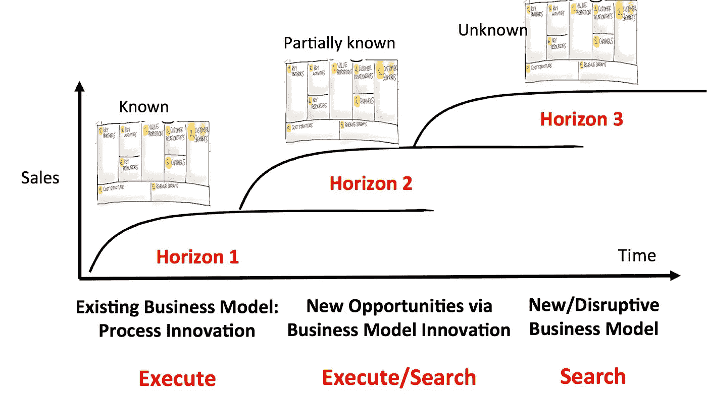

# 为什么敏捷没有带来业务敏捷性

> 原文：<https://medium.com/hackernoon/why-agile-isnt-delivering-business-agility-6138e1e8d3db>

Photo by [William Iven](https://unsplash.com/@firmbee?utm_source=medium&utm_medium=referral) on [Unsplash](https://unsplash.com?utm_source=medium&utm_medium=referral)

虽然敏捷逐年增加，大多数实践组织承认大部分好处，但第[12 次年度敏捷状态报告](https://explore.versionone.com/state-of-agile/versionone-12th-annual-state-of-agile-report) (2018)披露:

> 只有 4%的受访者表示敏捷实践能够更好地适应市场环境。

因此，虽然我们都越来越多地根据敏捷实践来交付，但是当谈到业务敏捷时，指针几乎没有移动。然而，在激烈的市场变化的压力下，领导层正试图转向创新。

## 敏捷和运营

从历史上看，敏捷一直受到组织的欢迎，通过迭代交付实现更短、响应更快的反馈循环来改善运营。然而，敏捷转换通常不是为了改变决定执行什么的过程，而仅仅是为了使执行本身更加有效。没有实施涵盖战略和执行的反馈循环，因此缺乏业务敏捷性。

管理传统上不愿意离开它的战略-结构-系统方法，保持自上而下的教学模式。不幸的是，在一个组织被迫尝试“新”事物的环境中，所执行的东西的价值不再那么确定。

## 运营和创新

创新有很多定义，但说到方法和框架，它最重要的方面就是不确定性。如果一个组织希望能够更快地响应不断变化的市场条件，它需要更好地处理不确定性。

[根据](/swlh/the-innovation-stack-how-to-make-innovation-programs-deliver-more-than-coffee-cups-7879c162b46d) Steve Blank 的说法，在现有组织中成功创新的最有希望的方法是让运营团队采用“创新堆栈”。

> 这些课程[创新栈]通过使用假设检验和室外实验的科学方法，教授如何将想法转化为可交付的产品/服务。该流程强调快速学习周期，包括速度、紧迫性、接受失败为学习以及创新指标。

这绝对有意义:

*   运营团队最接近行动，经常获得第一手的重要反馈。
*   创新是一个数字游戏。在命中率低的情况下，尝试的次数决定了成功的可能性。
*   对于一个已建立的组织来说，采用新的实践至少和发现并验证一个好主意一样困难。与业务之外或管理层实施的计划相比，运营团队是更好的催化剂。

传统上，在成熟的组织中，敏捷一直是改进 horizon 1 活动的工具。给定已知的业务模型，它被用于(持续地)改进支持过程。从这个角度来看，处理不确定性通常仅限于管理不断变化的用户需求。

[https://steveblank.com/2015/06/26/lean-innovation-management-making-corporate-innovation-work/](https://steveblank.com/2015/06/26/lean-innovation-management-making-corporate-innovation-work/)

*Horizon 1 活动支持现有的商业模式。*

*Horizon 2 专注于利用部分已知的商业模式扩展现有业务*

*Horizon 3 专注于未知的商业模式。*

## 敏捷和创新

解决方案被盲目地复制到不同的行业和市场，并假设随之而来的是可比较的结果。领导层假设‘T6’我们知道如何做这件事‘T7’和‘T8’我们想要其中的一个‘T9’，并命令运营团队进行同样的编译。

在消费者市场中，不确定性更容易被理解和接受，但是对于企业计划来说，存在高估已知事物的偏见。*不知道*听起来不太*专业*吧？因此，运营团队参与了 horizon 2 的活动，却没有适当的框架来处理相关的不确定性。

正如史蒂夫·布兰克[所说](https://hbr.org/2017/09/what-your-innovation-process-should-look-like):

> 试图将新的、无预算的、计划外的创新项目整合到一个有人力和资源预算的工程组织中会导致混乱和沮丧。

敏捷团队经常抱怨的一个问题是他们的迭代方法、企业预算和期限之间的不匹配。然而，管理层，‘*有业务要经营*’。因此，这些投诉被忽视了。不幸的是，这些抱怨不止一次地反映了一个更深刻的问题:不确定的业务结果。

应该有人承认并命名这种不确定性。只有这样，组织才能继续前进，采用正确的工具来应对即将到来的发现挑战。

敏捷团队应该使用创新工具包扩展他们的多学科技能，该工具包由精益创业运动推广，并进一步发展为精益产品管理，允许他们试验、挑战和验证预期的业务成果，而不是盲目地接受它作为事实。