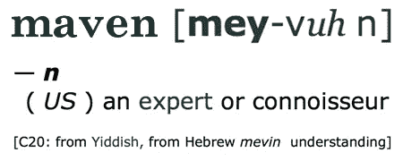
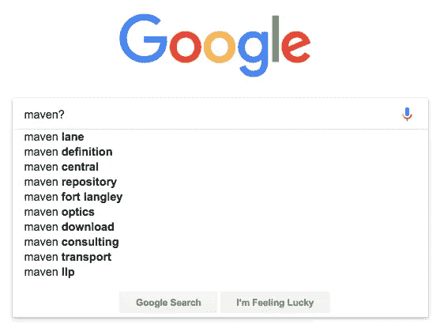

# 为什么算法永远不会成为专家

> 原文：<https://medium.com/hackernoon/why-algorithms-will-never-be-mavens-dd5a68608281>

> 1976 年夏天，加拿大首次在蒙特利尔举办奥运会。在西海岸，一个孩子出生了，他将发展出超乎寻常的个性。尽管小史蒂夫·布莱克是一名出色的马拉松运动员，但他从未真正参加过比赛。他的恶名是为了别的，问问题。

小史蒂夫·布莱克现在将近 6 英尺高，皮肤黝黑，是刚从墨西哥度假回来的人的典型特征。他留着一点胡子茬，脾气很好，看上去很不错。很像电影制作人路易斯·塞洛克斯，他有一种不可思议的能力，能让任何和他交谈的人立刻感到舒服。

带着坚定的好奇心，小史蒂夫·布莱克发现了你身上那些你很少让别人知道的东西。那是因为当你第一次见到他的时候，他让你觉得你已经认识他一辈子了。这也是他成为典型的*专家的重要原因。*

单词 *maven* 来源于意第绪语单词 *myvn* ，字面意思是“理解的人”。真正的专家，像小史蒂夫·布莱克，渴望把他们的知识传授给别人。另一方面，算法是为了解决问题而遵循的一套规则。“理解”是通过*输入*实现的。正如我们所知，随着时间的推移，有了数据集，算法可以成倍增长，变得更加智能和强大。

# 好奇的头脑

作为一个异常好奇的孩子，难怪小史蒂夫·布莱克没有让他的父母陷入困境。以圣人的耐心，他们会毫不动摇地迁就他们的儿子。正如肯·罗宾逊爵士推测的那样，他们知道:

> "好奇心是成就的动力。"

他的父母没有压制孩子好奇的深层内在动机，而是鼓励他质疑事物——更深入地探究问题。这种对知识的渴望使他能够更好地理解他的世界是如何运作的。但是随着小史蒂夫·布莱克的成长，他的问题变得越来越复杂，他被迫变得聪明起来，不那么依赖父母，而是自己寻找答案。他越来越善于在各种情况下做出正确的判断。毫不奇怪，他现在是不列颠哥伦比亚省检察机关经验丰富的检察官。

好奇心是成为专家的一个关键，但也有传播自己发现的意愿。在今天这个信息密集的世界，依靠算法来传递我们想要的信息——或者至少是我们认为想要的信息——是再平常不过的事情了。

谷歌占了所有在线搜索的四分之三，很容易看出哪里出了问题。无论搜索引擎的算法有多创新，它们仍然会产生它们确定的结果*。谷歌和他们的网络狂热者试图用超级光滑的算法取代小史蒂夫·布莱克的 mavenhood。*

# 测量人格

凭借他的奉献精神，小史蒂夫·布莱克分享了他积累的知识财富。他是第一个告诉我 Nike Pegasus Runners、Breaking Bad、ClassPass、巴厘岛生活的人，更不用说镇上一些最好的意式冰淇淋酒吧和世界上最美味的餐馆了。

当然，小史蒂夫·布莱克娶了另一个美文。现在他们是双重麻烦。他的妻子尼基是一名前纽约人，也是一名真正的专家，她是他们了解内幕的强大推动力。如今，她的丈夫很可能会发现自己坐在后座，对她言听计从。无论哪种方式，他们一起为社区提供了一些严肃的建议。

然而，与算法不同的是，这对搭档被限制在一个有限的网络中。在他们的社交圈里，只有这么多人可以从他们的调查中获得独特的见解。当然，亚马逊、Spotify 和网飞算法为你做了相当不错的工作，事实上，随着我们使用它们，它们变得越来越好。但是他们确实缺少一个非常重要的品质:*个性。*

# 关怀和背景

可悲的现实是，像小史蒂夫·布莱克和尼基这样的专家没有被听到，或者就此而言，很少被咨询。想成为 Maven 粉丝的人已经开始在 Instagram 上扩大他们的推荐或者谋生。在这个过程中，他们淡化了自己的男子气概，如果不是完全放弃的话。

当然，我曾经梦想过*超越*小史蒂夫·布莱克·梅文效应。但正是因为提升个性是一个极其微妙的舞蹈，所以常常做不到。像 OpenTable 或猫途鹰这样的平台技术做得还不错，但是你仍然不能像一个专家那样完全信任它们。

如果没有与真正关心你的经历的人交叉参考你的在线结果，在你独特情况的给定背景下，以及给予你培养自己好奇心的奢侈——你经常会错过发现真正特别的东西。

# 知名人士

算法寻求了解一切——实际上是成为无所不知的人。另一方面，专家们总是在探究，总是在深化和提升他们的特殊品味。即使他们在一个角落发现了令人愉快的东西，他们也迫不及待地想发现下一个角落可能会有什么。专家们足够聪明，知道他们不能也不应该试图了解一切。如果他们这样做了，就不会有更多的餐馆可以发现并告诉他们的朋友了。他们满足于成为*的名人。*

一种算法可能会很好地帮助你找到你正在寻找的东西，并且不可否认地，在预测你甚至不知道你正在寻找的东西方面相当不错。但它永远不会像你的专家闺蜜那样有用，她往往比你自己更了解你。∆