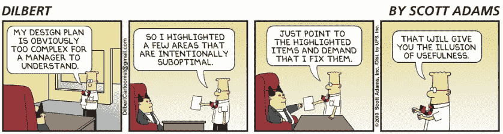

# 为什么所有工程师都必须理解管理:从两个梯子看

> 原文：<https://medium.com/hackernoon/why-all-engineers-must-understand-management-the-view-from-both-ladders-cc749ae14905>

Photo credit: @yangmiao on [Unsplash](https://unsplash.com/photos/IazFaFYSCfY)

当我试图写更多关于工程管理的东西时，一些有趣的事情发生了。

当我写关于[微观管理经理](https://www.quora.com/How-can-I-tell-if-I-am-micromanaging-my-employees-and-is-that-a-bad-thing)的建议时，一些朋友问我如何处理他们的(微观)经理，所以我写了如何[处理你的经理](https://medium.freecodecamp.org/are-you-being-micro-managed-manage-your-relationship-with-your-manager-instead-9ad10b28bcda)。后一块似乎有用得多。我还写了经理应该如何避免[认知偏见](https://medium.freecodecamp.org/cognitive-bias-and-why-performance-management-is-so-hard-8852a1b874cd)，我收到的大多数问题都是关于那些觉得他们的经理是这些偏见的受害者的工程师。你看到模式了。我为经理写作，我从 ICs 中获得兴趣。

可能是我接触到了错误的观众，但我认为还有更深层的原因。

## 双梯子

如果你在科技行业工作，你应该听说过“双重职业阶梯”。随着工程师的成长，他们可以选择爬“技术阶梯”，也可以爬“管理阶梯”。事实上，你面试的公司经常吹嘘它，你会认为是他们发明了它！事实上，就像现代硅谷认为自己发明的大多数东西一样，双轨制已经存在了几十年。我发现有人提到，二战后的杜邦公司(DuPont)首次明确提出了这一概念(如果属实，这一概念将与其他著名的杜邦发明如尼龙、凯夫拉尔纤维和投资回报率(ROI)概念(T9)放在一起，特别是在尼龙部分)。

双梯的用途是什么？

*   **避其** [**彼原理**](https://en.wikipedia.org/wiki/Peter_principle) **。工程和管理需要不同的技能组合，所以如果一家科技公司总是“提拔”它最好的工程师成为经理，它最终会把伟大的工程师变成糟糕的经理。**
*   吸引、留住和激励工程师。如果工程师认为他们成长的唯一途径是管理，并且对管理不感兴趣，他们可能不会加入，或者可能会离开，或者只是留下来而没有积极性。

人们常说，技术团队的经理应该了解技术，这样他们才能更有效率。它帮助他们建立信誉，指导他们的员工，并做出更好的技术决策。我想提出一个更广泛的主张:无论你选择哪一个梯子，你都应该了解攀登另一个梯子所需的技能。就像管理者要懂技术问题一样， ***工程师要懂管理问题才算有效*** *。在这篇文章的其余部分，我将主要阐述为什么这很重要，但是在以后的文章中，我将深入探讨一些选定的主题。但在此之前，让我们快速回顾一下过去。*

还记得我们说过要回到杜邦和尼龙吗？很难想象如果杜邦公司没有为一位才华横溢的年轻科学家提供机会，让他花时间对聚合物进行创造性研究，今天的世界会是什么样子。

当杜邦公司找到华莱士·卡罗瑟斯并提供给他一份实验室主任的工作时，他正在哈佛大学教化学。他起初拒绝了。这并不是说被描述为既聪明又忧郁的卡罗瑟斯喜欢他的教学工作。他实际上似乎不喜欢教书。但他只是想做研究，而且一直在应对令人瘫痪的抑郁症发作。他担心在杜邦工作的工业压力。尽管如此，杜邦公司还是坚持了下来，开出了他在哈佛两倍的薪水，并解释说，在杜邦公司，虽然他将领导一个实验室，但他可以把大部分时间花在发明上。他会写他在杜邦的日子:

> “没有人问我如何打发时间，或者我有什么计划。显然这完全取决于我。”

卡罗瑟斯的工作导致了氯丁橡胶和尼龙的发明，这使塑料发生了革命性的变化，并被用于从服装到军事装备的方方面面。事实上，尼龙因其对二战盟军胜利的贡献而被称为赢得战争的纤维。

尽管他在实验室取得了成功，但卡罗瑟斯继续遭受抑郁症的折磨，并悲惨地在 41 岁时结束了自己的生命，这比他的发明真正起飞还要早几年。但是他的研究改变了世界。似乎杜邦公司在 20 世纪 30 年代还没有正式确定“双阶梯”系统，从技术上讲，他是他的实验室的“主任”，但如果杜邦公司没有给他钱、声望和花时间做研究和解决技术问题的机会，世界可能会是一个非常不同的地方。

我们再举一个例子。认识一下亚瑟·弗莱，他被认为是便利贴的发明者。

Rumor has it he also invented witty scientist photos

1974 年，Fry 是 3M 公司的一名研究人员，在他们的双阶梯技术方面。由于无法将赞美诗中的书签固定住，他使用了 3M 公司的化学家同事斯潘塞·西尔弗开发的一种独特的粘合剂来粘贴、拆开和重新粘贴小纸片，从而发明了便利贴。

他后来被提升为“企业研究员”，这是 3M 公司技术阶梯上的最高一级，并在该公司呆了几十年。[他后来说](https://www.nytimes.com/1986/11/16/business/holding-on-to-technical-talent.html)，如果不是因为这个双重阶梯，他可能“已经离开公司，作为一个发明家去做生意，或者加入一些小公司，在那里他们会给你分一杯羹。”相反，他开始在 3M 公司“盯着墙壁或接受教育”，同时仍“挣着和副总裁一样多的钱”。

换句话说，公司一直在寻找吸引和留住技术人才的方法，为他们提供不强迫他们成为经理或行政人员的机会。当然,“二元”双阶梯有一点限制性，所以许多公司有更多的“宽阶梯”(管理与技术贡献的范围)或“攀登架”(允许或鼓励不同类型角色之间的流动)。

大多数公司已经意识到，经理们需要对事物的技术方面有所了解，以免你最终成为头发尖尖的呆伯特式的经理。

Dilbert.com

另一方面，许多个人贡献者(ICs)不一定觉得有必要了解管理方面的事情。IC 可能觉得管理与他们无关，或者他们可能对管理持怀疑态度。这就是为什么我认为这是一个大错误。

## **了解管理，因为你需要那些技能**

今天的软件公司与杜邦和 3M 的工业 R&D 实验室相去甚远。大多数当前的软件开发与其说是科学，不如说是工程学科。当然，经理和集成电路有非常不同的日常活动:经理花更多的时间开会和与人交谈，集成电路花更多的时间关注技术问题。但是，大多数集成电路并不是在某个实验室里孤立地工作，寻找改变世界的辉煌时刻。现代软件开发是一个高度协作、跨职能的学科。辉煌来自增量和迭代。

随着您在 IC 职业生涯中的进步，您将需要与团队内外的人沟通的能力、影响他人的能力、指导他人的能力等等。这些都是管理者需要的技能，但对 ICs 仍然非常有用。没有这些技能的经理很可能会失败——没有这些技能的集成电路可能只会阻碍职业生涯。我并不是说你需要把所有的时间都花在会议上，或者你需要学会玩弄公司政治。但我见过许多 IC 对任何与管理相关的事情都非常反感，以至于他们把婴儿和洗澡水一起倒掉了。所以，不要因为你决定在技术阶梯上成长，就回避那些看似“管理”的技能——相反，要投资于它们！

## **理解管理，因为它塑造你的系统**

我所说的系统是指你的公司或团队中的人员流程。你可能是主要由经理设计的流程的接收端。招聘和雇佣？你会经历那个过程。绩效管理？你也会经历那个过程。你会见证好的管理和坏的管理。你得设法解决。你应该理解那些过程，为什么它们被设计成这样，它们的优点和缺点。每个过程都有弱点。

让我们稍微放大一下绩效管理这样的主题。在初创企业的早期，主要目标是执行和生存。很多初创企业没有时间、没有闲心、也没有经验对绩效管理进行太深入的思考。作为一名工程师，你做任何需要做的事情，如果你不知道如何做，你会努力去学习，通过学习，你会成为一名更好、更博学的工程师。如果你没有做公司需要你做的事情，这对你和你周围的人来说是很明显的。如果你继续不做公司需要你做的事情，你可能会成为“火速”咒语的受害者。时间跨度短，反馈迅速但混乱。

随着公司的成长和成熟，事情开始发生变化。公司雇佣(或过渡)经理和“人员运营”人员，他们有经验(或至少有时间和授权)来思考团队人员的绩效管理。公司的时间跨度很大，这使得对未来的规划更加容易。有人可能会建议一些结构:一个 360 度的绩效评估过程以一定的节奏运行(一年一次或两次)。但是公司怎么评价人呢？有人提出了一个量规(或称“阶梯”，甚至可能是双重的)。你如何奖励人们？有人提出补偿政策。

经理 A 注意到经理 B 在评估团队成员时更“慷慨”了一些。她提出了一个*校准过程*，试图在不同的团队中保持标准和公平。每次表演结束后，经理们都躲在会议室里讨论他们提议的评估，并努力保持一致性。

这些流程因公司而异，取决于公司的规模、成熟度、文化和整体理念。但是作为一名工程师，你将是这些系统的接收端，有它的利与弊。即使你的主要目标不是获得晋升，理解你的公司为什么设计(或偶然进入)这个特定的过程仍然是有用的。正在评估哪些维度，为什么？管理者有自主权自己做决定吗，还是由公正的委员会做决定？

**那么你怎样才能了解更多这方面的信息呢？**

一种方法是直接问你的经理。*为什么我们要将“校准”作为绩效管理的一部分？谁决定谁升职？你评价人的尺度是什么？*有时这些流程设计得很好，并按预期工作，但有时却不是。不管是哪种情况，你都应该试着去理解它们。

当我的团队中有人对这些事情表现出兴趣时，我真的很喜欢，并且当我解释我们已经建立的一些过程背后的推理时，我很重视我得到的反馈。

我会写更多关于这些问题的内容，但是我会尝试用不同的方式来写。首先，我将尝试从其他人那里收集多种观点，因为不同的公司处理这些问题的方式不同，并且已经了解了关于什么可行什么不可行的各种事情。但更重要的是，从现在开始，当我写作时，我会试着从两个梯子的角度来写。

如果你有具体的话题想听听“双重视角”,请告诉我。