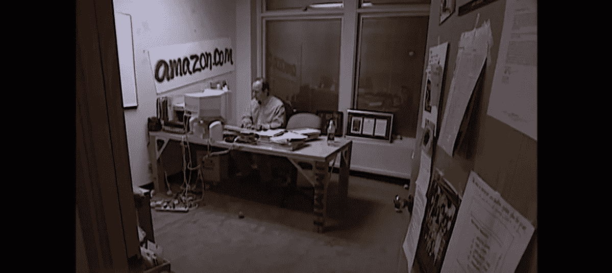
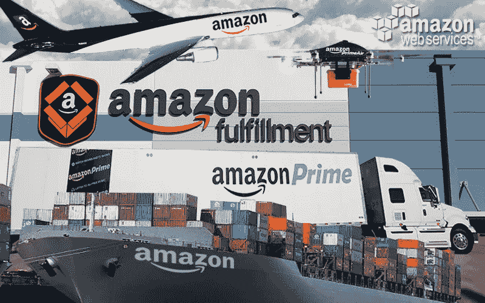
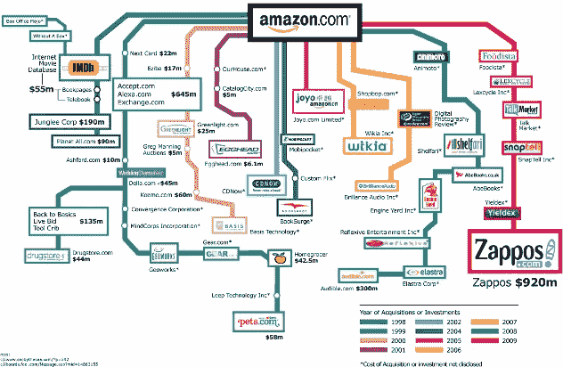
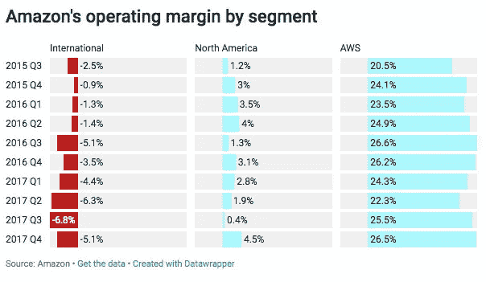
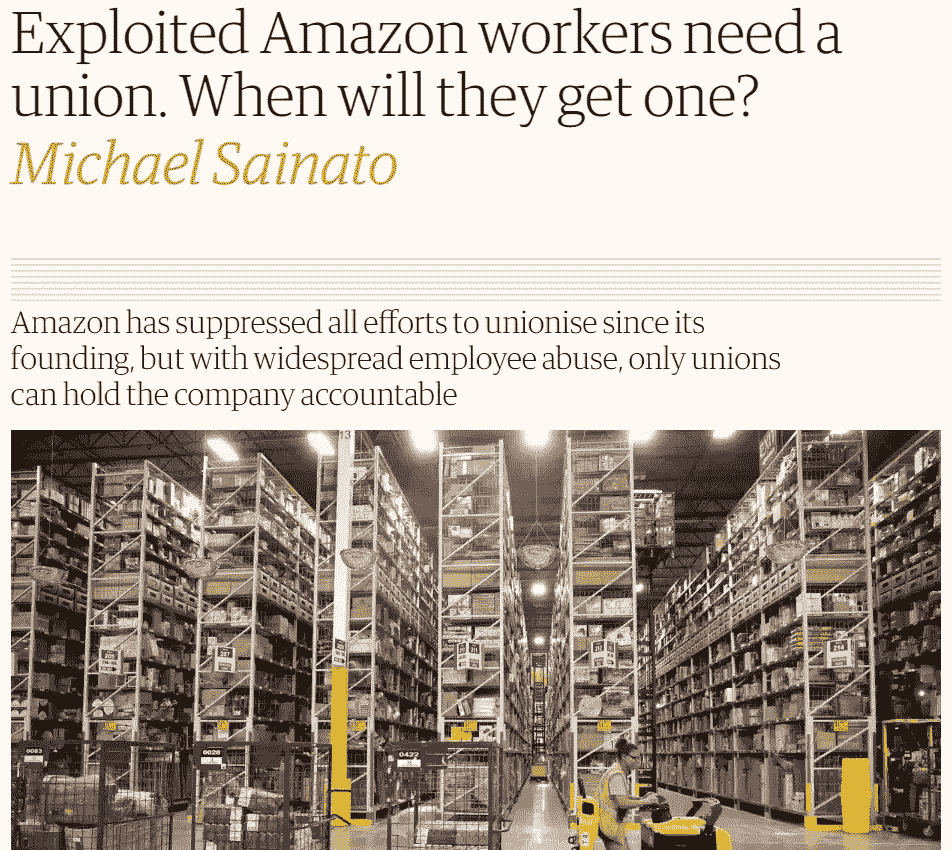
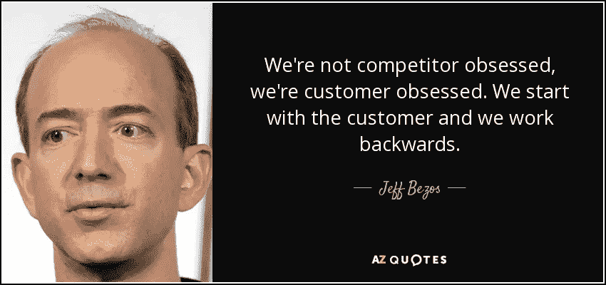

# 为什么亚马逊被正确地估值为 10 亿美元

> 原文：<https://medium.com/hackernoon/why-amazon-is-rightly-valued-at-1-000-000-000-000-142d02398948>

给你一个好的背景，亚马逊的估值比大约 100 家标准普尔 500 公司加起来还要高。亚马逊的估值几乎等同于四大银行——摩根大通、花旗集团、美国银行和富国银行。如果亚马逊是一个人，这个人每天花 100 美元，他们可以在接下来的 2700 万年里舒适地生活(除非我们搬到火星上，因为那样你就得开始向我们的邻居纳税)。有一个[巧妙制作的动画](https://www.nytimes.com/interactive/2018/08/02/technology/apple-trillion-market-cap.html?module=inline)向你展示了一个 1 万亿真正意味着什么的良好估计(*它最初是为苹果公司做的，但亚马逊现在加入了这个俱乐部)。*

那么，一家以网上书店起家的公司是如何在没有停止的情况下达到这种可怕的状态的呢？

The initial office of Amazon, in the 1990s

当我们想到亚马逊时，我们中的一些人认为他们是一个电子商务巨头，我们中的一些人认为他们将彻底改变智能设备，其他人则简单地认为他们分心了，想成为垄断者。这都是真的——但是亚马逊的策略并不明显。再深入一点，您会发现它们有三个突出之处，其价值理所当然地达到了 10 亿美元。

# 1.可扩展性:

亚马逊目前拥有超过 70 家公司——从全食超市这样的大型收购公司到你可能从未听说过的公司，比如专门从事健康和美容护理产品的 Drugstore.com。

为什么亚马逊对购买 Wholefoods 感兴趣？想一想。你可能一年只需要一部 iPhone，但你每周都需要买菜。虽然沃尔玛在美国的零售店数量最多，但它仍然只是一家零售店——它无法监控人们的购买模式，除非他们专门注册了某种沃尔玛卡。而亚马逊通过收购 Wholefoods，获得了[监控和分析人们购买模式的能力。](https://www.forbes.com/sites/gregpetro/2017/08/02/amazons-acquisition-of-whole-foods-is-about-two-things-data-and-product/#1dbbd1baa808)

这些数据可以在很多方面发挥作用，其中之一就是改善用户的购物体验。他们已经掌握了预测你可能想要什么并推荐给你的艺术，因此不久你就会看到你从未订购过的产品送到你家门口，因为亚马逊认为你可能会喜欢它。你会的。

因此，可扩展性是他们在所有业务中寻求的。他们接受一个想法，不管它属于哪个领域，将他们现有的数据加入其中，创造出一种经济实惠的产品(或改造一种产品),让你无法抗拒购买，然后在另一个领域从头再来。

你可以从亚马逊的字面意思来猜测。在一片光秃秃的土地上增加几棵树，你会有一个小树林，但是增加超过 4000 亿棵树，你会有世界上最大的雨林，[可以控制世界气候。](http://wwf.panda.org/knowledge_hub/where_we_work/amazon/about_the_amazon/why_amazon_important/)

# 2.长期愿景

是什么让一个人成为世界上最富有的人？*目光长远。*他的净资产超过 1450 亿美元，被《哈佛商业评论》评为全球表现最佳的首席执行官，也是《时代》杂志评选的全球 100 位最具影响力的人物之一。这只是我的一点皮毛。

贝佐斯有两个奇特的特质让你不禁好奇。首先，他收购的公司在与亚马逊业务的兼容性方面似乎毫无意义。他于 1998 年以 5500 万美元收购了 IMDB(第一批收购之一)。

Amazon’s acquisitions

> “杰夫对亚马逊的发展方向以及 IMDb 如何融入这个家庭描绘了一个清晰的愿景，”IMDb 首席执行官李约瑟回忆他们的第一次会面时说。“杰夫说，IMDb 将保留其网站和品牌，我们的信息将优化为搜索、浏览和贡献。与此同时，亚马逊将使用相同的数据库创建世界上最好的视频商店。”

所有这些都发生在亚马逊还只是一个在线书店的时候。

其次，杰夫·贝索斯和史蒂夫·乔布斯有一些共同点——他们都在拆自己的产品。2007 年，史蒂夫·乔布斯用他更具革命性的 iPhone 取代了革命性的 iPod。杰夫·贝索斯在 2011 年推出了 Kindle，颠覆了亚马逊最初的核心理念——在线售书。大多数公司都渴望成功的产品，比如 iPhone 和亚马逊的电子商务。那么，*他们为什么要这么做呢？*

因为，他们能预见未来。他们知道成功的核心是超前思维、创新和不断迭代，即使这意味着与自己的产品竞争。这就是为什么，尽管亚马逊的利润与收入比率约为 1.6%，但投资者仍然因为贝佐斯的愿景而大量投资。

# 3.顾客痴迷

如果没有经历过，我们都知道亚马逊提供的卓越客户服务——免费退货、24x7 客户服务、一键下单..所有这些都让体验变得天衣无缝。

但我们不知道他们对顾客的重视程度，即使这意味着员工在可怕的条件下工作。

[An Article on The Guardian](https://www.theguardian.com/commentisfree/2018/jul/08/amazon-jeff-bezos-unionize-working-conditions)

还有一些你可能不知道的事情:有没有想过亚马逊是如何将 Kindle、Echo 和 Echo Dot 等产品的价格定得如此之低，却还能赚钱？答案是:*他们没有。仅仅是制造这些设备的原材料成本就超过了它们的售价。*

> [一位曾参与 Echo 项目](https://www.bloomberg.com/features/2016-amazon-echo/)的人记得，该公司预计能够以大约 17 美元的价格制造这些设备，并以 50 美元的价格出售。现在它的价格是 180 美元，一旦将包装、运输和营销考虑在内，亚马逊被认为每笔销售都会亏损。该公司拒绝置评。

亚马逊 Echo Dot 是 2017 年假期期间最受欢迎的商品之一。亚马逊表示， [Echo Dot](https://www.amazon.com/Amazon-Echo-Dot-Portable-Bluetooth-Speaker-with-Alexa-Black/dp/B01DFKC2SO?ascsubtag=[]in[p]cjbzlutes008ooly6ypolvmhw[i]3OLcaG[z]m[d]D[r]google.com&tag=selectallsite-20) 是“亚马逊所有产品类别中最畅销的产品，销量达数百万。”Dot 在整个假日季都定价很高——从黑色星期五到 12 月底，亚马逊仅售 29.99 美元。没有提到的是:[亚马逊没有多少钱，](http://nymag.com/intelligencer/2018/01/amazon-could-give-the-echo-dot-away-and-still-make-money.html)至少没有。

*那么，再问一遍，为什么？*获得市场份额。确保客户以尽可能低的价格获得产品。成为一个家喻户晓的名字，每个人都倾向于在网上购买产品。

长话短说，亚马逊没有获得巨额利润，因为他们选择不这样做。他们认为应该将利润投入到更多的项目、想法和目标中，这将在未来带来更多的利润。

******************************************************************

***总之，亚马逊的估值为 10 亿美元是正确的，因为他们知道可扩展性会带来市场优势，长期愿景会带来投资者，而客户痴迷会带来收入。***

******************************************************************

*如果你觉得这很过瘾，就做* [***关注我***](/@poojabalasubramani) *获取更多文章。我喜欢写产品、科技行业和我在美国读研究生的经历。这里是我的* [***个人博客***](http://poojabalasubramani.wordpress.com/) ***。***

*和我联系的最好方式是通过**[***insta gram***](https://www.instagram.com/thecuriousmaverick/)*和* [***脸书***](https://www.facebook.com/pooja.balasubramani?ref=bookmarks) *。我在那里分享一些有趣的内容。想了解更多我的职业生活，可以查看我的*[***LinkedIn***](https://www.linkedin.com/in/soundarya-balasubramani/)*。快乐阅读！**

****灵感:*** *本文主要是受 poly matter*[*亚马逊宏大理论*](https://www.youtube.com/watch?v=UyohSu-Ft_U) *(我的新宠 YT 频道)上的视频启发。**

**图片来源:谷歌图片**