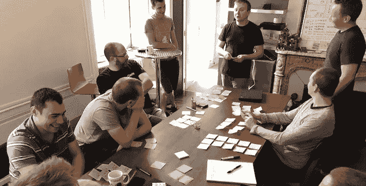
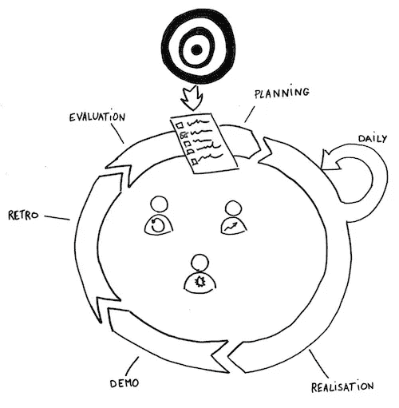
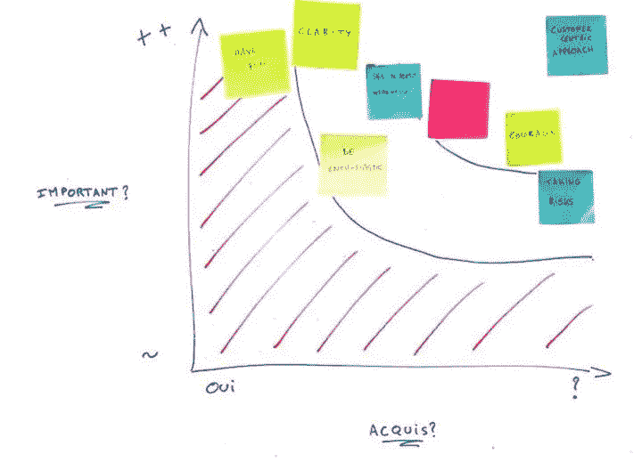
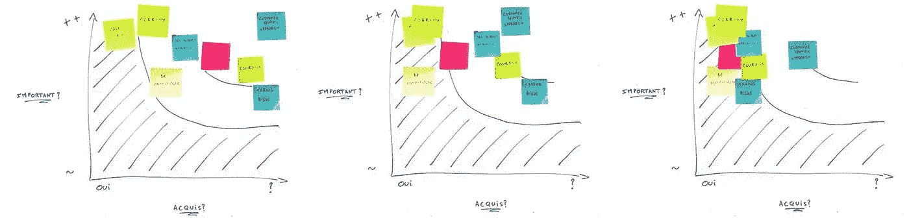

# 我们为什么以及如何花费 10k€来培训我们的新开发人员？

> 原文：<https://medium.com/hackernoon/why-and-how-do-we-spend-10k-to-train-our-new-developers-350d4fbd198b>

当一个公司雇佣了一个新的合作者，这个人需要一些时间来适应公司的工作方式，并学习是什么让公司变得特别。大多数公司称这个过程为**。我们认为它坏了。**

**我们相信我们最珍贵的材料是我们的人，他们的大脑，以及他们如何作为一个团队一起工作。当一个新人加入我们时，我们不希望只是让他们加入，我们希望**让他们融入我们的团队。****

> **合并**
> 
> **把某样东西放在一个整体中，使它看起来从一开始就属于它，与所有其他元素和谐一致。**

**我们做的不是*入职*，而是 [*敏捷*](https://hackernoon.com/tagged/agile) *整合*。我将首先解释为什么我们认为它如此重要。然后，我们将大致了解入职培训通常是如何进行的。一旦设定了背景，我们将会看到我们是如何做的以及为什么这样做，这样你就可以根据自己的需要来调整它。**

# **利害攸关的是什么？**

**我们认为，为了交付最大的价值，我们需要我们团队中的人在参与客户项目时就以近乎完美的和谐状态工作。为了实现这一目标，新来者需要分享我们的价值观、方法和实践。他们需要成为我们文化的一部分。**

****

**这意味着我们希望他们在这些**价值观**上达成一致:**

*   **我们冒险，有时会失败。但是我们宁愿失败也不愿不质疑现状。**
*   **我们集体对我们每个人的工作负责。没有孤岛。**
*   **我们的客户和他们的最终用户需要关注，我们为他们服务**
*   **以用户为中心的设计是良好用户体验的关键**
*   **共享的知识让每个人都变得更聪明，团队也比其成员的总和更优秀。**
*   **没有放之四海而皆准的解决方案。我们的客户要求我们跳出框框思考。**
*   **永远不要停止学习，保持好奇心。**

**他们也应该习惯我们的**方法**:**

*   **敏捷的仪式**
*   **系统的同行评审**
*   **通过强大的自动化测试套件保证质量**
*   **代码作为文档**
*   **持续部署**
*   **重复性任务的自动化**
*   **基于度量的决策制定**
*   **基于口头讨论和真实仪表板而非数字工具的强大沟通**

**最后，他们应该很快掌握我们选择的**工具**:**

*   **开源代码库**
*   **特雷罗**
*   **节点. js**
*   **React.js**
*   **码头工人**
*   **…**

**这是一个很长的列表，甚至还没有穷尽。**

**我们知道，我们不可能从第一天起就招募到能够检查所有这些项目的人。这就是为什么我们寻找我们认为能够检查大部分的人，并通过敏捷集成，在与我们合作的几周内帮助他们检查其余的。**

# **其他地方通常是怎么做的？**

**人们从事入职培训已经有一段时间了，即使有一些关于这个主题的研究，大多数公司也使用相同的方法。**

# **最大的禁忌**

****

**似乎最常见的入职方式是**让新人直接进入一个真实的项目**(咨询公司，我指的是你)。有这种入职实践的公司通常在招募新的合作者之前找到客户。由于客户的需求总是很迫切，新人越早到达越好，那么在这种情况下，入职培训有什么意义呢？**

**另一个常用的方法是让新人**在第一天阅读大量的文档**。然后，他们将知道他们应该如何工作、协作、处理他们的开支、请假……文档通常看起来像是量身定制的，以便在大量无用信息中隐藏最重要的事情，这样一来，新员工一周后就会忘记它们。**

**还有那种**组织图**帮助新人认识每个人，他们甚至不用去见他们。在这样的公司里，新来者可能会意识到，如果他们足够幸运，已经在图表上，他们就在最上面的第 7 层。**

# **没有协作的人类**

**一些公司发现他们招募的是*人*而不是*资源*，并试图度过这一关。**

**据我所见，最常见的方式似乎是在第一天去公司参观。如果新员工第二天还记得一些事情的话，他们会知道每个人是谁，公司是如何运作的。认识每个人并与他们交谈已经是一种进步，但他们仍然不清楚如何才能真正与他们合作。**

**另一种做法是**训练营**。我大多在大公司见过。他们把新兵送到一个集中的地方，在那里教练训练人们，以便他们回来时拥有所有需要的技能。这可能对硬技能非常有效，但一旦回到他们应该工作的地方，新来者不认识任何人，也不知道该如何工作。**

# **未优化的协作**

**另一种常见的入职技巧是**结对**。例如，对于开发人员来说，这意味着新来的人与具有相同工作描述的人配对。新人看到他们每天应该做什么，以及他们如何与他人互动。**

**这比上面的任何一种方法都好，因为新人实际上是在做他们将要做的事情，但在大多数情况下，导师是同一职位上的最后一个新人。即使对他们来说还是新鲜的，但他们是在这里待的时间最少的人，而且离公司文化最远。文化消失是真正的**风险。****

**此外，新来的人只有一个观点，没有机会和其他人合作。一旦真正的工作开始，他们的工作很可能就不是这样了。**

**你已经经历过这种情况了吗？根据定义，你感觉“融入”了吗？[大多数人不会](https://news.ycombinator.com/item?id=17246431)。**

**在我的公司，我们认为入职培训严重不足，我们需要做得更好。**

# **定义目标**

**要把一个新人变成我们的梦想同事，我们需要知道梦想同事长什么样。描述理想同事最简单的方式是建立一份清单，列出我们需要他们具备的所有软硬技能。**

**既然这是他们的公司，我们可以让我们的老板来做清单，但是这有意义吗？不多，新员工应该和每个人都相处融洽，因为他们要和每个人一起工作。那么，我们如何让每个人都参与到构建这份清单中来呢？还是用**便利贴**吧！**

****

**好吧，用便利贴来描述敏捷方法是很老套的，但是这很简单，你可以在家里举办这样的研讨会:**

1.  **每个参与者都在便利贴上写下他们理想同事应该具备的所有技能，使用尽可能多的便利贴——我们在这个阶段寻求详尽无遗**
2.  **每个参与者解释他们写了什么和为什么，并把他们的便利贴放在白板上**
3.  **协作移动便利贴，按主题对资产进行分组**

**我认为每个人都参加这个研讨会是至关重要的，因为每个人都希望新员工具备不同的技能。它有助于塑造我们的集体理想同事。人们通常会思考他们擅长、不擅长的技能，或者在过去的情况下拯救了他们的技能。这是非常个人化的，在这里使用集体智慧使得最终的形状详尽无遗——这就是我们所寻求的。**

**扩大这样一个研讨会的规模似乎很有挑战性，但确实值得努力。如果你不知道怎么做，看看[解放结构](http://www.liberatingstructures.com/)。我认为[1–2–4-All](http://www.liberatingstructures.com/1-1-2-4-all/)和 [World Café](http://www.theworldcafe.com/key-concepts-resources/world-cafe-method/) 特别适合这种用途。**

**最重要的一点是，团队应该完全**拥有**那份清单，清单上的每一点都应该是你想要的，没有适用于每一种文化的**标准**。**

**如果你需要，你还可以从[我们的列表](https://docs.google.com/spreadsheets/d/19P2E6k4yTRtpvq9_umIjxQ4Xyg3FEOHPx3Ya3idio1k/edit?usp=sharing)中获得一些灵感。**

# **走吧，我们玩吧！**

**我们知道我们要把新人带到哪里。此外，我们相信我们通过做和玩学得更好。我们整个敏捷集成都围绕着这些原则。**

**在他们的第一天，我们让新来的人玩一个游戏。这个游戏将是他们融合期的主题。它们都是真实世界的游戏，而且很有战术性。我们也喜欢我们能互相比赛。这类游戏的例子有[多比布尔](https://marmelab.com/blog/2015/04/07/first-challenge-dobble.html)，[连接四个](https://marmelab.com/blog/2016/09/19/puissance-4-retour-experience.html)，[黑白棋](https://marmelab.com/blog/2016/11/07/othello-en-python.html)，[阿瓦勒](https://marmelab.com/blog/2017/02/10/awale-en-python.html)，[四开](https://marmelab.com/blog/2018/07/20/jouer-pour-mieux-travailler-le-quarto.html) …**

**我们认为将游戏作为主题有助于**脱离过去的经历**。此外，这不是我们要卖的东西，所以它有助于重视学习而不是完成。还有，我们[爱](https://marmelab.com/blog/2017/03/27/play-14.html) [到](https://marmelab.com/blog/2017/12/19/game-storming.html) [玩](https://marmelab.com/blog/2018/04/12/play14.html)——这是我们文化的一部分。**

# **迭代积分**

**我们的入职方法是**迭代**:五周，五次迭代。每周，新成员都会接受不同的挑战，关注我们清单上不同的项目。**

**在整个时期保持相同的主题有助于节省一些时间。新兵可以重用之前挑战的结果，他们不需要每次都从零开始了解游戏[域](https://en.wikipedia.org/wiki/Domain_knowledge)。**

**例如，基于一个连接四个游戏，挑战可能是这样的:**

*   **第一周:用 Python 实现游戏机制，并让它可以在游戏机上玩**
*   **第二周:用 PHP/Symfony 以客户端-服务器的方式重新实现游戏核心和界面**
*   **第三周:重新实现游戏核心，在 Go 中构建一个 AI，部署到云端**
*   **第四周:在 React Native 中重新实现游戏界面，发布一款 Android 应用**
*   **第五周:在 React 同构中重新实现游戏界面，并发布到网络上**

**用不同的语言实现同一个系统有助于发现用每种语言编程的惯用方式。例如，在 Python 中，程序必须使用异常，在 Go 中，程序必须使用 goroutines，在 React 中，程序必须使用不可变状态，等等。由于专家的指导，这也有助于快速掌握这些技术。**

# **一次详细的迭代**

**敏捷集成实际上是实验性的。我们已经在小范围内进行了尝试，并一直在逐步改进。我们试图从实践中形式化一个过程:**

****

**上面的部分，我们之前已经看到过，是关于定义我们想要达到的目标。然后每个周期代表一周，和一个挑战。**

**在我的图的中央，你可以看到敏捷集成的主要参与者:新人、指导者和推动者。事实上，公司里的每个人都应该参与进来，让新员工感到公司欢迎他们，希望他们加入。这增强了自信，并有助于确保他们已经是这个团体的一部分。成为新人已经是一种有压力的经历，我们必须确保避免增加任何障碍。**

# **策划挑战**

**所有新来者都瞄准同一个目标，但他们都不一样。这意味着我们不能给他们一个标准的挑战。每个挑战都应该是量身定制的，以帮助这个人在我们需要的方向上提高，基于他们已经知道的。**

**我们如何**工艺量身定制挑战**？有时是出于本能，有时是通过将我们的清单映射到一个简单的重要性/掌握度图。在该图中，我们按照重要性(纵轴)和成就水平(横轴)来排列我们期望新员工具备的技能。**

****

**假设我们在一次严肃的游戏活动中遇到了我们的新成员。我们知道他们已经“掌握”了如何在工作中享受乐趣，但这对我们来说仍然非常重要。我们把它映射到图表的左上部分。**

**另一个例子:以客户为中心的方法是我们最重要的资产之一，它位于顶部。但是想象一下一个没有与最终用户接触经验的新人。我们不知道他们是否掌握了那个资产，我们必须特别小心地监控它。到右边去！**

**我们不应该太在意任何进入红色阴影区域的东西:这些技能要么是已经获得的，要么对我们来说并不重要。**

**一旦我们制定了要学习的技能，我们就知道我们希望他们先学什么。因为我们相信人们通过实验学得更好，我们可以想象我们希望他们学习的所有资产的具体挑战。**

> ***这里有几个例子，说明我们在关注特定资产时所面临的挑战。***
> 
> ****以用户为中心的方法****
> 
> **游戏应该是有趣的，并且应该提供一个非常令人愉快的图形用户界面，让用户觉得这种体验是愉快的。**
> 
> **如果……那是 1980 年，图形界面还没有普及呢？以用户为中心的设计原则仍然适用于命令行界面！**
> 
> ****协作****
> 
> **当你来到工作场所时，很容易与你每天见到的人合作。新来的人通常不会觉得问问题太难，并能很快熟悉周围的环境。**
> 
> **万一…他们的导师在远程工作呢？我们确实有远程工作人员，当所有通信都必须通过电话或 visio 会议时，情况通常就完全不同了！**

# **快速失败**

**我们雄心勃勃地设计挑战。新人在 5 天的 sprint 中发现的积压图片是一个成品，而不是一个勉强工作的概念证明，它在我的机器上工作。每一个挑战都是艰难的——即使对于一个经验丰富的开发者来说也是如此。**

**为什么？首先，因为我们称之为“挑战”，而不是“两天就能烤熟的简单练习”。通过设定高标准，我们确信新来者会努力达到这个标准并一路学习。这也是因为我们的客户项目也非常雄心勃勃。我们希望新员工明白，他们需要尽最大努力满足客户的需求。**

**最后，我们专攻创新，这意味着我们必须时刻承担风险。因为我们冒险，所以我们失败了。例行公事。这可能是因为技术不够成熟(例如，我们在 2012 年使用了 React 的前身，但失败了)，因为客户对其市场规模做出了错误的假设，或者因为最终用户根本不存在我们的客户认为他们存在的问题(这是最常见的失败原因)。不管怎样，既然我们失败了，新人也需要学会失败。学会失败很难，但这是我们工作的基础。这是敏捷集成的强大目标之一。**

**所以挑战太难完成，**故意**。他们唯一的目标就是学习。**

> ****失败 vs 成功****
> 
> **项目失败并不意味着集成挑战不成功。**
> 
> **将项目的结果与新人的实际发展分开是很重要的。我们的主要目标是让我们的新人成长；我们很容易理解，即使项目失败，它们也能成长。**
> 
> **即使这似乎是从一本个人教练书中摘录的，我们相信**失败比成功**教会更多，我们在日常工作中也证明了这一点。**

# **规划**

**每一周都从计划那一周要做的工作开始。新员工发现一个**产品积压**。挑战被分成[用户故事](https://www.agilealliance.org/glossary/user-stories/)。每个用户故事都非常详细，并且包含[验收测试](https://www.agilealliance.org/glossary/gwt/)。它使新来者能够专注于他们的挑战，而不是想知道他们项目的功能范围是什么。**

**新员工向产品负责人提问，并评估每个用户故事的复杂性。这与我们在**冲刺计划**中与客户使用的流程相同。**

****注意**:虽然第一个挑战包含不允许太多疑问的用户故事，但随着时间的推移，用户故事变得越来越不详细。为什么？首先，因为从第二周开始，这个领域更广为人知。第二，因为当我们的客户表达他们的需求时，他们看起来比我们第一周照本宣科的用户故事要简洁得多。客户用户故事看起来更像是一个想法，一个特定用户的问题，我们必须习惯于问正确的问题来发现用户故事实际上是关于什么的。**

**之后实现大概需要 4 天。每天都以每日(站立)会议开始:主要演员会面以确保一切顺利。和 Scrum 一样，这主要是一种健康检查，以便在问题出现时立即发现并解决问题。**

# **指导**

**在整个一周中，导师全天陪伴并回答新人的问题——或者指出知道答案的人。我们的导师在指导新人的同时，实际上也在做客户项目，但他们通常每天会额外花一个小时进行辅导——分成几个讨论，每个讨论持续几分钟。**

**无论发生什么，导师都应该采取特定的立场:**

*   ****善良:**善良并不像看起来那么容易，导师们真的需要真心实意。说*“很简单！”*或者*“就是那点小事”*不是故意的恶意中伤，但也不是善良。**
*   ****不给解:**俗话说*“给人一条鱼，你喂他一天。教一个人钓鱼，你会喂他一辈子。不要灌输解决方案，试着让他们问自己正确的问题。指出问题，指出解决之道，就是这样。让他们生活和学习。***
*   **不要妥协:像对待客户的项目一样重要。如果你让集成变得更容易，你就没有为他们做好，一旦真正工作起来，这一切都变得更难了。你也没有在真实条件下评估它们。**

**我们公司的每个员工每年都有机会指导一名新人。学习如何指导很难，但这也是一次令人兴奋的经历，它帮助我们更一致、更彻底、更确定一个真正的员工应该做什么。**

# **示范**

**到了周末，不管作品完成与否，都是演示时间！**

****

**我们的新人有大约半个小时的时间向全公司介绍他们的工作。他们应该解释他们做了什么，如何做，以及为什么选择一个解决方案而不是另一个。我们都认真听着。**

**剩下的半小时留给我们问各种各样的问题。**

**我们为什么要这样做？**

*   **沟通是敏捷的一个非常重要的价值；在大家面前演示是一个很好的培训，为将来向我们的客户演示做准备。**
*   **[我们知道**每个人都害怕在公共场合讲话**](https://marmelab.com/blog/2018/04/16/confessions-of-a-public-speaker.html) ，这个演示可以减轻这种恐惧，帮助他们获得自信**
*   **我们相信**教学是学习**的好方法。通过向人们展示，你必须理清你的思路，知道你知道什么，你不知道什么。做这个练习有助于巩固你所学的东西，并且对于确保所有的学习不会在几周之后被遗忘和浪费是至关重要的。**

# **回顾的**

**演示结束后，我们要求新员工评估他们迄今为止的工作。我们让他们自己做，以训练他们自我批评。如果我们建立了足够的信任，新人应该有足够的自信承认自己的弱点。我们相信**看到自己的缺点**是改进的第一步；这是我们的核心价值观之一。**

**回顾应该主要集中在新人的感受上。因为当我们和人类打交道时，感觉是最重要的，然而它们很难猜测。**

**然后应该把重点放在**他们所学的**。他们应该自己承认。知道自己知道一些事情本身就是一种学习。另外，如果你在所有人面前假设你知道一些事情，它会“迫使”你实际上知道它。**

**因为我们的挑战是为学习量身定做的，我们从未见过有人整整一周什么都没学到。有了这些新的知识，我们问他们现在是否会以不同的方式做事。在他们开始挑战的几天后，他们通常会做很多不同的事情。**

**我们相信，在所有人面前大声说出这些有助于强化学习。**

**再一次，演示和回顾仪式与我们在真实的客户项目中使用的是相同的，尽管有一点减少。我们发现学习敏捷的最好方法是通过实践来**。****

# **估价**

**一种文化很难传承下去；我们相信实验而不是解释。但是为了让实验产生结果，我们应该对新来者的工作给予坦率的评价。**

**我们不要**责怪**。我们只是给出改进的建议。**

**我们应该透明地让他们知道我们希望他们在哪些方面取得进展，这样他们就知道他们在哪些方面还有工作要做。怎么做呢？我们可以重复使用我们之前制作的图表，让它一周又一周地发展。**

****

**我们将有改进的技能的便利贴移到图表的左侧。他们中的大多数应该在挑战结束时到达红色阴影区域。如果还有一些剩余，如果我们准备好接受它，它们将成为我们新团队成员应该首先改进的指标。**

**作为本周的奖励，我们请新来**的人写一篇博文**。通过选择“整合”标签，你可以在我们的博客中找到许多此类帖子的例子。**

**主要原因是，通过写下你学到了什么，你在哪里失败了，你是如何克服问题的，你会加强你的学习。事实上，它有比展示和回顾更广泛的展示，增加了更多的结构和关怀的需要。再说一次，把你的想法写在纸上也能构建你的大脑，确保你把事情做对，而且是长久的。**

**另外，如果你关注我们的博客，你会注意到我们写了很多。写帖子不是一件容易的事，但这是我们工作的一部分。这就是我们之间分享知识的方式——通过与世界其他地方分享知识。我们的大多数合作者在他们以前的经历中并不真的习惯于写作，他们在敏捷集成期间写的博客帖子是他们未来将要写的所有博客的开端。**

# **敏捷集成是一个试验阶段**

**老实说，敏捷集成并不完全致力于让新人进步。我们也用它来确保新来的人将是团队**的合适人选**。那是因为我们在面试过程中出了名的糟糕。无论我们对多少不同的人进行了多少次采访，我们永远不会确定，直到我们真正与某人一起工作。问题是，有些候选人在面试中非常优秀，但不适合实际工作。除非你让他们和你一起工作，否则你无法察觉。**

**新人最先知道这一点。在他们的第一天，我们告诉他们，如果我们注意到他们不会在一些基本技能上取得进展，或者如果他们与团队的其他成员相处不好，我们可能会在结束前终止整合。我们知道这会增加压力，并且可能会扰乱学习过程。但我们很清楚这一点，我们的试用期通常比其他公司短得多:在五周的试用期结束后，新人就正式成为团队的一员。**

**另一方面，如果它不是积极的，如果他们没有达到我们的期望，我们不会害怕告诉他们它不会工作。一旦签订永久合同，扔掉我们在他们整合期的投资总比后悔好。**

# **收支平衡？**

**敏捷集成要花多少钱？我们试着做数学…**

**每个挑战需要新人 5 天的工作，以及导师和辅导员大约 1 天的时间。有 5 个挑战，这意味着**敏捷集成花费大约 30 个人工日**。基于每天 350€的理论成本，相当于每个新雇员花费**10000 多€。****

**而这还只是原始成本。当新来者进行敏捷集成时，他们不是在为我们的客户工作。这意味着它会造成重大的收入损失。**

**因此，敏捷集成确实成本很高——尤其是与其他入职技术相比。**

**但我们相信，如果我们不投入那么多，我们的成本会高得多:**

*   **新来者需要更长的时间来适应，我们将不得不对他们的工作收取更少的费用，导致收入减少**
*   **我们的文化会在不知不觉中逐渐消失，导致员工流失**
*   **我们会雇用不合适的人，导致我们的交付质量下降，客户不满意**
*   **我们的修行会停滞不前，我们会慢慢变老，最后死去**

**我们不能说通过敏捷集成我们节省了多少。我们相信这不仅仅是收支平衡，而是对我们来说非常有利可图。这是我们公司的核心。**

# **结论**

**我们通过实验开发了这种入职方法，我们知道它在我们的环境中是可行的。通过分享它的精髓，我们希望你能在自己的环境中尝试并提供反馈。**

**就像我们为开源做贡献一样，我们很乐意看到你参与进来。我们愿意相信，这可能是在更大范围内解决入职问题的开端。**

**请随意评论:**

*   **你对敏捷集成的感受**
*   **你经历过的糟糕的入职方法**
*   **你认为有什么改进吗**
*   **你的挑战想法**
*   **有什么想分享的吗**

***原载于 2018 年 9 月 5 日*[*marmelab.com*](https://marmelab.com/blog/2018/09/05/agile-integration.html)*。***