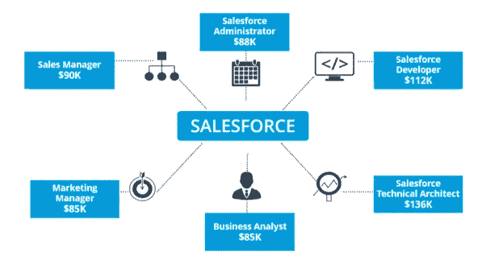

# 为什么以及如何获得 Salesforce 开发人员认证

> 原文：<https://medium.com/hackernoon/why-and-how-to-earn-a-salesforce-developer-certification-a56543ea6287>

Salesforce 开发人员拥有在 Lightning 平台上定制应用程序所需的强大技能，以满足和扩展业务目标。

要成为 Salesforce 开发人员，认证是必要的要求，它提供了借助 Salesforce 平台的声明性功能设计定制应用程序所需的技能。获得此证书可以让专业人员展示创建数据模型、理解业务逻辑、构建用户界面和确保定制应用程序安全性的能力。该认证由 Salesforce.com 口述并提供。

# 开发者证书的级别

有三个级别的[sales force developer credentials](https://www.koenig-solutions.com/salesforce-developer-training.aspx)测试您的技术熟练程度以及真实世界的经验。

*   **Salesforce 认证商务云数字开发人员**

该认证专为已经拥有 Salesforce Commerce Cloud Digital 全栈开发经验的专业人士设计。

认证人员使用商务云数字开发电子商务解决方案，包括:

*   设置开发环境
*   使用数字数据模型
*   使用网站内容
*   使用业务管理器执行站点配置任务
*   使用脚本扩展站点业务逻辑
*   与外部应用程序交互
*   优化站点性能
*   常见问题疑难解答

Salesforce 明确指出，认证没有先决条件。

考试形式包括:

*   60 道选择题
*   完成考试需要 105 分钟
*   70%及格分数
*   **Salesforce 认证平台开发人员 I**

该证书面向能够在 Lightning 平台上构建自定义声明式和编程式应用程序的个人。

这个认证也不需要任何先决条件。

考试形式包括:

*   60 道选择题
*   完成考试需要 110 分钟
*   65%的及格分数
*   **Salesforce 认证平台开发人员 II**

该证书面向能够展示其在 Lightning 平台和数据建模的高级编程能力方面的技能，并且能够开发复杂的业务逻辑和界面的个人。

要获得此证书，个人必须拥有 sales force Certified Platform Developer I 证书。

考试形式包括:

*   60 道选择题
*   完成考试需要 120 分钟
*   63%的及格分数

# 资格要求

这些证书要求的基本资格要求是:

*   计算机应用或商业管理学位。
*   了解 Salesforce 平台的基本概念

# 认证过程

考生必须确保自己符合资格标准，并在参加考试前报名参加培训课程。培训成功后，候选人需要注册他们希望参加的 Salesforce 开发人员考试。

该考试的注册费为 200 美元，不包括当地法律规定的税费。重考费用为 100 美元，不包括当地法律规定的税费。

> ***专业提示*** *:要快速跟进您对 Salesforce 认证的学习，请考虑更新* [*Salesforce 培训课程*](https://www.koenig-solutions.com/salesforce-training-certification-courses.aspx) *。*

# 考试的有效性

Salesforce 每年发布三次新功能更新。认证持有者需要通过根据 Salesforce 产品发布周期进行的维护考试来维护其证书。

这些考试的通知通常通过电子邮件通知，但是，在公布的截止日期之前通过考试是个人的责任。

# 职业成长

Salesforce CRM 是市场上最好的软件之一。Salesforce 开发人员证书将立即为您带来高薪和巨大的职业发展机会。有许多组织正在从 IT 转向云和 [CRM](https://www.koenig-solutions.com/specialization/crm-training-courses.aspx) ，并在 Salesforce 上进行大量投资。借助 Salesforce，公司的销售收入增加了近 27%,销售线索转化率增加了 32%,客户满意度提高了 34%,部署速度加快了 56%。这些数据清楚地说明了为什么公司正在寻找 Salesforce 认证的专业人员，以及 Salesforce 如何以更高的工作安全性改变一个人的整个职业生涯。

> *根据*实际上*生成的报告，Salesforce 开发人员的平均年薪为 112，330 美元。这个数字本身就表明了对这些认证所提供的技能的认真认可。*

*原载于 2018 年 9 月 26 日 blog.koenig-solutions.com**T21*[。](http://blog.koenig-solutions.com/2018/09/26/why-and-how-to-earn-a-salesforce-developer-certification/)