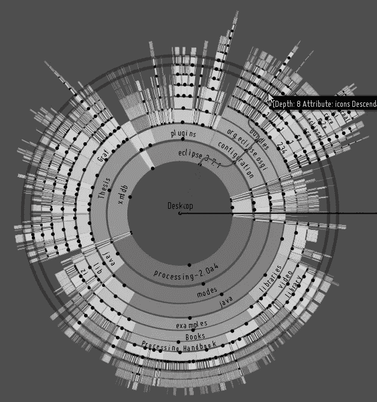
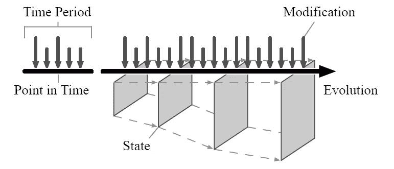
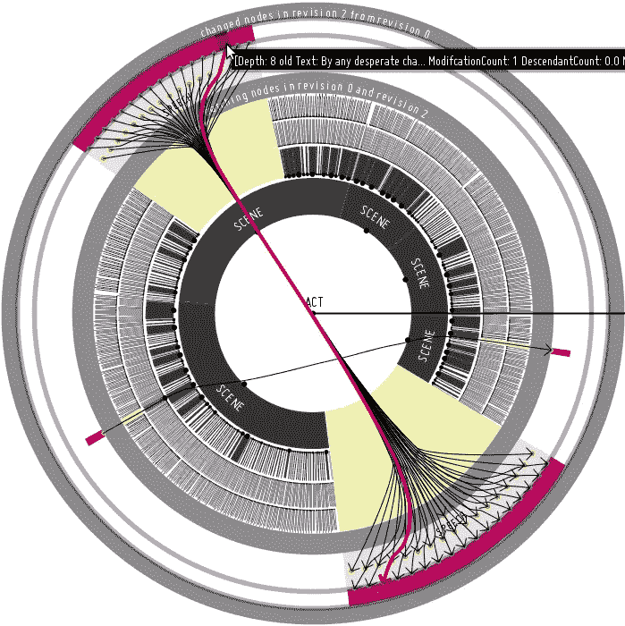
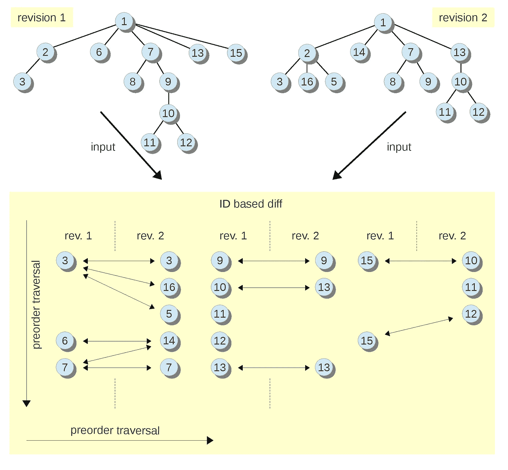

# 通过新颖的滑动快照算法和高效的时间旅行查询，将数据库版本控制推向极限

> 原文：<https://medium.com/hackernoon/why-and-how-we-built-a-temporal-database-system-called-sirixdb-open-source-from-scratch-a7446f56f201>

由于当前大多数数据库系统仍然只是将当前状态或过去状态存储在一个大的关系表中，因此我们研究了性能驱动因素以及如何改进当前的技术水平。io ),它存储小尺寸的快照并支持复杂的时间旅行查询，同时与非时态数据库系统的效率竞争。

Sunbirst view of a resource stored in Sirix (showing file system data)

# 什么是时态数据库系统？

这是一个用来描述系统能够检索数据过去状态的术语。典型地，时态数据库既存储**有效时间**，即一个事实在现实世界中为真的时间，也存储**事务时间**，即数据实际提交到数据库的时间。

问题如:*给我上个月美元对英镑对欧元汇率的历史。**2015 年 7 月 12 日当天记录的客户地址是什么？是他们移动了还是我们纠正了一个错误？我们在数据库中有错误吗，这些错误后来被纠正了吗？*

让我们转向或专注于这样一个问题:为什么历史数据在过去没有被保留，以及近年来新的存储技术的进步如何使得构建复杂的解决方案来帮助回答这些问题成为可能，而没有最先进的系统带来的障碍。

# 固态硬盘等闪存驱动器的优势和劣势

正如 Marc Kramis 在他的论文[中指出的那样,](http://kops.uni-konstanz.de/bitstream/handle/123456789/5914/report.pdf?sequence=1&isAllowed=y)让持久的树木进入 21 世纪:

> 向闪存驱动器的转变强烈地促使人们从“当前状态”范式转向记住导致这种状态的进化步骤。

主要观点是，如今常见的固态硬盘等闪存驱动器具有零寻道时间，同时无法对数据进行就地修改。闪存驱动器分为页面和数据块，而数据块由于其特性，能够在精细的页面级别读取数据，但只能在较粗的数据块级别擦除数据。在更新数据块之前，必须先将其擦除。因此，更新的数据首先被写入另一个地方。垃圾收集器将已被重写到新位置的数据标记为已擦除，以便将来可以存储新数据。此外，索引结构被更新。

Evolution of state through fine grained modifications

此外，Marc 指出，由于传统机械磁盘磁头寻道时间的缓慢随机读取导致的群集要求，小的修改通常不仅涉及写入修改的数据，还涉及写入修改的页面中的所有其他记录以及具有未修改数据的多个页面。这显然是不希望的结果。

# 我们如何基于这些观察从零开始构建一个开源存储系统

> Sirix 存储每个版本和每个页面的增量。

由于闪存驱动器的寻道时间为零，我们不必对数据进行群集。Sirix 只在事务提交期间聚集数据。它基于只追加存储。**数据从不就地修改。**

相反，一旦事务提交，它就被成批地复制并附加到内部树结构的后序遍历中的文件中。

我们借鉴了文件系统 **ZFS** 的想法，例如存储在父数据库页面/页面片段中的校验和，这形成了自我验证的 merkle 树以及我们内部的数据库页面树结构。

> 与其他**写时复制** (COW)方法形成鲜明对比，然而我们并不是简单地复制整个记录页，这是对存储空间的浪费。根据所使用的版本控制算法，我们只从页面中复制一些记录(每次都是改变的记录本身)。

**用于存储和检索记录级快照的版本控制算法**

由于大多数数据库系统，我们最多存储固定数量的记录，即每个数据库页面的实际数据(目前最多 512 条记录)。记录本身的大小是可变的。超过预定义字节长度的超长记录存储在额外的溢出页中，仅在记录页中引用。

我们实现了许多版本控制策略，这些策略在备份系统中最为人所知，用于记录页的写时复制操作。也就是说，我们要么复制

*   完整记录-页面，即页面中的任何记录(**完整**)
*   仅记录页中关于先前版本的已更改记录(**增量**)
*   自整页转储(**差异**)以来，记录页中只有已更改的记录

众所周知，这些版本控制策略各有优缺点。简单地存储整个页面(**满)**对于读取操作来说是非常有效的。然而，与所有其他方法相比，写入性能是最差的，因为我们只是复制所有未更改的记录以及所有已更改的记录。

**增量**-版本控制是另一个极端，写性能是最好的，因为它存储了最佳值(仅更改的记录)，但另一方面，重建页面需要间歇性的完整页面快照，这样，性能不会随着页面的每个新版本而下降，因为增量的数量随着每个新版本而增加。

**差异**——版本控制试图更好地平衡读写，但仍然不是最佳的。每次修改页中的记录时，都会写入一个新页，其中包含自上次完全转储该页以来所有已更改的记录。这意味着只需读取页面片段的两次修订即可重建记录页面。然而，写入性能也会随着页面的每个新修订而恶化。

The screenshot depicts an (Interactive) Visualization of moved subtrees in Sirix throug hierarchical edge bundles

**增量**版本控制在写入性能方面，由于页面的间歇性完全转储要求会导致写入峰值。差异版本控制也有类似的问题。如果没有间歇性的完整转储，每次新写入时都必须复制大量数据。

> Marc Kramis 提出了一种新颖的滑动快照算法的想法，该算法平衡了读/写性能，以避开任何写峰值。

该算法利用了滑动窗口。首先，任何改变的记录必须被存储，其次，任何比窗口的预定义长度 **N** 旧的并且在这些 **N** 修订期间没有被改变的记录。只有这些**N**-最大修订版必须被读取。获取页面片段可以并行进行，或者一旦从最近的修订开始重建了整页，我们就简单地停止。

一旦我们确定我们的存储系统线性地获取旧版本和最新版本，对数地获取和存储单个记录以及整个版本，我们就把注意力集中到上层。

# DOM alike API

> 然后我们投入了大量的工作来实现一个持久的 DOM 接口(例如存储 XML 文档，以及将来的 JSON 文档)。

我们的记录存储有稳定的标识符，这些标识符永远不会改变，不管记录是否更新，也不管它们实际存放在哪里。为删除的记录插入标记。编码只是第一个孩子、左兄弟、右兄弟、父母和节点 ID，以便存储当前 XML/XDM 节点的一种 DOM 表示。

# 版本化、类型化、用户定义的索引

> 然后，我们再次将重点转移到实现版本化的用户定义的索引结构上。

在每个事务提交期间，不仅会生成存储数据的快照，还会生成索引的快照。目前的索引是基于 AVL 树/AVL 节点，这些节点存储在我们内部类似 ZFS 树结构的不同子树的记录页中。

> 资源中所有路径的路径摘要始终保持最新。

为了使用户能够充分利用我们的时态数据库系统，并实际上轻松地回答前面提到的问题，我们扩展了一个名为 Brackit 的查询编译器。

> 用户现在能够打开特定的修订版，在类似 DOM 的树结构中导航以选择特定修订版中的节点，然后及时导航。例如，通过新颖的基于时间的轴，可以很容易地分析所选择的或一系列的记录/节点在下一个版本、前一个版本、第一个或最后一个版本、过去或未来版本、所有版本中看起来如何…

此外，我们能够基于给定的时间戳或修订的 id 来查询修订的范围。

但是，如果我们想要导入预先存在的文档的几个修订，或者独立于我们选择的版本控制算法比较存储在我们系统中的任何修订，该怎么办呢？

# 差分算法

**FMSE 差分算法**

我们首先实现了一个名为**快速匹配简单编辑脚本** (FMSE)的 diff 算法，以支持文档不同版本的导入，并在我们的存储系统中提交几个修订。该算法不依赖于节点标识符。它基于子树的相似性进行匹配，首先在要导入的树形结构文档(目前是 XML，将来也是 JSON)的叶节点上计算一个**最长公共子序列** (LCF)。然后它试图从下往上匹配。在下一步中，应用编辑操作将文档从一个版本转换到另一个版本。该算法显然在一种形式的树到树校正问题中使用了启发式算法，因此是 NP 难的。如果叶节点非常独特，它工作得最好，并且产生最小的编辑脚本。

**基于 ID 的算法，可选地利用存储的散列值**

为了计算 Sirix-resources 的任何修订版之间的差异，并且不考虑记录页级别的版本控制，我们开发了一种算法，该算法利用了我们的稳定记录标识符(这是基于序列生成器的，它从不重新分配 id(例如从已删除的记录中)。如果我们在插入期间存储节点的散列，如果节点标识符以及散列匹配，diff 算法能够跳过整个子树。

**Depicts how the ID-based diff algorithm works**

# 非阻塞、异步 RESTful API

我们最近在 XQuery 和 DOM-API 层之上构建了一个更高级别的 API，用于与基于 Vert.x、Kotlin/Coroutines 和 Keycloak 的 Sirix 服务器进行通信，以进行身份验证。其实现和使用示例已经是另一篇[文章](/how-we-built-an-asynchronous-temporal-restful-api/how-we-built-an-asynchronous-temporal-restful-api-based-on-vert-x-4570f681a3)的主题。

# 一种用于比较树结构的可视化分析方法

如一些截图所示，我们曾经开发了一种可视化分析方法来比较存储在 Sirix 中的树形结构。但是，它有点过时了，需要移植到网络上。

# **我们正在做的事情**

> 接下来，我们将研究如何最好地存储 JSON-documents，这简单地归结为我们希望记录有多细粒度的问题(例如对象记录节点、数组索引节点……)

然而，我们非常乐意讨论未来的方向和想法。非常感谢任何帮助。

如果你喜欢这个，请给我们一些掌声，让更多的人看到它或 Github 上的一颗星…最重要的是检查一下(**我们很乐意听到任何建议，反馈，对未来工作的建议，例如关于 JSON 或云的水平扩展的工作，错误报告；-)，只是一切…请联系** ) :-)

# **我们的开源库:**[**http://sirix . io**](http://sirix.io)