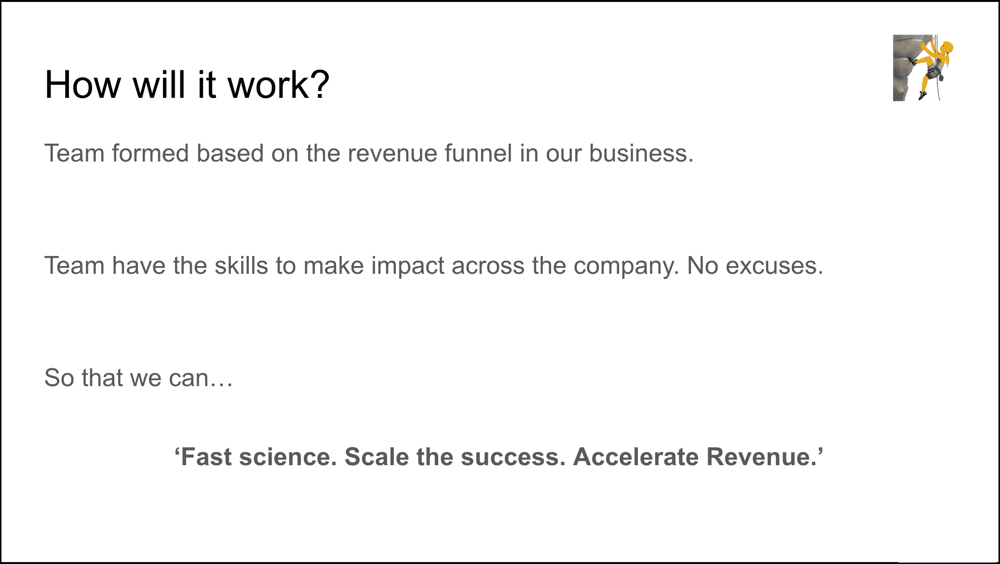
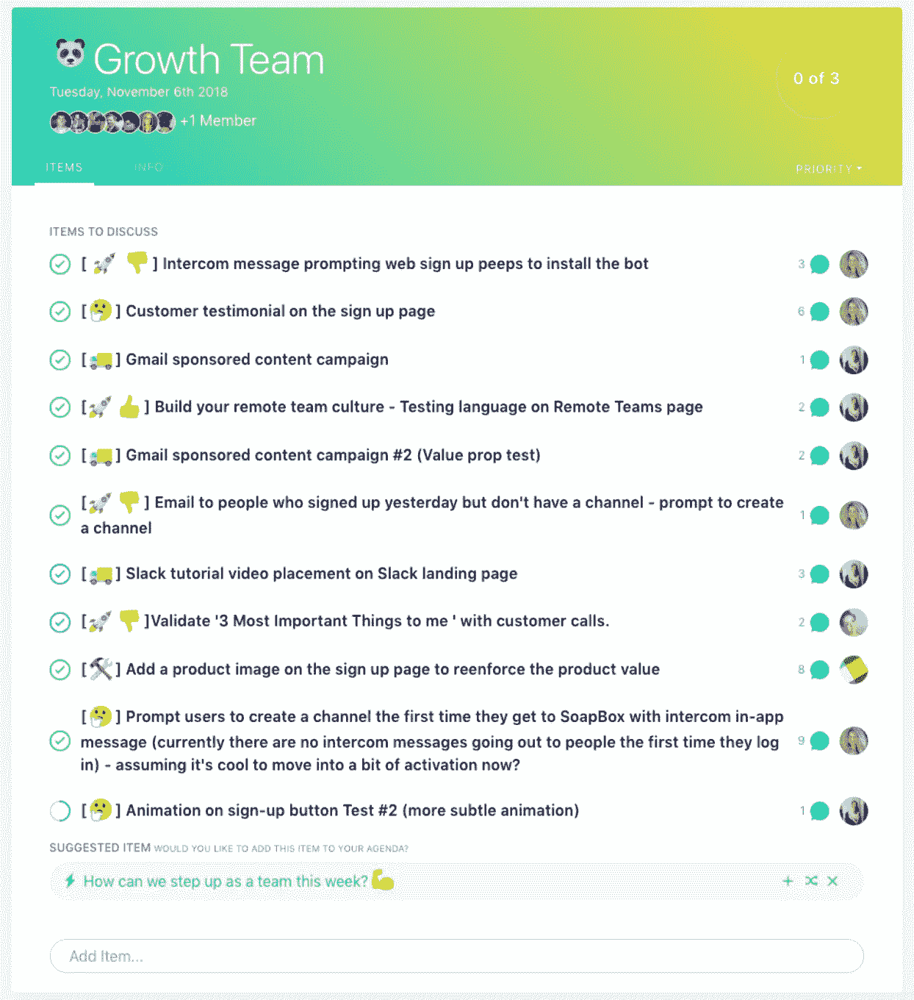
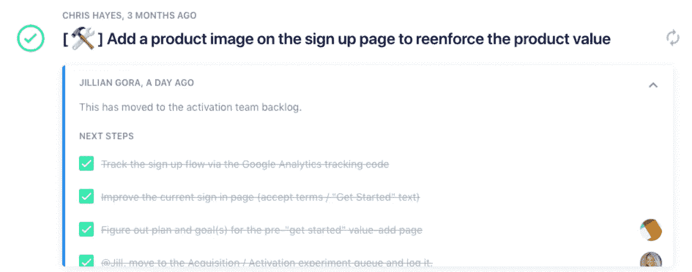
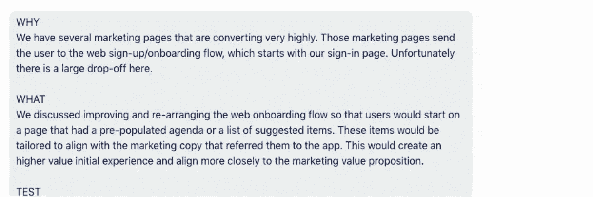

# 为什么(以及如何)在我们 28 人的初创企业中组建一个成长团队

> 原文：<https://medium.com/hackernoon/why-and-how-we-started-a-growth-team-at-our-28-person-startup-849dcd8da554>

这是一家初创公司……难道每个人都不应该致力于增长吗？

夏天开始时，我站在整个[街头表演团队](https://soapboxhq.com/)面前，告诉他们我们将组建一个[成长](https://hackernoon.com/tagged/growth)团队。现在，四个月过去了，我想和大家分享一下我们是如何(以及为什么)应对这一挑战的，以及在这一过程中所学到的一些东西。

# 什么是成长团队？

一个成长团队就是为了改进你的产品或业务而设计的快速迭代实验。在 SoapBox，我们经常把我们的产品说成是一个桶。理想情况下，营销和销售会将大量潜在客户倒入桶中，并保留所有客户。但是如果你的桶有一堆洞，你会在顾客进来的同时流失他们。成长就是尝试填满水桶和堵住漏洞的方法。

# 为什么我们在 SoapBox 成立了一个成长团队

一个创业公司很大程度上是一个成长团队。(正如我们在 Intercom 的朋友所说的那样，*“创业公司的每个人不都应该致力于增长吗？”*)在如此小的规模下，每个人都相互联系，共同努力来使业务受益和增长是有道理的。

A slide from the presentation I gave to the team the day we launched Growth @ [SoapBox](https://soapboxhq.com)

对我们来说，更多的是确保这是一个跨公司的事情。在过去，会是公司的创始人和高层领导谈论增长——仅此而已。相反，我想要的是整个公司对整个产品交付的共同责任。我们需要一个由产品、工程、支持、营销和其他业务人员组成的正式团队，我们可以将他们聚集在一起，帮助他们取得成功，并让他们对我们的业务增长负责。

我们也知道，在多伦多创业生态圈，增长思维不像在其他地方那样普遍。因此，我们希望将这一点注入到我们团队的 DNA 中，让人们与成长团队一起进行一种“职责之旅”，然后将他们学到的东西带回他们的职能领域。

# 我们组建成长团队的前三件事

## 1)我们准备好了我们的文件

在你真正开始全面增长之前，你需要准备一些文件。

*为什么？*我们的目标是将成长思维扩展到整个团队。为了做到这一点，我们需要对我们正在解决的问题以及我们在为谁解决这个问题达成共识。我们还需要一个共享的地方来记录我们的学习成果，并在进行实验时参考它们。

作为一个创始人，这只是储存在你的头脑中，用你的直觉来验证。为了扩展您的业务，您需要共享这些信息并将验证过程外部化。这意味着你需要开始整理这些过程。

首先，你需要定义你的[理想客户档案](https://www.atlassian.com/blog/marketing-teams/how-to-create-buyer-personas-free-template)。这就是我们要找的人，我们为什么要找他们，他们有什么具体问题，哪些竞争对手可能会把他们吸引走……这就像一张非常轻的[精益帆布](/@steve_mullen/an-introduction-to-lean-canvas-5c17c469d3e0)。

第二，你有一个[买家之旅](https://www.atlassian.com/team-playbook/plays/journey-mapping)。从“我从来没听说过你”到“哦，伙计，我太喜欢你的产品了，我告诉了我认识的每一个人。”

(关于前两份文件，有一点需要注意:它们不应该一成不变。你实际上是在创建一个初稿，然后利用你的成长团队来验证其中的一切。参加第一次会议时，手里拿着一份草案是很重要的，这样你就可以让发展团队走上正确的方向，而不会让他们偏离轨道。)

最后，您有了自己的衡量标准。我们使用[盗版指标](http://startitup.co/guides/374/aarrr-startup-metrics)，将我们的关键数据组织成获取、激活、保留、收入和推荐。当您决定发展团队应该关注什么时，这些指标为您提供了支持决策的数据。

这些文件成为我们学习的基础。我们创建一个假设，并针对特定的盗版指标进行实验，验证我们从买家旅程和理想客户档案中了解到的真实情况，审查实验结果，并以快节奏的每周节奏记录学习成果。

我们的想法是，通过尽可能快地一遍又一遍地做这个过程，我们可以更好地专注和提炼我们的实验，并最终理解什么样的信息和产品体验最能引起客户的共鸣。即使前 4 周的实验结果是失败的，我们仍然比在我们的功能领域保持孤立状态时学得更快。所有这些共同的学习应该会带来成功，并在我们的核心指标中产生更好的结果。

## 2)我们设置好工具

这相当简单。我们需要:

*   配有白板和电视的会议室
*   [肥皂盒](https://soapboxhq.com/features/meeting-minutes)

我们知道我们会每周聚会一次，讨论发展问题。但这导致了对话，而不是执行、问责和知识转移。我们知道我们需要一个地方来协作、存储、跟踪和评估哪些实验成功了/失败了，并记录我们的学习成果。我们为此设置了 SoapBox:一个在每次团队会议之前跟踪、讨论和协作想法的共享场所。我们还用它来存储决策、后续步骤和学习内容。

A typical SoapBox Growth Team meeting agenda

## 3)我们创建了团队

我们要求我们的成长团队花 20%的时间在这些实验上(工程师花 50%)。这是一个很大的承诺。所以我们需要确保我们选择了正确的人加入。

*但是一个优秀的成长团队成员有什么特点呢？*

1.  **他们体现了** [**街头演说手册**](https://info.soapboxhq.com/hubfs/SoapBox-Official-Employee-Handbook-Mar2.pdf) **:** 中的“让最好的想法获胜”部分，他们积极向上，他们知道顾客才是王道，他们是积极的倾听者，他们有同理心。
2.  他们很好奇:他们喜欢思考、探索、解决问题、提问、实验、学习。
3.  **他们渴望构建/测量/学习:**我们要求团队成员每周只用 20–50%的时间进行实验？那很难。但这是我们超越竞争对手所需要的。

在像我们这样的小团队中，挑选加入成长团队的人相对容易。在大多数情况下，只有一个人扮演每一种角色。如果我们有多个人扮演类似的角色，我们会选择更有经验的人，确保他们拥有全面的品牌知识。

工程更棘手，因为这是一个更大的团队，我不想只是拉人。有些人是我想加入的，因为他们非常注重产品，总是问一些好奇的问题。但我不想强迫。所以我告诉他们我需要两个志愿者——我期望加入的是那些自愿加入的人。所以那很完美。

# 我们的成长团队如何工作

每周，我都会查看我们的盗版指标，然后选择一个卸货区。自问:*我们在哪里失去了人？我们获取和保留客户的最大漏洞是什么？人们是否访问了我们的网站，但没有点击“立即注册！”按钮？人们是否点击了 CTA，但从未完成注册过程？*

我选择最大的下车点，并告诉团队这是他们的目标区域。收购是最初几个月的重点。然后我们进入激活状态。

一旦我们有了一个集中的度量标准，团队就有了一些指导原则。

首先，我们有几条基本规则要遵守:

*   在设计实验时，我们必须始终考虑购买者的旅程和顾客角色
*   每个人都应该平等地做出贡献(因为不缺少可以运行的实验)
*   我们必须坚持在小范围的实验中快速学习——理想情况下，构建和部署不超过一周，运行实验并获取足够的可测量数据不超过一周。

从那里，团队建立他们的假设。所有实验推介必须:

*   有一个实验试图达到的既定目标
*   拥有可以作为实验“之前”或“对照”的历史数据
*   有某种明确的度量被跟踪，这将表明实验是否达到了预期的目标

# 我们的流程

理想情况下，成长团队每周会面一次，讨论两件事:

1.  回顾过去一周的实验，以及
2.  即将到来的实验的计划会议，我们团队带来了他们的实验想法，并提出了哪些应该建立。

一开始，我们每周四开两次会:上午一小时，下午一小时。这并不理想，但我知道我们需要更多的时间来进入这个过程，我认为一次两小时的会议太长了。

现在，几个月过去了，我们已经足够精简，可以在一个小时的会议中完成所有工作。这是因为每个人在报告中变得更加勤奋，在推销中变得更加简洁。

会议最重要的部分是计划实验。当一名成长团队成员提出一项实验时，他们会在我们的 SoapBox 中提供以下信息:

*   我们目前所处的状态
*   为什么解决这个问题会改变业务或关键指标
*   他们实际会做什么的一些细节

Example growth experiment in the build phase

Example details of a growth experiment in the build phase

这个团队讨论这个问题，确保每个能为这个实验做出贡献的人都是这个过程的一部分。这就是我成为反馈机器的地方。在成长会议之前，我会花 30 分钟在我们的讲台上阅读每个人的实验想法，我会带着问题来。开始的时候，很多人会说，“你又错过目标了。”或者，“*你想得太大局了。*

现在，随着我们越来越了解事物的变化，它更像是温柔的提醒。*你想证实什么？* *这对我们买家的旅程有什么影响？*等等，等等。我是不断提醒他们遵守我们制定的规则和指导方针的破记录。

但是，每次会议，总会有人想办一些大事。我不得不说，*“等等，我们为什么要这么做？”他们会说，“哦，我想看到产品的变化。”我会说，不。你想先学。目标是了解什么可行，什么不可行。一旦我们对此有信心，结果就会随之而来。所以我只是不断重申。*

然后，建立实验。他们上线，我们让他们运行一周，然后我们开始查看数据。我们期待完全成功或完全失败。失败完全没关系，只要你能从失败中吸取教训。例如，如果我们更改了 CTA 定价页面上的语言，我们看到转化率下降了 5%，那就完全失败了。我们可以从这个实验中了解我们的核心客户对哪种语言做出反应，我们可以在整个网站和产品中利用英特尔来获得正确的客户类型。

最后一步是将这些发现传播给公司的其他人。到目前为止，我们还没有做任何大的事情来促进这一点。我想看看它是否会自然发生。毕竟，我们是一个 30 人的创业公司。我们都在同一个房间工作。我们利用公司范围的演示日来分享关键发现，但除此之外，我只是让成长团队成员与他们的团队分享他们的发现。我们仍在观察这是否可行，目前看来还不错。

# 谁是领导？

我成立了增长团队，但我认为你不一定需要高层领导来领导它。

你需要得到高层管理人员的认可，这样公司里的每个人都会意识到这一点的重要性。而且，作为首席技术官，在场肯定有助于更好地形成对话，因为我能够分享他们需要的所有关键信息。我了解我们的投资者、我们的董事会会议以及最新的客户反馈。我知道我们的营销定位是什么，所以我可以为团队提取所有信息。但是，如果我们更加努力，这些信息应该更容易被公司的每个人获得，并在我们的市政厅和演示日进行讨论。

尽管我开始是领导者，但我不再领导会议。我坐下来，对会议和讨论的实验做出反应。这是最好的改变。所以我会说，不要把一个来自领导层的人放在成长团队里。至少不去策划、组织或呈现。他们的工作就是成为反馈机器。

理想情况下，根据你追求的目标，在任何给定的时间，你都有几个领导者。例如，当我们专注于收购时，我们的数字营销经理主持会议。当我们从收购过渡到激活时，我们的产品经理接手了。这种转变是交叉领导的发展方向。

有人问我是否需要参加会议。我的目标是帮助团队中的每个人在实验过程中变得自律。所以，在他们离开之前，我不会离开队伍。他们一回来，我就出去。但现在我仍然在那里推，推，推。

# 我们成长团队的未来

现在我们已经有了一个好的会议节奏集，我们将循环增长团队的成员。*为什么？*首先，由于我们是一家初创公司，每个人都应该自然而然地以成长的心态运营，我们将带着第一批“成长学校”的毕业生，带着他们 DNA 中的成长心态和对如何在日常工作中融入跨团队协作的良好理解，让他们回到自己的职能领域。

同样的成员也很难每周都拿出新的实验，我可以看到团队开始感受到压力，所以一些新成员需要关注新的盗版指标(保持！)将有助于保持 SoapBox 的增长势头。