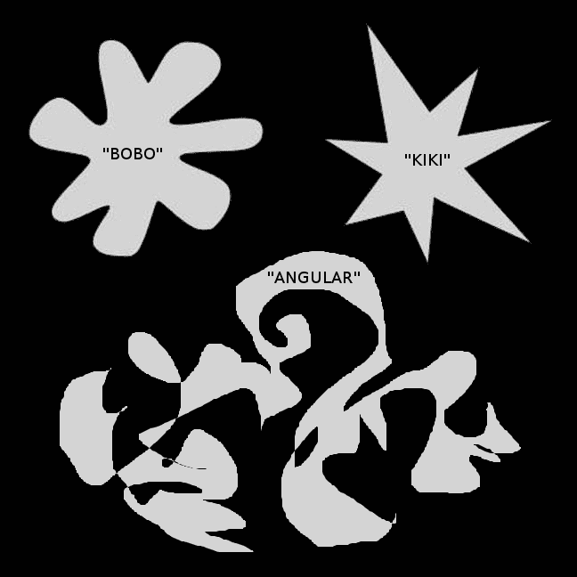
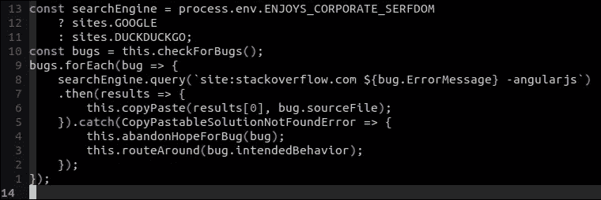

# 为什么 Angular 让我退出网站开发

> 原文：<https://medium.com/hackernoon/why-angular-made-me-quit-web-dev-f63b83a157af>

辨别一家公司是否已经开始衰败的最可靠方法之一，是衡量其产品在一段时间内提供的效用的导数。像苹果这样的公司在发布 iPhone 时见证了平均产品效用的巨大飙升，这种增长持续了一段时间，但最终在他们开始取消 3.5 毫米插孔等重要的手机功能时保持平稳。一般来说，大多数公司都经历过这种效用的 S 曲线或抛物线:前一种类型通常找到自己的位置，填补它，并在舒适的利润中运营，而不需要太多的创新；后一类人设法把事情搞砸，并在未能理解其产品的情况下破产。

*角度*。它的名字在舌头上是一个敌对的形式。慢慢念。/'eŋgjəlɚ/.喉咙本身扭曲在这个词的可怕的异形周围，这个词的意思是丑陋的，尖锐的，人造的。

*Test subjects across the globe overwhelmingly associate the same three words with the same three shapes.*

在这里，我将举例说明我的心灵被这种混乱的恶魔粪便——谷歌的创意:有角度的 WEB 开发框架——不可逆转地伤害的各种方式。

# 文档

你是否曾经有过一个周末项目的绝妙想法，在周六下午开始，然后逐渐意识到这个项目至少需要六个月才能完全实施？当谷歌开始记录 ANGULAR WEB 开发框架的内部工作时，他们也有过这样的时刻。然后，他们连续几周只给一名实习生滴加浓咖啡，直到她有了一个 Hello World 代码跟踪项目，他们能够将其作为整个堆栈的完整文档。

在 ANGULAR WEB DEVELOPMENT FRAMEWORK 上构建 WEB 应用程序时，您将会遇到的所有错误都不会在本文档中列出。事实上，您需要的设计模式或核心概念也很少会出现在这里。如果你想学习如何用 ANGULAR 实际构建一个*危险的*工具，你需要购买一个在线课程(我可以推荐 Maximillian Schwarzmueller 的全面的[完整指南](https://www.udemy.com/the-complete-guide-to-angular-2/)，它挽救了我的工作)，它将向你揭示所有的问题！时刻和陷阱等待着 naȉf，他们相信自己可以像 React 或 Vue 开发人员一样开始编写 Javascript。

Angular 的*实际*文档更多的是一个函数，下面我会伪代码。

This neat little script is only 5MB after Angular compiles it.

注意到什么了吗？是的，没错:在 ANGULAR 中修复 bug 时，你需要*明确地从你的每一次搜索中排除短语‘ANGULAR js’*。你不能附加一个 2，或者 7，或者希望仅仅“有角度”就足以排除这个综合软件开发栈的不幸的第一版。不用说，仅仅这一点过了一会儿就开始令人生厌了。

但是当你开始阅读足够多的这些堆栈溢出“解决方案”来解决人们的问题时，你开始明白，在你编写的代码和浏览器中运行的代码之间，不仅仅是一个编译器会为你轻松地破解所有的 CSS，还有一个真正的黑盒，要求你以完全相同的方式格式化你的应用程序，否则整个事情将会*无声地失败*或者更糟，抛出一个*不正确的错误消息*。你真的不能相信 ANGULAR WEB 开发框架告诉你的关于你做错了什么的任何事情，因为甚至它也不知道它自己的系统是如何工作的。您是否在“模块”中声明了一个“EntryComponent ”,它旨在延迟加载到而不是根“模块”中，在根“模块”中它会失去延迟加载的所有好处？*不！*你有没有尝试过使用*双向数据绑定*，而不是一个神秘的“事件发射器”和“订阅”和“服务”的菊花链？*禁止！*

整个 ANGULAR WEB 开发体验就是这样。你全速跑向砖墙的次数够多了，最终你学会了以蜗牛的速度爬行，可怜地摸索着寻找框架可能扔在你路上的任何任意障碍。世界上最令人沮丧的事情莫过于试图操作这个据称是世界上最聪明的公司设法制造出来的巨大而又喜怒无常的装置。

想象一下，一辆车的引擎盖从来没有打开过，它的仪表板上写着只有仪表板在眩目的灯光下无法关闭。汽车一旦坏了就无法修理；只能从外到内进行更换或修改。即使没开，它也会耗油。不存在维修手册。如果你想知道它是如何工作的，这里有 5280 页的组装指南。祝你好运。

# “建筑”

有角的慢。编写应用程序需要很长时间，一旦你的应用程序变得比“Hello World”更复杂，你创建的应用程序就会运行缓慢。如果 ANGULAR 框架给用户或程序员带来任何好处，比如在运行时出错时优雅地失败，或者快速编译，或者增加应用程序的安全性，这都是可以接受的。但是 ANGULAR 没有这些。事实上，只要一提到“未被捕获的类型错误”,它就会崩溃成一堆哀号。

基本上，理解 Angular 实际上在做什么的唯一方法是阅读开发人员乐意在 GitHub 上提供的数百万行源代码。因为没有人真的这么做，ANGULAR WEB 开发人员通常会满足于学习一两个他们知道不会爆炸的设计模式，然后用它们构建一个完整的应用程序。就像用越来越大的医生办公室充气手套建造的潜水艇。如果有源源不断的手套和幼儿，这可能行得通。你唯一的另一个选择是让自己沉浸在无意义的、任意的疯狂中，等待着试图学习角度如何“工作”的开发人员。

我来告诉你它是如何工作的。您的组件与您的服务对话，服务通过您的应用程序导入的模块将数据传递给其他可注入的组件。这有什么不清楚的？如果您需要澄清，请查阅材料设计指南。他们有你需要建造的所有组件。请保持你的设计像素完美。这应该很容易做到，因为谷歌设计的材料和角度应该可以很好地配合工作。当每个列表项上的填充占据了网页的三分之一，打开一个下拉菜单需要 16 秒时，它看起来和感觉起来都很棒。你不觉得从一个武断和不发达的互联网的束缚中解放出来了吗？

ANGULAR 的设计没有一个部分能让你的代码运行得更快。它只增加了三件事:复杂性膨胀，完成一个简单功能所需的时间，以及——如果你能以某种方式避免日复一日地写这种意大利面条让自己发疯——你和你的团队的工作保障。但是要注意:当截止日期临近时，ANGULAR WEB 开发框架不会给你任何帮助。

# ANGULAR WEB 开发体验

打开你的 IDE 选择，编码！请输入您的 IntelliJ IDEA 许可证密钥开始。需要许可证密钥才能继续。感谢您输入许可证密钥。请选择您想要用来“Lint”您的类型脚本代码的类型脚本“Linter”。ANGULAR WEB DFGHSDFG FGSGDFSFDS 运行类型脚本，是带有类型的 Java 脚本。这就很好了。您必须使用与类型脚本兼容的 IDE。类型脚本偶尔会更新。这将破坏您的代码和依赖项中的代码。这是意料之中的。为通过蠕虫函数调用获取报酬的时间而欢欣鼓舞吧！这就是生活！

如果您的依赖库在更改了一个您从未使用过的类的单个属性后，偶尔会发出重大更改，请不要惊慌。您可以在每个构建过程中添加一个手动文件编辑步骤。或者您可以冻结兼容版本的库，并丢失所有未来的改进。感谢您选择字体和角度。

ANGULAR 将有助于将假的 HTML 元素混合到真正的 HTML 元素中，因为整个应用程序正在被他们的提前编译器撕成碎片，所以如果他们用反复无常的冒名顶替者污染了正确的规范，那又有什么关系呢？当编写一个 HTML 文件时，请记住使用特定于角度的标记语言，它包含了使你的代码调试起来更有趣的指令。如果您想进一步混淆您键入的字符的目的，您甚至可以编写自己的角度指令。所有这些高级的有角度味道的 HTML 的最吸引人的特性是，追踪错误的源头比现存的几乎任何其他库、框架或编码环境都要困难得多。他们会给你错误的错误信息。在你意识到真正的错误隐藏在条件和神秘的导入指令的深处之前，你可以搜索一个丢失的结束标记好几天，并且试图向一个局外人解释它会激起一种恐惧或怜悯的表情。哦，你也不能再写同页锚链接了，因为那个功能太有用了。享受用 Java 脚本手动滚动的乐趣吧！

不过没关系，你将有足够的时间来考虑你的不明智的决定，继续用这个漂亮的框架编程，因为*每次你编辑任何小的 HTML 片段，你都需要重新编译整个应用程序*。热重新加载工作在婴儿阶段，但是一旦你的应用程序开发出任何程度的复杂性，你需要等待 *60 到 300 秒*，同时处理器处理你的整个代码库，将*单个 HTML 类添加到弹出窗口的单个元素中*。你生命中的几个小时很快就消失在虚空中。花费数小时盯着控制台消息:“92%块资产优化”。希望你喜欢播客！

“但是，等等，如果使用这种技术，您可以避免所有编译！！[Stack Overflow link*]"不能使用这种技术，因为 ANGULAR WEB 开发框架设法在开发模式下编译应用程序时没有错误*，而在生产模式下会抛出错误*。所以你需要构建产品，每一次都要捕捉每一个 bug。

*再问一次:为什么文档中一开始就没有这种技术？！

你讨厌写清晰的 CSS 吗？ANGULAR 提供了各种令人困惑的方法来将显式样式规则转换为伪 HTML，每次更改元素的类时都需要重新编译。你甚至不需要学习 FLEXBOX…当然，直到经理要求知道为什么你的布局没有“达到标准”——材料设计标准——然后突然，你意识到你一直在对着黑盒念无意义的话，整个应用程序建立在一个即将崩溃的不稳定的假设集合上，但是你不能在不撤销数周工作的情况下修复它们，但是最后期限，最后期限！

# 作为谷歌虐待狂程序的奴隶一年的收获

ANGULAR 让我成为了一名更好的程序员，因为它教会了我如何站在火山中，在坚硬的岩石岛上跳过熔岩池时编写函数式应用程序。我做的任何不是最有效的方法都会立即导致无法忍受的减速。我尝试做的任何事情，如果比将数据对象 A 附着到显示元素 B 的最简单的解决方案更复杂，都有可能让整个地方陷入火海。是-角度应用程序中的任何错误都会导致角度应用程序的其余部分出现意外行为。我们最终实现了一个系统，在这个系统中，每当应用程序注意到一个未被捕获的错误时，它就会重新加载页面，因为这比试图过滤支持标签来确定一个错误是它自己的错误还是在功能中留下一个弹坑后悄然消失的其他错误的结果更简单。然后他们去掉了那个补丁:“不要写错误就好。我以为你用的是测试驱动开发？”

我将终生带着 ANGULAR WEB 开发框架的知识。我没有办法摆脱它；它比任何粘液都更强有力地粘附在我身上，它比任何自然液体都更彻底地堵塞我大脑的皱纹。如果我要养活我的家人，我别无选择，只能作为一名 ANGULAR DEVELOPER 提供服务。但还是有希望的。有一天，我可能会使用 React 或 Redux 之类的另一个框架获得一份合同，或者上帝保佑一个像 Vue 之类的对你的 web 堆栈的其余部分没有偏见的库。但现在，我坚持不懈，紧紧抓住那些我知道属于我的记忆，抵御威胁着我身份本质的谷歌概念的入侵。我们活着是为了迎接新的一天。

今天，我在 [Whiteboard Dynamics](http://whiteboarddynamics.co) 工作，在这里，我的时间很少花在使用 ANGULAR 命令行工具上，而是花在为不需要每三个月重写一次的产品编写干净、高效、实用的代码上。总的来说，我发现这种变化让我的预期寿命延长了几年。如果你要求的话，我们会写一些有棱角的东西——正如我说过的，我将永远承受这种被诅咒的能力——但是相信我:你最好去一个人们会喜欢工作的图书馆。它将花费你更少的时间和金钱，而且你将得到你不朽的灵魂。