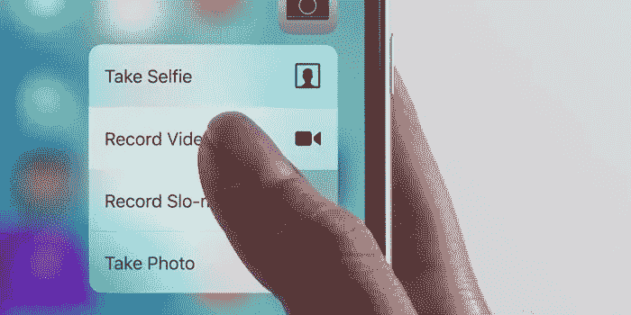
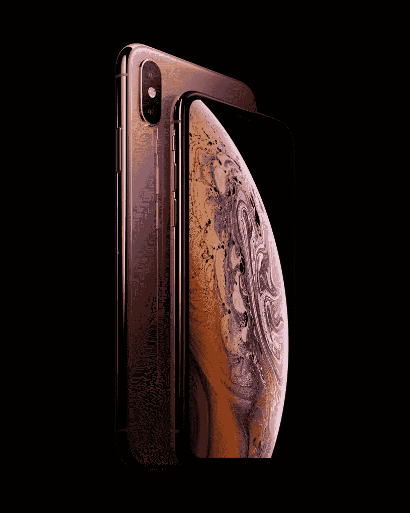
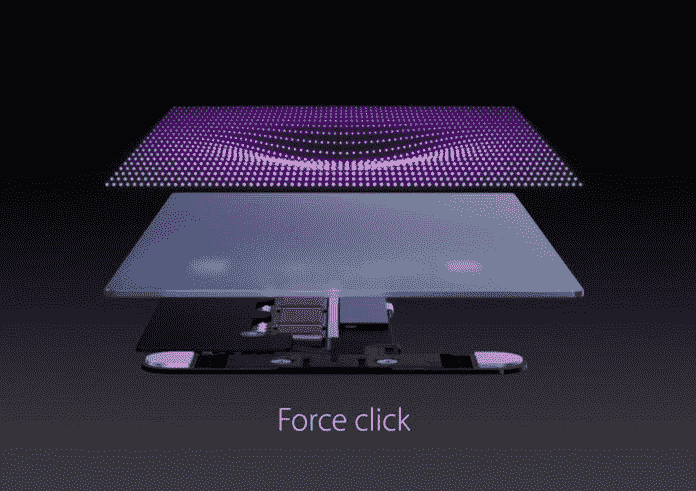
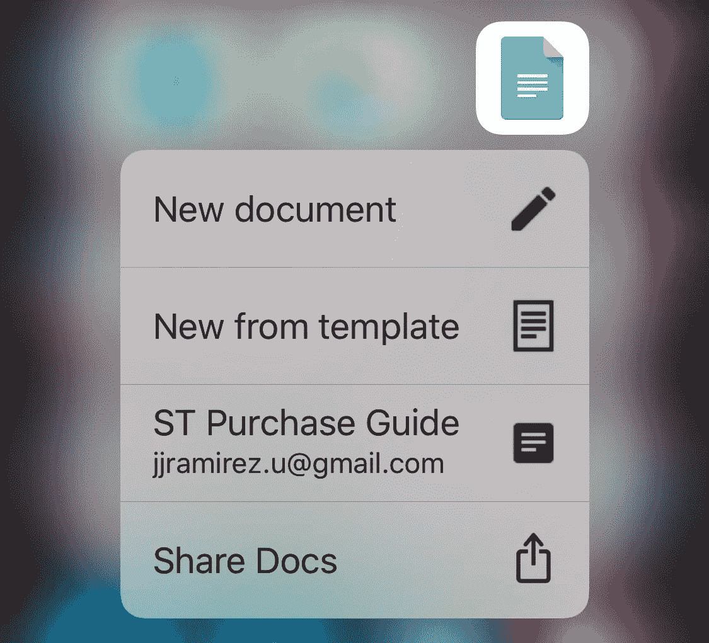
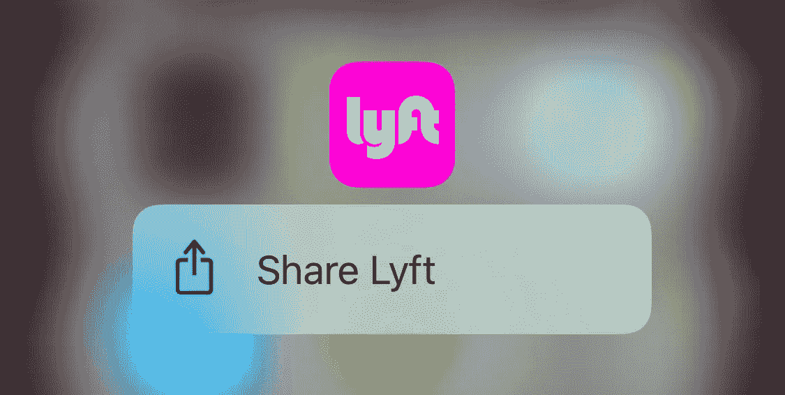
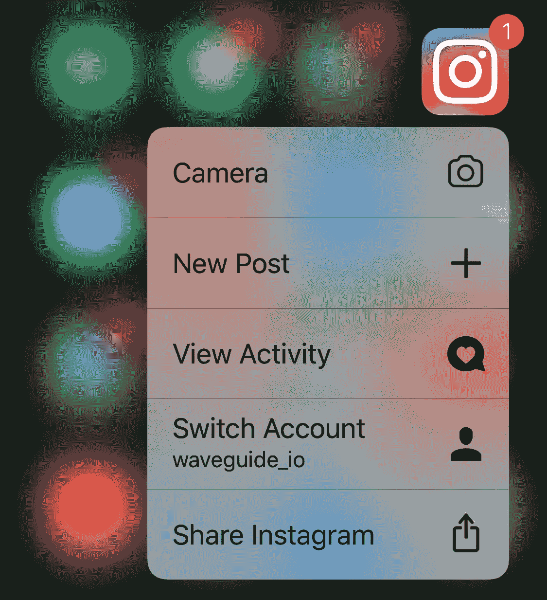
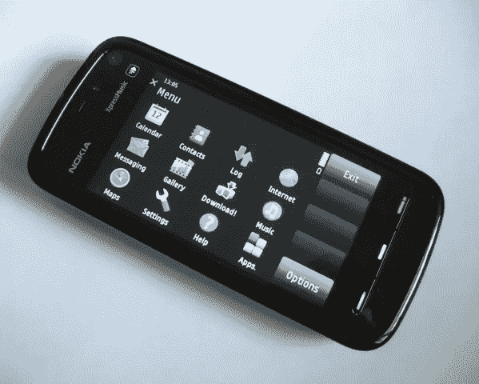

# 为什么苹果的 3D Touch 会惨败？

> 原文：<https://medium.com/hackernoon/why-apples-3d-touch-failed-miserably-72545b608ad>

## UX 拆除一项不成功的技术。

3D Touch

上周[苹果](https://hackernoon.com/tagged/apple)公布了他们最成功的产品和品牌的新产品，即 [iPhone](https://hackernoon.com/tagged/iphone) 。

在他们的[主题演讲](https://www.youtube.com/watch?v=wFTmQ27S7OQ)中宣布的大多数事情都在苹果产品发展的预期之内。产品线顶部的新改进，包括更现代、更大的手机，对角线为 6.5 英寸。他们史上最大的手机。

iPhone XS

然而，随着 iPhone XR 的推出，他们的产品策略发生了巨大的转变。这一举措是极其罕见的产品决策，可能会塑造 iPhone 的未来，并改变其生产和营销方式。

对于那些没有看主题演讲或没有足够了解它的人来说，XR 是一款奇怪的手机。以下是这款手机与我们之前见过的苹果手机完全不同的一些原因:

*   它比 XS 便宜，但更大(XS 的对角线长度为 5.8 英寸，而 XR 的对角线长度为 6.1 英寸)。
*   它的 A12 仿生处理器和在 XS 发现的一样。然而，它配备了 3GB 的内存(与 X 相同)，而 XS 配备了 4GB。这意味着这款手机比 X 快，比 XS 稍慢。
*   它配有 128GB 的存储选项。X 家族唯一提供的手机。
*   它有一个单摄像头，而不是双摄像头，但它仍然能够依靠其软件(如谷歌像素)在人像照片中产生景深效果。
*   它有六种不同的颜色。苹果创造多样化需求的老策略。然而，它确实有一个优质的玻璃背面，这使得它的营销方式有很大的不同(还记得 iPhone 5C 吗？那个觉得便宜，这个没有)。
*   它带有苹果公司所谓的“液态视网膜”。这是一种 LCD 屏幕，比 X 和 XS 使用的有机发光二极管显示器差，但比 iPhone 8 使用的上一代 LCD 要好。
*   尽管这些手机被宣传为“无边框”，但它们仍然有一个小的圆形边框。这款屏幕的边框明显比 X 和 XS 的厚。
*   最后但同样重要的是，这款屏幕**没有配备 3D Touch** 。苹果显然放弃了这一功能，它决定从一款手机中放弃这一功能，这意味着要重新调整他们未来几年的产品战略。

对我来说，最后一点是苹果即将推出的战略的最重要的启示。似乎苹果正在为我们准备一个将 3D touch 从顶级旗舰产品系列中淘汰的未来。

这就引出了一个问题。这个功能为什么会失败，它对 iPhone 的未来意味着什么？
我花了几天时间来剖析臭名昭著的 3D touch 的 UX 和历史，**试图揭示 3D touch 功能的消失将如何重塑苹果最重要产品的未来。**

## 3D touch，乞求一个问题的解决方案。

苹果在 2014 年推出了 3D Touch / Force Touch，作为其进化版触控板中的嵌入式技术。这项技术是触觉引擎技术的伴侣，其主要目标是重现机械按压或驱动按钮的触觉感觉。这是苹果工业设计战略的一次重大变革，该战略一直倾向于减少使用中容易损坏的机械部件。

Force Touch in Macbook’s Trackpad

这项技术在 2015 年进入了 iPhone 和 Apple Watch，旨在为可触摸设备带来新的交互维度。“改变游戏规则”的技术是 iPhone 6S 的主要卖点之一。

这里有一个现在标志性的 Jony Ive 视频解释了这项技术

iPhone 6S with 3D Touch

作为一名设计师，我记得第一次看这个视频时，对这个新的交互水平感到非常兴奋。但是三年后再看，事情变得清晰而明显。
**这是一个乞求解决的问题。视频中演示的互动没有一点用处。**

例如，Jony 称之为“偷窥和流行”的互动仅仅是像照片和 URL 这样的开放资源的噱头替代品。
该视频甚至未能展示 3D touch 实现的完整快捷流程是如何工作的，并且仅关注上下文菜单。

视频显示该技术是触摸传感技术的一个进步，但现实是，即使在营销中，它也几乎没有实际用途。似乎苹果的 3D touch 战略是将该技术作为其传感器产品的原始产品提供，并让他们的开发人员社区找到创造性和智能的方法来使用它并增强他们的体验。这不是苹果第一次这样做，因为他们的一些最具突破性的技术来自类似的原理。

那为什么没有发生呢？在对该功能进行深入分析后，我发现了以下几点。

## 开发人员采用率极低

这可能是 3D touch 失败的原因或结果。不管怎样，这是事实。

我在 200 个 iPhone 流行应用的样本中测试了应用图标快捷菜单。只有 40%的应用程序有 3D 触摸快捷菜单。这个采用率听起来并不可怕，直到你开始深入了解他们的实施细节。

例如，**谷歌似乎在每个应用中都包含了 3D touch 快捷菜单，但我惊讶地发现他们的实现缺乏一致性。**Sheets 应用程序没有快捷菜单，而 Docs 应用程序有。

对于同一个套件中的一组应用程序来说，这是一种奇怪的不一致。

Google Sheets — No 3D Touch Menu

Google Docs — 3D Touch Menu

Lyft 和 Bumble 等热门应用没有快捷菜单，优步只为乘车应用提供了快捷菜单，但没有为 UberEats 应用提供快捷菜单。

Lyft — No 3D Touch Menu

很多 app 都有快捷方式，甚至不起作用。在测试不同的快捷方式时，我注意到一些应用程序试图深入链接到描述的视图或功能，然后陷入白屏。这个问题在我身上发生得太多了，以至于我甚至没有努力去记录它。你自己去测试一下就好了。

大多数提供 3D 触摸快捷菜单的应用程序也没有在菜单中提供太多价值。以 DoorDash 应用程序为例，通过快捷菜单提供的唯一选项是“搜索”。

DoorDash 3D Touch Shortcut Menu

快捷方式是枯燥和重复的流程，可以在没有 3D 触摸交互的情况下实现。
我在下面的观点中对此做了更多的阐述。

## 重复和重叠的用户路径

让我们想象一下，3D touch 是它声称的天赐生产力和省时功能。这意味着通过使用它，你可以加快工作流程，用更少的步骤完成工作。对吗？

嗯，这与事实相差甚远**。在我所有的测试中，我找不到一个比仅仅使用带有标准触摸功能的应用程序更实用、更有用的快捷键。**
Instagram 就是这种失败的绝佳例子。让我们以相机快捷方式为例。
如果我想通过 3D touch 菜单打开相机，我必须做以下事情:
1)找到 Instagram 图标，2)强制触摸它 3)点击相机菜单项。
现在，如果我想通过传统的触摸交互打开相机，我必须做以下事情:
1)找到 Instagram 图标，2)点击它 3)从左向右滑动或点击左上角的相机图标。

Instagram 3D Touch Shortcut Menu

**考虑到使用两种交互方法实现相同的路径需要相同的步骤，因此没有背离传统输入的好动机。**这个问题也存在于其他功能性更强、更快捷的菜单选项中，比如切换账户。没有理由依赖一种只能带来有限改进，有时根本没有改进的交互。

## 发现率极低

这一点可能是这项技术最广为人知的问题。3D touch 在 UI 层非常不容易被发现。
如果你想了解这种交互所能实现的动作类型，你必须强制触摸你屏幕上的所有东西，并期望得到一些输出。有时当你得到输出时，很难理解交互支持哪种增强或功能。

苹果甚至没有试图就如何提高 3D touch 的可发现性提供指导。他们的[人机界面指南](https://developer.apple.com/design/human-interface-guidelines/ios/user-interaction/3d-touch/)没有提供这个主题的背景，只解释了无用的“偷窥和流行”概念的细微差别。

## 不可靠的交互和人机工程学的噩梦

如果你想体验一下关节炎的感觉，我建议你在 iPhone 上进行一整天的 3D 触摸。这东西是人体工程学的噩梦。**它的主要问题是确定触发交互的合适压力有多难。**在默认的灵敏度设置中(中等),有时似乎轻轻一触就会触发，但大多数时候不会。在触发 3D 触摸的尝试失败后，大多数用户会施加极大的压力，以平衡实现交互所需的力的明显需求。

一项使用食物称重天平和手对手比较的自制测试显示，有时用户可以施加远高于 100 克的压力来触发 3D 触摸。我并不是说这是触发交互所需的实际压力，但一旦第一次失败，用户很可能会想到这一点。**事实上，有时你会发现自己施加了四分之一磅的压力来触发 3D 触摸，这使得该功能对于日常使用来说完全不切实际。**

## 交互光谱中的概念碰撞

iPhone 主要是一个触摸设备。它还有其他输入机制，如麦克风、加速度计/陀螺仪组合和摄像头，但这些机制都无法与触摸屏幕来记录意图的有效性和效率相提并论。

这种基本原理可能是苹果认为扩大可用触摸交互数量是显而易见的事情的原因。他们非常成功地实现了这一点，引入了多点触摸电容屏幕以及来自该技术的一系列动作和交互。
但是 3D touch 不一样。与典型的电容式触摸相比，3D 触摸并没有提供任何实际优势。事实上，它做了完全相反的事情。
作为一种依赖于物理压力的功能，3D 触摸在交互光谱中占据了一席之地，与电容屏支持的轻触交互的持续成功形成了冲突和否定。

**还记得使用带电阻式触摸屏的手机或设备有多令人沮丧吗？** 3D touch 是一项技术，它重新找回了那些让压力屏幕如此令人沮丧的不必要的阻抗。

Nokia 5800 with a Resistive Screen. The most frustrating phone ever.

虽然找到扩大可用交互范围的方法是有意义的，但像 3D touch 这样的技术不可避免地会遭遇生存危机，特别是当它与 iPhone 如此受欢迎和成功的功能之一间接竞争时。

## 投入少、产出垄断的有限技术。

如前所述，3D touch 是一项不可靠的技术。

很难确定触发 3D 触摸所需的压力大小，这使得很难持续使用。但是输入还不是这项技术最糟糕的部分。3D touch 在 UI 层中如此受限，以至于它蚕食了其他技术(如触觉引擎)可以为普通触摸交互提供的潜在体验优势。

**由于 3D 触摸交互通常与触觉引擎产生的触觉反馈配对，像触觉引擎这样的神奇技术的工作被简化为“农民 3D 触摸伴侣”的角色。**

虽然这不一定是 3D touch 失败的原因，但它解释了 3D touch 创造的微观世界有多么有限。该功能并没有真正增加 iPhone 最终 UX 的价值，但它的优势足以让人觉得它是一个限制因素，而不是一项未使用的技术。

## 3D 触摸的未来

随着 iPhone XR 的推出和 3D touch 在该设备中的移除，苹果对该技术未来的意图非常明显。**然而，从产品线顶部移除该功能比决定不再将它添加到未来的手机中更具挑战性。**

苹果在高端机型上测试价格弹性的策略似乎奏效了。但这一策略只有在苹果不断增加功能以证明价格上涨是合理的情况下才会奏效。

取消 3D touch 将是一个挑战，主要是因为这意味着取消一项特殊的技术，该技术可以证明他们高端设备的价格是合理的。

在没有找到可替换的替代物之前，苹果不太可能移除这项技术，即使它只是一种基于软件的替代输入，如[指关节检测。](https://qeexo.com/fingersense/)

还有一个很小的可能性是，苹果正在研究这项技术的新版本，它基于其他技术，如这个[专利](https://appleinsider.com/articles/17/09/26/apple-patent-for-ultrasonic-force-sensor-could-lead-to-iphone-with-under-screen-touch-id)、
中描述的技术，甚至是某种能够感应重量的屏幕，这将允许像 iPad 这样的设备作为小型食品称重天平工作。

当然，一切皆有可能，XR 可能表明，苹果针对高端机型的新产品战略也可能受到该机型中所见的技术集成和部署新方法的影响。

或者，3D touch 技术的替代品可能会增加 Apple Pencil 支持(这是过去两年来人们一直期待的)，并推出 Apple Pencil Mini 和带笔筒的特殊 iPhone 外壳，这将是史蒂夫·乔布斯遗产中的最后一颗钉子。

无论如何，目前的现实是 3D touch 已死，苹果仍在处理它的身体…

那么你的想法是什么？你是 3D Touch 的铁杆用户吗？如果它不在了，你会怀念它吗？请在评论中告诉我。

我叫胡安·拉米雷斯(JJ)。我目前是亚马逊网络服务的 UX 设计师。如果你喜欢我的写作和想法，请不要犹豫访问 [*波导*](https://www.waveguide.io) *，这是一个设计知识库，我在这里剖析 UX 模式和文档设计。也请确保在 Twitter 上关注我，以跟上我的项目和文章。*

偶尔，我会为公司和个人做点播的 UX 拆除和 UX 战略项目。如果你有兴趣，可以在我的网站上给我留言。