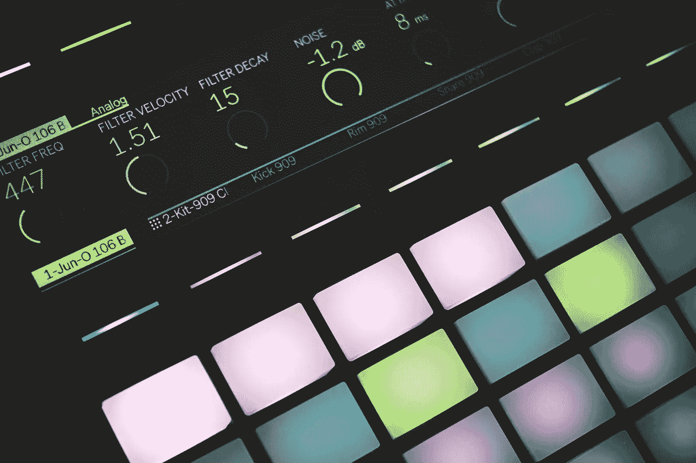

# 为什么那么多码手都是音乐人？

> 原文：<https://medium.com/hackernoon/why-are-so-many-coders-musicians-60389fb8b645>

**长期承诺。**

## **第 1 部分，共 3 部分**

Photo by Luca Bravo (unsplash.com)

我目前正处于开发人员职业生涯的开端。可以说，我是从“后门”进来的。我一生都是一名音乐家，正是由于我对构建音乐工具的兴趣，我进入了软件行业。

从音乐到代码是一个渐进的过渡。我花了一些时间做决定，因为我害怕被疏远。我不想变成一个小隔间的僵尸，整天对着电脑漫不经心地打字，脱离生活和艺术。我以前有过几份公司工作，无法接受。对于有创造力的人来说，疏离的工作会吸取生命的精华。音乐家在工作中需要创造性的表达，对灵魂破碎的工作容忍度低。

尽管编码意味着长时间盯着屏幕，但令我惊讶的是，我发现这并没有疏远我。在其中，我发现了一种表达创造力的新方式。就像从事音乐工作一样，无论是制作、作曲还是演奏，都感觉不像是实际工作。为什么会这样？除此之外，我注意到许多开发人员是音乐家。在这个行业干了几个月后，我意识到这不是巧合。

寻找音乐家让我意识到我的恐惧是没有根据的，这也让我想知道为什么许多程序员都是音乐家。造成这种关系的两个职业有什么共同点？

在这个由三部分组成的系列文章中，我将谈谈这两种职业的不同特质。

**长期承诺**

对于音乐家和程序员来说，似乎有一种专注的品质。人们需要这种储备和专注，才能长期集中精力发展技能。在这两个学科中，我都发现了一种个人特质，那就是坚持不懈，克服不断的挫折。

发展音乐才能需要长期的投入和大脑可塑性的持续训练，以将精细的手部动作融入工具中，训练耳朵区分音符、和弦和音色，学习如何阅读乐谱，并将和声、对位法和乐器的理论抽象转化为声音的心理表达。

作为一名初学编码的人，我发现自己也处于类似的过程中。学习基本原理并变得舒适和有创造力需要概念的成熟，这需要很长时间。编程中的许多概念都是抽象的，你无法将其与日常经验联系起来，因此，它们需要很长时间才能适应。

话虽如此，尽管这两个学科的性质需要相似的思维模式，但这并不意味着技能是相同的。我不认为逻辑和算法思维直接转化为音乐，这需要懂得数数，有很好的听觉和协调能力。与此同时，我看不出这些最后的技能将如何转化为编码。许多音乐家不会编程，许多程序员无论如何努力也成不了音乐家。然而，你获得技能的过程是相似的，并且奖励那种能够从事长期实践和学习的个性。

感谢阅读。请继续本系列的 [**第二部**](/@francisco.rafart/why-are-so-many-coders-musicians-f260e2a9257a) ，用我发现的音乐和编码之间的其他关系。