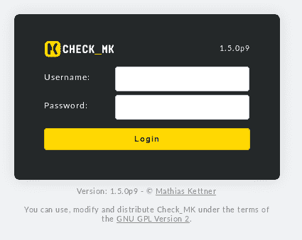
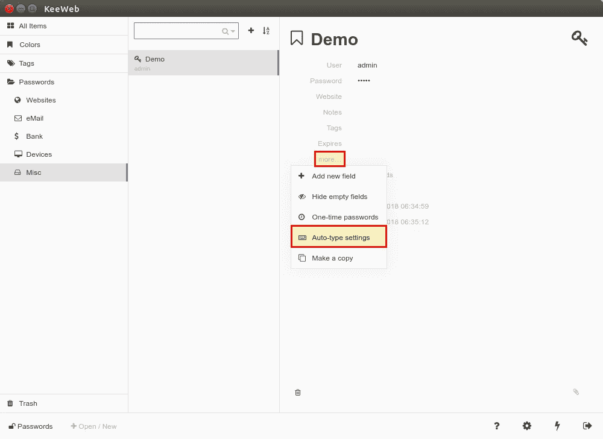

# 为什么自动打字是 KeeWeb 最好的特性之一

> 原文：<https://medium.com/hackernoon/why-auto-type-is-one-of-the-best-features-in-keeweb-30a31e780821>


KeeWeb 是一个与 KeePass 兼容的密码管理器，可用于许多平台。我已经私下和专业用了好几年了。今天我想介绍一个我最近才发现的出色功能:自动打字。通过自动输入，您可以自动输入您的凭据，无论它是网站还是桌面应用程序。好的一面是你几乎不需要做任何事情来配置 KeeWeb 中的 Auto-Type。

# 自动打字是如何工作的？

动画超过 1000 字，所以这里有一个小的 GIF，展示了自动打字的功能(图中 [Check_MK](https://openschoolsolutions.org/tag/check_mk/) ):



顾名思义，KeeWeb 会自动填写输入字段并为您注册。KeeWeb 必须打开(在后台)。

# 在 KeeWeb 中配置自动类型

从版本 1.2 开始，默认情况下对所有条目启用自动类型。该设置可在**更多→自动类型设置**中找到。



出现一个输入字段，您现在可以在其中输入各种占位符或命令。对于所有条目，默认条目是:

```
{USERNAME}{TAB}{PASSWORD}{ENTER}
```

首先自动填写用户名，然后使用 TAB 键更改密码字段并输入密码。最后，Auto-Type 用 Enter 键“按下”登录按钮。

对于大多数网站或应用程序来说，这种设置非常有效。但是，也有一些页面(如 Gmail)会在显示密码字段之前先检查用户名。在这里，您可以使用{DELAY X}添加延迟。代替 X，你必须指定一个以毫秒为单位的值，例如

```
{USERNAME}{ENTER}{DELAY 3000}{PASSWORD}{ENTER}
```

Auto-Type 知道许多命令和占位符。你可以在这里找到概述。

# 使用自动键入

要使自动键入工作，您必须首先在 Linux 下安装一个软件包:

```
$ sudo apt install xdotool
```

之后，您可以使用 **SHIFT+ALT+T** 激活自动键入(KeeWeb 必须打开(在后台))。如果 KeeWeb 只找到一个匹配的条目(如通过窗口标题或 URL)，KeeWeb 将自动填写这些字段。如果与现有条目不匹配，将出现另一个窗口。您可以在那里手动选择合适的用户名/密码。

# 结论

我很欣赏 KeeWeb，因为它可以在许多平台上使用，并且可以同步密码数据库。无论是 Nextcloud、Google Drive 还是 Dropbox——有了 KeeWeb，你在任何地方(甚至在团队中)都可以获得所有软件和服务的密码。Auto-Type 是 KeeWeb 中隐藏的、但却是最好的特性之一！

*最初发表于*[*【openschoolsolutions.org】*](https://openschoolsolutions.org/keeweb-auto-type/)*。*