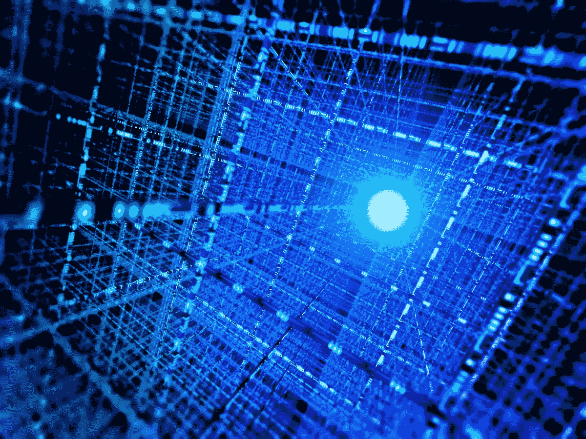
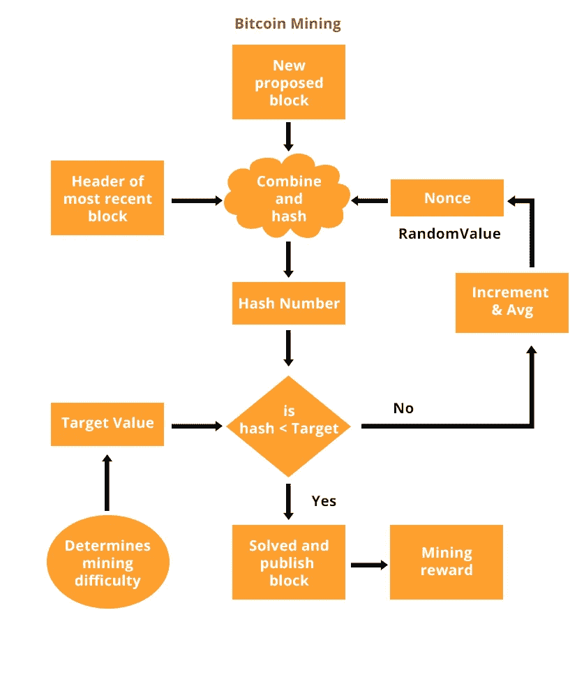
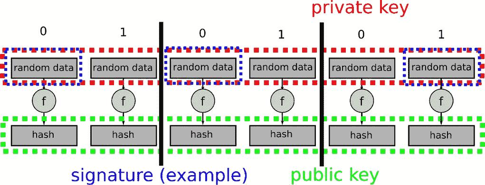

# 为什么比特币害怕量子计算机——而 IOTA 不害怕

> 原文：<https://medium.com/hackernoon/why-bitcoin-fears-quantum-computers-and-iota-doesnt-697da531a11b>

如果有一件事会给整个区块链领域带来真正的麻烦，那肯定是量子计算。这项新技术提供了比我们以前拥有的更多的计算能力，也可以用于破解比特币等的安全系统:在 2018 年的 CES 上可以看到，这种新型处理器不再是未来的事情，但它的发展正在迅速取得进展 ( [英特尔](https://newsroom.intel.com/news/intel-advances-quantum-neuromorphic-computing-research/)刚刚宣布了一项[重大突破](http://www.zdnet.com/article/ces-2018-intel-announces-major-breakthrough-in-quantum-computing-chip/))。IOTA 正在努力成为整个物联网(IoT)的新基础层，这是一个拥有数百万和数十亿互联设备和交易的全新生态系统——当然，这样的网络必须免受攻击，也免受量子计算机的攻击。我认为 IOTA——与比特币等不同——使用的是一种底层架构，这种架构可以防止量子计算机实施的恶意攻击。

# 1.你需要知道的是

注意:这里的目标是用简单的语言解释这个过程，所以我必须跳过一些深奥和令人困惑的技术细节。

比特币使用公共账本来存储数据。它将特定时间段的所有数据打包到一个所谓的块中。这个块还携带了前一个块的所谓的“T8”哈希(T9):一个数学函数，它将数据转换成一组特定长度的数据，通常是一长串随机数字和字母(“a003c86b3e1038….”).为了防止用户多次消费同一个比特币，有一个所谓的**时间戳**也被添加到每笔交易中，并存储在块中。然后还有另一个数字叫做 **nonce** 。

块=先前块的散列+事务/时间戳+随机数

挖掘器检查将要通过网络发送的事务是否有效(通过比较所有散列和值是否有意义)。如果它们是有效的，他会将交易抓取到一个块中，并使用一种非常著名的安全算法“SHA-256”对整个块进行两次哈希运算。通过这样做，新的散列被创建并且**该散列必须小于某个目标值**，以便该块被发布为区块链的新块。*挖掘者唯一可以改变的值是 nonce* ，所以如果 hash 不小于目标值，挖掘者必须尝试另一个数。就计算而言，这是一项大量的工作，一旦你找到验证区块的随机数，就会得到比特币的回报:所有这些都被称为**挖掘**，你可能听说过:-)。顺便提一点精神食粮:

> 根据总部位于英国的能源价格比较服务公司 PowerCompare 进行的一项研究，今年用于开采比特币的平均用电量已经超过了 159 个国家的年用电量。[……]一笔比特币交易消耗的能量足够一个普通家庭使用一整个月。([链接](https://futurism.com/mining-bitcoin-costs-more-energy-159-countries-consume-year/))

[https://www.supportsages.com/bitcoin-mining/](https://www.supportsages.com/bitcoin-mining/)

# **2a)51%的风险——攻击**

现在问题来了:因为每个矿工都将一个单独的交易打包到一个块中(这个块将发送给他有希望得到回报的比特币)，每个矿工的*哈希问题*都是单独的。这意味着理论上两个矿工可以同时找到他们问题的解决方案，结果将是两个开采的区块。比特币协议的规则是只接受经过更多努力的那个。到目前为止，一切顺利。

但是，如果矿工聚集在矿池中，分享他们开采的比特币，因为每个人都在工作，就像在团队中一样(这就是正在发生的事情)，他们拥有如此强大的个人电脑，以至于他们代表了超过 50%的网络计算能力，会发生什么？然后它“可以通过删除交易来花掉比特币两次，这样它们就永远不会被纳入区块链。(其他矿工)并不知道，因为他们对采矿过程没有监督。([《麻省理工科技评论》](https://www.technologyreview.com/s/609408/quantum-computers-pose-imminent-threat-to-bitcoin-security/))“这么大的计算能力会让整个采矿系统崩溃！

到目前为止，这种情况从未发生过，因为这需要一大群人聚在一起，把他们所有的计算能力放在一起——但是如果你使用一台或多台量子计算机来挖掘比特币会发生什么呢？

根据麻省理工学院专家的说法，答案是**不会真正成为危险**(至少在未来 10 年内不会)，因为量子处理器的时钟速度(还)不够高，无法跟上今天英伟达等公司最强大的采矿机器。

# 2b)计算私钥的风险

当然，比特币协议希望确保每一枚比特币只能由其所有者花费。每个钱包都有一个秘密的私钥(可以说是访问比特币账户的密码)和公钥，公钥很容易从私钥生成并发布到网络上(这个密钥的哈希就是钱包地址！):所以基本上你可以说一个是密码，一个是钱包地址。

你可以做的是使用一个签名，向其他人表明你真的有这个账户的私钥，而不用分享你的密码/密钥。这项技术被称为“椭圆曲线签名方案”(这样的签名[将 IOTA 的来世确定为 NXT](/@iotasuppoter/iota-the-hardware-part-a6100b5bb4d5) 的创造者)

因此，您可以很容易地从私钥创建公钥，并通过上述方案证明您的所有权——但反之则不然！即使用我们今天最快的计算机，这也是不可能的，因为加密方法足够强大。然而，

> [……]有了量子计算机，就容易了。
> 
> 这就是量子计算机对比特币构成重大风险的原因。“比特币使用的椭圆曲线签名方案风险更大，最早在 2027 年，量子计算机就可能完全破解**，”Aggarwal 和他的同事说。**
> 
> 事实上，量子计算机对所有使用类似技术的加密方案构成了类似的风险，这种技术**包括许多常见的加密形式**。[麻省理工科技评论](https://www.technologyreview.com/s/609408/quantum-computers-pose-imminent-threat-to-bitcoin-security/)

这将使量子计算机在钱包地址/公钥已知的情况下计算任何账户的私钥=密码成为可能(如果你想深入挖掘，关键词是 [Shor 的算法](https://en.wikipedia.org/wiki/Shor%27s_algorithm))。

# 3.极微小

与比特币相反，IOTA 不使用[椭圆曲线加密](https://en.wikipedia.org/wiki/Elliptic-curve_cryptography#Quantum_computing_attacks) (ECC)，而是使用[基于哈希的签名](https://www.imperialviolet.org/2013/07/18/hashsig.html)，因此不仅使协议[能够抵抗量子计算机](https://eprint.iacr.org/2011/191.pdf)的攻击，而且签名和验证交易也更加简单快捷。

IOTA 是量子安全的，因为它使用了 Winternitz 签名:

The signature is derived from parts of the private key (Lamport-Diffie-scheme)

我能想到的最好的总结如下:

> 对于这种类型的签名，人们为具有代表消息的单个比特的‘0’或‘1’的每种情况生成随机数据。这是**私钥**。**公钥代表每个随机数据块**的散列版本。为了对消息进行签名，根据单个消息位是“0”还是“1 ”,透露每个位的私钥数据。验证者可以计算散列并将其与公钥进行比较。这里我们注意到，生成第二个签名会告诉我们关于私钥的更多信息，并允许攻击者伪造更多的签名。**因此，单个密钥对只能使用一次**。为了提高性能和减少空间需求，Merkle 提出了以 Robert Winternitz 命名的 Winternitz OTS(一次性签名)。温特尼茨 OTS 的基本思想是一次签署几个比特。

至于 IOTA，简单地说，这就是为什么不应该使用同一个地址发送 IOTA 两次的原因，因为每次都会泄露一部分私钥；使用同一个地址超过一次会使它被攻击，即使使用今天的方法。

然而，IOTA 仍在开发和改进中，其中一个主要方面是其[对三进制(而非二进制)硬件的关注](/@iotasuppoter/iota-the-hardware-part-a6100b5bb4d5)，即开发一种能够尽快处理加密计算的芯片。当然，这也需要考虑三值逻辑的软件解决方案。因为市场上没有可以使用的东西，所以它必须由一些真正聪明的人来发明:IOTA 开发者！

IOTA 的三元(还是那句话，不是如上的二元！)哈希函数称为 CURL-P (P =原型)。目前，[这正在由世界上最著名的安全审计公司之一](https://blog.iota.org/iota-foundation-hires-cybercrypt-615d2df79001)进行审查/审计(这是有意义的，因为这是一种全新的技术，应该能够处理未来的十亿交易物联网网络)。[引用 IOTA-foundation](https://blog.iota.org/the-transparency-compendium-26aa5bb8e260) ，

> CURL 是“基于 Keccak 创造者(SHA-3)发明的经过充分研究的海绵结构，并严格符合他们官方文件中描述的所有要求[。](http://sponge.noekeon.org/CSF-0.1.pdf)

因为在没有完整和成功的安全审计的情况下不能使用它，所以已经通过使用用于签名的 [NIST 标准 Keccak (SHA-3)](https://www.nist.gov/news-events/news/2015/08/nist-releases-sha-3-cryptographic-hash-standard) 算法采取了安全预防措施:因为 IOTA 网络还没有在三进制硬件上运行，所以需要将信息从二进制转换成三进制的软件功能；这个哈希函数叫做 [Kerl](https://github.com/iotaledger/kerl/blob/master/IOTA-Kerl-spec.md) (=Keccak-384)。

# 观点

可以看出，由于椭圆曲线加密及其在这种情况下的缺点，量子计算对比特币(以及其衍生品)账户的安全性构成了真正的威胁。由于选择了基于散列的签名，IOTA 对此没有什么可担心的。

目前，IOTA 还没有全速运行，因为计算必须经过软件转换(KERL)。未来，这将由[物联网定制微处理器](/p/iota-the-hardware-part-a6100b5bb4d5)来完成:

> 这意味着，即使是在网络边缘的小型设备，也完全能够在本地执行自己的哈希运算，每秒处理数百/数千个事务，而无需外包。有了硬件支持，IOTA 扩展的基本限制将是物理定律本身。*即无线电波/光子传输数据的速度。*值得注意的是，这种硬件组件不会在价格或芯片尺寸上给制造商增加任何额外成本，并且将完全开源。([大卫·松斯特博，IOTA 联合创始人](https://blog.iota.org/the-transparency-compendium-26aa5bb8e260))

我希望这有助于你理解 a)为什么 IOTA 是一个如此伟大和特殊的事业，以及 b)为什么 IOTA(尽管它已经取得了巨大的成功)在它与硬件结合的实际能力方面仍然只是在开始…并且记住:**所有这些都将在能源成本的一小部分(与比特币等相比)并且没有任何费用**！

如果你想的话，我很乐意捐一点。-):

IOTA:kgozyhjryvdbsxtusecyjvebldvyfkcakawtptckxmbnownvrdhrvsjnivoqufrodfpxfwysgrokrwzwjztjohsx