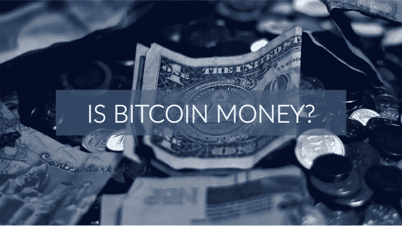
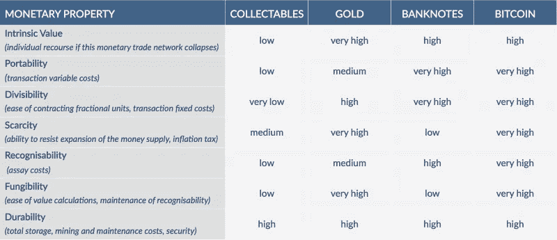

# 比特币和货币史。

> 原文：<https://medium.com/hackernoon/why-bitcoin-is-the-purest-form-of-money-to-date-a-history-of-money-2c6613f7bcfc>

# 货币史

我们都在使用金钱，并且花费了我们生命中的很大一部分时间来工作，但是它是什么呢？货币最简单的形式是交换媒介、记账单位和价值储存手段。追踪债务的困难和低效导致了货币的发展。例如，如果一个猎人在 25000 年前捕获了一大笔鱼，他们可能希望与他们的社区分享战利品，以换取未来的好处。然而，在货币出现之前，这是一个困难的命题；猎人必须准确记录他们分发了多少肉，给了哪些人。因为没有共享的分类账，每个人都有责任记录自己的债务。

债务的自我跟踪有明显的问题，如不准确和相互矛盾的记录，以及对不同商品的价值缺乏共识。因此，商品货币诞生了，最初是贝壳和毛皮等收藏品，后来是金银等贵金属。这种早期的货币形式提供了一种中间产品，可以用作共享的分类账，每个人都同意一个单位的价值。商品货币的选择基于某些特征，如便携性、耐用性和可储存性。收藏品和贵金属是对以前债务经济中使用的方法的巨大改进，但随着代表性货币的引入，便携性和可分性得到了进一步改善。

代表货币是一种交换媒介，它证明对有价值的东西的所有权，但本身并不具有内在价值。代表性的货币首先是商人发行的金银存单，后来是政府发行的银行券。几个世纪以来，纸币都是由黄金支持的，这意味着在任何时候，人们都可以以特定的汇率将纸币兑换成黄金。随着经济的增长，对货币的需求越来越多，黄金的供应量不足以支撑新的纸币。法定货币是当今最常用的货币形式，它的发展是为了让政府能够更好地控制货币供应。法定货币的功能与早期的纸币相同，但没有任何实物商品的支持，而是基于人们的共同认知。

**比特币和货币**

既然我们已经了解了什么是钱，钱从何而来，那么让我们来谈谈[比特币](https://hackernoon.com/tagged/bitcoin)和其他加密货币是如何融入这一切的。根据米什金(2007)的《货币、银行和金融市场经济学》,某物要被认为是货币，必须满足三个功能:

比特币实现了所有这三个功能:它易于交易，可以用来代表真实物品的价值，是一种非常安全的价值储存手段。

然而，并不是所有类型的货币都是平等的，仅仅因为某样东西满足所有这三个功能并不一定意味着它是一种好的货币形式。某些属性使得某些形式的货币更适合某些用途。下图基于七种广泛使用的货币属性，比较了不同类型的货币，包括比特币。

[Courtesy of 3iQ Research Group](https://3iq.ca/3iq-research-group/)

**内在价值**比特币的内在价值在于它的网络。它能够充当世界上第一个数字无记名资产，可以在不受第三方托管人或政府干预的情况下存储和交易。此外，这些交易可以以近乎即时的速度跨越无限的距离进行，这一事实也是有价值的。

**便携性**比特币不像黄金或现金那样是我们持有的实物，它们没有重量，运输时也没有摩擦。你可以把比特币储存在手机、电脑甚至一个小小的硬件钱包里。运输比特币的唯一要求是电力和互联网连接，这两者几乎无处不在。此外，随着你积累越来越多，比特币也不会变得更加难以运输。购买像房子或汽车这样的大件商品就像买一杯咖啡一样简单。

**整除性**一个比特币可以被整除到小数点后 8 位。最小的比特币单位，一个 Satoshi，价值 0.00000001 BTC。相比之下，美元的最小单位，美分，价值 0.01 美元。Satoshi 等高度可分的单元能够促进小额支付，小额支付正在成为数字时代越来越受欢迎的支付系统。

为了保持价值，货币必须有有限的供应量。流通中的比特币最多只有 2100 万个，没有人能创造更多。与法币等通货膨胀货币不同，法币会随着供应量的增加而贬值，比特币可以被视为通货紧缩货币，因为随着供应量的减少(由于丢失、被盗等原因)。)每枚比特币将在总供应量中占据更大比例，因此价值更高。

快速可靠地检验你收到的钱是真的还是假的能力至关重要。比特币共享账本的性质使得伪造几乎不可能。每笔交易和每个地址都有一个完全唯一的标识符，该标识符是公开的，可以快速验证。

**可替换性**可替换性测试一个货币单位是否与任何其他货币单位相同。在大多数情况下，比特币被认为是非常可替代的。一枚比特币的价值与任何其他比特币相同，可以认为它们是完全可以互换的。然而，在极少数情况下，由于比特币网络上交易的可追溯性，可能会出现问题。如果比特币接触到与不利服务相关的钱包地址，它可能会被视为“脏”比特币。一些买家避免使用“脏”比特币，因为与“干净”或“处女”(新铸造的)比特币相比，这些比特币的价值更低。

**耐用性**比特币几乎是不可摧毁的，它不会屈服于磨损，也不会被有意摧毁。尽管如此，如果比特币被发送到一个没有人能提取的地址，它实际上会丢失。尽管如此，按照适当的备份程序，比特币是最安全的财富存储之一。

**结论**

那么，比特币是真钱吗？简单的答案是肯定的。长期答案是，它不仅是迄今为止最纯粹的货币形式之一，它远不止是货币。除了其特殊的货币属性，比特币还是一种协议、计算机网络等等。提供现有货币无法提供的灵活性和功能。

参考文献:

*货币、银行和金融市场的经济学。*

Smithin，J. (2000)。*什么是钱。*检索自:[https://books.google.ca/books?id=MDU-NTEJziMC&pg = PA47&redir _ ESC = y](https://books.google.ca/books?id=MDU-NTEJziMC&pg=PA47&redir_esc=y)

Desjardins，J. (2015)。*信息图表:货币的属性。*检索自:[http://money . visual 资本家. com/info graphic-the-properties-of-money/](http://money.visualcapitalist.com/infographic-the-properties-of-money/)