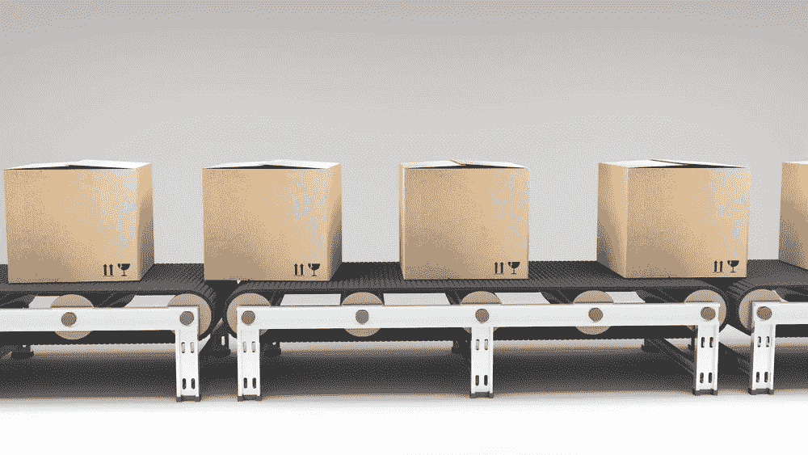

# 为什么区块链即服务解决方案不是区块链

> 原文：<https://medium.com/hackernoon/why-blockchain-as-a-service-solutions-arent-blockchains-8d588b1f35ce>

IBM 和沃尔玛正在使用区块链跟踪食品的消息看起来像是更大的区块链计划的胜利。我有朋友和家人给我发来最近关于食品信托平台的文章，说:“嘿，这不是你做的吗？”

更多的意识当然是一件好事，这是毫无疑问的。

在我们日益全球化和网络化的供应链中，食品安全非常重要。我的意思是，拜托，人们在吃了一个有 T4 生菜的 BLT 三明治后，T2 就要死了。包装食品并不安全，正如我们在 33 个州看到的 100 起沙门氏菌感染与凯洛格的谷类食品有关。

但作为一家致力于建立行业运营、去中心化的区块链解决方案的公司的联合创始人，沃尔玛和 IBM 区块链是一个笑话。任何人都不应该拥有供应链或建立区块链即服务(BaaS)平台。

我并不反对大公司，但集中化的解决方案违背了区块链的精神。这项服务被宣传为一个生态系统，但事实并非如此。

> 这是一个集中化的产品，购买它就像购买云服务一样。

如果公司轻描淡写地抛出“解决方案”、“协议”或“生态系统”这样的术语，这对区块链空间没有好处这个行业最不需要的就是那些有意义的术语变成被过度使用的、有延展性的流行语，根据公司的需求来定义。

创建一个真正的区块链生态系统需要公司重新思考他们的业务结构和商业模式。这不是实现这些解决方案的最简单的方法，但从长远来看，它将具有最大的价值。

这就是为什么集中式方法没有同样的效果:

# **真正的区块链生态系统是由节点管理的分散式网络。**

几家公司采用的 BaaS 方法从根本上与去中心化的精神格格不入。他们营销、构建和销售区块链，就好像它是一个平台或解决方案。他们用“生态系统”这个词来描述他们正在建造的东西，但他们并没有以赋予这个词生命的方式来操作技术。

如果公司想要创建一个生态系统，他们必须花时间弄清楚谁属于网络，然后把每个人聚集在一起，参与并合作应对治理的挑战。

## 相反，企业正在采取自己拥有和管理区块链的方式。

很明显，当一个企业在运行一个集中的平台，使用区块链作为一个时髦的词。这是一种自上而下的方法，在这种方法中，公司成为控制网络上的节点和服务的看门人。

作为一个纯粹主义者，我认为任何需要人类治理的东西都与去中心化的概念不一致。我还认为，许可网络从根本上挑战了作为区块链意味着什么的概念，但嘿，我们还没有到那一步。

区块链的行业可能还很年轻，但我认为当它被一家公司控制时，称之为生态系统是不公平或不准确的。

# **任何一个组织都不应该拥有运营权。**

一个真正分散的网络是不切实际的，不管是在哪个行业。

必须有一个实体来促进网络并把参与者聚集在一起。然而，更大的公司正在使用这种推理来创建一个完全集中的平台。

> 区块链的美妙之处在于，它可以创建之前参与者回避的行业内用例。但唯一的办法是通过生态系统建设和全行业的参与。

例如，看看今年早些时候 IBM 和沃尔玛在供应链中追踪芒果的做法。点对点路由是对该技术的一个很好的利用，如果没有区块链的解决方案，这是不可能的。这里的问题不一定是这两家公司是否使用区块链的有效解决方案，而是他们如何执行和实施这些解决方案。

作为大公司，他们将会影响区块链应用的未来。因此，对他们来说，致力于为使用它们的公司提供长期价值的解决方案是非常重要的。

# **如果一个区块链网络以非常集中的方式开始，那么它很难扩大和变得分散。**

毫无疑问，IBM 和沃尔玛之间的关系将影响其他公司如何建立他们的网络。这个领域总会有一定程度的集中化，因为有些人就是无法放弃他们一贯的做事方式。

尽管如此，这并不是行业前进的最佳方式，因为它设定了一些企业可能决定遵循的标准。一旦发生这种情况，他们将永远无法越过中央集权的临界点。

其他公司正在试图以正确的方式解决这些问题，通过提供工具来促进行业生态系统的形成，从而促进分散的网络。目标应该是将各方聚集在一起，为他们提供参与和促进网络形成和治理的途径。

只有当每个人都有发言权时，才能建立真正改变一个行业的解决方案。

**感谢阅读！**

**关注我的** [**推特**](https://twitter.com/iamSamsterdam) **和**[**Quora**](https://www.quora.com/profile/Samantha-Radocchia)**了解更多关于区块链科技的见解。或者在这里** **与实录团队** [**取得联系。**](https://chronicled.typeform.com/to/y80B2Y)