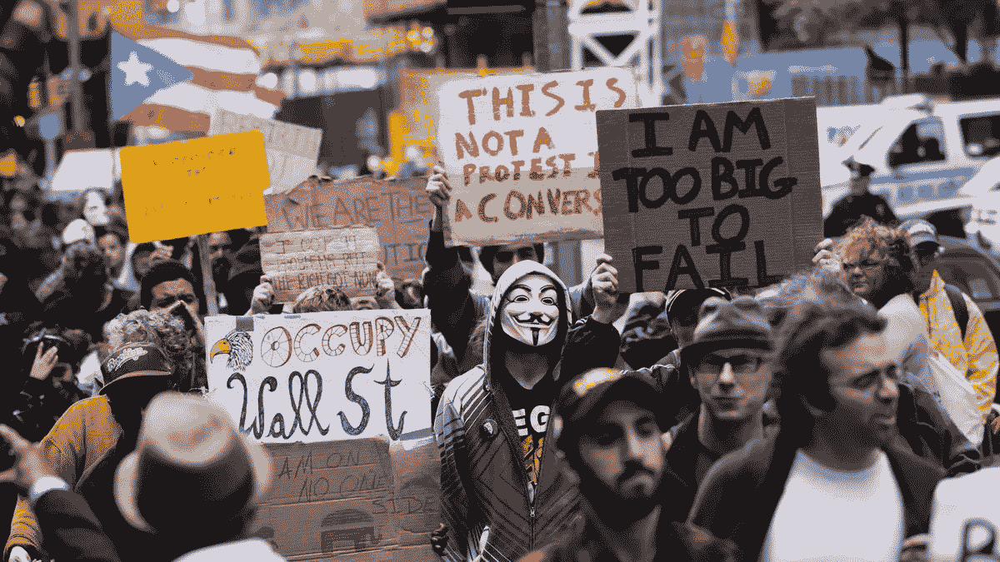
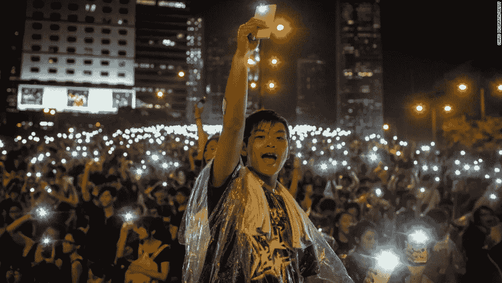

# https://hackernoon.com/tagged/startupWhy 区块链至关重要

> 原文：<https://medium.com/hackernoon/why-blockchain-matters-21daa15aa6a8>

## “权力下放不仅具有行政价值，还具有公民层面，因为它增加了公民对公共事务感兴趣的机会(……)。”——亚历西斯·德·托克维尔

十九世纪初，法国外交官亚历西斯·德·托克维尔将政治分权描述为“[真正的自由精神](http://counterpoint.uchicago.edu/Autumn%202010.pdf)”。托克维尔的重点——将权力划分到美国各州——似乎与我们今天联想到的[区块链](https://hackernoon.com/tagged/blockchain)科技的分权思想相去甚远。然而，从本质上说，区块链的重要性反映了托克维尔在近两个世纪前的美国颠覆性变革中所认识到的东西——分配社会权力的系统可以成为更广泛参与社会和经济事务的催化剂。

2009 年，[中本聪](https://www.cnbc.com/2017/10/27/bitcoins-origin-story-remains-shrouded-in-mystery-heres-why-it-matters.html)用比特币把区块链带到了世界舞台。该技术解决了著名的“双重支出问题”，允许互不相识的各方在不需要支付处理商、银行和众筹服务商等中间人的情况下交易数字化资产。

区块链爱好者经常将该技术的革命性潜力描述为“在不信任的世界中传递信任”。传统上，中介将确定有价值的资产和转移的有效性和安全性。但是因为区块链本质上是共享的，所以任何改变都服从自动一致协议，该协议可以在没有中央权威支持的情况下执行这样的验证和确认。

正是这些共识协议让区块链从比特币的起源开始了真正的革命。由于以信任为中心的流程被“T0”硬连线“T1”到区块链分类账中，资产可以更直接地分配和交易——没有典型中介相关的延迟和成本。由于区块链是数字化的，资产管理也变得可编程，通过[智能合同](https://blockgeeks.com/guides/smart-contracts/)和[分布式应用](https://www.investopedia.com/terms/d/distributed-applications-apps.asp)允许通过自动化实现更大的灵活性。

[比特币](https://bitcoin.org/)显示了区块链对数字货币创造和使用的好处，现在我们开始看到从房子到汽车到商业合同的各种资产在区块链注册，使它们更容易、更便宜、更安全地存储和管理。贯穿这些用例的共同主线是，区块链促进了*无偏见共识*的建立，而没有经常需要的集中管理拐杖——托管服务、银行和公证人。

从意大利商人到上个世纪的商人和商人，我们依靠集中的借贷记录来告诉我们谁拥有什么。我们也越来越依赖于中央数据库来存储信息。我们的数据、身份以及对商品和服务的访问权被委托给当局，这通常不是出于选择，而是因为这是玩这个游戏的唯一方式。

Government clerks documenting the public legislative process

但使经济活动成为可能的中央集权机制扭曲了权力分配。早期，银行，以及后来的证券交易所和其他中介机构，从流动性经济的促进者变成了看门人。他们收费并限制访问，制造阻力并抑制创新。在很大程度上，集中的参与者开始支配市场，设定准入价格和准入规则。获取商品和服务的故事是一个类似的由中央集权的巨人把关和垄断的故事。

我们声称生活在一个全球化的社会，一个人类联系最紧密的时代。然而，世界各地的个人和团体仍然缺乏权力和机会。人们经常感到不公平、不平等，他们的声音没有被听到。许多人认为集中的参与者——社交网络、银行、媒体——为他们自己的利益服务，对他们撒谎，侵犯他们的隐私。在这个“全球化社会”中，[20 亿人无法进入银行账户](http://uk.businessinsider.com/the-worlds-unbanked-population-in-6-charts-2017-8)，因为当局拒绝接受他们的记录，基本上将他们挡在了全球经济之外。

Protesters in New York during the Occupy Wall Street movement

区块链在速度、成本和准确性方面显示出重要管理优势。但是[蓬勃发展的兴趣](https://hackernoon.com/big-techs-growing-interest-in-blockchain-8100b6daa2b5)、投资和围绕科技的兴奋不能仅仅归因于这些因素。确立真相并通过共识做出决定，传播第三方的力量，其核心是一种极端的[去中心化](https://www.catholicculture.org/culture/library/view.cfm?recnum=9958)模式。正如托克维尔在他创造了这个术语的研究中所认识到的那样，分权往往比它带来的行政好处更多。

如果不是共识的产物，社会价值本身是什么？这将是一个空洞的概念。价值交换的前提是这样一个事实，即我们相信对方关于我们拥有什么、我们被欠什么以及我们欠什么的主张。我们的信息、[身份](https://www.forbes.com/sites/forbestechcouncil/2018/07/27/how-blockchain-can-solve-identity-management-problems/)和访问也是如此。一个正常运转的社会要求我们就什么重要，什么不重要达成一致，并建立社会活动所依据的某些共同原则。

区块链技术的真正前景是，它可以通过激进的、去中心化的价值创造和管理方法，极大地增强社会活动赖以存在的信任，进而创造出有待发现和探索的新经济结构和组织。

区块链表明，人们可以以更公平、更平衡、更包容的方式参与社会。当人们感到他们有了新的权力，他们有了发言权，他们在决策中有了更平等的发言权，这可以促进创新。就像文艺复兴这样的创新时刻一样，进步通常会推动进一步的进步。我们可能很快就要进入一个颠覆性技术变革的时代，这将改变数字原生社会的社会权力分配。

Internet creator Tim-Berners Lee

互联网创始人蒂姆·伯纳斯·李(Tim-Berners Lee)对他的发明有一个著名的评价，“[我从没想到会有这么多猫](https://www.independent.co.uk/life-style/gadgets-and-tech/tim-berners-lee-on-creating-the-web-i-never-expected-all-these-cats-9189946.html)”。技术可以迅速变得比它们的根源大得多，特别是那些扩大权力、影响和信息的技术。区块链的使用案例多种多样，但很难说其最大的影响是什么。像互联网一样，区块链是一项 [*基础技术*](https://bitcoinmagazine.com/articles/op-ed-making-friends-time-cryptocurrency-space/) ，随着它在使用中的增长和适应各种需求，它将产生进一步的可能性。

在 20 世纪 90 年代，很少有人能预测到谷歌和脸书的迅速崛起，但是互联网泡沫给这项技术带来了巨大的投资，为未来巨头的觉醒奠定了基础。我们看到类似的令人眩晕的投资、炒作、波动、怀疑和理想主义围绕着今天的区块链。我们很容易被身边的科技所吸引。但是，区块链空间的移动和颤抖形成它的最高峰可能还需要几年的时间。

显而易见的是，我们目前正在进行的创新是为更美好的未来做准备，这将为我们更广泛地参与经济、政治、投资和商业，以及我们在当代生活中未知的利益方面带来大量的可能性。区块链已经在许多领域展示了其颠覆性的潜力。大规模的[改变游戏规则的案例](https://www2.deloitte.com/us/en/pages/consulting/articles/innovation-blockchain-survey.html)已经在金融服务、电信和媒体、制造、医疗保健、能源、生命科学和公共部门得到采用。

在区块链之前，没有办法做出集体决策，并把执行控制权交给公正的参与者。我们不得不将这项工作外包给我们认为能确保决策得到贯彻、业务得到公平执行的人。然而，这些参与者的影响力越来越大，成为社会软件中被黑客攻击的重要目标(从内部和外部)。区块链是我们如何消除这些缺陷，我们如何形成一个更平衡，更强大的社会生态系统，优化大多数人从其多样化的机会中受益。

在 IOST，我们正在为去中心化的经济创造基础设施，这种经济不会走捷径，也不会在去中心化的真正可能性上妥协。IOST 将是一个高速区块链平台，允许开发者构建大众化的应用和合同，这将有助于让世界变得更美好、更公平。

我们理解，权力下放应该是非指令性的。这就是为什么我们花时间去了解如何最好地为人们提供一个区块链平台，这个平台足够灵活，可以适应多种用途，足够安全，可以高速处理数据而不存在漏洞，足够公平，可以在网络上分配控制权，并奖励对生态系统做出积极贡献的人。

对托克维尔来说，分权政治最有益的方面是它的公民方面。权力在美国传播的公民效应是通过赋予个人权力来加强地方对政治体系的参与。区块链提供的权力下放模式可以通过更多的选择自由、与其他个人和企业更直接的互动以及可能的新的经济和社会表达方式，增加个人参与自己创造的经济的机会。

技术的本质是更好地将决策影响力分配给*授权*。因此，尽管区块链的行政好处是显著的，但反映最大变化的可能是这种公民层面。推动加密货币繁荣的社区利益现在正在为下一代区块链项目奠定基础，以通过技术手段动员人们。

Protesters using mesh network technology for mass communication

革命不是简单地通过广告、营销或政党政治开始的，而是通过希望开始的——不是作为一种情感的建构，而是通过改变现状的一线机会。区块链作为一项基础技术，将为更多参与未来经济活动和利益提供大量机会。这就是区块链举足轻重的原因——无论它在哪个领域发生革命。

> [**本水域**](https://www.linkedin.com/in/ben-d-waters/) 是 IOST 负责人的数字。作为一名在数字领域工作了 10 年的资深人士，他在技术营销、商业战略和管理方面拥有丰富的经验。作为加密货币和区块链的大力倡导者，Ben 自 2016 年以来一直积极参与区块链技术的社区、开发和推广。