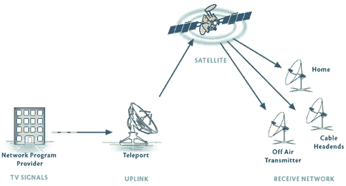
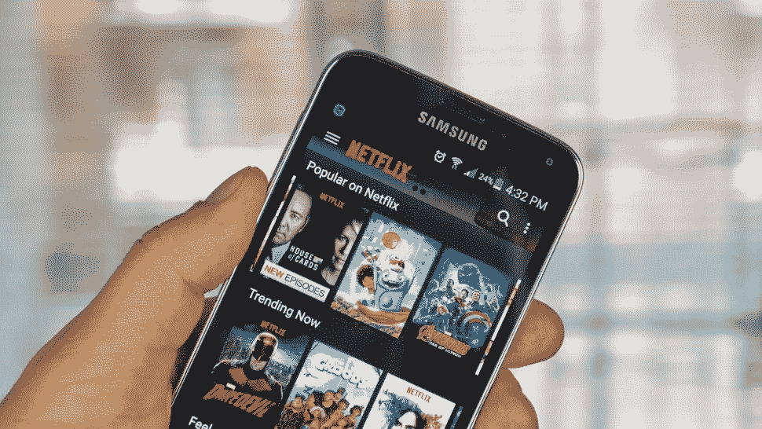

# 为什么区块链可能会杀死有线电视和网飞

> 原文：<https://medium.com/hackernoon/why-blockchain-might-kill-both-cable-and-netflix-9e2f596a050c>

> 这篇文章的一个简短且略有不同的版本最初出现在 [Venture Beat](https://venturebeat.com/2018/01/28/how-blockchain-could-kill-both-cable-and-netflix/) 的客座博文中

Buggles 乐队 1979 年发行的流行歌曲“视频杀死了电台明星”，是一首歌颂技术变革如何直接导致娱乐业命运变化的歌曲。

这是一个已经多次上演的循环，从 20 世纪 50 年代的广播到电视开始。20 世纪 80 年代，有线电视的兴起震撼了娱乐业。这些变化今天仍在发生，因为互联网的崛起为点播视频和新的聚合和流媒体网站如网飞和 Hulu 或亚马逊提供了机会。

今天，随着一种新型技术的兴起，区块链，由世界各地的点对点计算机节点提供动力，由新的令牌提供资金，这种趋势会继续吗？建立在区块链基础上的分散式娱乐应用真的能取代网飞或亚马逊这样的集中式流媒体服务，成为有线电视的最后丧钟吗？随着以区块链为基地的娱乐方式的出现，现有的娱乐结构(广播、有线电视、网站)还有存在的必要吗？

答案不仅仅是技术性的；它还需要了解区块链驱动的基于令牌的系统如何为娱乐生态系统的不同部分提供经济激励。

## ***娱乐网络的演变***

让我们来看看电视和视频技术的历史。在 20 世纪 40 年代末/50 年代初，出现了广播电视网络。早期，这些公司(NBC，CBS 等。)被称为“链式网络”，因为一个中央信号从纽约发送到附近的城市，如费城，然后再向前发送到更远的地方，如底特律、芝加哥等。(首先使用链式物理同轴电缆，然后使用专用微波链路)。

当地电台是唯一通过天线向电视机进行“空中”广播的电台。今天，我们称之为“最后一英里问题”。我们这些足够大的人会记得我们的父母调整天线，以试图从当地电视台获得更清晰的信号。

电视网络是集中式内容分发平台的早期例子。这种树状结构从一个中央主干开始，而分支就像一个本地站，叶子则是一个个接收器。这不是一个陌生的网状结构。当使用 cdn 时，我们可以在航班时刻表、互联网流和广播中看到它。

由于广播信号不是很强，也不会传播很远，许多家庭的接收效果通常很差。Cable 通过将同轴电缆一直延伸到家中解决了这一问题，这是解决同一“最后一英里”问题的不同解决方案。这对农村地区来说是天赐之物。我记得在 20 世纪 80 年代初，当我们住在北达科他州的农村时，我们第一次获得了有线电视——突然间，我们不仅可以获得广播网络，我们还能够从很远的地方接收频道，如 WTBS 和 WGN 芝加哥。

每一项新技术都会带来新的商业模式，通常会将现有的参与者甩在身后，有线电视也不例外。HBO、MTV、CNN 和其他有线“电视台”变得普遍。大量采用新技术和新商业模式(“订阅”和“付费电视”)创造了财富，今天，由于有线电视，广播网络对家庭内容的垄断早已结束。

## ***互联网流媒体仍然依赖于中心站点***

虽然网飞开始于 DVD 时代，互联网只是用来下单，但随着通过普遍可用的网飞应用程序进行视频流的兴起，它真正获得了目前的主导地位。今天，大多数电视网络都有自己的移动应用程序，除了通过基于互联网的网络观看内容之外，还可以用来消费内容。最近仅通过 CBS 应用程序发布的*星际迷航:发现*没有在传统的 CBS 广播或有线电视频道上播放，这是这方面的一个分水岭。

与此同时，Youtube 和 Twitch 等网站为用户生成的内容创造了一个新的大众市场——这剥夺了有线电视网和工作室作为内容唯一创造者的权利。然而，尽管这些大型网站的崛起，今天大多数高质量的脚本娱乐内容仍然是通过一个很大程度上集中的模式，然后通过管道(有线电视，OTT 应用程序)发送。

## ***区块链依赖去中心化应用***

区块链会如何影响这个生态系统？区块链的想法最初是为加密货币(即比特币)开发的，它有能力从根本上颠覆娱乐业，因为它为内容分发和货币化带来了一种全新的去中心化模式。在区块链中，世界各地的计算机在一个对等网络中一起工作来完成某项任务。没有中央服务器，也没有网站或权威机构。这张图片看起来更像一个网格，而不是一个有序的树。

在商业方面，今天的网飞和有线电视仍然依赖于“集中”生产、聚集和分配的理念。内容创作者必须通过一些“看门人”并与网络达成商业交易，然后将它放在服务器上，然后通过同轴电缆，或最近直接使用 cdn(如 Akamai 或 Amazon CloudFront 的内容交付网络)通过互联网进行分发。提供什么内容、何时提供、价格和分发路线仍然是非常专有和等级分明的。

在一个去中心化的世界里，没有一个网站或权威机构能够决定什么样的“内容”将被分发，以及如何到达“最后一英里”。没有网站能够屏蔽特定的内容。有了 DApps，或分散式娱乐应用，无论是直播还是点播视频，世界各地的数千台计算机将在一个没有层级的网状网络中充当“广播者”。这些“超级节点”将通过向地理上邻近的计算机广播信号来解决最后一英里的问题。这在现有 cdn 不多的国家尤其有效。

出现了许多新的加密项目，它们使用现有的区块链或全新的区块链作为分散式视频流的基础设施。其中一些针对接收和压缩内容进行了优化，以使其可用，一些是端到端解决方案，一些更侧重于直播，一些更适合现有的视频文件。我的公司 Theta Labs 正在构建一个适用于端到端直播的协议，并将在此基础上构建许多 DApps。

虽然点对点传输有助于减少行业对 cdn(目前是 200 亿美元的行业)的依赖，但引入具有货币价值的代币对这些新协议来说与传输系统一样重要，并将导致主流娱乐创作者比以前的尝试更快、更热情地采用这些系统。在新的区块链模式中，代币可以用来为内容开发提供资金，可以被广告商用来绕过中间商(网络)，也可以被消费者用来为特定内容付费。

## ***网飞之死与电报？***

这些区块链项目不仅会彻底颠覆发行世界，因为它们不再需要集中式架构，它们还会颠覆世界的 Netflixes，让有线电视频道的想法彻底过时。除了通过定义明确的分发网络收集精选内容之外，什么是渠道？

以下是一个完全去中心化的区块链娱乐网络可能颠覆这个行业的几种方式:

● *解放内容创作者*。内容创作者可以创建节目，并通过一个分散的平台即时提供——不需要去推销工作室或试图让网飞把你放在他们的系统上。不再有“看门人”，甚至不再有必须批准你的内容的网站。

● *内容的资助*。最终用户可以使用代币为内容付费，或者可以为内容预付费，从而产生新的众筹技术来资助新的电视剧或电影。在借鉴视频游戏的商业模式中，免费直播流的用户可以使用代币以虚拟礼物奖励内容创作者(这已经开始在电子竞技界发生)。这种模式可以扩展到不同类型的娱乐。

● *新频道。*新的“频道”可能只是网络上可用内容的聚合器，同样是以完全分散的方式。你可以设想电子竞技、现场活动、幻想、科幻、新闻等频道。这些频道可以由任何人建立，由内容创作者以分散的方式加入，并由代币资助。

● *广告和免费内容。免费内容甚至可以通过使用代币来颠覆传统的电视广告模式(YouTube 等网站正在效仿这种模式)。新的区块链视频项目通常提供代币，广告商可以使用代币在这些新的分散频道上购买广告。他们可以指定这些硬币直接流向内容创作者，而不必让大型中间商拿走大部分收入——这与中间商获得最大份额的现有做法大相径庭。*

● *付费内容。*至于付费娱乐或订阅模式，这些新代币可用于订阅特定频道或向特定内容创建者付费。这可以取代有线电视点播，并且可以无限制地选择“点播”什么节目。HBO 和其他订阅网络最近发布了他们自己的应用程序，这样你就不需要有线订阅来观看它们。下一个 HBO 可能是一个完全去中心化的网络，完全不依赖有线电视，而是由提供代币的终端用户付费。

● *基础设施激励措施。许多新协议都有激励模型，以新的方式鼓励分布式对等系统。有些要求用令牌“支付”上游节点。在 Theta 协议中，令牌挖掘的引入成为“资助”分发网络的一种方式，并激励人们不仅传递现有的种子流，还传递全世界的直播流。如今，娱乐公司可能会将高达 50%的运营预算用于交付基础设施，而使用基于区块链的令牌系统作为对等网络的一部分，可以完全消除这一成本。新的娱乐玩家不会有这么大的入门成本，这可能会导致有趣内容的爆炸。*

***结论:小心！***

技术变革一直影响着娱乐业。虽然互联网创造了消费内容的新方式，但高质量节目的创作和发行在很大程度上仍被少数播放器、工作室、电视网络、有线电视提供商和网飞等聚合商所主导。这并没有带来互联网承诺的内容民主化。

区块链是下一波技术，有机会通过解决其中的一些问题，从根本上颠覆娱乐业。在一个完全去中心化的世界里，数以千计的个人计算机将取代集中的“看门人”,内容分发的树状有序结构将被动态的对等网状网络取代。

在这个去中心化的世界里，内容创建者不再需要通过重重关卡来提升他们的内容，不再需要与看门人进行长期的商业交易，或者只获得一小部分广告收入。将没有用户会去的网站来消费高质量的视频内容。此外，代币的引入为计算机共享内容、流媒体工具和内容创作者使用网络、最终用户补偿内容创作者创造了新的有趣的经济激励，并为独特的新娱乐内容创造了新的资助模式。

这些项目中的许多将在今年年底上线，我们可以期待在 2019 年和 2020 年看到新参与者的快速增长。正如网飞花了几年时间取代大片和视频租赁店成为消费点播娱乐的主导方式一样，新的去中心化区块链方法成为行业的主导趋势可能也需要几年时间。

因为区块链，现有的娱乐模式(电视网络、有线电视公司和像网飞这样的网站)可能会像 Buggles 所说的那样，走上“电台明星”的道路。

> **关于 Riz**
> 
> Riz Virk 是 SLIVER.tv 的顾问、投资者和企业发展负责人，也是 Theta Labs，Inc .的创始团队成员。他还担任麻省理工学院 Play Labs @ MIT 的现任主任，并在麻省理工学院媒体实验室进行研究。Rizwan 是加密货币和许多区块链公司的早期投资者，包括 Ripio/BitPagos、CoinMkt、Bex.io，自 2013 年以来一直活跃在 BitAngels。他是几篇加密货币相关论文和专栏的合著者，包括*比特币场外交易的在线自动拍卖*(2015)*创建在线买卖比特币的点对点系统*(2013)*我如何用量子计算机垄断比特币采矿市场(理论上)*。Rizwan 拥有麻省理工学院的计算机科学工程学士学位和斯坦福大学商学院的管理学硕士学位。