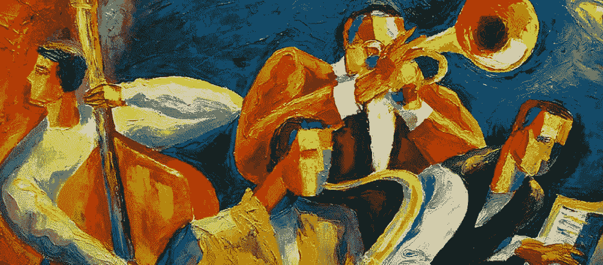
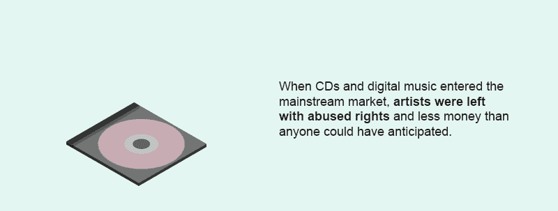
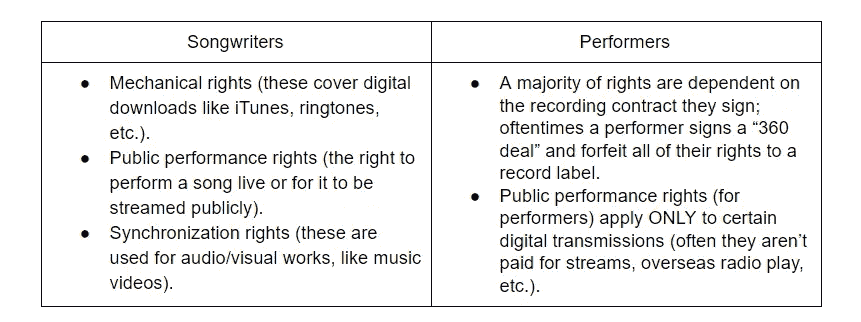
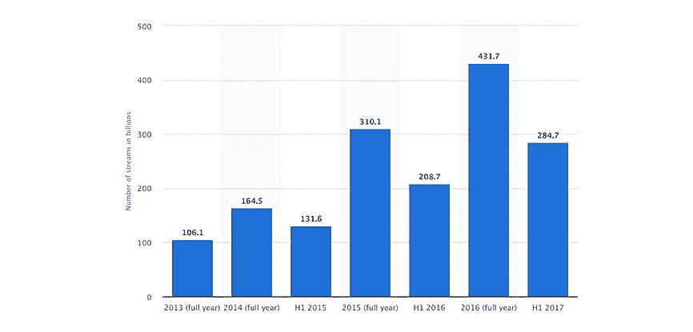
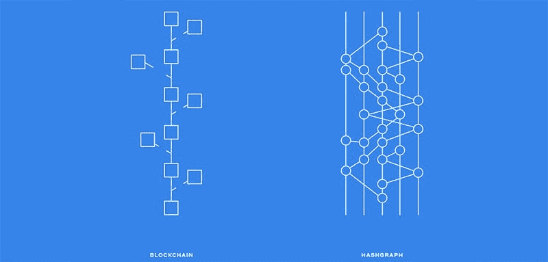
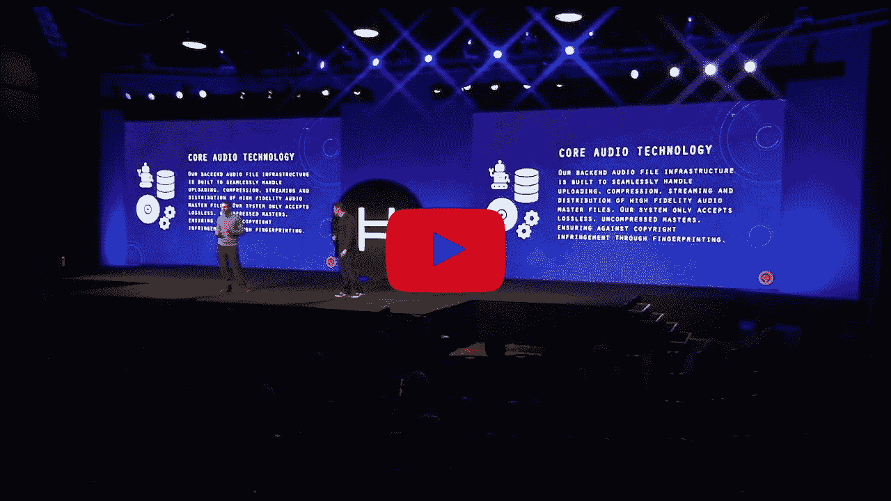
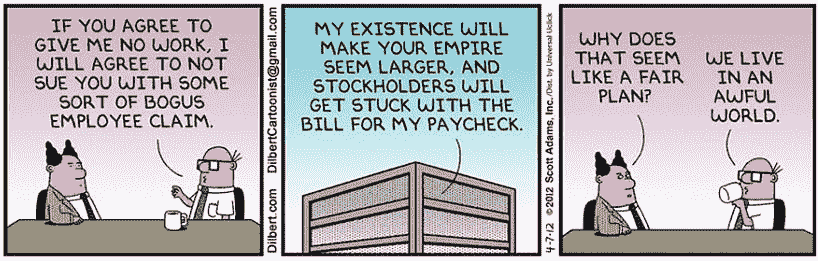

# 为什么区块链可能不是音乐行业的完美技术

> 原文：<https://medium.com/hackernoon/why-blockchain-might-not-be-the-perfect-technology-for-the-music-industry-936db6aa2b35>

音乐是伟大的，我们都爱它。那么，为什么我们不希望我们花这么多时间聆听的艺术家得到最好的呢？当然，当我们通过 Spotify 收听 repeat 上的“Shape of You”时，我们可能会觉得我们是在支持他们，但想想这样一个事实，即每场演出只为艾德·希兰赚了一小部分一美元。许多人倾向于认为区块链是解决方案，但推动大多数加密货币的技术可能太慢，交易费用对音乐行业来说可能太重，这就引出了一个问题:什么类型的分布式账本技术可能是音乐行业转型的关键？

# 光盘(以及我们还没走多远)

CD 改变了音乐的面貌，让音乐比以往任何时候都更容易获得，流媒体在一代人之后也做了同样的事情。但是当 CD 和数字音乐进入主流市场时，艺术家们被滥用的权利和 T2 得到的钱比任何人预料的都要少。随着盗版的出现，通过 iTunes 的在线音乐销售，以及最终的流媒体服务，该行业不得不重新评估艺术家拥有的权利。这种重新评估甚至在今天仍在发生，尽管一些[的人相信区块链技术](/blockstreethq/to-which-extent-can-blockchain-technology-disrupt-the-music-industry-e6182fb5741a)可以很容易地帮助解决问题，但现实可能会更复杂一些。在我们深入探究区块链独自在何处挣扎之前，我们需要理解为什么音乐产业如此复杂；问题的核心在于音乐、词曲作者和表演者的权利。

# 音乐产业许可证

歌曲作者(参与歌曲创作的人)和表演者(演唱/表演歌曲的人)有不同的权利。

本质上，词曲作者拥有的权利远多于表演者，即便如此，他们仍然仅限于从四个职业者中选择一个(表演权利组织；两个是非盈利的，两个是盈利的)。专业人士应该是艺术家最好的朋友，一个代表艺术家四处收取版税同时保护他们权利的公司。但是正如知识产权法教授 Mary la France[指出的](https://www.law.berkeley.edu/wp-content/uploads/2015/07/LaFrance-Rights-and-Revenues-in-Recorded-Music.pdf)，“歌曲作者/出版商的担忧包括:

*   无法知道流媒体服务是否准确地向专业人士报告。
*   专业人士不会精确跟踪广播剧，他们必须评估公共场所的演出。
*   专业人士没有透露作家个人版税份额是如何计算的。"

除了所有这些针对艺术家的许可证之外，音乐行业总体上还受到另外一些许可证的约束:

1.  [DMCA 广播流媒体许可证](https://www.streamlicensing.com/directory/index.cgi?action=page&page=legal_tos)
2.  [点播流媒体许可证](https://www.easysonglicensing.com/pages/help/articles/music-licensing/music-licensing-for-streaming.aspx)
3.  还有[掌握录制权](https://www.thebalancecareers.com/master-license-for-music-recordings-2460595)

持续的问题是[都形成了路障和障碍](https://www.cnbc.com/2018/02/28/how-spotify-licenses-and-pays-for-music-rights.html)迫使艺术家和粉丝使用一系列服务来听他们喜欢的音乐。由于这个错综复杂的领域，艺术家们通常会向数字发行商支付订阅费( [The Orchard](http://www.theorchard.com/) 、 [Tunecore](https://www.tunecore.com/) 等)。)在所有可用的平台上发布他们的音乐。在某些情况下，艺术家可以自己做(如果他们拥有自己音乐的权利)，但大多数公司[如 Spotify](https://artists.spotify.com/guide/your-music) 要求艺术家通过第三方经销商验证他们音乐的质量。

尽管这看起来是区块链介入的最佳位置，但应该注意的是，Tx/s(每秒事务数)的庞大数量会压倒大多数标准链。分布式账本技术无疑是这里的关键，但找到一种可以处理音乐流媒体量的技术(Spotify 目前仅在美国就每秒播放[超过 18，000 首歌曲](https://www.statista.com/statistics/384687/on-demand-music-streams-number-usa/))，最快的[区块链只能处理 1，500 Tx/s](https://www.fool.com/investing/2018/01/14/which-cryptocurrencies-have-the-fastest-transactio.aspx) 。

# 公平行业的协议

音乐产业支离破碎；艺术家们被迫将他们的音乐放在如此多不同的平台上，而且他们没有简单的方法来追踪他们(T2)应该赚多少钱，因为他们通常必须通过第三方服务才能上市。即使一个乐队可能有成千上万的在线流，他们可能仍然被迫[继续巡回演出以维持生计。](https://www.nytimes.com/2016/01/25/magazine/touring-cant-save-musicians-in-the-age-of-spotify.html)2015 年，法国政府发布了他们的“[在线音乐公平发展协议](https://impalamusic.org/sites/default/files/pictures/attachedfiles/MoU%20for%20the%20Fair%20Development%20on%20Online%20Music%20.pdf)，该协议概述了一条通过向唱片公司施压来修复音乐行业的道路:

1.  支持合法音乐产品的开发
2.  让音乐产业的经济更加透明
3.  加强音乐和文化多样性的展示
4.  推广合同最佳实践
5.  确保艺术家获得公平的报酬
6.  利用可用资源促进数字化转型
7.  确保有效和持续地实施《守则》

这一行为准则受到了业内人士的广泛欢迎，这清楚地表明该行业已经准备好进行变革了。碰巧的是，所有这些行为准则的目标都可以通过分散技术来实现，但为了让区块链修复音乐产业，它必须能够以非常低的成本每秒处理大量的交易。

# 区块链还是不同的分布式账本技术(DLT)？

Silvan Jongerius 在 LinkedIn 的一篇文章中写道,区块链可以为音乐行业做四件事:提供一个元数据核心分类账来清理版权问题，允许更快更公平的支付分配，为音乐项目创建一个“类似 ICO”的资助计划，以及帮助消除唱片公司和专业人士的一些中央控制。

我们看到许多不同的区块链公司已经在实施这些解决方案。例如，Musicoin 和 [Revelator](https://revelator.com/) 都是总部位于区块链的初创公司，它们提供了典型行业标准的替代方案。Musicoin 允许用户免费播放音乐，他们目前有超过 3 万首歌曲的库，但如果他们想与 Spotify 竞争，规模肯定会成为一个问题。另一方面，Revelator 提供了一项帮助监控版权的服务，让音乐人有能力追踪他们应该获得多少版税。[菌丝体](http://myceliaformusic.org/)，由伊莫金·希普创建的平台，是一个区块链平台，允许音乐人直接向粉丝出售他们的音乐，以换取加密货币。

这些单独的技术很棒，但它们仍然造成了音乐行业碎片化的问题，艺术家和粉丝被迫参与到一个大型的平台集合中，以便访问他们想要听到的不同音乐。底线仍然是，由于其物理限制，区块链不能处理这样一个行业以及其他分布式账本技术的整体需求。

*面向音乐行业的分布式账本技术(DLT)。*

[Hyperledger Fabric](https://www.hyperledger.org/projects/fabric) 是一种功能替代方案，目前正在[与美国作曲家、作者和出版商协会、音乐作者、作曲家和出版商协会以及音乐 PRS 合作](https://www.ibtimes.co.uk/major-music-rights-societies-join-blockchain-copyrights-using-ibm-hyperledger-1615942)，以创建一种更高效的版权数据管理方法。然而，有一个小问题，Hyperledger Fabric 不是作为货币交易所设计的，所以这个 DLT 永远不能用于流媒体服务。

在其他主要的 DLT 中，唯一真正的竞争者是 [Hedera Hashgraph](http://www.hedera.com/) ,因为它具有高 Tx/s，图形而不是块结构，并且它能够在不需要工作证明或利害关系证明共识的情况下保证交易安全。 [Hedera 在他们的白皮书中解释道](https://www.hedera.com/hh-whitepaper-v1.4-181017.pdf)“区块链就像一棵树，在成长过程中不断修剪——这种修剪是必要的，以防止树枝生长失控。在 hashgraph 中，它不是修剪新的生长，而是织回到身体中。”

Hedera Hashgraph 上推出了一个专门针对帮助音乐行业的平台，与《在线音乐公平发展协议》中概述的七项内容相比，它提供了一个非常有前途的解决方案。 [Hearo.fm](https://token.hearo.fm) 构建在 Hedera Hashgraph 平台上，而不是在区块链上，因为它需要利用某些关键方面来使其 JAM 令牌正常工作:

*   它能够每片执行数十万次发送/秒
*   有纳米费用(因为平台不需要像区块链那样的沉重的采矿原则，管理费用和参与成本要低得多)
*   [异步拜占庭容错](https://www.information-age.com/gold-standard-security-distributed-systems-like-blockchain-123469395/)(即使有坏的、恶意的或说谎的节点参与系统，也能达成共识的能力)

[https://www.youtube.com/watch?v=LEAR4pEDCZg](https://www.youtube.com/watch?v=LEAR4pEDCZg)

Hearo.fm 旨在成为一种流媒体服务，向艺术家支付他们应得的报酬，它通过提供混合音乐许可证来实现这一点，该许可证符合公平发展列表上的第 1-4 项。该许可是艺术家与平台之间的协议，将允许平台在代表艺术家接受法定货币和加密货币支付的同时，流媒体、销售、发布和广播音乐。许可证的关键部分是它的非排他性，这意味着已经签署了标签和出版协议的艺术家仍然可以参与。Hearo.fm 创建了一个许可证，它是表演、机械、同步、下载和流媒体许可证的组合，在全球范围内可用，这意味着任何地方的艺术家都可以推广他们的音乐，并获得公平的报酬。

他们收到的报酬也不会大幅减少，因为艺术家可以自己设定费率，并从他们在 Hearo.fm 上的音乐收入中赚取 90%的收入，与他们现在的 12%相比，这是一个很大的差异。这种对艺术家的公平报酬满足了第 5 项，而 Hearo.fm 将对全球艺术家开放的事实满足了第 6 项。最后，鉴于他们的 JAM 令牌代码将使用开源 ERC20 协议编写，社区将能够确保 Hearo.fm 考虑到音乐家的最佳利益，使他们符合第 7 条。

# 够了吗？

花旗集团的一份详尽报告解释说“艺术家在音乐收入中的份额很小。2017 年，艺术家仅获得了 12%的音乐收入，大部分价值流失是由运营无数分销平台的成本驱动的——AM/FM 广播、卫星广播、互联网分销商——加上唱片公司的成本(和利润)。“这意味着艺术家应该赚 20.8 万美元左右，但在此过程中却损失了 18.3 万美元。

音乐产业迫切需要改革。艺术家是这个行业的唯一创造者，却远远没有享受到他们的劳动成果；相反，他们在挨饿，而唱片公司和授权代理机构拿走了所有的利润。当像 Hearo.fm 这样的平台使艺术家能够通过流媒体音乐、销售、商品等获得 90%的收入时，这是一个简单的答案。这一切都可以归结为一个简单的问题，即“艺术家的作品应该得到公平的报酬吗？”因为不管你怎么说，12%都比抢劫高不了多少，而现在 90%是可能的。

## 关于作者:

基里尔·希洛夫——geek forge . io 和 Howtotoken.com 的创始人[。采访全球 10，000 名顶尖专家，他们揭示了通往技术奇点的道路上最大的问题。加入我的**# 10k QA challenge:**](http://twitter.com/kirills4ilov)[geek forge 公式](https://formula.geekforge.io/)。