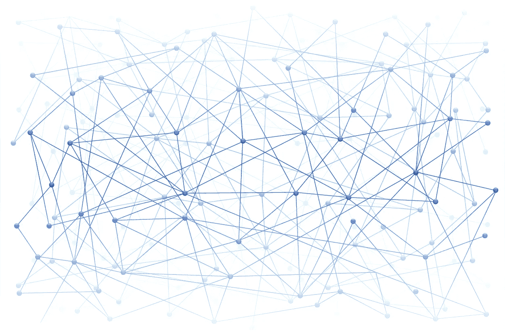
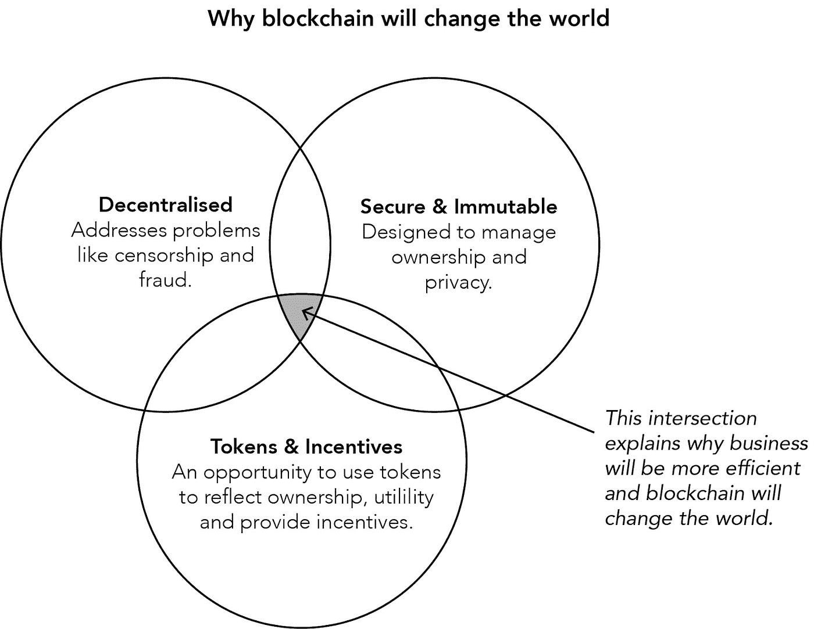

# 为什么区块链会改变世界？

> 原文：<https://medium.com/hackernoon/why-blockchain-will-change-the-world-38fa90cf5716>

很明显，[区块链](https://hackernoon.com/tagged/blockchain)将改变世界，因为它解决了三个关键问题:去中心化、安全和与结果一致的激励。下面，我将解释这些问题将如何有助于改变世界，以及区块链将如何帮助你克服它们。

# 区块链如何帮助您解决三大问题

# 问题 1:权力下放

社会上对中央大企业的支配地位和影响力越来越关注。在许多行业，人们越来越倾向于认为分散化的治理和交付模式可能是更好的选择。它被视为更加包容、透明、公平，并与利益相关者的利益内在一致。

在过去的十年里，你已经看到了脸书、亚马逊和 T2 谷歌 T3 的崛起和统治地位。举一个例子，媒体行业由于这些公司的控制而陷入混乱，人们开始认识到并质疑这些科技巨头通过基于以前的使用和你的个人资料来锁定媒体对他们生活的影响程度。

还有与欺诈和审查有关的问题，这是集中治理和控制的结果。在 2018 年 1 月的[版中，*《经济学人》*](https://www.economist.com/news/leaders/21735021-dominance-google-facebook-and-amazon-bad-consumers-and-competition-how-tame) 将谷歌、脸书和亚马逊称为‘BAADD’——庞大、反竞争、上瘾、破坏民主。要点是，数据的价值、网络效应的影响以及基于平台的商业模式的主导地位正在受到质疑。我们需要一种去中心化的方法来替换或增强中央和专有的数据存储，以重新控制为这些现有者提供动力的数据，并确保我们的数据用于造福我们的生活和我们的社区。

# 问题 2:安全性

你可能听说过公司在数据安全、所有权和隐私方面面临越来越多的挑战。(也许你的公司正在为这些问题而苦苦挣扎。)在全球范围内，随着各国政府在这些问题上采取不同的立场，事情只会变得更加困难，合规成本也会增加。在欧洲，随着市场对将于 5 月 25 日生效的《通用数据保护条例》( GDPR)做出反应，有趣的动向已经开始。GDPR 将取代数据保护指令，成为规范公司如何保护欧盟公民个人数据的主要法律。

对于任何企业来说，保护客户数据都是至关重要的。随着我们的世界变得越来越互联，我们需要强大的系统来管理物理或数字资产的所有权。这些系统应该与税收要求、支付、贸易、商业、法律以及全球几乎所有社会的结构保持一致。

互联网是通信和信息传播的一个根本性转变，但它重新定义了我们的所有权概念。我们需要一种新的方法来管理数据。在商业中，我们所做的大多数事情都涉及多方之间的交易，这些交易受一系列规章制度的约束。几十年来，律师一直利用合同来尝试和管理这些安排，以及在情况发生变化时所需的证据。这一切都是通过一张张纸，或者它们的数字等价物，PowerPoint 幻灯片和电子邮件来管理的。这种静态的动手操作成本高昂，而且效率低下。如果有一种方法来管理这些规则，让数据以自动化、分布式和可信的方式流动就好了！这将会改变游戏规则，对吗？

# 问题 3:激励措施

最后，我们都是人，我们对激励、回报和我们所做的任何事情的渴望是一种强大的力量。在我们的社会中，公司的价值在于其团结员工、投资并从公司价值增长或公司利润分享中获益的能力。

然而，在股东和企业客户获得的激励和利益之间，通常是有界限的。这是一个常见的问题——在不同的利益相关者群体中，将激励与利益和效用结合起来。如果你能建立这种联系，有机增长加速的机会是巨大的。

# 在区块链之外应对这些挑战

除了区块链，许多企业已经迈出了应对这些挑战的步伐。作为应对中央控制和审查的一种方式，股东们要求提高董事会的透明度和问责制。过去十年见证了众筹和众包模式的出现，旨在更好地让“大众”参与并与关键决策、价值或产品和服务交付目标保持一致。公司在高管薪酬激励方面取得了重大进展。

在所有权、不变性、隐私和安全的背景下，包括监管者、技术专家、律师和风险专业人士在内的多个利益相关者正走到一起，不断改善现状。然而，每一组都在当前的约束条件下进行广泛的管理，但是技术已经开始开辟新的业务方式。

# 你如何成为新的未来国家的一部分

区块链的分布式本质、其对安全性、所有权和数据隐私的演进方法以及其联网计算模型的内在效率，对那些期待全新未来状态的人具有吸引力。

下图说明了这一切是如何结合在一起的。

区块链的三个核心特征为你提供了一个改变世界、重塑你生活和工作方式的巨大机会。

外面的专家们现在谈论区块链正处于绝望的低谷。我必须承认，我也一直在寻找“球场”。为了让这项技术站稳脚跟，我们都需要相信什么？问题是，我认为我们都买进了，但我们还没有加入其中。缺少的是与更广泛的议程的联系以及对“为什么”的回答。希望这篇文章能有所帮助。

要让区块链的好处发挥作用，你首先需要考虑如何利用它让事情变得更简单、更实惠、更容易获得。这项技术将推动商业和人们生活质量的根本转变，增强人们对让日常生活变得更轻松的系统的信心。这是一个很大的要求，但潜力是巨大的。互联网改变了世界，但它需要一段时间来构建基础，改变商业模式和我们的生活方式。区块链也会大同小异。

如果你采取一些措施来解决当今世界的主要挑战和摩擦点，区块链的影响将会更大。一些问题正在得到解决，而另一些问题则需要干预——突然且更有意识地改变策略。

拥抱追逐。