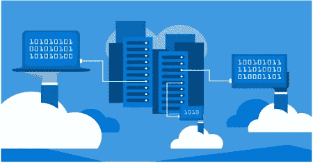

# 为什么布鲁泽尔与众不同

> 原文：<https://medium.com/hackernoon/why-bluzelle-is-different-6fb98f9ddc84>

我们经常被问到 Bluzelle 与许多数据存储解决方案有何不同，包括但不限于 Filecoin、Storj、Sia 和 IPFS。这种比较并不理想，因为尽管所有这些服务都可以用来存储信息，但它们回答的问题不同。例如，比特币本身可以用来存储数据，但将其用作数据库的数据存储将导致一个滑稽的缓慢而昂贵的应用程序。举个更现实的例子，考虑一下 IPFS:理论上它可以用来存储数据，但是它不能保证数据可以使用多久，除非你自己托管它。IPFS 更多的是寻址和传输数据。它可以被认为是一种介于 bittorrent 和 HTTP 之间的传输协议。

为了回答这个问题，我们将讨论与其他服务和数据存储服务相比，Bluzelle 的目标是什么。我们避免直接详细讨论那些其他的架构，因为细节是微妙的，并且经常在变化。作为 Bluzelle 背后的团队，我们更适合讨论我们自己架构的优点，而不是描述他人的缺点。

## 数据库ˌ资料库

Bluzelle 类似于数据库，而不是文件系统或硬盘。尽管客户端数据被分解、加密、复制等等，但我们将所有这些过程的细节抽象出来。Bluzelle 的客户不必考虑应该有多少份数据副本，也不必考虑它们应该放在哪里。它不必考虑如何将数据整理成文件或如何加密这些文件。它不必确保存储数据的物理设备忠实地这样做，或者在副本不可避免地出现故障时从副本中恢复；蜂群处理这些任务。Bluzelle 公开了一个简单的键值存储，并抽象出所有这些细节。

## 不可靠的

Bluzelle 是一个不可信的架构。该协议确保从客户的角度来看，他们的数据是安全的，不会受到第三方的粗心和恶意处理。这与传统的云存储提供商(虽然这种企业的声誉对他们来说太有价值，以至于他们没有动机积极干预客户数据，但他们仍然可以在任何时候拒绝为客户提供服务，特别是如果该客户变得不受欢迎)或“存储市场”类型的系统形成对比，在这种系统中，客户和矿商签订单独的合同来存储数据(单个矿商的恶劣行为并非不可能)。在 Bluzelle 中，数据是安全的，除了对数据库本身的系统的和昂贵的攻击。

## 可攀登的

Bluzelle 完全是为可伸缩性而设计的。传统的[区块链](https://hackernoon.com/tagged/blockchain)模型(如[比特币](https://hackernoon.com/tagged/bitcoin)和以太坊)依赖于处理每笔交易的每个节点来验证新的区块。结果是，向网络中添加更多的节点并不会增加它的计算能力——事实上，更大的网络速度更慢，因为它承受更高的开销。Bluzelle 的新颖群群架构使它能够毫不费力地扩展到处理任意大量的数据，因为每个数据碎片只在一个群内复制。

这就是 Bluzelle 的魅力所在:一个真正可扩展的数据库，建立在世界上被浪费的存储介质上，其安全性使其可用于重要的项目，可扩展性超出了好奇心。