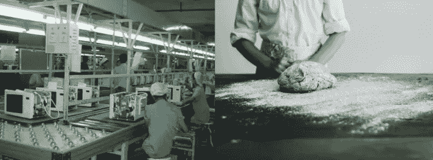
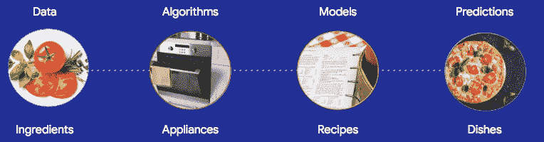

# 为什么企业在机器学习上失败了

> 原文：<https://medium.com/hackernoon/why-businesses-fail-at-machine-learning-fbff41c4d5db>

我想告诉你一个秘密:当人们说“机器学习”时，听起来好像这里只有一门学科。有两个，如果企业不明白其中的区别，他们可能会经历一个麻烦的世界。

## 两个机器学习的故事

想象一下，雇一个厨师为你造一个烤箱，或者雇一个电气工程师为你烤面包。当谈到机器学习时，这是我看到企业一次又一次犯的错误。

These are different businesses! Unfortunately, too many machine learning projects fail because the team doesn’t know whether they’re supposed to build the oven, the recipe, or the bread.

如果你要开一家面包店，雇佣一名经验丰富的面包师是个好主意，他精通制作美味面包和糕点的细微差别。你也会想要一个烤箱。虽然它是一个重要的工具，但我敢打赌，你不会让你的顶级糕点师承担知道如何制作烤箱的任务；那么，为什么你的公司专注于机器学习的等价物呢？

你是做面包的吗？还是做烤箱？

If you prefer videos to blogs, this is for you. If not, keep reading…

## 机器学习研究

他们没有告诉你的是，所有那些机器学习课程和教科书都是关于如何建造烤箱(以及微波炉、搅拌机、烤面包机、水壶……厨房水槽！)从零开始，而不是怎么做菜，怎么用菜谱创新。

如果你建立机器学习算法，你的重点是通用工具供他人使用。(厨房电器，如果你更喜欢类比的话。)这项业务被称为**机器学习研究**，通常由像[学术界](http://vision.stanford.edu/)或[谷歌](https://ai.google/research/)这样的地方完成。

> 当谈到机器学习时，许多组织都在错误的业务中。

做这一行需要相当多的教育，因为这里有很长的历史。一些流行的[算法](http://bit.ly/quaesita_emperor)已经存在了几个世纪。例如，最小二乘法的回归，是在 1805 年发表的[。相信我，人类在 200 年里已经走过了漫长的道路。](https://projecteuclid.org/download/pdf_1/euclid.aos/1176345451)

今天，有一些相当复杂的设备在那里…如果你不知道这个如何工作，你怎么能制造一个更好的微波炉呢？你当然需要沉浸式学习！成为一名研究人员需要几年时间，101 课程从微积分基础开始是有充分理由的。

## 应用机器学习

大多数企业只是想做饭，以解决他们的业务问题。他们对销售微波炉不感兴趣，但却经常犯错误，试图从零开始制造这些电器。很难责怪他们——目前的宣传和教育周期主要集中在研究上，而不是应用上。

如果你在创新食谱，不要重新发明轮子。那些微波已经存在了。你可以从很多地方免费得到它们。如果建立自己的机器学习厨房听起来像一件苦差事，像[谷歌云平台](http://bit.ly/gcp-hello)这样的提供商让你使用他们的，配有[电器](https://cloud.google.com/ml-engine/)、[配料](http://bit.ly/gcp-publicdata)和[食谱](https://cloud.google.com/apis/)。

> 如果你在厨房创新，不要重新发明轮子。

对于大多数[应用](http://bit.ly/quaesita_realitycheck)，你的团队不需要理解神经网络中反向传播的[数学，就像厨师不需要知道微波炉的接线图一样。但是，如果你打算经营一家工业规模的厨房，你确实需要知道很多事情，从管理你的食材到上菜前检查你的菜肴是否美味。](https://raw.githubusercontent.com/suriyadeepan/deeplearning/master/doc/01_ConceptsInNN/04_TheoreticalFrameworkForBP.pdf)

Which of these are you selling? The right team to hire depends on your answer.

## 与机器学习一起崩溃和燃烧

不幸的是，我看到许多企业未能从机器学习中获得价值，因为他们没有意识到应用方面与算法研究方面是非常不同的学科。取而代之的是，领导们试图通过雇佣那些一生都在制造微波炉零件，却从来没有做过饭的人来开始他们的厨房。什么可能会出错？如果成功了，那是因为你运气好，不小心雇了一个很棒的厨师。

但通常你都不走运。人的一生只有这么几个小时，如果你把这些时间花在学习微波炉的接线上，你就没有那么多时间来掌握糕点艺术或做生意了。何时何地！—你的博士培养的人工智能研究员会获得应用机器学习所需的技能吗？如果你把你的心放在两方面都是专家的混血儿身上，难怪你会抱怨人才短缺！

If you try to start a restaurant by hiring folks who’ve been building microwave parts their whole lives but have never cooked a thing… what could possibly go wrong?

你应该雇佣谁呢？就像在工业厨房里一样，你需要一个跨学科的团队，这个团队的领导了解这个领域。否则，项目会失败，毫无进展。

## 为工作雇佣合适的团队

如果你卖的是尖端设备，就雇佣研究人员。如果你在食谱上创新以大规模销售食物，你需要知道什么值得烹饪/目标是什么的人(*决策者和产品经理*)，了解供应商和客户的人(*领域专家和社会科学家*)，能够大规模加工原料的人(*数据工程师和分析师*)， 能够快速尝试许多不同的配料-器具组合以生成潜在食谱的人(*应用 ML 工程师*)、能够检查食谱质量是否足以上菜的人( [*统计学家*](https://towardsdatascience.com/statistics-for-people-in-a-hurry-a9613c0ed0b) )、将潜在食谱转化为数百万道高效菜肴的人(*软件工程师*)、让跨学科团队保持正轨的人(*项目/计划经理*)， 还有那些确保你的菜肴保持一流水平的人，即使送货卡车给你带来了一吨土豆而不是你点的大米。

虽然这些人不必是独立的个体，但要确保你已经涵盖了每个角色。在你因为我提供了这样一个不完整的漫画而向我扔烂番茄之前，我要坦率地承认，关于应用机器学习的招聘，还有很多要说的。我已经外包给其他职位，包括[这个](http://bit.ly/quaesita_roles)。

说到外包，如果你的团队已经尝试了所有现有的工具，但无法做出符合你业务目标的配方，那么考虑增加建筑设备方面的技能是有意义的(*研究员*)。你是把那个人雇佣为你的永久员工，还是把这项工作外包给一家有经验的算法研究公司，取决于你的经营规模和成熟度。

与研究人员联系的另一个原因是，你的原型是如此成功，以至于在你有幸操作的大规模上使用定制的设备是有意义的。(多么大的问题啊！)

## 决策智能

专家应该讨论这个问题，但他们没有。他们不承认这里真的有两种机器学习的事实，所以世界正在训练人们建立所有这些算法，而不是使用它们。

我的团队正在努力解决这个问题。我们已经创建了一个新的学科来涵盖应用方面，并且已经培训了超过 15，000 名员工。我们称之为 [**决策智能**](http://bit.ly/quaesita_di) ，它涵盖了机器学习和数据科学的所有应用方面。

换句话说，如果研究机器学习正在制造微波，应用机器学习正在使用微波，[决策智能](http://bit.ly/quaesita_toa)正在安全地使用微波来满足你的目标，并在不需要微波的时候使用其他东西。

## 祝你好运，玩得开心！

当谈到应用机器学习时，最难的部分是知道你想做什么，以及你打算在提供给客户之前如何检查它。那部分其实没那么难— [别忘了做](http://bit.ly/quaesita_island)就行了。

至于其他的，用机器学习解决商业问题远比大多数人想象的要容易。那些闪闪发光的厨房正等着你来玩。像在真正的厨房一样尽情享受。开始修修补补！每次我遇到有人认为他们需要参加传统的机器学习算法课程——或者，天哪！整整一个学位——为了开始，我不禁想象他们拒绝使用微波炉，直到他们自己造了一个。不要相信你需要一个博士学位才能用机器学习做惊人的事情的谎言。相反，你真正需要的是一点人类的创造力。祝你好运，玩得开心！

# 感谢阅读！YouTube 课程怎么样？

如果你在这里玩得开心，并且你正在寻找一个为初学者和专家设计的有趣的应用人工智能课程，这里有一个我为你制作的娱乐课程:

Enjoy the entire course playlist here: [bit.ly/machinefriend](http://bit.ly/machinefriend)

# 喜欢作者？与凯西·科兹尔科夫联系

让我们做朋友吧！你可以在 [Twitter](https://twitter.com/quaesita) 、 [YouTube](https://www.youtube.com/channel/UCbOX--VOebPe-MMRkatFRxw) 、 [Substack](http://decision.substack.com) 和 [LinkedIn](https://www.linkedin.com/in/kozyrkov/) 上找到我。有兴趣让我在你的活动上发言吗？使用[表格](http://bit.ly/makecassietalk)联系。