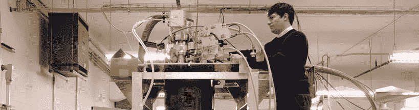
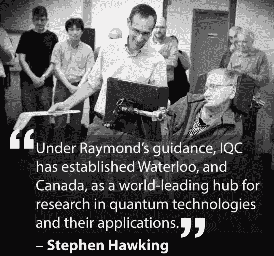
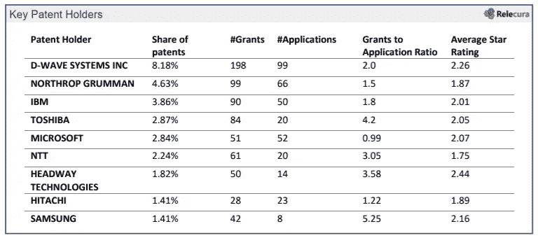

# 为什么加拿大会赢得量子竞赛

> 原文：<https://medium.com/hackernoon/why-canada-will-win-the-quantum-race-ba705bfecab>

Photo Courtesy: [Quantum Valley Investments](http://quantumvalleyinvestments.com/about-qvi/the-analogy/)

虽然量子技术可能刚刚起步，但打个比喻来说，有一个地方似乎正在这个领域实现量子飞跃，这个地方不是硅谷。

这是加拿大的安大略省。

尽管人们普遍认为“原型量子计算硬件仍处于胚胎阶段”([Wired](https://www.wired.com/story/wired-guide-to-quantum-computing/)2018 年 8 月)，但多伦多和滑铁卢之间越来越多的加拿大技术专家已经开始参与竞赛，希望利用他们的先发优势开发、商业化和兑现量子位驱动的未来。

> 加拿大的“量子谷”已经做好了获胜的准备——他们在构建和商业化该技术方面拥有 16 年的优势，私人和政府的支持，科学人才的涌入，以及爆炸式的创业场景。

我最近从纽约搬到了多伦多，现在正在看第一手资料，一会儿我会分享更多为什么我看多。但首先，让我们快速解开量子计算是如何工作的，以及为什么它将成为游戏规则的改变者。

# 量子计算到底是怎么工作的？

我参考这个来自 [*主板*](https://motherboard.vice.com/en_us/article/539ne5/the-idiots-guide-to-quantum-computing) 的快速讲解:

当今的计算机受到硬件的限制。它们使用在 0 或 1 位置打开或关闭的电路。量子计算将通过使用称为量子位的粒子来改变这种情况，量子位悬浮在温度接近绝对零度的超冷环境中。这些粒子形成的网络允许处理能力呈指数增长，因为量子位可以同时处于 0 和 1。”

如今，超级计算机发现的许多具有挑战性的任务——化学模拟、破译密码、创造通用人工智能——对于量子计算机来说都非常简单。

微软首席执行官塞特亚·纳德拉是一个信徒。在 2017 年的一次会议上，他恳求开发人员开始研究量子问题(使用微软的开源工具)，因为这项技术将“帮助我们解决我们面临的一些最大挑战”( [Wired](https://www.wired.com/story/microsofts-nadella-wants-to-help-coders-take-a-quantum-leap/) )，实现医学、能源和金融领域的巨大突破。

除了微软，包括谷歌、IBM 和英特尔在内的其他巨头都在大力发展量子技术，与他们一起的还有 Xanadu 和 Rigetti Computing 等快速增长的初创公司。

> “根据 CB Insights 的数据，2017 年，风险投资者向全球从事量子计算硬件或软件的[初创公司](https://www.wired.com/story/quantum-computing-factory-taking-on-google-ibm/)投入了 2.41 亿美元。这是前一年的三倍。”([连线](https://www.wired.com/story/wired-guide-to-quantum-computing/)

到 2024 年，估计[量子技术](http://homelandsecurityresearch.com/Quantum+Computing+Market+and+Technologies)的全球市场将达到 107 亿美元，这解释了为什么国家、企业和初创公司都在争夺第一的位置。

# 加拿大的情况如何？

安大略的水里有某种东西让我相信他们会先破解量子密码。原因如下:

## 1.他们“打响了发令枪”

这是加拿大物理学家、滑铁卢大学量子计算研究所(IQC)前所长 Raymond LaFlamme 的话。根据 LaFlamme 的说法，16 年前的 2002 年 IQC 的发射“打响了这场竞赛的发令枪”，早于美国、中国和英国开始投入大量资源进行量子研究的数年。

IQC 诞生于黑莓创始人迈克·拉扎里迪斯的巨额个人捐赠，他将量子视为他成为下一次技术革命核心的机会。自 2002 年以来，Lazaridis 已向 IQC 投资超过 1 亿美元，进行跨学科研究并创建一个生态系统，以支持该领域的早期高风险/高回报机会。

如果你在寻找一些社会证据，拉弗雷姆的前任导师，已故的斯蒂芬·霍金对此印象深刻:

Raymond LaFlamme (left) with Stephen Hawking. Photo Courtesy of the Institute for Quantum Computing

## 2.他们是第一个商业化的

不列颠哥伦比亚省是第一家将量子计算硬件系统商业化的公司 D-Wave Systems 的所在地。D-Wave 成立于 1999 年，比 IQC 早三年，尽管它的总部位于加拿大西海岸，但 D-Wave 的早期进入和成功已经波及全国，并成为投资者、技术专家和企业之间持续对话的催化剂。

多伦多量子光子公司 [Xanadu](http://www.xanadu.ai) 的首席执行官 Christian Weedbrook 告诉我“每个人都知道 D-Wave。你和 D-Wave 有什么不同？(投资者)经常会问你这个问题，这是一个谈论更多我们在做什么的机会。”

D-Wave 筹集了超过 2 亿美元的资金，是该领域所有公司中专利份额最高的，客户名单包括谷歌、美国国家航空航天局(NASA)、洛克希德·马丁(Lockheed Martin)和“一个未透露姓名的美国情报机构”，是一股有利于加拿大的强大力量。

Source: [Relecura Quantum Computing: IP Report 2018](https://relecura.com/wp-content/uploads/2018/03/Quantum_Computing_Relecura_Report_20180104.pdf)

## 3.他们以得到私人和政府的支持而自豪

除了迈克·拉扎里迪斯(Mike Lazaridis)和他的风险投资公司量子谷投资(Quantum Valley Investments)的私人投资，安大略省和加拿大政府都投入了大量资金——仅在过去十年里就投入了 10 亿美元——与拉扎里迪斯和其他人一起建设量子优势所需的基础设施和资源。

这种公私合作关系促成了量子计算研究所、T2 理论物理周边研究所、T4 量子纳米实验室和量子谷创意实验室的创建，这些机构都位于滑铁卢，专注于量子研究生命周期的不同元素——从研发到新产品商业化。

## 4.他们鼓励技术人才的涌入

除了资助研究和基础设施，加拿大政府还通过优惠的经济和移民政策支持科学人才的涌入。据《福布斯》报道，43%的财富 500 强公司是由移民或他们的子女创立的，排名靠前的量子公司也不会有什么不同。认识到这一点，加拿大政府制定了切实可行的计划来激励外国企业家和科学家移民:

首先，[全球技能战略](https://www.canada.ca/en/employment-social-development/campaigns/global-skills-strategy.html)通过展示“独特和/或专业才能”并绕过典型的移民要求，为高技能外国工人作为永久居民移民提供了另一种快速通道。通过该计划，加拿大雇主可以在 10 个工作日内招聘到顶尖人才并获得工作许可。

其次，加拿大的[创业签证](https://www.canada.ca/en/immigration-refugees-citizenship/services/immigrate-canada/start-visa/eligibility.html)项目可能是全球最具进步性的，2018 年将获得 460 万美元的资助。与全球技能战略类似，它鼓励外国工人，但主要目的是让初创公司的首席执行官更容易进入加拿大，获得风险投资并为加拿大人创造就业机会。

相比之下，美国对国际人才的吸引力越来越小，因为特朗普政府的移民政策越来越严格，这无疑会阻碍其长期的量子抱负。

## 5.创业场景已经为成长做好了准备

由于世界级的研究机构、健康的投资、政府支持和人才的汇聚，安大略省的创业社区就像一个加速的引擎。事实上，许多最聪明的头脑现在正在世界上第一个以量子为焦点的技术加速器上一起工作，这是 CDL 创造性破坏实验室的一个子项目。

CDL 打赌，这种密度将在扭转局势方面发挥作用，对加拿大有利。该加速器接受了 21 家公司和 40 名量子物理学家加入 2017 年的 inagural 计划，[预测](https://www.investinontario.com/success-stories/worlds-first-quantum-machine-learning-start-program-lives-ontario)“到 2022 年，它将创造出比世界其他地方加起来还要多的商业上可行、资本雄厚、创收的量子机器学习公司”。

来自 CDL 的后起之秀之一 Xanadu(他在量子轨道正式公布前一年参与了该项目)同意这一观点。据首席执行官 Christian Weedbrook 称，这些孵化器项目“吸引了大量人才”，这对解决 quantum 带来的严峻技术挑战至关重要。Xanadu 本身就是一个可能的例子，因为他们已经在全球范围内竞争，最近从大公司那里赢得了主要的试点。

## 为什么重要？

虽然还不清楚第一个杀手级量子应用会是什么，但很明显，首先创造它的国家将获得巨大的经济、政治和国家安全优势。无论是用于解密和揭露秘密，为医学突破申请专利，还是使计算机系统防黑客攻击，有一点是肯定的——量子技术有能力戏剧性地改变历史的进程，使其朝着征服者的方向发展。

赌注如此之高，全球竞赛已经开始。

在这个早期阶段，它肯定仍然是任何人的游戏，但有了风的支持和健康的开端，量子竞赛是加拿大的失败。

*请注意:观点是我个人的，可能不代表我雇主的观点*