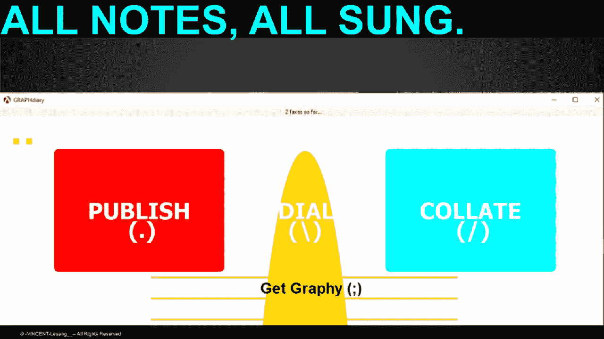

# 为什么集权是一件好事

> 原文：<https://medium.com/hackernoon/why-centralisation-was-a-good-thing-d43c87043e44>

*分权是* [*新时尚*](/@lesdikgole/a-statement-on-altcoins-bitcoin-smart-contracts-and-anonymous-transactions-27ea28590e13) *。我们需要提醒自己，为什么集权在过去是好的。在过去，高效的通信和信息组织需要集中管理。*

# “坏”数据问题

信息有像细菌一样传播的趋势。但是有‘好’细菌；然后是“坏”细菌。

[http://GRAPHdiary.com](http://GRAPHdiary.com)

集中的“控制”最终是为了避免和抑制混乱。因此，中央集权的社会和系统大大降低了混乱、无序和浪费的程度。

一个集中的系统需要“好的”信息来做决定。正因为如此，集中式系统对于“坏”数据有非常好的“检测”系统。包含在中央系统中的数据的保真度对于系统的生存能力至关重要。

因此， ***所有的*** 集中式系统也是*可靠的*数据系统。

# 信息动态

称集中式系统为“可靠的”数据系统与声称它们比分散式系统拥有“更多”数据是两码事。事实上，集中式系统在信息生成方面极其贫乏。他们倾向于*过度依赖*过去的*数据*(最初从*分散的*来源生成)获取信息。

正是这种对过去数据的过度依赖使得集中式系统极易受到黑天鹅的攻击；例如，中央“规则”的变化、以前未考虑的新“细菌”、改变业务方式的新产品、来自另一个中央系统的致命攻击*等。*

那么，集中系统的*信息*动态就是“等待”集中的“命令和控制”。

分散系统的*信息*动态没有“等待期”，它是即时的、连续的、无处不在的、多维的。

# 评估系统风险

每个系统工程师都有责任了解*集中式“规则”和分散式系统背后的风险。*

在过去，集中的规则系统似乎比分散的规则系统要好得多，主要是因为“信息”很难获得。从另一个角度来看，分散的系统*没有提供*真正的好处*而 c* 带来混乱和[坏信息*超载*](/@lesdikgole/the-semantic-consistence-problem-and-why-big-data-will-not-solve-it-3ebfd1f593df) 的巨大风险！

现在，有一种对权力下放的偏好。这在一定程度上是出于 T2 良好的理由。中央集权的系统承担着严重的风险:停滞不前，被打乱，缺乏适应性，过度依赖历史而不是现在和未来。

# 系统是关于信息的，而不是“控制”或缺乏控制

有一种方法可以判断任何制度，无论是集权制还是分权制，是好是坏。

这种*的新*方式，涉及从*的角度看设计过程*系统是否有 1)一个*信息*生成，和 2)一个[‘可靠性’检测](/@lesdikgole/iot-small-data-is-much-more-important-than-iot-big-data-6d4ccbe40b3a)系统。

一个系统 1)是脆弱的，缺乏成长、适应和智能的突现特性。

2)对于**完成**复杂流程*无效*的系统。

# 反思分权

*因为*系统与“控制”或缺乏控制无关。完全没有必要将“分权”视为解决我们当前问题的范例。

但是我们可以根据它们如何应用于*信息动态*来调整去中心化的概念(见上一节)。

这样做之后，我们就可以问我们的*新*系统是否有*内置的*检查和平衡，用于在需要时**复杂流程**的*执行*。像纳西姆·塔勒布和比特币/区块链狂热者这样的大多数“去中心化”倡导者似乎忽略了这一点(非常关键的一点)!

人们对去中心化越来越感到兴奋，但这仍然没有考虑到凝聚力和架构保真度的需求。

# 重新思考信息！！！

信息是[而不是数量](/@lesdikgole/bauhaus-fragility-an-assessment-of-architecture-in-buildings-and-information-systems-4e0b5533d2b3)。可悲的是，这甚至与数据的“新”无关！很明显， ***有一种趋势，对于“数据(生成)密集型”系统来说，对“新”数据比对“旧”数据更有偏好*** 。(也许是'假新闻'/ **点击诱饵**背后的主要原因？).

信息其实是关于“可操作性”的。集中式系统*对此非常了解*。不幸的是，通过有意识地限制信息的*数量*，集中式系统犯了(无意中)限制*动作*的错误。

# 系统设计是信息架构

许多软件工程师通常被告知，设计一个复杂的软件需要某种形式的“信息架构/设计”。

我在这篇文章中的论点是，任何现存的系统(物理的、社会的/政治的或虚拟的)**实际上都是一个信息架构。**

这意味着所遵循的“设计过程”比工程师在项目开始阶段绘制的“系统架构”更能决定最终的系统“架构”。

这个假设的另一个含义是，实际上不仅仅是软件工程师在做‘信息架构’。每个工程师本质上都有责任实现同一个目标:制造一个*有用的*系统，并以某种方式“生成”新的见解。

当前对人工智能和区块链的痴迷似乎将“数据”置于有用性之上；“分权”胜于集权；更多的“数据”超过更少的*(可操作的)数据。*

*但是，我们两个都需要！*

# *真正的未来！*

*未来在于理解这种新的“信息”范式。*

*我们需要真正有用的系统；我们*也*需要信息系统。*

*要实现这两者，去中心化是错误的范例。*

*为了实现这两个目标，我们需要“更多”的信息系统。(不一定是“更多数据”)。谢天谢地，互联网、区块链、手机等计算设备、*改进的*交通系统(如 hyperloop 等)、社交媒体以及传感器设备、网络和技术的激增在这方面给了很大的帮助。*

*为了得到这两者，我们需要**建立**几个***制衡系统，让我们能够及时有效地做出*自己的*决定*。*****