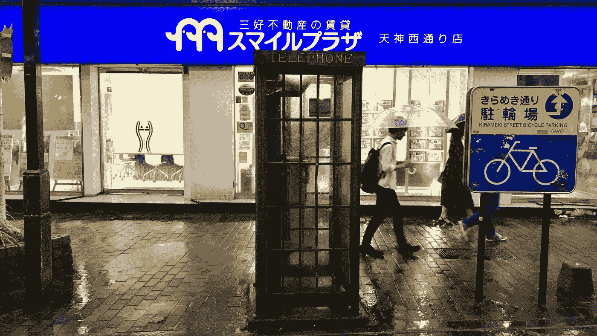
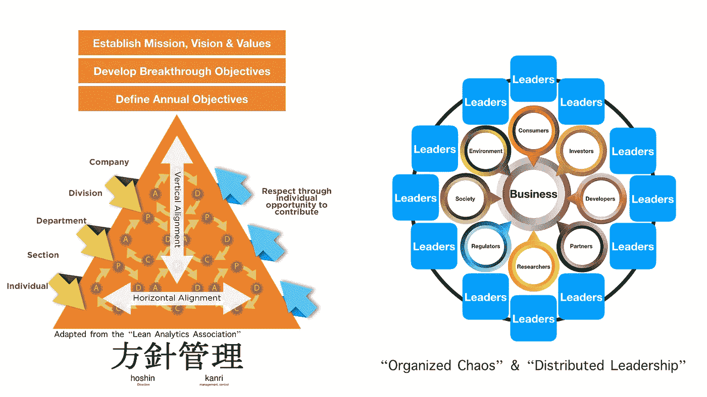

# 为什么“混乱”在工作和生活中很重要

> 原文：<https://medium.com/hackernoon/why-chaos-matters-in-work-life-de5014f2bdf3>

## *“数字化转型”的基本要素*

Fukuoka, Japan (Thursday, July 5, 2018)

这星期我在日本。

日本是我经常去的一个国家，在过去的十年里，我每年至少去两三次，教授和谈论数字化转型。这是我最喜欢的地方之一，我总是喜欢呆在这里。

但最近，在与其他“外国人”的交流中，我注意到一个相当典型的反应。尤其是，在那些第一次来访的人当中。

在到达之前，游客期望日本是一个高科技社会。他们期待被创新的、最先进的小工具和设备所包围。他们希望一睹未来智能城市的风采。

尤其是机器人，似乎在我们期望在这里找到的每个人的技术清单上都排在前列。考虑到这么多机器人来自日本，这一点也不奇怪。

想想*本田的* Asimo，*索尼*的艾博，或者*丰田*的 T-HR3。

然后人们来到这里。当然，还有很多值得爱的东西。公共交通的秩序、清洁、礼貌、文化、食物和准时性。

但是大多数人倾向于对数字技术感到失望。我们不再看到我们期望或希望发现的创新。至少，关于新技术，时间似乎静止了。

可能二三十年前，就不一样了。但现在，肯定少了点什么。

# ***【和欣观里】***

是的，日本在技术创新方面享有盛誉。而且，在很多方面，这个名声是当之无愧的。在资本主义的早期工业阶段，日本公司将简约的设计美学与高效的大规模生产技术相结合。日本产品以优雅、性能和可靠性著称。

想想随身听或游戏机。

而且，在北美和欧洲，我们仍然可以感受到日本管理技术的影响。认为日本公司是创新者意味着日本的商业方法和理念将继续发挥影响力。

一个众所周知的例子是“Hoshin Kanri”

“Hoshin Kanri”是一种管理形式，旨在将长期战略目标融入日常管理和流程中。这种方法的本质是将生产分解成可管理的、离散的“步骤”，然后建立一个结构化的审查系统，其中每个“步骤”的“客户”提供关于“产品”特征和性能的持续反馈。

然后，这个反馈被集成到产品开发过程中(以及包容性的自我评估),以便改进产品的下一次迭代。最终目标是客户满意，因此也是业务的长期增长。

许多日本公司采用了这种方法，但世界其他地方的公司也接受了这些想法。

让我们明确一点。Hoshin Kanri 在工业资本主义时代表现出色。

例如，如果你是一家传统的汽车制造商， *Hoshin Kanri* 帮助保证了可靠的大规模生产，产品设计的稳步改进，并确实产生了更高水平的客户满意度。正是像*丰田*、*日产*和*本田*这样的公司的成就。

但是有一个问题。

> 我们不再生活在工业资本主义的世界里。

世界已经变了。我们现在生活在一个以不断颠覆性创新为特征的数字世界。而且，在这种背景下， *Hoshin Kanri* 是非常无效的。

例如，如果一个企业过分强调“顾客的想法”，那它就犯了一个错误。随着消费者驱动的渐进式改进，公司建立在现有模式的基础上，但它不会实现真正的创新。毕竟，真正的颠覆性创新包括提供消费者不期望或不要求的产品。

在数字时代，最好的产品是消费者“想象不到的”。想想谷歌搜索、iPod 或智能手机。这些商品或服务在被创造出来之前没有需求或市场。

此外，如果公司里的每个人都被训练成在自己的小盒子里思考和操作，那么复杂且具有破坏性的潜在创造力的个人可能不会感到满足或被欣赏。

有了 Hoshin Kanri 你就有可能创造“孤岛”和“盲点”,导致错失机会。如果一家企业专注于消费者对产品的看法，那么它不会被颠覆，但更重要的是，当颠覆真的发生时，它还没有做好竞争的准备。

条块分割的生产和强烈的客户关注不会实现真正的创新。

那么，答案是什么？日本企业如何才能重新发现自己的创新能力？

这里有两个相互关联的观点，看起来特别适合日本的环境。

# **“有组织的混乱”&“分散的领导”**

第一个想法包括重新思考我们对“混乱”的态度，鼓励我称之为“有组织的混乱”。

我们通常认为混乱是一件“坏事”毕竟，混乱是秩序的对立面。随着秩序失去控制，我们只剩下一种破坏性的无序，需要加以限制。

例如，在日本，你不会伸出头去，冒失败的风险。混乱的思想和行为通常是不被鼓励的。

但是，这是对待混乱的错误态度。

> 数字思维需要一定的创造性和有组织的混乱。

当然，倾听他人很重要，但独立思考、分歧和冲突也很重要。

商业不仅仅是划分任务和责任——建立效率和秩序——它还应该包括接受风险和实验，并培养创造性的张力，这种张力来自产品设计过程中的多种声音和观点。

第二个(相关的)建议是关于领导和建立一种新的领导风格，我称之为“分布式领导”

当“领导”意味着自上而下的领导或集中的领导或具有主导地位、魅力的领导者时，公司将很难实现持续的战略创新。毕竟，等级制度对最优秀的人才没有吸引力，在一位魅力领袖离开(或去世)后，公司很少会繁荣。

> 相反，我们需要创造一个环境，让领导者参与其中，向他人学习并分享。他们避免单方面的决策，征求信任的员工的意见，做出涉及并说服他人的决策。

一个例子是商业组织中的领导力与体育团队中的领导力之间的比较(团队成员通过短会或“秘密会议”获得灵感)。

因此，我们需要确定通过实施分布式领导来实现创新的机制，这种方法在组织中随处可见。

数字世界中的领导力需要更加包容、全面，并能够适应环境的变化。这种领导力的实验方法需要开放和包容的沟通，这种沟通产生了数字化转型所需的有组织的混乱，未来是未知的。

# 但是，也有积极的迹象。。。

把它带回日本。

我确实看到了一些积极的迹象。日本的一些人和公司似乎确实明白这一点。*例如，软银*采取了一种更加开放和包容的经营方式，拥抱有组织的混乱。该公司 1000 亿美元的*愿景*基金旨在建立“世界上最大的科技公司网络”

 [## 软银愿景基金首席执行官解释建立全球最大科技公司网络的计划

### 软银首席执行官孙正义计划接管硅谷和…

www.cnbc.com](https://www.cnbc.com/2018/03/28/softbank-ceo-rajeev-misra-shares-vision-fund-vision.html) 

例如，当我在日本时*软银*宣布与*百度*(中国的*谷歌*)建立新的合作关系。*百度*同意为*软银*的子公司 [*SB Drive*](https://www.softbank.jp/en/drive/) 生产其十辆自动驾驶巴士。第三家公司，金龙，将负责这些巴士的生产，将于 2019 年交付。

 [## 软银和百度联手将自动驾驶巴士引入日本|《日本时报》

### 软银集团的一家子公司和中国互联网搜索巨头百度公司的一家日本子公司周三表示，他们…

www.japantimes.co.jp](https://www.japantimes.co.jp/news/2018/07/04/business/softbank-baidu-units-tie-bring-autonomous-buses-japan/#.W0ICCS-B3yw) 

一起创造，一起合作，分享和试验彼此的工作(“有组织的混乱”和“分布式领导”)是构建未来成功平台的关键。

*感谢您的阅读！请点击*👏*下面，还是留下评论吧。*

*每周都有新的故事。因此，如果你关注我，你不会错过我关于数字时代如何改变我们生活和工作方式的最新见解。*