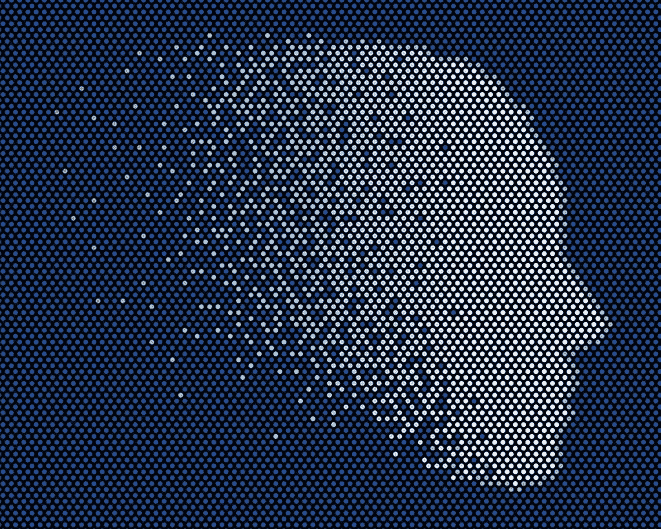

# 为什么中国的人工智能威胁是真实的，但也许没有你想象的那么糟糕

> 原文：<https://medium.com/hackernoon/why-chinas-artificial-intelligence-threat-is-real-but-maybe-not-as-bad-as-you-think-a67af2538968>

根据你的衡量方式，中国要么在人工智能方面仅次于美国，要么已经超过了我们。

考虑到 2017 年全球[对人工智能初创公司的 152 亿美元投资](https://hackernoon.com/tagged/investment)中的[48%流向了中国，而美国为 38%。普华永道](https://www.technologyreview.com/the-download/610271/chinas-ai-startups-scored-more-funding-than-americas-last-year/)[还预测](https://www.economist.com/news/business/21725018-its-deep-pool-data-may-let-it-lead-artificial-intelligence-china-may-match-or-beat-america)到 2030 年，基于人工智能的[增长](https://hackernoon.com/tagged/growth)将推动全球 GDP 增加 16 万亿美元，其中超过一半将流向中国。中国政府去年也概述了成为人工智能世界领导者的三年计划。

面对这一生存威胁，美国政府犹豫不决。虽然奥巴马政府已经认识到中国在人工智能领域日益增长的影响力，并提出了一个对抗它的计划，但现任政府什么也没做。“我们仍在等待白宫提供一些指导，”在谷歌从事人工智能政策的蒂姆·黄最近告诉《纽约时报》。

政府可以做的事情很多，我将在下面概述。但是人工智能的本质使得它的威胁——至少在商业上——比你可能被引导去相信的要小。简单地说，中国不能像倾销钢铁一样在我们的市场倾销人工智能。

**我们的史泼尼克时刻在哪里？**

十多年来，观察人士一直警告称，美国在 STEM 教育方面正在落后。在最近的全球教育评估中，美国在数学方面(在 71 个国家中)排名第 38，在科学方面排名第 24。中国目前培养的 STEM 毕业生大约是美国的八倍，到 2030 年，这个数字将上升到 T2 的 15 倍。

美国以前也面临过类似的威胁。1957 年，苏联发射人造卫星，标志着该国在进入太空方面击败了美国。这导致了 1958 年的国防教育法案，该法案投入了数亿美元(在当时是一大笔钱)用于学生低息贷款和改善中小学教育。

虽然我预计联邦政府不会提供任何形式的援助，但地方政府和私营企业已经采取了一些行动。例如，现在 T4 的 15 个州为公立学院和大学培养 STEM 毕业生提供奖励。Code.org 也在推动美国每所学校教授编程。去年，佛罗里达州试图颁布一项法律，允许学习一门编程语言来满足学校系统的外语要求。这个动议没有通过，但这是个好主意。

我们的学校系统错过的最大机会是，我们为低收入学生开设的公立学校比那些为富裕孩子开设的学校差得多。例如，2016 年斯坦福大学的一项研究发现，六分之一的美国公立学校的平均考试成绩比全国平均水平低一个等级以上。研究还发现，社会经济优势最强和最弱的地区的分数相差四个等级。

**现在好消息是…**

虽然美国显然需要改善其 STEM 教育，但一个可取之处是人工智能不能像其他技术那样转移。苹果的新 iOS 可以在世界各地运行，但百度不能将其人工智能系统带到美国，插入并开始获得见解。

那是因为 AI 是基于数据的。中国公司使用中国消费者的数据。在中国工作的中国将能够在中国做大事。但没有美国的数据，在美国工作的中国将无法做大事。因此，美国公司的人工智能仍将是世界上最好的——对美国市场而言。

因为中国的数据是基于一个大得多的消费者群体(中国的人口是美国的四倍多——这一事实也让那些 STEM 毕业生的统计数据有了正确的看法)，中国的人工智能可能会比我们的更好。但这是一个有争议的问题。

当然，事情可能会改变。首先，人工智能不仅仅是一个商业产品。它还涉及国家安全问题。正如我们所看到的，在国际网络战中，即使是像朝鲜这样的小国也能脱颖而出。

这就是为什么我们作为一个国家最好的投资是在我们的教师身上。最起码，我们应该给予优秀者应有的尊重。