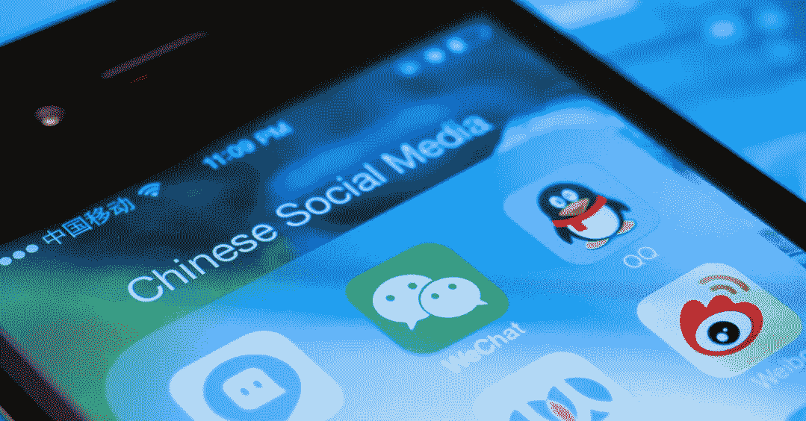

# 为什么中国公司不擅长用户参与

> 原文：<https://medium.com/hackernoon/why-chinese-companies-suck-at-user-engagement-f07a47f1d10f>

## 技术观点

我想我刚刚明白了为什么中国公司在用户参与方面表现糟糕(&社区/品牌建设)。

下面是我的故事:大约一年前，我进入了中国的区块链领域，专攻社交媒体 T2 营销 T3。我曾为多家中国区块链公司提供建议，并亲手将其中一家公司通过内容创意和受众定位发展成了一个国际社区。这份工作让我明白了为什么一些来自中国的顶级区块链公司在建立一个真正有吸引力的全球社区和国际品牌方面遭遇惨败。

但这份工作并不天生适合中国市场。虽然社交媒体营销在西方变得越来越受欢迎，甚至是业务增长的必要条件，但中国的社交媒体营销行业才刚刚起步。随着脸书、Instagram、Twitter 和 LinkedIn 等大型社交媒体平台的发展，西方社交媒体营销空间一直在增长，而中国的社交媒体营销空间只有一些大胆的非热门品牌在尝试。在中国，你有“尚维”的形式，这是利用微信上的时刻，类似于脸书的时间线，只向你的朋友宣传商品。微信广告的使用是非常被低估的。中国互联网用户似乎天生就喜欢嘲笑那些利用社交媒体广告侵犯他们私人朋友空间的商家。只有少数中国最近兴起的网络流行社区开始了他们的实验，并有未经证实的结果。

这与西方已经发生的情况形成了鲜明的对比。从 Gary Vaynerchuck 到 Tai Lopez，西方社交媒体营销风暴已经席卷了所有大型社交媒体平台，在不太成熟的西方数字营销行业启动了一大批社交媒体营销人员。这些社交媒体营销人员是他们工作中的专家。他们知道如何创建渠道，如何设计内容创意，以及如何通过广告瞄准正确的受众。这种情况已经持续了几年，该行业仍在不断发展。这种崛起也培养了一种文化，即深入了解市场受众，并通过有价值的内容以正确和有意义的方式让社区参与进来。

内容和价值。这是中国企业仍不熟悉的社交媒体营销中的两个词。特别是在区块链行业，分散的社区对区块链企业来说至关重要，构成创建有影响力的社区和品牌的支柱的两个组件只进入区块链顶级企业的意识。现有的区块链业务仍然主要生产仅展示其产品的内容，这本质上是产品销售内容。在用户注意力是打开潜在销售的关键的时代，这种向用户提供的负价值必须停止。

还记得凯西·奈斯塔特的耐克动机商业视频吗？这只是一切的开始。这个半广告半激励的视频为用户提供了一个积极的价值，也为品牌带来了积极的价值。古老的从用户那里获取价值并将其给予产品的方法已经过时了。这对今天的观众来说太明显了。没有人想看一个已经过度宣传的品牌谈论他们的产品有多好，并努力向顾客推销。围绕你的品牌创造有价值的、有趣的、有教育意义的内容，人们就会来。提供价值，停止索取价值。

尽管这已经逐渐成为社交媒体营销领域的常识，但大多数中国企业仍然没有意识到这种趋势。这使得他们在建立国际用户群时变得繁琐和无所事事。虽然国际观众已经习惯了社交媒体营销类型的用户参与和内容，但中国企业仍在使用“嘿，这是过去一周的产品进展”总结来介绍自己。咄…

该长大了。

我不想谈论语言障碍或使用不同社交媒体平台的技术问题。这可能是一个问题，但这只是我们今天讨论的表面问题。事实是:一群年轻、有抱负的中国互联网/区块链企业未能适应全球社交媒体领域快速发展的营销方式。如果他们不掌握社交媒体营销的游戏，他们将很快失去竞争优势。当他们还在考虑如何发展国际社区时，他们已经被美国/欧洲的同行超越了。

【联系我上 [***推特***](https://twitter.com/jc_zhang_)***:*******@ JC _ Zhang _
邮箱:****

*~ ~ ~ ~ ~ ~~ ~ ~ ~ ~ ~ ~ ~ ~ ~ ~ ~ ~ ~ ~ ~ ~ ~ ~ ~ ~ ~ ~ ~ ~ ~ ~ ~ ~ ~ ~ ~ ~ ~ ~ ~ ~ ~
更多关于我在中国区块链的经历:
[我在为 3 家中国区块链创业公司工作时学到的东西](https://hackernoon.com/what-i-learned-from-having-worked-for-3-chinese-blockchain-startups-ce8f56a10372)*