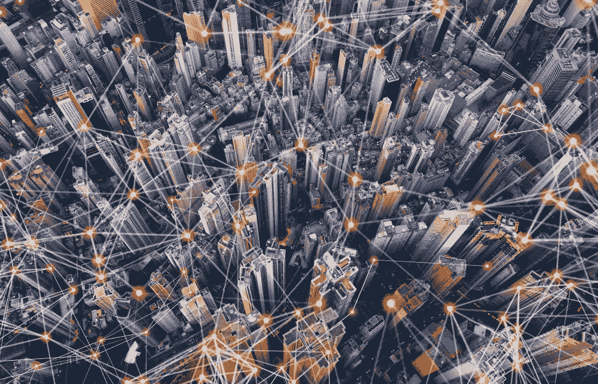

# 为什么使用新兴技术的城市和市民将为未来做好更充分的准备

> 原文：<https://medium.com/hackernoon/why-cities-and-citizens-using-emerging-technologies-will-be-better-equipped-for-the-future-9436d3d4ac0b>

我最近参加了一个会议，最后和一个来自电气和电子工程师协会(IEEE)的人进行了对话。

当我们交谈时，他分享了他的观点，即互联网的最初目标是帮助人们，但在他看来，很明显这项技术弊大于利。

我认为这部分是因为人们现在掌握了互联网的所有力量，但还没有很多问责措施到位。互联网让人们可以自由地做一些美妙的事情，但它也很容易被用来匿名诋毁他人或传播错误信息。

> 关于科技为改变和更负责任的 T2 未来服务的可能性，仍然有未实现的梦想。

这种责任感是为什么[区块链](https://hackernoon.com/tagged/blockchain)有潜力完成互联网做不到的事情。

利用区块链推动进步和激励人们以健康和富有成效的方式行事的城市和社会将是最终实现这些目标的人。

这就是为什么它对我们所有人都很重要:

# 如果使用得当，技术可以提高信任度。

透明度是一个复杂的话题。

如果一个组织或个人不怀好意，他们可能想要尽可能少的透明度。但是仅仅因为有人想要隐私，这并不一定意味着他们在做一些邪恶的事情。

尽管如此，许多组织能够，而且确实，在对他们的过程和行动保持开放的同时茁壮成长。

区块链有能力提供帮助，因为它为政府和公司提供了一种方式，使他们的交易、供应链以及他们提供的产品和服务更加透明。这是因为区块链技术的基石是其可信和安全的自动交易和记录保存。

> 像[零知识证明](https://blog.chronicled.com/why-zk-snarks-are-crucial-for-blockchain-data-privacy-e02f4bc1d352)这样的技术允许公司和政府在不放弃其他敏感数据的情况下，证明他们尊重人权，提供他们所说的援助，或减少污染。

这种能力可以让透明和信任成为我们社会的准则。因为如果没有人是透明的，那么没有人会被追究责任。

# 新技术有助于应对重大的全球性挑战。

区块链在我们目前面临的问题上有很多应用——比如最近难民涌入欧洲导致的人道主义危机。

证明你的身份并获得批准进入另一个国家是一个艰巨的过程，并不是每个申请人都首先有适当的文件。

我是说，这在美国都不容易。为了更新我的执照，我不得不去我父母的房子，爬进阁楼，从一个带锁的箱子里拿出我的社会安全卡。虽然我知道一张纸或一个实物是最好的，因为它不可破解，但当我们所有的身份号码都在网上浮动时，这似乎很荒谬。

> *如果我们能给人们一个数字身份来建立信用，并以安全简单的方式跨境流动，这将大大减轻难民和接收难民的国家的压力。*

这也不仅仅是猜测。 [Bitnation](https://tse.bitnation.co/) 已经创建了一个自愿的、无国界的区块链管辖区，在 30 多个国家设有领事馆。这是给人们提供自我主权身份的一种方式。那些在世界上没有传统地位的人可以获得获得结婚证、出生证、难民紧急身份证和所有其他公民身份标志的能力。

对于那些被迫离开家园的人来说，这是一项现实世界的技术应用，可以真正改变他们的生活。

# 科技的使用让人们可以质疑他们的城市或国家是如何进步的。

数据透明和所有权可能是最终目标，但这条路并不平坦。

有很多国家不允许他们的公民完全接触互联网或其他新兴技术，因为他们担心这种透明度可能会导致什么。你能接触到某样东西并不意味着你能使用它。没有人会通过在第三世界国家分发加密钱包来解决世界饥饿问题。

区块链和其他新兴技术有很多让世界变得更美好的机会，但实际上，这取决于人们选择哪条道路。

人们经常谈论这项技术能做的所有令人惊奇的事情，但是必须有政治意愿和社会压力来做出这些改变。在许多情况下，我们缺乏的不是技术，而是行动的意愿。

人们必须向他们的地方和国家政府施加压力，让他们参与进来，以改善我们生活的方式使用这些技术。这是真正实现区块链、互联网或任何其他变革性技术的承诺的唯一途径。

**感谢阅读！**

**我们区块链艺术集体的团队希望确保艺术世界的变革者和创新者——无论是个人还是机构——对这个不断增长的生态系统产生影响。**

听起来像你？ [**填写表格**](https://blockchainartcollective.com/ecosystem/) **向区块链艺术集体工作组提出申请。**