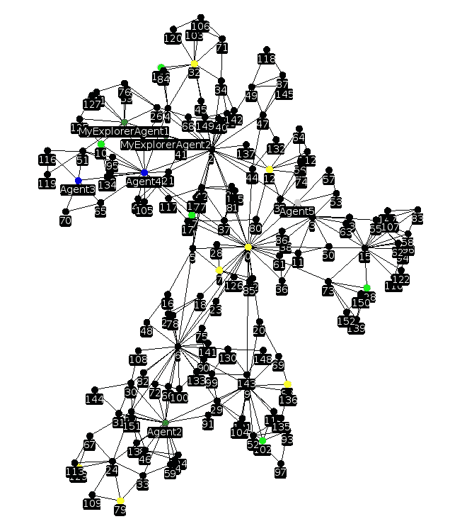

# 为什么编写多智能体系统很难

> 原文：<https://medium.com/hackernoon/why-coding-multi-agent-systems-is-hard-2064e93e29bb>

[Source](http://www.geekinsider.com/newest-addition-pantheon-sentient-robot-films-chappie/)

> “三十五年人工智能研究的主要教训是，难的问题容易，容易的问题难。”平克(1994)，《语言本能》

我认为编写软件代理程序来收集图上的宝藏是小菜一碟。我完全错了。事实证明，对代理进行编码，使他们不会愚蠢地行事，在本质上是很困难的。

# 定义良好的多代理设置

> “一个**代理**可以被视为通过**传感器**感知其环境，并通过**效应器**对该环境做出反应的任何东西。”[人工智能:现代方法](https://people.eecs.berkeley.edu/~russell/aima1e/chapter02.pdf)，斯图尔特·拉塞尔和彼得·诺维格

Simulation of a multi-agent system collecting treasures using [GraphStream Library](http://graphstream-project.org/)

**这里是一个简单的多主体问题。让 n 个代理在一个全连通图中移动来收集财宝。代理人的行动、感知和交流都受到限制。它们只能观察和移动到与它们直接相连的节点，并与足够近的代理通信。**

**特工**有三种:*探险者*、*收藏家、*和*无限背包特工*。探险者注定要探索地图，因为他们不允许挑选宝藏。能够收集的人是收集者，但是他们不能携带太多，必须将收集到的宝物交给无限背包代理。

智能体的感知能力有限，但能记住过去的观察结果。每个智能体都有自己的世界表示，自己的图，是真实图的子图。他们的子图是他们访问过的所有节点的内存，以及他们曾经看到或拍摄的边。他们必须将这个图传达给其他人，这样他们就可以共享所有子图的重构。

[**JADE**](http://jade.tilab.com/)**(Java Agent development Framework)将用于实现所谓的“行为”**(教程可以在[这里](http://jade.tilab.com/doc/tutorials/JADEProgramming-Tutorial-for-beginners.pdf)，或者[这里](https://gitlab.com/herpsonc/startJade))。在这个[多代理系统](https://www.cs.cmu.edu/~softagents/multi.html)框架中，一个*行为*是一个代理将要执行的一组指令。在每个回合中，每个代理都依次执行它的每个行为。

**你的目标**:实现代理的行为，让他们在一定的时间内收集尽可能多的财宝。

看起来很简单，对吧？

(注意:这个项目是多智能体系统介绍的一部分(ANDROIDE 的一门课程，我目前在 UPMC 攻读人工智能硕士学位)。它的灵感来自于生存恐怖游戏 [Hunt The Wumpus](https://en.wikipedia.org/wiki/Hunt_the_Wumpus) ，在该项目的完整版本中，代理需要处理一个四处游荡的恐怖 Wumpus)。

# 不平凡的行为

想象两个代理在一条长长的走廊上向相反的方向移动。图中每个节点只能有一个智能体，因此它们必须协调行动，以免阻塞道路。必须实现特定的协议来考虑这种情况。

Conflict of agents in a simulation: MyExplorerAgent2 is blocking the two others

## 协调

**特工感知有限，能力各异。因此，合作是必要条件。当冲突发生时，必须有一个协议来解除这种情况。他们必须分享他们的子图，看谁更接近高度连接的节点，并就谁将移动达成一致。**

探险家代理还必须就谁将探索未知图的哪一部分达成一致，以优化他们的行动并防止冲突。

## 信息交流

在多智能体设置中交换信息以使每个智能体访问全局知识的过程被称为 [*八卦问题*](https://www.sciencedirect.com/science/article/pii/0012365X73901210) *。*

[Source](https://jisajournal.springeropen.com/articles/10.1186/1869-0238-4-14)

例如，让我们假设集合{1，2，…，n}中的每个代理都确切地知道一条信息，称为秘密。然后，一个非常简单的协议是让代理 1 给 2，3，…，n 打电话，了解他们的秘密。然后，当 1 知道了所有的秘密，他打电话给 2，…，n 告诉他们那些秘密，然后所有人都知道了所有的秘密。总共进行了 n-1+n-1 = 2n-2 次调用。实际上，[最优解](https://arxiv.org/abs/1511.00867)需要 2n-4 次调用，接近我们的简单算法。

然而，在我们的问题中，**直到所有的节点都被探索过之后，总信息才被完全知晓**，这使得算法稍微复杂一些，因为总知识是动态的(代理探索图越多，他们的总知识就越多)。

**这就是优化妥协出现的地方。**n 个*代理之间必须交换的消息的最佳数量是多少，这样他们才能知道所有的秘密？更多的信息意味着更好的全球知识和更好的协调。然而，由于有数千个代理和数百万个节点，**每毫秒发送数千条消息的成本是不可忽略的，并且成为计算负担。***

## 异步通信

代理之间的通信是*异步的*。由于代理的执行是[分布式的](https://en.wikipedia.org/wiki/Distributed_computing)，因此没有**全局时钟**来同步代理的动作。此外，当交换信息时，每个代理都有一个包含来自其他代理的消息的邮箱，因此**通信可能会延迟。在此延迟期间，一个代理可能会移动到很远的地方，并且**永远不会回复原始消息**。**

## **联盟形成**

Example of coalition formation : [source](https://www.slideshare.net/SurSamtani/coalition-formation-and-price-of-anarchy-in-cournot-oligopolies)

某些目标是无法单独实现的(例如，举起重物)。因此，代理人可能会同意组成一组代理人，称为*联盟*，以实现共同的目标。

有了具备三种不同*必要*技能(探索、收集和积累)的三个智能体，**必须形成至少三个智能体的*联盟***。因此，必须实现创建和更新联盟的协议。一种可能是使用 [Shapley 值](https://www.degruyter.com/view/books/9781400881970/9781400881970-018/9781400881970-018.xml)(由代理联盟创造的剩余)来确定哪个联盟是最有价值的。

即使是一个简单的问题设置，**几个障碍很快出现，算法的复杂性似乎无法克服**。当试图构建能够以类似人类的方式运行的人工智能算法时，这是一个反复出现的现象。

# 构建展示简单行为的人工智能很难

> “让计算机在智力测试或玩跳棋时表现出成人水平的表现相对容易，但在感知和移动性方面，让它们拥有一岁儿童的技能却很难或不可能。”莫拉维克(1988)心智儿童

如果我们用人类代替代理人，我相信他们会很快明白如何在这场游戏中获胜，交流他们在图表中看到的东西，并形成联盟来收集最多的宝藏。然而，**对智能代理实施严格的行为规则被证明是惊人的困难。**

这就是[莫拉维克悖论](https://en.wikipedia.org/wiki/Moravec%27s_paradox#):

> 对人类来说容易的事情对机器来说却非常困难

在下棋方面，AI 达到了超人类的表现。但是对于基本的人类行为，如行走或协调行动以探索地图，人工智能算法令人惊讶地更难。

国际象棋大师加里·卡斯帕罗夫在 [*深度思考*](https://www.amazon.com/Deep-Thinking-Machine-Intelligence-Creativity/dp/161039786X) 中作出如下表述:任何足够先进的算法在同时进行的一场比赛中击败 20 名顶级棋手并不困难。**但是没有人工智能(在机器人中)可以在拥挤的酒吧里走来走去，自己移动棋子**。

Source: [DARPA robots falling down](https://www.youtube.com/watch?v=adFd0f7K46w)

## 机器学习在非常特殊的环境下工作

*但是我们为什么不用最新的机器学习(ML)算法来解决我们的问题呢？…* 你说。嗯，**纯 ML 算法只能用于某些任务**。

是的，强化学习(RL)算法风靡一时，可以解决令人震惊的难题，例如在雅达利游戏或围棋游戏[中达到](https://deepmind.com/blog/alphago-zero-learning-scratch/)[超人的水平。但是**那些游戏都是全可视的游戏，数据输入很小**，我们的寻宝问题就不是这样，地图在开始的时候并不是全可视的。](https://storage.googleapis.com/deepmind-media/dqn/DQNNaturePaper.pdf)

Source: [Deep Reinforcement Learning Doesn’t Work Yet](http://Deep Reinforcement Learning Doesn't Work Yet) (Feb. 2018)

但是 OpenAI 不是正在研究一个多智能体系统来使用机器学习算法在 5 比 5 的设置中击败 Dota 2 中的人类吗？...你说。

是的，当[在 Dota 2 中以 1 比 1 的比分击败](https://blog.openai.com/dota-2/)世界冠军时，OpenAI 已经展示了令人印象深刻的结果。但是**主要是因为他们强大的计算能力**,[不是人工智能的突破](https://www.quora.com/How-did-OpenAI-create-the-Dota-2-game-bot-that-beats-professionals)。

他们的目标是在 5 对 5 的环境中获胜，使用[一个 580 万游戏的数据集](https://blog.openai.com/more-on-dota-2/)。因此，他们似乎正在用完整的机器学习方法(从人类游戏中学习)来解决多智能体问题，并且似乎缺少了多智能体系统的自上而下的方法。

**代理人不推断，不归纳**。纯 ML 可以用于单个智能体或完全可观测的系统，但对于不完全已知世界中的多智能体系统，必须采用更通用的方法。

## 我们不知道如何实现可伸缩的行为

只有两个探员在走廊上向相反的方向走，我们遇到了一个问题。实施一项协议来处理这一具体问题是可能的。

> 但是 400 个节点的地图上有 100 个代理怎么办？

在为少量代理人硬编码特性和拥有多代理人系统的可扩展 T21 和可推广实现之间存在差距。

## 需要做些什么

必须通过研究开发特定的多智能体协议来解决这类问题。[没有先验知识的学习](https://deepmind.com/blog/alphago-zero-learning-scratch/)不会教会智能体如何沟通，因为搜索空间太大。纯数据驱动的方法不会有任何结果。

# 结论

实现一个能够解决寻宝问题的算法被证明比看起来要困难得多。构想能够解决简单问题的多智能体系统绝非易事。**机器学习算法在最近十年取得了很大的成果，但单靠它们并不能解决所有的人工智能问题。**