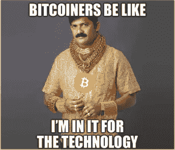

# 为什么社区开发是令牌化网络的新技术开发

> 原文：<https://medium.com/hackernoon/why-community-development-is-the-new-technology-development-for-tokenized-networks-e121677c0f63>

# 区块链的生态系统有问题...

锁链为融资创造了一个很好的用例，允许早期项目获得早期采用者的支持，他们可以直接决定应该建造哪些项目。这为区块链开发者创造了一个富有成效的环境，他们的激励现在与推出将在这些令牌上运行的产品和协议一致，并有望升值。

> 问题是，在代币出售后，各代币利益相关者之间的激励开始出现分歧。

1.  ***第一天***—流动性可能是一把双刃剑，它带来了一系列新的挑战，项目利益相关者可以随时买卖项目的令牌，导致长期忠诚度下降或“游戏中的皮肤”。很难想象早期的脸书或亚马逊这样的公司，能够在成百上千渴望 10 到 100 倍回报的投资者用电报骚扰他们的情况下，进行长期思考。
2.  **代币预售**——正在迅速取代公开*人群销售*。这些打折的私人预售的增加意味着越来越少的投资者获得早期代币，导致利益相关者的总数稳步下降。这可能是个问题，[即使对于早期预售投资者来说](https://www.coindesk.com/ico-presales-boost-vc-3iq-multicoin/)。
3.  **激励不一致** —除了矿工之外，其他大多数利益相关者的激励并不与项目维护和改进保持一致**。这可能是为什么我们看到现有项目越来越多的分叉，导致核心协议开发人才的碎片化和现有社区的内斗和分裂。**

# 我们是怎么到这里的？

在 T21，最初的 cypher 朋克和自由主义者最初对这项技术感兴趣是因为对加密技术带来的隐私的热情，以及它在 2008 年金融系统崩溃后对建立一个更加分散的互联网的影响。价格的上涨反过来又吸引了新一波参与者，包括科技企业家、投机者、华尔街套利者和寻求快速获利的普通投资者。

从 2009 年一直到 2014 年左右以太坊推出自己的 ICO，技术开发是区块链新项目的主要活动，这是有充分理由的。建立一个健壮的基于区块链的协议在技术上很有挑战性，而且世界上只有少数工程师拥有创建一个协议所需的技能。

# 仅有伟大的技术是不够的…

F **ast 向前到今天:**对于技术企业家和协议开发人员来说，过分专注于构建核心技术本身是很有诱惑力的。这是技术驱动型创业公司的普遍情况，而不仅仅是区块链的公司。

残酷的现实是，光有技术是不够的…维持一个项目真正需要的是一个繁荣的社区，它能够在没有核心团队参与的情况下传播和推进项目。

比特币本身就是一个典型的例子，它是由一个化名的个人发起的项目，这个项目是由其社区基于其原始设计和激励机制的力量进行的。

有些人甚至声称:

> 加密货币是通过其市值的大小来衡量的。这是一个粗略的计算器，但对大多数用途来说已经足够好了。但是那些还没有发行硬币或者举办代币销售的项目呢？越来越多的投资者转向一个难以伪造的、表明广泛支持的指标——电报追随者。— [来源](https://news.bitcoin.com/telegram-followers-the-new-metric-for-cryptocurrency-success/)

# **社区发展不够……**

H **ow-ever** :如今，随着越来越多的项目涌入这个领域，越来越明显的是，仅靠伟大的技术不足以支持一个突破性的项目继续发展和维持。

*密码经济学*的关键经验来自于调整各级项目利益相关者之间的激励，以使整个系统繁荣发展。

简而言之，为了参与项目并为项目的成功做出有意义的贡献，一个社区必须参与到游戏中。完全忽略这一点的项目，无论是通过向新参与者空投代币(游戏中皮肤的对立面)，当这些短期黑客行为不会导致长期参与时，都不应感到惊讶。

除了最初的金融支持者之外，最近一些有趣的项目旨在广泛分发其令牌，包括:

1.  ***【纳诺】****(以前的 rai blocks)—[一个相对公平分布的](/@musback/why-raiblocks-will-become-the-worlds-digital-currency-dbe1f98cec4c)令牌，由于它的采矿方法，能够在早期获得令牌持有者的广泛分布。*
2.  ****Eco***——旨在创建一个[经过验证的大学网络](/@eco/introducing-eco-a-global-currency-protocol-b99c74f7c0f7)，以帮助建立一个均匀分布且“T12”合作的金融基础设施，该基础设施易于使用且节能。*

# *心态的转变*

**

***Customer < Investor < Contributor***

*我们现在进入了区块链发展的第三局。为了下一代协议取得成功，项目创建者和开发者需要转变他们的观点，不再将令牌持有者视为客户甚至投资者，而是将其视为项目的 ***熟练贡献者*** 。简单来说:*

> *为了参与并做出有意义的贡献，您的社区必须与游戏息息相关。*

*作者认为，随着时间的推移，我们将开始看到新的激励机制的蓬勃发展，让新的项目利益相关者以他们最适合的方式做出贡献，或者通过他们的专业技能、网络和关系、意见和反馈等等。*

*作为这种转变的结果，我们将会看到项目'*contributor*'的定义的扩大，以及能够最好地利用其社区的力量来帮助他们建立和发展项目的新项目的繁荣。*

## ***关于作者***

*亚当·布雷克勒是棱镜实验室的创始人，棱镜的制造者。IO ，为令牌化网络打造的社区开发平台。*

***喜欢这篇文章？请点击那个小小的❤按钮来表示你的支持。***