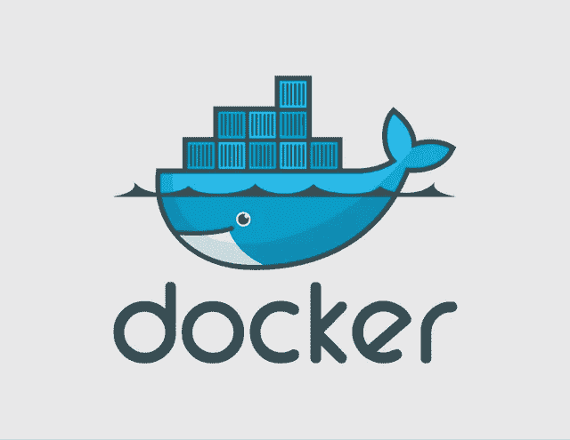
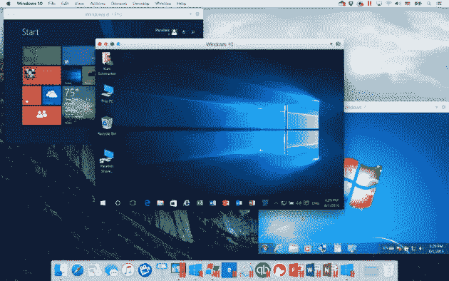

# 为什么公司现在需要容器战略

> 原文：<https://medium.com/hackernoon/why-companies-need-a-container-strategy-now-a85a4f693d6c>

这篇文章是给非技术人员的容器介绍。

我的公司[机器箱](https://goo.gl/s1hBch)以[码头](http://www.docker.com)集装箱的形式交付机器学习模型。如果没有容器，我们将很难获得客户的接受，我们获得客户的成本将会非常高。

[http://www.docker.com](http://www.docker.com) — I love these guys

码头工人可能是新的电力。还记得没有电很难经营一家公司的时候吗？今天，如果没有某种容器战略，将很难运营一家公司。尽管容器和电荷的存在之间有一些细微的差别，但资源和产出之间的基本关系是相同的。

请允许我从基础开始。我们谈论的是软件容器，而不是那些你可以把衣服放进去的塑料立方体和菱形。集装箱是由一家名为 Docker 的公司推广的，该公司在 2015 年的估值超过了 10 亿美元。也许解释什么是软件容器的最好方法，是将它与您可能更熟悉的东西进行比较；一台虚拟机。虚拟机本质上是另一个操作系统中的一个操作系统。例如，你可以在 MacOS 中运行 Windows，作为一个虚拟机。你启动一些软件，这些软件可以理解虚拟机文件的样子，在这个环境中打开文件，整个操作系统就会启动，与周围环境隔离开来(某种程度上)。

它有很多好处，因为您可以对其进行扩展，以适应大型工作流，其中一些特定的软件需要以专用的方式安装和运行。对于复杂软件的供应商来说，这也是一种简单的方式，无需大量的安装和配置就可以将他们的产品交付给你。

[https://www.geekwire.com/2017/review-parallels-desktop-12-mac-shows-virtual-machine-matters/](https://www.geekwire.com/2017/review-parallels-desktop-12-mac-shows-virtual-machine-matters/)

但是当你运行一个虚拟的 Windows 实例时，你也在运行操作系统中所有你不需要的东西。每次运行虚拟机时，所有这些驱动程序、应用程序、设置和 Solitaire 实例都会启动。从规模来看，这是大量的资源浪费。

## 什么是容器？

这就是容器的用武之地。Docker 描述得最好:

> 容器映像是一个轻量级的、独立的、可执行的软件包，包含了运行它所需的一切:代码、运行时、系统工具、系统库、设置。

它排除了所有你不需要的东西。它们是精简的、吝啬的应用机器。正确架构的容器内部没有任何不必要的 computerness。

如果您已经做到这一步，您可能会问自己“如果开发人员正在制作容器，那么我需要 Docker 做什么？”

Docker 做了很多事情，但主要是操作系统和容器之间的协议。就像在你的电脑上运行虚拟机的软件一样(有很多)。

## 我如何扩展？

好了，现在你已经得到了一个容器，它在我的计算机上运行得很好，但是我如何扩展呢？很棒的反问！这是真正的投资回报率发挥作用的地方，也是为什么公司必须开始认真考虑他们将如何处理他们的基础设施，因为它涉及到容器。

密切关注一种名为 [Kubernetes](https://kubernetes.io/) 的东西。还记得使用容器代替虚拟机所节省的开销吗？当您考虑扩展时，这真的开始为您省钱了。Kubernetes 是一个容器 orchestrator，这意味着您可以使用它来管理数百万个容器协同工作。这就是今天云的工作方式。像谷歌这样的公司使用 Kubernetes 来管理全世界每天每秒都在搜索的数十亿人。谷歌是单一平台；一个只有一个目的的网站。然而，它可以被地球上的每个人同时使用，而且不会使公司崩溃或破产。想一想当构建一个可扩展到那个规模的系统时所面临的所有挑战；负载平衡、安全性、分段、数据管理等。事实证明，将容器与 Kubernetes ( [还有其他工具](/@n_gerasimatos/comparing-container-management-platform-enterprise-options-a86b47e713f0))等工具结合起来，可以让任何公司(在某种程度上)扩展到谷歌的规模，而不会倾家荡产。朋友们，这是你们投资的回报。

如果不考虑容器策略，就不可能提供客户期望的规模。所以请一位开发工程师，现在就开始解决这个问题。

# 什么是机器盒子？

[Machine Box](https://machinebox.io/?utm_source=blog&utm_medium=medium&utm_campaign=matblog) 将最先进的**机器学习**功能放入 **Docker 容器**中，这样像你这样的开发人员就可以轻松地将自然语言处理、面部检测、对象识别等融入其中。到您自己的应用程序中。

盒子**是为扩展**而建造的，所以当你的应用真正起飞时，只需水平地添加更多的盒子，直到无限甚至更远。哦，它比任何云服务都要便宜得多，而且数据不会离开你的基础设施。

[有戏](https://machinebox.io/docs/facebox/teaching-facebox)让我们知道你的想法。