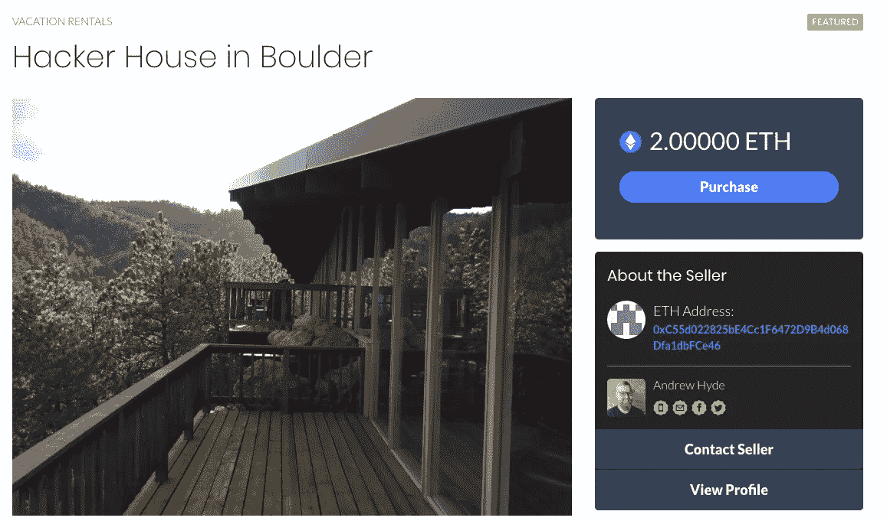
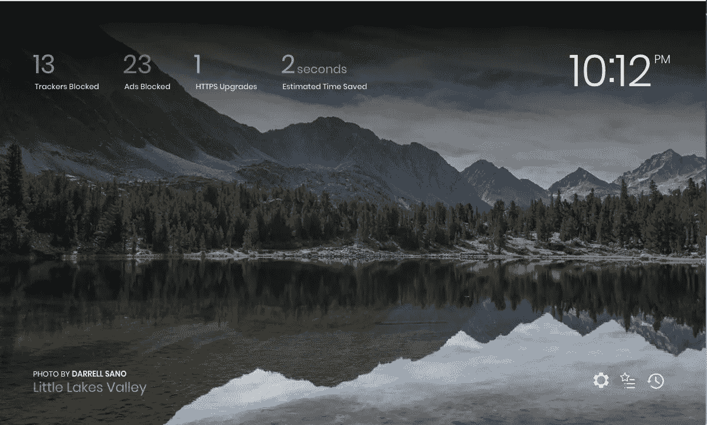
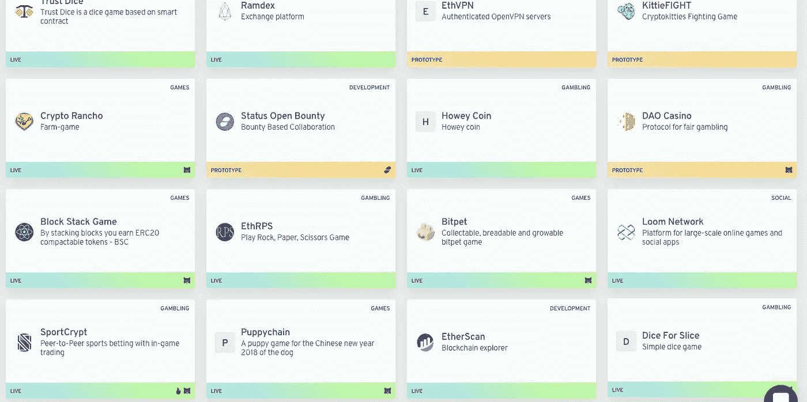
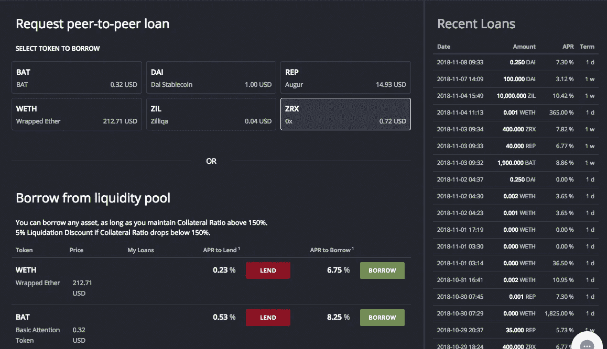

# 为什么消费者会喜欢去中心化的网络

> 原文：<https://medium.com/hackernoon/why-consumers-will-love-the-decentralized-web-3ab60ab474a9>

很多人还没有听说过去中心化网络，但是它带来了互联网公司建立方式的巨大转变，总有一天，我们都会使用它。但是，即使在分散式网络最热情的支持者中，许多人也不理解*为什么*我们都会使用它。支持者会吹捧“抵制审查”、“控制你的数据”或“自由”是最大的优势。正如我将要解释的，去中心化将会获胜的真正原因很简单，就是经济。它改变了谁拥有市场的“库存”,从任何特定的公司到所有的公司(即一个共同的数据主干)，这将导致更多的竞争，自然会创造出消费者会喜欢的更好的产品和更低的价格。一个“去中心化的 Airbnb”可能只能拿走 1%而不是 15%。一个“分散的 Craigslist”可能会被迫有一个令人愉快的设计。

这将会发生，因为去中心化的网络解决了倾向于垄断的市场行业之间的自然紧张，以及垄断公司的问题。这将影响从出租车(优步)、度假租赁(Airbnb)、贷款(LendingClub)、拍卖(易贝)等众多行业。基本上所有的市场。

A house for rent on a real decentralized P2P marketplace, just like Airbnb, except 25% less expensive than normal.

## 底漆

当我说“去中心化网络”时，我和其他人指的是建立在任何区块链之上的“去中心化应用”和协议的网络，例如[以太坊](https://ethereum.org/)或 [Cardano](https://www.cardano.org/en/home/) 。术语“去中心化应用程序”(“dapp”)还没有一个确切的定义，但就我们的目的而言，它意味着一个主要使用存储在区块链上的数据的应用程序。否则，它可能看起来和感觉就像一个普通的应用程序。

区块链是一种通过分布式计算机网络保存数据并对数据进行计算的方法，这种计算机网络不受任何一个中央机构的完全控制。在当今世界，如果脸书更新了他们的应用程序，而你不喜欢更新，你的选择是接受更新或停止使用应用程序。这些都是激烈的选择。但在一个去中心化的世界里，如果以太坊基金会推出了一个人们不喜欢的更新，那么网络的参与者就有了第三种选择。他们可以继续运行现有版本，就像以前一样。以太坊不能强迫任何人升级。这实际上给了网络中的参与者对每次升级的“投票”。因此，对网络的控制更接近于民主。每个人都可以信任网络，而不必信任任何特定的中央实体，因此您得到了术语“去中心化”。正如我们将看到的，这种权力动态的变化是至关重要的。

Start screen of a decentralized browser which can block ads and automatically give micro payments (through crypto currency) to content creators

去中心化的 app 和[浏览器](https://www.toshi.org/) [存在](https://metamask.io/) [今天](https://blockstack.org/)。它们很笨重，还没有人真正使用它们，但是一个庞大的开发者和投资者社区正在积极努力改变这种状况。

如果你对更多的区块链背景感兴趣，我鼓励你在读完这篇文章后搜索一下。互联网提供了。

## 人们在去中心化网络上犯了哪些错误

围绕“去中心化网络”的大肆宣传是相当崇高的。它被《连线》杂志描述为“可以恢复自由的数字伊甸园”。麻省理工学院的一份报告吹捧“抵制审查是一个主要的好处”，被认为发明了互联网的蒂姆·伯纳斯·李，“设想了一个新的网络，用户可以控制他们的数据存储在哪里以及如何访问”。

这些都是值得称赞的目标，但是所有的证据表明，消费者并不像吹捧他们的技术专家那样关心这些理想。如果你真的想的话，你现在就可以实现其中的大部分目标。DuckDuckGo 提供了一个伟大的搜索体验，而不需要你的数据。FastMail 提供卓越的电子邮件服务，无需您的数据。数百万青少年使用 Jott 通过网状网络(没有中央服务器)免费发送短信。但他们使用它是因为他们负担不起数据计划，他们在学校没有 wi-fi 接入，而不是因为他们需要逃避政府审查。如果消费者真的关心这些东西，那么这些产品将成为主流，而不是替代品。

专注于自由和审查是一个经典的例子，保罗·格拉厄姆称之为“T1”“*你们(初创公司创始人)将会犯的*错误”，这是一个被“愿景”所困扰的例子，这里指的是隐私和自由，而忘记了你的客户真正想要的是什么。不过，并不是每个人都被吸引住了。克里斯·迪克森[明白了](/@cdixon/why-decentralization-matters-5e3f79f7638e)。他从开发人员的角度谈论它。他说，分散式系统将会胜出，因为它们将会赢得开发者的“芳心”。他是对的，但是让我们更进一步，我认为是更强大的力量——消费者。Internet Explorer 告诉我们的一件事是，尽管被开发人员讨厌，这些开发人员仍然花费无数时间来确保他们的应用程序在 Internet Explorer 9 上工作，因为消费者使用它。苹果在应用商店征收的 30%的税量化了当你拥有消费者时，你拥有了多少权力。因此，在我们阐明为什么*消费者*会想要去中心化的网络之前，我们不会有全面的了解。

事实是，对于大多数消费者来说，科技“伊甸园”并非没有审查。这是一个很容易使用的。它有你想要的所有节目，有所有的公寓出租，有你所有的朋友。理想情况下，它是免费或便宜的。这最后一部分正是为什么去中心化的网络最终会赢。让我解释一下。

## 转移网络效应

当你想买卖当地的东西时，你可以使用 Craigslist。他们的设计很烂或者支持不存在都没关系。这就是“网络效应”的力量，它可以被定义为一种产品随着更多的人使用而变得更有价值。脸书、易贝、Airbnb、优步、AdWords 也是如此，这样的例子不胜枚举。这并不是说某人*不能*与之竞争，这只是说不通而已。当只有一个或几个地方可去时，像这样的双边市场实际上更好。因为给定市场的所有“库存”(汽车、房屋、你的朋友等)。)都在一个地方。搜索是昂贵的，而整合减少了这一开销。把你的沙发放在 25 个不同的地方出售是没有效率的。让行业在一个地方达成一致可以节省您的成本。它还允许围绕中心开发一个“生态系统”，如第三方应用程序、与合作伙伴的集成等。这些都是增值的。

但是如果我们都同意一个地方，或者一个公司，那么我们实际上就把这个公司冠上了垄断的帽子，而垄断是不好的，对吗？[是的](https://www.nber.org/papers/w0055)，毫无疑问。

该死的。我们这里有一种自然的紧张。一方面，消费者希望这些行业的库存集中在一个地方，因为这样可以降低搜索成本，让生态系统增值。但另一方面，消费者不想要垄断，因为从长远来看，垄断会对你要价过高或服务不足。那么，为什么不打破垄断呢？嗯，你可以，但请记住，这样做实际上对消费者来说更糟，因为你增加了搜索成本或降低了生态系统的价值。与垄断相比，这些增加的成本有多糟糕？这很难量化，但作为上限，我们可以说优步收取大约 20%，苹果 30%，Airbnb 大约 15%(在整个数十亿美元的市场中)[1]。

> 当我听到“为什么去中心化的网络会赢？”这让我想起了詹姆斯·卡维尔的名言，“经济才是问题，笨蛋！”

然而，区块链解决了这种自然的紧张关系。分散的计算和存储为所有人廉价共享库存提供了一种方式，同时不受任何人控制。我们在一个地方得到所有的存货，没有垄断。换句话说，**区块链将网络效应从任何一家公司转移到分散的网络上，允许任何公司建立在相同的数据之上。**

如果任何一个网站都可以完全访问 Airbnb 上的每一个家庭，度假租赁会发生什么？没有人能肯定地说，但它可以削减成本，消除它们，甚至完全改变商业模式。虽然目前没有建立在真正公开数据基础上的行业范例，但我们确实有几个行业的一些大型数据子集至少被所有竞争对手共享，从这个角度看这些行业非常有趣。在线房屋销售就是一个例子(如 Trulia，Zillow，Redfin)。每个人都可以部分访问 MLS 的家庭数据库，以及公共数据(如犯罪和学校信息)。或许令人惊讶的是，Zillow 和 Trulia，[认为自己是](https://www.quora.com/What-is-the-business-model-of-Zillow-Trulia-Redfin-and-others-How-do-they-earn-money-and-What-are-the-possible-revenue-sources)“媒体”公司。他们从广告中赚钱，而不是佣金。Redfin 有他们自己的代理人，但他们支付的是[薪水](https://www.redfin.com/blog/2018/01/how-much-do-redfin-agents-earn.html)，Redfin 的[销售佣金](http://press.redfin.com/phoenix.zhtml%3Fc%3D252734%26p%3Dirol-faq)是 1%，大约是典型代理费率的 1/3。因此，我们有两个与传统代理完全不同的商业模式，一个价格低廉。

发短信应用可能是另一个例子。在这个行业里，“库存”就是你的人脉。但与普通的社交网络不同，所有的库存都存储在你手机的 sim 卡上，任何应用程序都可以访问。这个行业有太多的应用程序，没有任何垄断者控制市场。有很多播放器，包括 Signal，Messenger，Telegram，Textra，WhatsApp，我经常使用它们。我不用脸书的 5 个版本。

考虑其中的含义是很吸引人的，但我不想过多猜测。关键点是*我们在谈论许多价值数十亿美元的公司，他们的费用可能会下降 10 倍* (30% - > 3%)，或者有可能被淘汰。当我听到“为什么去中心化的网络会赢？”，我想起了著名的詹姆斯·卡维尔[的名言](https://en.wikipedia.org/wiki/It%27s_the_economy,_stupid)，“是经济，笨蛋！”

## 例子:贷款行业

为了在最近的一次工作黑客马拉松中获得乐趣，我在一个名为 [Dharma](https://dharma.io/) 的去中心化借贷协议之上构建了一个演示应用程序(我没有财务联系)。它激发了我的许多想法，所以我将它作为一个例子，使上述概念更加具体。

首先是佛法入门。把达摩协议想象成一个在以太坊区块链上运行的程序，就像车库乐队是一个在 Mac 上运行的程序一样。达摩的目的是以一种其他人可以在此基础上建立一般的、集中的、利润最大化的业务的方式来模拟贷款行业。想象一下，如果易贝或 LendingClub 不收取任何费用，而是提供完整、实时的数据库访问权限，然后允许其他人在相同的数据库上构建他们自己版本的易贝或 LendingClub。这类似于达摩组织和其他区块链协议对区块链上的数据的支持。

Screenshot showing a handful of the dapps and protocols currently available that are built on the Ethereum blockchain.

达摩实际上是已经建立在区块链基础上的成千上万个协议之一。术语“协议”在这里只是指一组通过代码强制执行的协议和概念。达摩包含了其他业务可以插入的概念。像“债务人”和“贷款人”这样的概念。它包含像“市场”(他们称之为“继电器”)和“承销商”(他们决定给定贷款请求的风险水平)这样的概念。它还自动处理诸如强制执行贷款偿还合同和收集抵押品之类的事情。这些概念中包含了每个玩家指定费用的能力。比如，延期者可以说他们将收取贷款申请价值的 0.5%，达摩将为他们处理并自动存入资金。它接收的所有数据和执行的所有计算都可以在区块链上获得。

如果你在问达摩如何赚钱，这是一个公平的问题。我也问了他们这个问题，他们告诉我他们正在寻求“开放核心”模式，这意味着“核心”产品是开源和免费的，而他们最终会尝试向大型企业客户出售服务。这种模式实际上在科技界有很强的先例，包括 RedHat(刚刚以[、340 亿美元](https://www.businessinsider.com/ibm-is-reportedly-nearing-a-deal-to-acquire-redhat-the-software-company-valued-at-20-billion-2018-10)的价格卖给 IBM)，以及 Docker ( [、13 亿美元](https://www.cnbc.com/2018/03/28/docker-founder-solomon-hykes-is-leaving-the-software-start-up.html)的估值)。协议商业模式尚未尘埃落定，但[和其他](https://thegraph.com/)正在尝试“捆绑”(有点像会员费)、 [ICO、交易费等等](https://www.quora.com/How-do-blockchain-businesses-make-money)。

不出所料，如今 P2P 贷款只有两个主要参与者。除非你是一个合格的投资者(基本上没有)，否则你可能会去 Lending Club 或 Prosper，这两家公司总共控制了 60%的市场份额[3]。如果你是债务人(即你想要贷款)，情况也是如此。如上所述，垄断或寡头垄断正是你对这类市场的期望，因为它们对消费者更有利。

但正如我们所讨论的，当公司拥有如此大的市场力量时，它通常会以两种方式之一使消费者的情况变得更糟:滥用权力，或无竞争力的行为。虽然区块链肯定可以解决一些首要问题(见我对 2016 年 5 月 LendingClub 丑闻的脚注，其中他们篡改了贷款信息，他们的首席执行官和其他几位高级官员被迫辞职[4])，但我不想专注于此。我想把重点放在我认为更普遍的“无竞争行为”上，我认为这种行为的影响要大得多。

为了说明这种差异，我们来谈谈价格。如果你是投资者，LendingClub [收取你贷款金额的 1%](https://www.lendingclub.com/public/rates-and-fees.action),如果你的债务人违约，他们将收取他们为你收取的任何金额的 30 %- 40 %(称为“收款费”)。如果你是借款人，利率为 1-6%，可能平均为 3% [“发起”费](https://help.lendingclub.com/hc/en-us/articles/216117807-What-fees-do-borrowers-pay-)。

Screenshot of a real decentralized P2P lending platform, using Dharma’s protocol.

现在想象一下，你想要一笔个人贷款，而不是去 LendingClub 发布你的请求，你去[Bloqboard](https://bloqboard.com/)——一个真正的分散中继站，但再次重申，我没有财务关系——你的请求不仅发布到 bloq board，而且，如果你愿意，还会被 20 个其他网站自动获取[5]。在这样一个世界里，所有 20 个网站都在竞争最快地完成你的贷款。Bloqboard 并不“拥有”你的贷款，或与此相关的任何东西，所以他们必须保持低费用来吸引投资者来填补你的贷款，这就是 Bloqboard 会拿走他们的份额的时候。现在回到费用:作为投资者，Bloqboard 目前将向你收取零费用(这可能稍后会改变，但仍可能比 LendingClub 少一个数量级，更多信息请参见脚注[6])，他们的“收集费”也是零，因为实际上没有收集*到* *做*。贷款开始时是有抵押的，如果贷款逾期，达摩智能合同自动允许投资者从(区块链)托管账户中提取抵押品。

有趣的是，不同的市场可能在不同的维度上竞争(对债务人和债权人都是如此)。有些可能有最低价格，有些可能有令人难以置信的支持，其他人可能有令人印象深刻的债务人和债权人之间的匹配算法。但每个人都必须在对用户重要的事情上竞争，因为持有数据赎金不再有效。

让我们更进一步。通过将市场公司的真正权力来源——库存——放到本质上是公共可用的数据库——区块链上，去中心化的网络允许我们问“如果我们从任何一个特定的公司拿走这种权力会怎么样？更好的是，如果我们给每家公司都发一份呢？”

这迫使企业放弃“拥有库存”这一策略，转而在消费者喜欢的其他方面(价格、支持、技术等)展开竞争。).因此，去中心化的网络会胜出，因为竞争自然会产生更好的产品，消费者自然会蜂拥而至。

## 好吧，但是你为什么需要区块链呢？

问得好。从技术上讲，我提到的这些都不真正“需要”区块链。如上所述，易贝、LendingClub、Airbnb 或任何人都可以轻松地提供对其数据库的完整、实时访问，然后让其他人在这些数据的基础上开发自己的产品。这将是一个“市场即服务”的产品，如果你愿意，基本上是说“我们有库存，你建立业务”。因此，如果从技术角度来看没有什么可以阻止它们，而且消费者也想要它，为什么我们还没有看到它呢？

这是一个非常有趣的问题。我认为答案可以归结为两件主要的事情，激励措施、权力动态和 T2。

**激励措施—** 数据垄断的利润机会如此巨大，企业几乎不可能忽视它们。即使公司允许其他人利用他们的数据，投资者或股东(或创始人)也不可能让这种事情免费发生。因此，如果易贝成为一个数据平台，他们可能会开始向一家公司而不是终端消费者收费，但他们最终可能会有效地收取相同的金额。

**动力动力学—** 这可能是更有趣的答案。正如我前面提到的，当当今网络中的公司更新他们的政策或应用程序时，用户必须要么接受更新，要么停止使用该产品。区块链允许一个新的动态，更接近民主。用户可以简单地忽略更新并继续运行旧版本的软件，就像您可以忽略从笔记本电脑上请求的操作系统更新一样。这具有“投票”决定使用哪个版本的效果，并将真正的权力交还给用户。这意味着，如果达摩或以太坊基金会希望人们升级，他们需要为每个人创造令人信服的理由，调整激励措施并约束他们的权力[7]。这很重要的原因是它允许开发者(以及最终用户)有发言权。这种声音自然会要求所有人共享数据，而在区块链之前，这种权力动态在技术上是不可能的。理论上，你可以尝试通过法律手段(例如 Airbnb 主机工会)来执行这样的安排，但这是一个相当令人头疼的后勤问题，而且成本高昂。

## 我们如何从这里到达那里？

现有的垄断者，比如优步，显然不会把他们的数据放在区块链。鉴于他们对股东的信托责任，这实际上可能是非法的。因此，改变必须来自消费者，就像任何大的自下而上的改变一样，这可能会从不同的角度在许多年内发生。一个角度是让人们习惯拥有和使用密码。就像优步只有在足够多的人拥有智能手机后才出现一样，许多加密市场只有在足够多的人拥有加密钱包后才有可能出现。随着时间的推移，不同的(非市场)用例将对此有所帮助。投机已经对数千万人产生了影响。Stablecoins 、[分散式浏览器](https://brave.com/)和[文件存储](/fragments-network/state-of-decentralized-file-storage-mid-2018-27bd5664f3b7)，其他的可能会帮助更多的人做到这一点。

另一个角度是当前系统没有很好服务的“边缘用例”。例子包括无法与传统银行互动或获得贷款的大麻公司，或无法获得美国财政援助的国际学生贷款。另一个例子是高价的市场交易，比如，为 15 个朋友租一个 Airbnb 公寓来举办单身派对。如果你每晚花费 1000 美元，那么 Airbnb 将向你收取 11.5%的费用。这意味着你要向 Airbnb 支付每晚 115 美元的中介费，这太疯狂了。相反，你可以在 Origin(一个不同的分散式市场)上以零费用或者接近零的价格租到房子。或者发送非常大(＄10k+)或非常小(<＄1)的金额。这些都是利基用例，但这是这些事情如何开始。这是推动工具和体验变得更好的工作，它带来了更多的人，带来了网络效应，意味着更多的用例开放，循环继续。

## 暗示

虽然这可能需要很多年，但考虑到潜在影响的规模，这是令人震惊的。想想有多少行业被这些同样的网络效应力量所控制。谷歌、Airbnb、优步、Lyft、脸书、Ebay、Craigslist、Instagram、谷歌、WhatsApp、Pinterest、OpenTable、Waze、微信。我应该继续吗？[8].这些行业中的每一个都可能不得不应对大量的新进入者，这可能意味着大幅降低价格，不同的功能，甚至完全不同的商业模式。谁也说不准事情会如何发展，但不会像今天这样。

许多人已经对去中心化的网络如何让用户重新控制他们的数据，以及如何抵制审查感到兴奋。然而，有了我们的新认识，经济学可以让它变得比以前更令人兴奋。我也希望这能帮助我们越过区块链是骗局或创造乌托邦的非黑即白的讨论。让我们开始问*为什么对于顾客来说*区块链实际上*更好*，因为这最终将是它生死存亡的原因。

**脚注:**

[1]——你可能会说，“嗯，实际上他们可以收那么多钱，因为他们有令人难以置信的技术。”这似乎是合理的，但我认为，事实上他们收取这一金额的能力几乎全部来自他们对市场库存的垄断，而令人惊讶的是，很少来自他们的技术。我是作为一名实习后端软件工程师这么说的。即使对于 Airbnb、Lyft 等知名大公司来说，支撑它们的技术在这一点上也大多是商品化的。有点像航空公司的喷气式飞机。令人印象深刻，是的，他们当然需要高技能，高薪专业人员来建造和维护，但喷气式飞机(即。大规模网络技术)以前已经建立了很多次，现在许多人知道如何建立它们。安全驾驶飞机对航空公司来说是“赌注”。你选择你的航空公司是因为他们的航线、价格和支持。你期望喷射部分“正常工作”。类似地，我认为很多这样的市场服务，像贷款、假期租赁、汽车等。，我们应该根据价格、选项和支持进行选择，而不是因为他们碰巧拥有库存。

[2]——如果“你所有关于区块链的数据”听起来很吓人，要意识到这不像乔·施莫可以在谷歌上搜索简·施曼的区块链历史。数据链接到匿名地址。其他人是否，以及在什么情况下有人可以将区块链数据与你的真实身份联系起来，这些细节相当复杂。我只想说隐私实际上是区块链被发明的全部原因，许多公司正在努力使区块链比现在更加安全，更加隐私。

[3] — [福布斯对 P2P 行业的分析](https://www.forbes.com/sites/oliviergarret/2017/01/29/the-4-best-p2p-lending-platforms-for-investors-in-2017-detailed-analysis/#2d90e2ee52ab)还有，如果 60%听起来很低，你应该意识到谷歌控制了大约 70%的搜索。

[4] —来自 LendingClub 自己的 [SEC 文件](https://www.sec.gov/Archives/edgar/data/1409970/000140997016002140/q11610q.htm)详细说明了这个问题:“在一个案例中，涉及 300 万美元的贷款，申请日期在一个实时公司数据库中被更改，试图看起来满足投资者的要求，贷款余额在直接违反投资者指示的情况下被出售。”这种丑闻在区块链上是不可能发生的，因为你不能改变现有的条目。事实上，我几乎想不出比这更好的广告来宣传使用不可更改的、公众信任的账本的好处。

[5]——我想指出的是，从技术上来说，在达摩上发帖不会立即“上链”(保存到区块链)。然而，这更多的是一种设计选择。事实上，贷款请求不会立即上链，这可能是一个特性，而不是一个错误。它让用户拥有最终的控制权。如果他们想要更私人的贷款，他们可以跳过中间人和承销商，因为他们可能已经知道谁是债权人。某人将贷款请求放在 chain 上所需要的只是支付汽油费(将它存到区块链所需的网络费)，这笔费用非常小(几分钱，多多少少)，而且随着时间的推移可能会越来越便宜。人们可以想象，企业也会突然出现来处理这个问题，可能会向用户预付汽油费，以换取以后更高的费用。

[6] — Bloqboard 还在测试阶段，这就是它免费的原因，但他们最终会开始收费，他们知道他们的竞争对手是谁(1-6%)，所以考虑到区块链的其他障碍，你会期望他们的收入远低于这个数字，或者有其他的商业模式。我和 Bloqboard 的人简短地聊了聊，虽然他们肯定没有说任何明确的事情，但他们暗示他们可能会按照其他分散式交易所(不用于贷款)的收费标准进入，收费大约为 0.3%至 0.5%。这仍比 LendingClub 的平均水平(约 3%)低一个数量级。此外，Bloqboard 用户必须支付“天然气”费用(向区块链)，但这些都很便宜，像 1.50 美元的总说和做。即使 1.50 美元实际上也有点高，但那是因为在贷款的有效期内，你需要做许多交易，每笔交易都会产生少量费用。煤气费会随着时间的推移而变化。

[7]——所谓的区块链“治理”有许多细微差别。比如见达摩的[规则](https://developer.dharma.io/faq/governance)；“智能合约”在技术上可以在没有用户同意的情况下更新，但有一个强制的 7 天“时间锁”，在这个时间锁中，新的代码将被知道，用户可以决定他们想做什么。如果变化真的很糟糕，用户可以“分叉”智能合约，仍然运行旧版本。此外，智能合约的能力有限。例如，他们不能带着你的资金逃跑。

[8] —好的我会继续:Slack、必发、LinkedIn、Salesforce、Twitter。但说真的，据估计，自 1994 年以来，科技领域创造的价值中有整整 70%来自网络效应。参见[https://medium . com/@ nfx/70-of-value-of-the-tech-is-driven-by-network-effects-8c 4788528 e35](/@nfx/70-of-value-in-tech-is-driven-by-network-effects-8c4788528e35)。同样值得注意的是，一些公司不会受到影响。苹果就是其中之一。虽然 AppStore 有网络效应，但苹果从其令人难以置信的硬件和软件中赚了更多的钱，如果你拥有它，这些硬件和软件也会令人难以置信。这里的另一个细微差别是，不要把“规模经济”和网络效应混为一谈。亚马逊的物流就是一个例子。因为他们运送如此多的包裹，他们可以分散他们的固定成本(如卡车、仓库等)。)并使运费非常便宜。但这并不是真正的网络效应。如果亚马逊只给你送货，对他们来说不会盈利，但对你来说同样有价值。如果脸书只为你服务，那它就一文不值。