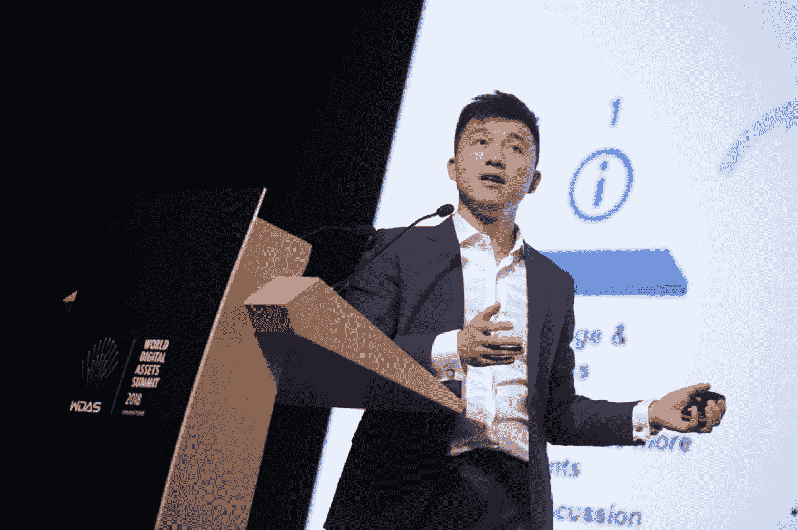

# 为什么企业采用区块链变得容易多了

> 原文：<https://medium.com/hackernoon/why-corporate-blockchain-adoption-has-been-made-a-lot-easier-825d9ad690bd>

## 区块链一直活跃在各个行业中。道路并不平坦。随着区块链继续向消费者和生产商证明自己的价值，一些障碍必须被克服。


[rawpixel](https://unsplash.com/@rawpixel?utm_source=medium&utm_medium=referral) | [Source](https://unsplash.com/@rawpixel?utm_source=medium&utm_medium=referral)

B **锁链在活跃的这些年里，一直在各个行业内解决**问题。道路并不平坦。随着区块链继续向消费者和生产商证明自己的价值，一些障碍必须被克服。

在区块链存在的更重要的一段时间里，各种平台一直试图将自己推销给集中化的行业，宣扬去中心化的福音以及实施去中心化系统所带来的好处。这可能只能在有限的范围内起作用，因为大多数公司可能会选择坚持他们的旧操作方式，以避免不可预见的不便。在任何系统中采用区块链的成本对于选择区块链平台的每个行业和每个组织都是不同的。因此，Aelf 与其他一些区块链公司合作，为主流公司提供了一条采用区块链的现成解决方案。

# 让它变得简单

一旦主流人群了解了区块链的全部潜力，它很可能会接管全球各种公司和机构的运营。然而，要实现这一点，使用集中式平台的公司需要知道什么是区块链，了解它是如何工作的，并找到一种方法将其集成到他们的系统中。目前，区块链平台在创造对区块链的认识方面做得很好，确保世界了解它相对于中央平台的优势。然而，各种平台未能做的是就这些机构可以采取的多种途径以及可能遇到的挑战提供建议。

[Aelf](http://aelf.io) 与来自火币实验室、FBG 资本、XRP 资本、希格诺资本和罗兰·贝格的合作伙伴一起，成立了创新联盟，旨在使主流公司更容易采用区块链。从一开始，Certik、Celer 和 Republic 就加入了这个联盟。

# 区块链采用可能面临的挑战

改变并不总是令人舒服的。在这个过程中，可能会经历一些不确定和不舒服的时期。创新联盟希望在机构从传统方法向基于新区块链的运营模式过渡的过程中减少或消除这样的时间。以下是企业在采用区块链时可能面临的一些挑战:

## **1。大写**

行业提案通常都有路线图，并附有他们希望实现的目标和财务安全措施，以防在此过程中发生其他费用。对于大型企业来说，改变他们的系统可能不会造成财务压力，因为规模经济，而且考虑到由此带来的优势和成本节约，他们可以很容易地收回升级到分散网络所花费的收入。然而，在独特用例的研究和开发方面仍然可能有巨大的成本。小企业也是创新联盟的主要目标之一，因为它们的运营很脆弱。

对于小型企业来说，这是一个远离彻底失败的错误举动，例如在升级期间让您的主平台停机太长时间，或者在错误的平台上构建应用程序。你的客户可能很容易转向其他行业。Aelf 与创新联盟一起，可以为在转型期间可能遭受财务损失的小企业甚至大公司提供设备，以最大限度地降低财务成本。通过提供可以轻松集成到现有系统中的平台，提供这些企业可以获得过渡到分散网络所需的资本的方法，并随时提供专业知识和资源，Aelf 和创新联盟将有助于弥合区块链采用过程中存在的财务缺口。

## 2.**研究**

在采用区块链技术之前，企业必须了解区块链是否真的适合他们的行业。没有区块链，某些行业仍能安全盈利，而其他行业则迫切需要区块链的技术。这项研究需要资金、开展研究的正确范围以及资源和熟练的工作人员/开发人员。大多数集中化的公司不具备进行此类研究的专业知识，需要一个在区块链领域经验丰富的团队来帮助他们取得具体成果。

创新联盟能够为这些企业提供这种服务。鉴于他们在区块链领域已经有相当长的一段时间，他们了解区块链各行业的动态以及区块链参与的每个市场的需求。与其他方相比，他们还能更好地建议企业是否应采用区块链，并且由于他们在区块链领域的综合经验，他们还能确定具体的使用案例。

## 3.**合适的应用**

当进入区块链领域时，集中式平台可能会选择要么改造现有平台，要么带着他们量身定制的区块链应用程序进来。企业将知道什么类型的区块链应用程序，他们需要的基础上进行的研究。很可能这些应用程序将很容易用于一般用途。但是，每个平台可能需要推荐给它们的应用程序稍有不同。创新联盟成员火币实验室在这种情况下就派上了用场。他们有区块链孵化项目，可以看到企业得到他们量身定制的申请。通过 Huobi Labs，这些应用程序甚至可以根据企业愿意与捐赠者达成的协议的性质获得资金。由于 aelf 内核具有充分的灵活性和可定制性，因此这些应用程序可以构建在 aelf 平台上。

除了资金和孵化，火币实验室还提供了重要的行业见解，企业可能会赞赏。

## 4.**行业洞察**

任何进入区块链世界的企业都必须了解其运营方式，尤其是那些打算使用加密货币作为支付方式的企业。每当与加密货币进行交易时，许多变量通常都会发挥作用，企业必须了解并重视这些变量。如果一家新公司知道区块链是如何运作的，这将使整个区块链行业受益。借助创新联盟提供的洞察力，区块链空间的新进入者将更自信地在区块链空间航行，做出更明智的选择，从而整个区块链网络受益于所提供的知识和理解。



aelf co-founder Chen Zhuling making a speech at WDAS 2018 | [Source](https://www.google.co.uk/url?sa=i&source=images&cd=&cad=rja&uact=8&ved=2ahUKEwiF-tymzojfAhULThoKHbpQBg0Qjxx6BAgBEAI&url=https%3A%2F%2Ftwitter.com%2Faelfblockchain%2Fstatus%2F992077646128295936&psig=AOvVaw0vszojCczZji-_nRUXHS2J&ust=1544096501164325)

有了创新联盟，企业不必再有任何疑虑。应他们的要求，将向他们提供关于区块链的信息。这促进了整个区块链产业的整体增长。企业也将能够了解他们在更广泛的行业中的位置，知道现有的参与者是谁，以及他们如何能够相互受益。

创新联盟帮助有意将区块链整合到其运营中的企业以更加顺畅的方式进行整合。创新联盟解决了大多数可能阻碍企业在区块链领域采用和发展的因素，使创新者能够专注于他们的创新。

区块链已经发展了多年，但尚未达到预期目标。由于采用区块链技术带来的挑战，大多数平台仍由集中式系统运行。Aelf 和创新联盟的其他成员将通过他们有目的的努力为区块链的发展做出重大贡献。

要了解更多关于**lf**请[使用此链接。](https://aelf.io/)

***# aelf # aelfinnovationalliance # corporate # block chain adoption***

```
***Disclaimer:*** *Please only take this information as my* ***OWN*** *opinion and should not be regarded as financial advice in any situation. Please remember to* ***DYOR*** *before making any decisions.*
```

♂️你好，我叫萨尔。*如果你觉得这篇文章有用，并想查看我的其他作品，请务必鼓掌并关注我的* [*中型*](/@salmanmiah) *和* [*LinkedIn！*](https://linkedin.com/in/salman-miah-57aa90a0/) *😎*