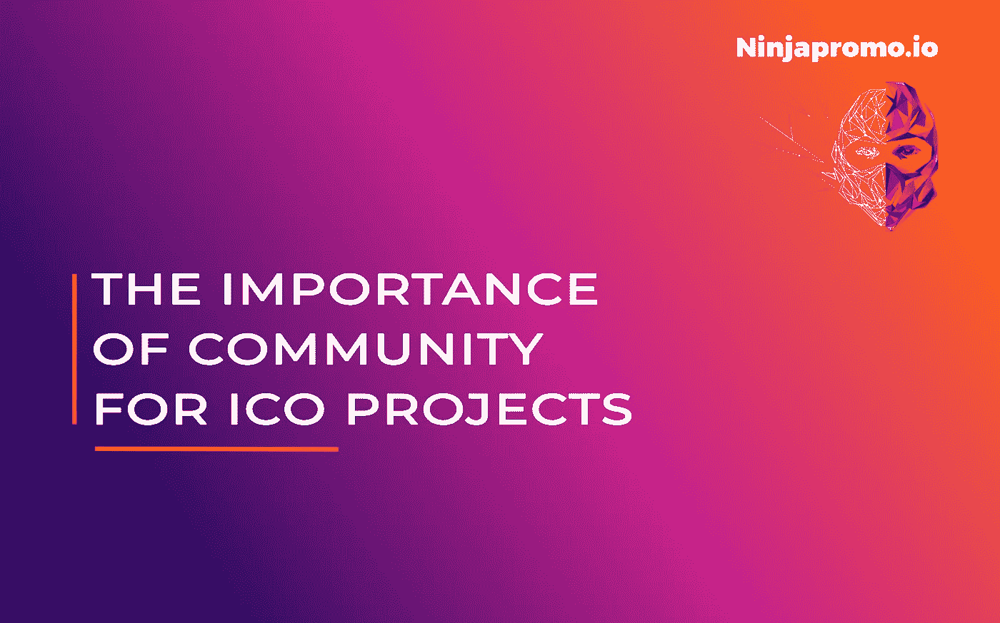

# ICO 为什么需要它的社区以及如何关注它

> 原文：<https://medium.com/hackernoon/why-crypto-community-matters-and-how-to-focus-on-it-ebd2d293c94>

在现代社会，很难低估社区的力量。被大型赞助商和传统资金来源拒绝的无数项目，被那些坚信这个想法的人拯救了，他们愿意花自己的血汗钱，只为看到它变成现实。Kickstarter 和 Patreon 等平台的成功表明，在互联网主导的世界里，社区是唯一真正需要让你的项目进行下去的东西。高瞻远瞩的区块链工业抓住了这一点，并将社区置于其核心位置。

# **密码社区发电站**

没有社区的翅膀，今天没有任何一个加密项目能够飞翔——在这一点上，拥有一个只是一个简单的要求。但是社区到底是如何影响项目开发的呢？

## **及时反馈**

老派的做事方式是在你自己的泡泡里开发一个项目，把它发布到外面的世界，收集最嘈杂的反馈，解决最突出的问题。但是观众变得挑剔，在 crypto 中，你站在你的社区的肩膀上，所以你必须考虑他们的许多意见。因此，你可以在开发过程中完善你的项目并修复它的问题，而不是等到一切都准备好了，因为你的社区可以为你找到它们——即使你不希望他们找到。

## **最佳公关工具**

良好的口碑一直是推广任何东西的最佳方式，尤其是在产品和服务的选择比以往任何时候都更加多样化的现代社会。在 crypto 中，社区已经成为公关活动中最重要的——也是最便宜的——工具之一。你的社区越大，你成功的机会就越大，并且在项目结果上超越你自己的期望。您的社区可以传播消息，接触到大多数意想不到的受众，向其他人介绍您的项目，并通过他们的支持展示项目的前景，这远比重复的广告文本更有说服力。

## **卸下你肩上的重担**

即使你认为你已经考虑到了你宝贵项目的每一个细节，在前进的道路上还有很多意想不到的转折和变化在等着你。你会有新的想法，遇到新的趋势，处理行业内的创新。因此，你将不得不做出许多新的艰难决定。你的社区可以帮助你实现这些目标。他们会指出跟随某些趋势是否值得努力，你的项目是否真的需要那些将改变世界的新特性，以及他们是否真的对你想要做出的改变感兴趣。你的社区在那里支持你，在决策过程中帮助你。

## **归属感**

由于社区从早期阶段就参与了你的 ICO 项目，并参与了与项目相关的活动，你可以清楚地看到你和你的想法是需要的。你知道你必须做什么，你是比你大得多的东西的一部分。你的目标和你的社区决定了你在世界上的位置。你的社区是你的扩展项目团队，你应该永远记得像它关心你的想法一样关心它。

# **中的方式**

**那么你如何为你的社区选择平台呢？互联网提供了几十个社交网络、论坛和聊天，主流的和特定领域的，完美的想法是涵盖所有这些，从脸书和 Twitter 这样的全球巨头到韩国 KakaoTalk 这样的本地服务，这取决于你的目标受众。但是如此大的覆盖范围需要巨大的预算和大量的人员，因为每个平台都有自己的陷阱和技巧，自己的一般情绪和公众的期望。因此，当你在财务上捉襟见肘时，你需要选择最佳方案，并倾其所有。**

> **为了最有效地管理您的社交媒体平台，无论您的预算是多少，您都需要对平台了如指掌的专家。因此，考虑像 [NinjaPromo](http://ninjapromo.io/?utm_source=medium&utm_medium=article&utm_campaign=iconeedscommunity) 这样的 ICO 数字营销机构的帮助是合理的，因为他们的直接目标和业务是基于加密相关的营销和社区管理。**

**对于与密码相关的活动，包括 ico，Telegram 已被证明是社区建设最可靠的来源之一。它以其安全性吸引人们，而基于电报的社区是其他社交媒体群体中参与度最高、反应最快的。此外，电报社区往往更具行业针对性，但仍能吸引大量受众。**

> **我们可以为您希望加入电报社区的不同受众设计和创建单独的群组，调整内容并将其翻译成 14 种语言:英语、德语、西班牙语、意大利语、法语、中文、日语、俄语、韩语、荷兰语、阿拉伯语、越南语、土耳其语和葡萄牙语。这样的团体每个可以吸引 5000 到 50000 名成员，为你提供忠诚的跨国社区来支持你的 ICO 项目。**

**主流平台(脸书、Twitter、Reddit 等。)，当然，由于其用户群的规模，看起来更有吸引力。然而，对于像 ICO 项目那样寻找特定营销的人来说，这种规模也是他们的问题。这些平台非常适合撒网，但在你用它捕捉的所有鱼中，只有几条会真正有利于你的事业。**

**基于领域和地区的平台会为你提供更挑剔和更忠诚的受众，但只关注他们会让你失去大量的潜在群体，他们会通过你的想法被吸引到密码行业，并在更深层次上相信你的项目，而不是纯粹的财务收益。这就是你需要将你的项目从其他项目中分离出来的原因。如果你不能同时出现在每一个地方，Telegram 是一个真正的中间地带，在这里抽象的商业与可能成为伟大事业一部分的真实的人相遇。**

***感谢您阅读这篇文章！如果你喜欢它，请分享它，并告诉我们你对今天 ICO 发布费用的看法。另外，你可能会喜欢我们的其他故事:***

> **[*——区块链影响者营销手册*](https://hackernoon.com/influencer-marketing-fdff540b092e)**
> 
> **[*-你忽视的事情，因为它们在营销你的加密项目时是显而易见的*](/@NinjaPromoAgency/things-you-neglect-because-they-are-obvious-while-marketing-your-crypto-project-4100cf3bef05)**
> 
> ***-* [*ICO 发布:你想法的真实价格*](/@NinjaPromoAgency/ico-launch-the-true-price-of-your-idea-52dcc61587d4)**