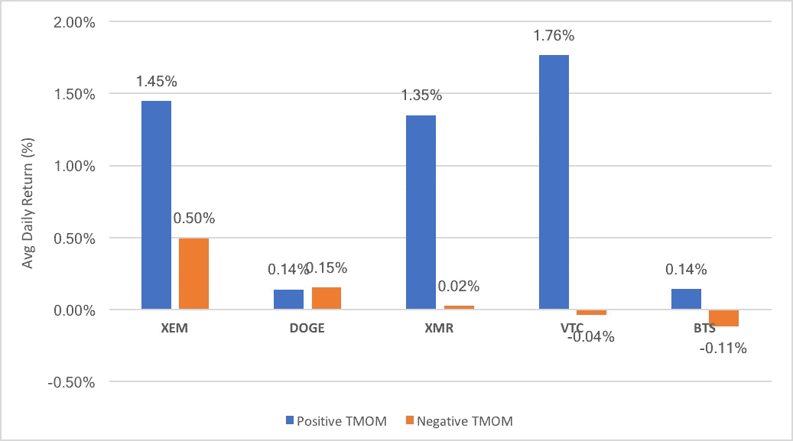

# 为什么加密投资者应该关注价格动量

> 原文：<https://medium.com/hackernoon/why-crypto-investors-should-pay-attention-to-price-momentum-aa94f00bf605>

## 加密资产价格动量的统计分析

*这是一系列文章中的第一篇，介绍如何使用量化模型帮助投资者在* [*加密*](https://hackernoon.com/tagged/crypto) *资产类别中做出投资决策，这是一个高度未开发的研究领域*

加密资产是一种新兴的资产类别，投资者对如何最好地分析、评估和交易它们知之甚少。这一资产类别的短暂历史也意味着很少有数据可以用来训练模型。这部分解释了为什么今天的大多数加密基金都是自由支配的，并且通常具有类似风险投资的投资策略。这与传统市场形成对比，在传统市场中，五家最大的对冲基金中有四家完全依靠量化系统来决定如何配置资本。

量化基金希望通过系统性地利用市场异常来获得回报。市场异常是市场中的重复模式，其中具有某些特征的资产持续产生高于平均水平的回报。这些异常现象的存在是因为市场中的某些结构性原因(如国内资本管制)或因为市场参与者的重复行为模式(如羊群行为)。

人类行为相对一致，这意味着有充分的理由相信传统的市场异常现象也将存在于加密资产领域。鉴于缺乏成熟的量化基金来判断这些异常现象，交易这些异常现象的回报理论上应该远高于传统市场。

**引入动量异常**

动量异常是市场中最广为人知的(也是最简单的)异常之一。它可以归结为:

*平均而言，过去表现优异的资产未来将继续表现优异，反之亦然。*

从高层次来看，这实质上意味着投资者应该买入过去价格上涨的资产，卖出价格下跌的资产。虽然这对许多人来说似乎违反直觉，但重要的是要理解它的存在有坚实的理由，并且异常主要存在于短期时间范围内。

**动量的理论基础**

几乎每一个资产类别都记录了动量异常。虽然可能有许多不同的原因，但我提出三个基本因素来解释它的存在:

**原因#1:信息传播和作用缓慢**

新的信息传播有一段时间的滞后，并且作用也有一段时间的滞后(毕竟，人类需要时间来处理信息)。因此，随着越来越多的市场参与者意识到这一点并采取行动，消息可能会导致股票朝着一个方向持续移动，而不是突然飙升。投资者投资的时间框架不同，因此对新信息的反应速度也不同。

**原因 2:流动性限制**

大型投资者通常受到资产流动性的限制，因此必须在很长一段时间内分散购买，以避免支付差价。这导致长时间的购买，这表现为持续的价格趋势，而不是突然的价格上涨。这也是为什么价格动量策略通常在流动性相对较低的小型资产中更有效。

**原因#3:投资者羊群效应和收益推断**

害怕错过是人类投资者行为的一个被充分记录的模式。当资产回报强劲时，市场参与者可能会产生从众心理。人类投资者在预测未来时倾向于从最近的过去进行推断，这一事实放大了这一点，这意味着最近的高回报导致对未来的乐观预测。正因为如此，价格趋势往往会成为一种自我实现的预言，即购买会带来高回报，从而导致进一步购买(至少在短期内)。

**根据经验测试加密动量**

虽然动量是一个相对简单的概念，但有许多不同的方法来分割它。我们将从最基本的动量类型开始，称为时间序列动量(TMOM)。它在一项商品期货的学术研究中得到推广，研究表明 TMOM 在所有 58 种被测试的资产中都有预测价值。

这非常简单:计算一项资产在特定时间窗内的过去回报率，并比较该资产在 TMOM 为正和为负时的后续平均回报率。理论表明，当资产处于正 TMOM 状态(即当前价格高于先前价格)时，资产的平均后续回报应该高于其为负时。

为了测试该指标的有效性，我们将计算可投资加密资产的 TMOM。我们的世界将是五种最知名的加密资产，它们具有相对较长的交易历史:[比特币](https://hackernoon.com/tagged/bitcoin)，莱特币，以太坊，Ripple 和 Dash。

为简单起见，我们将使用 10 天作为计算 TMOM 的窗口，并在每日滚动的基础上进行计算。因此，如果一项资产的每日收盘价高于 10 天前的收盘价，该项资产就被认为具有“正 TMOM”，反之亦然。然后，我们比较该资产随后 10 天的回报(计算为未来 10 天收盘价与当前收盘价的百分比差异)。实际上，需要进行更严格的回溯测试来完全充实一个异常，但是**我们在这里保持简单，只是为了方便读者而比较平均回报。**

计算 2017 年我们宇宙中的五项资产，基本汇总结果非常清楚:

当 TMOM 为正时，所有五种资产的平均回报率都高于其为负时，尽管只有三种资产的结果具有统计学意义。其中最引人注目的是 Ripple (XRP)，当过去 10 天的 TMOM 为正时，其平均日回报率为 3.7%(反之为负时为 0.6%)。在对波动性进行调整后，这些结果仍然成立，当 TMOM 为正时，夏普比率会更高。

回顾前两年(2015-2016 年)，模式是相同的，最显著的结果来自 ETH 和 LTC:

所有五种加密资产在正动量状态下相对于负动量状态下具有更高的平均回报率，这很有趣，因为 2015 年和 2016 年的市场环境与 2017 年大不相同。在 TMOM 为负的这段时间里，LTC 和 XRP 实际上有负的日收益。

再往前追溯到 2013 年和 2014 年，除了比特币和莱特币，我们失去了宇宙的大部分。然而，这一结果仍然有效，当这两种资产势头良好时，它们的平均回报率要高得多。同样，考虑到当时的市场环境是多么的不同，这种情况很有意思。

这种模式也适用于其他加密资产。例如，以下是 2017 年对另外五种知名加密资产(NEM、Dogecoin、Monero、Vertcoin 和 Bitshares)进行测试的结果:

除了 Vertcoin 之外，其他四种资产在正 TMOM 状态下的平均日回报率要高得多。特别是，NEM 和 Bitshares 似乎主要是由动量驱动的，正负 TMOM 状态之间的平均日回报率差为+2.5%。

当展望 2015-2016 年时，这些结果在该群组中重复出现:

同样，所有五种资产在正 TMOM 期后的平均后续回报率都高于负 TMOM 期。特别是，在负 TMOM 期之后的 10 天内，Vertcoin 和 Bitshares 的平均回报实际上都是负的。

**结论**

尽管这些回溯测试过于简化，但其中一些资产的正负 TMOM 状态之间的回报率差异之大令人震惊。结果的一致性也令人惊讶，几乎所有接受测试的资产在短期动量为正时，平均日回报率都高于动量为负时。

信息很清楚，期望加密资产的短期回报反映其最近的回报。换句话说，从短期来看，在强势时买入，在弱势时卖出，这在历史上更有利可图。

考虑到加密市场的低效率和相对成熟的市场中动量的持续，动量是严肃的市场参与者需要注意的事情。即使对长期投资者来说也是如此，因为他们可以利用动量来更好地选择进场和出场点，并改善他们的风险管理。

最后，考虑到时间序列动量是如此简单，动量的更高级版本可能会对资产价格有更好的预测。这将是以下报告的主题。