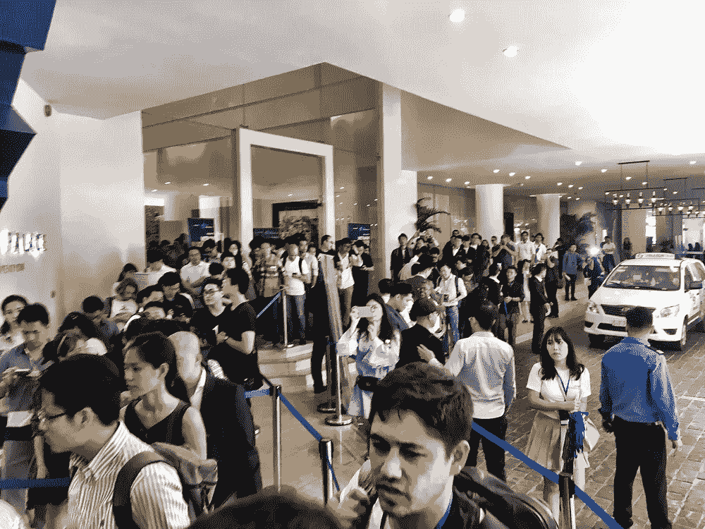
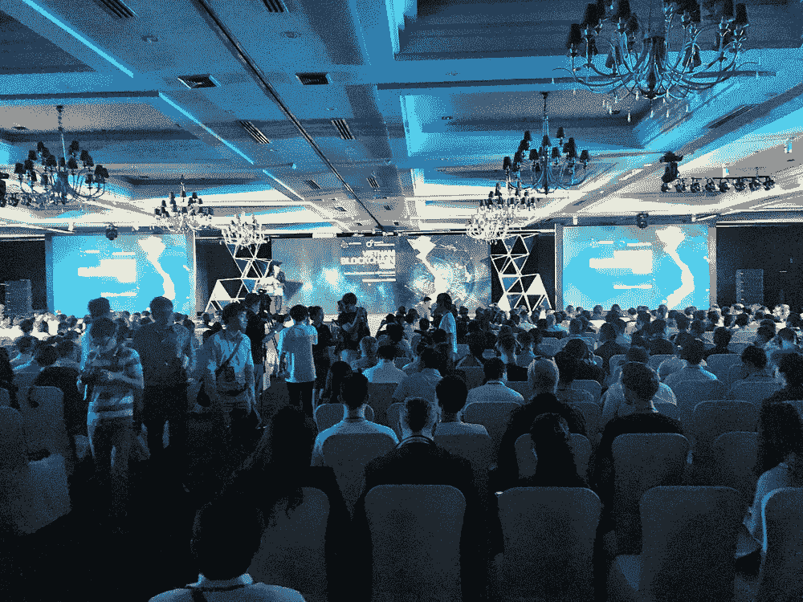

# 为什么加密货币不会消亡

> 原文：<https://medium.com/hackernoon/why-cryptocurrency-will-not-die-fb7139227ae5>

*而推动下一轮改革的集团将会让华尔街大吃一惊*

华尔街和杰米·戴蒙(Jamie Dimon)和沃伦·巴菲特(Warren Buffet)等所谓的专业人士不断向主流人士表示，加密是一种泡沫、时尚、骗局等。他们越是沿着这条路走，越多的秘密就会增长。原因是这些家伙生活在自己的泡泡里，不知道地面上发生了什么。如果他们冒险去新兴市场，他们会发现自己大错特错。

我刚刚在胡志明市参加了[越南区块链周](https://twitter.com/matmichalko/status/971574956399067136)，参加了一些小组讨论。当我早上出现的时候，有一大群人在等着进去。出租车和优步游乐设施不断吸引着与会者。然后我走上楼，早上 9 点的时候，这个地方已经很拥挤了。有多个房间和翻译耳机，让所有越南人都能听懂英语演讲者在说什么。这一切都是专业完成的，旨在激发灵感。我心想，

> “这是亚洲的一个城市。看看这里所有的人都在学习区块链和加密。”

这进一步证实了我到目前为止在 ICO 的最后阶段一直在完善的一个论点。第一波购买密码的人是早期的狂热爱好者，他们很早就购买了密码，度过了低迷时期(HODL！)，获得了收益，并用他们的资金推动了我们当前的一波区块链项目。但下一波是来自新兴市场的人。在我们建立社区的过程中，我学到了这一点，并与他们进行了接触。我们的 KYC 阶段显示了所有地区，我看到了来自发展中国家的人注册的趋势。

这一切都说得通。这些群体被挡在房地产之外，不能购买股票，而且将资金投入共同基金给他们带来的回报很少。但历史表明，新兴市场的人们更具创业精神，会找到自己的道路。**现在他们将加密视为提高生活水平的途径。**公众谈论亚洲发达国家的加入——中国、日本、韩国、新加坡；但是现在它开始在印度尼西亚、马来西亚、台湾流行起来，就像我刚刚在越南看到的那样。

去这些国家和他们的城市，我可以直接和他们交谈，许多人走过来说他们喜欢我们的项目，是我们的忠实粉丝。此外，他们还会问自己能做些什么来帮助传播信息。我了解到，他们不仅仅是象征性的购买者，他们觉得自己是某件大事的一部分。这对于所有代币购买者都是一样的，不管他们来自哪里。他们都是密码社区的一部分，多年后他们想说他们帮助建立了像 Bluzelle up 这样的公司。

有趣的是，在我从胡志明市回来的飞机上，我听了世界著名物理学家加来道雄作为嘉宾的“大思考”播客。**他提出财富的产生来自科技。**我们刚刚经历了由互联网引领的第三次技术浪潮。但是在美国，只有 30%的人的生活得到了改善。其余 70%保持不变或倒退。因此出现了反弹，人们想知道会发生什么变化。Kaku 接着说，第四次浪潮将改变事物，创造新的财富，并将是生物技术、纳米技术和人工智能的结合。我不同意。这三件事将需要创造产品，新的商业模式，这将需要时间来间接给人们带来收益。这一比例仍可能只有 30%。区块链/加密货币是目前唯一能够直接为以前被排除在外的更广泛的群体创造财富的技术。

所以我说，让华尔街和他们的常青藤联盟去说他们想说的吧，我们知道到底发生了什么。**引用吉尔·斯科特-赫伦的话，“** [**革命不会被电视转播，它将被直播**](https://www.youtube.com/watch?v=qGaoXAwl9kw) **！”**