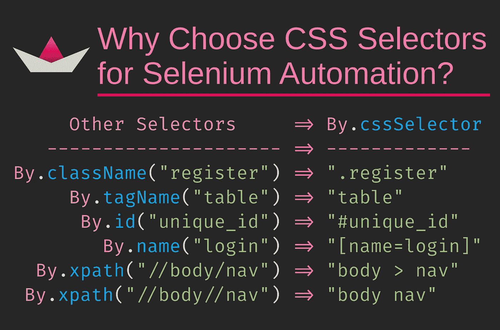

# 为什么 CSS 选择器是最有用的 Selenium WebDriver 定位器？

> 原文：<https://medium.com/hackernoon/why-css-selectors-are-the-most-useful-selenium-webdriver-locators-28082be1cd3b>

当前端开发人员需要在网页上定位元素时，他们使用 CSS 选择器！为什么不支持 selenium webdriver 自动化？



image created via carbon.now.sh

Selenium Web 驱动程序自动化中使用了各种各样的定位器。当你问“你经常使用的定位器是什么，为什么？”时，CSS 选择器排在最后

**XPath** 是最适合所有解决方案的解决方案。即使有合适的`id`可用，也有使用`XPath`的趋势。

通常，缺乏对 CSS 选择器的了解也会驱使他们选择其他选项。人们提到，他们能够用其他选择器完成这项工作。很公平，没有造成伤害。

# 为什么一定要关注 CSS 选择器？

回答这个问题。当你想在墙上钉钉子时，你会用砖头、鹅卵石还是锤子？

砖和鹅卵石可以做这项工作。但是，**锤子**是这项工作的工具。

就像这样，有很多方法可以识别 HTML 文档/DOM 中的元素。但是 CSS 选择器是这项工作的工具。他们有一个浏览器需要遵循的[规范](https://www.w3.org/TR/selectors-3/)

如果你是一个从事 UI 自动化的自动化工程师，花时间学习 CSS 选择器(通读文章的其余部分怎么样？).你将获得更多的好处。

我能听到你的问题:“但是，复制 XPath 太容易了。CSS 选择器怎么样？”相信我，在许多浏览器中，选项就在`Copy XPath`旁边。你会发现`Copy CSS Selector`或`Copy Selector`。

你知道为什么吗？因为前端开发人员甚至在测试之前就使用 CSS 选择器来应用网页的视觉效果和行为。

# 为什么发明 CSS 选择器？

你有没有想过为什么那些类和 id 都在那里？你有没有问过任何人，我需要在这些元素中包含一些 ID/类，以便我可以对这个 UI 进行自动化测试？

如果不是你，那么谁要求这些属性？

这个故事可以追溯到样式被添加到 HTML 文档的时代。这是在 UI 测试自动化之前。每个浏览器都有自己的文档样式。文档(HTML)作者无法控制他们的文档如何呈现给读者。作者需要一种方法来定位标签和应用样式，以达到他们想要的布局。[hkon Wium Lie](https://www.w3.org/Style/CSS20/history.html)提出了现在流行的层叠风格语言。

CSS 工作组正式指定了针对特定元素的选择器。浏览器开发人员将该规范作为需求，构建支持 CSS 的浏览器。

像`id`和`class`这样的属性被作为钩子添加到特定的元素中。它们帮助前端开发人员设计样式并将行为附加到元素上。**自动化工程师可以搭载**相同的条款，CSS 选择器，来识别元素。

# CSS 选择器是如何使用的？

要设计元素的样式，前端开发人员需要首先找到元素，然后应用样式规则。

看起来是这样的:

```
#logo{ color: white; background: black; }
```

那个 CSS 片段说，将`color`和`background`样式应用到任何 ID 为`logo`的元素。通常，ID 在任何精心制作的 HTML 文档中都是唯一的。但是在同一个页面上工作的多个开发人员有可能对不同的元素使用同一个 ID。大多数时候，在不知道它已经被使用的情况下。不要担心，他们最终会发现这个错误，但关键是浏览器不会发出警告。当你发现这样的场景时，你应该告诉开发者。

想要尝试一下`logo`的 JavaScript 开发人员编写如下代码:

```
let element=document.querySelector("#logo"); 
rotate(element);
```

不要管`rotate`的实现，只看第一行。`document.querySelector`是一个本地 API，可用于在浏览器中选择元素。…它采用 CSS 选择器语法。

事实上，您可以在 **JavascriptExecutor** 中使用它。

由于前端开发人员使用 CSS 选择器来定位元素(或者样式化它们/修改元素/将行为附加到元素)，UI 测试自动化工程师也使用相同的 API 来定位元素是有意义的。

深信不疑？这里是一个由 CSS 选择器替换的不同选择器的预览。

```
Other Selectors          => By.cssSelector 
------------------------ => -------------- 
By.className("register") => ".register" 
By.tagName("table")      => "table" 
By.id("unique_id")       => "#unique_id" 
By.name("login")         => "[name=login]" 
By.xpath("//body/nav")   => "body > nav" 
By.xpath("//body//nav")  => "body nav"
```

# 四个选择器

让我们从原始选择器开始。你只需要掌握 4 种，这是最简单的部分。

## id 的散列值`#`

任何具有特定 ID 的元素都可以使用`By.cssSelector`定位，方法是在 ID 前面加上一个散列`#`。

例如:

```
By.cssSelector("#logout")
```

`#logout`将帮助您定位 ID 值为`logout`的元素。标签名是什么并不重要。它可能是一个链接或按钮，但`cssSelector`找到了它。

通常，ID 是唯一的。这是一个公平的假设，通常有一个。假设可能会出错。二十个开发人员在一个非常繁忙的 UI 上工作，最终可能会将同一个 ID 放在两个不同的元素上。所以，如果你想把它和一个标签配对，你可以这样做。将标签名称放在 ID 前面。

```
By.cssSelector("a#logout")
```

这个选择器更加具体。它说，*找到一个 ID 值为* `*logout*`的锚标签(一个链接)。

## 点`.`为类

现在我们知道了如何处理 id，通过类名定位元素只会比以前更容易。

您需要在类名前面加一个点`.`来查找包含这样一个类的元素。

过期示例:

```
By.cssSelector(".btn_red")
```

这将是一个红色按钮(如果开发人员添加了相关的样式)，但我们不要担心这个。该选择器将使用类`btn_red`来标识一个元素。如果找到多个元素，则返回第一个元素。

如果你想把标签名和类名结合起来。

```
By.cssSelector("a.btn_red")
```

这很有道理，不是吗？

## 标签保持不变

现在，这个更简单。如果您想使用特定元素的标记名来定位它，该怎么办呢？**无前缀，无后缀**。只要标签名就可以了。

这将为您提供页面上的第一个表格。

## `[attr]`为属性

四个中的最后一个选择器。这完全基于元素中的属性。HTML 元素倾向于拥有诸如`id`、`name`、`class`、`type`、`src`、`href`、`alt`等属性，并且在`data-`前缀下还有更多属性。

如果您知道元素的属性是唯一可识别的，那么所有这些属性都可以用来识别元素。

这里有一个例子:

```

```

定位器可以是以下任何一种:

```
By.cssSelector("[src]") 
By.cssSelector("[src=logo.png]") 
By.cssSelector("img[src=logo.png]")
By.cssSelector("img.top[src=logo.png]"
```

*   第一个标识所有具有`src`属性的元素
*   第二个通过具有特定值的`src`属性定位
*   第三种使用标签名称、属性及其值
*   第四种使用标签名、类名、属性和特定值

它们都有各自不同的特点。最后一个很具体，第一个很笼统。

也可以为属性值指定条件，如`starts with`、`ends with`或`contains`。

几个例子:

首先是 html:

```
<input type="text" class="form_text">
<input type="email" class="form_email"> 
<input type="radio" class="form_radio">
```

和一些使用属性的定位器:

By.cssSelector 描述`"input[type*=form]"`输入元素的类型属性中包含文本`form`的值`"input[type^=form]"`输入元素的类型属性以`form`开头`"input[type$=radio]"`输入元素的类型属性以`radio`结尾

# 四个组合子

我们看到了四种不同的选择器，它们构成了 CSS 选择器家族的基础。我们现在来看看赋予 CSS 选择器特殊能力的四个组合子。

## 加`+`为相邻兄弟

如果想要选择另一个元素之后的元素，可以使用带有加号的相邻兄弟组合符`+`。

让我们建立一些样本 HTML:

```
<div id='profile'> 
   
  <h1>Mr.Neo</h1> 
  <p>The one</p>
</div>
```

如果您想要选择紧接在`img`标签之后的所有`h1`标签，您可以使用以下命令:

```
By.cssSelector('img + h1')
```

如果您想选择跟在`h1`标签后面的所有`p`标签，这将有所帮助:

选择的是最右边的元素。例如，当使用`h1 + p`时，选择`p`元素。`h1`有没有当配角。

最后，如果您想从前面的 HTML 片段中选择`img`标记，该怎么办？精神食粮。

## 通用同级的颚化符`~`

我们看到了 plus `+`的功能。如果您想检查一个元素是否是另一个元素的兄弟，而不一定是直接兄弟，该怎么办？

这就是一般的兄弟组合子来拯救的地方。它使用颚化符`~`符号来表示一般的兄弟。

让我们设置一个显示您的姓名和照片的 HTML 片段:

```
<div> 
  <h1> Your name!</h1> 
   
   
   
</div>
```

如果您想访问所有与`h1`标签同级的图像，您可以使用通用同级组合符。如果只有一个`img`，你就会得到那个。

```
By.cssSelector('h1 ~ img')
```

在这种情况下，`img`标签是否紧跟在`h1`后面并不重要。重要的是，它们都有相同的父标签，并且`img`标签是`h1`的兄弟标签。

如果用`img ~ img`呢？你会得到最后两个。去想想。

顺便说一句，你最亲爱的`xpath`给了你一个通过特殊函数按兄弟获取元素的方法:

```
By.xpath("//img/following-sibling::h1")
```

## 儿童角码`>`

兄弟姐妹都很好。但是现在孩子们开始哭了。让我们关注他们。这些也是广泛使用的组合子。您可以使用右尖括号`>`符号定位父元素的直接子元素。

我们可以重用一些早期的 HTML 片段:

```
<div id='profile'>
  
  <h1>Mr.Neo</h1>
  <p>The one</p> <div id='crew'>
    
    <h2>Mr. Morpheus</h2>
    <p>The other one</p>
  </div>
</div>
```

使用以下选项可以找到所有三个元素:

```
By.cssSelector('#profile > img')
By.cssSelector('#profile > h1')
By.cssSelector('#profile > p')
```

这些选择器不在`crew`部分内定位`img`或`p`标签。因为他们不是`#profile`元素的直系子孙。他们是后代，但不是孩子。

## 后代的空间

我们现在来看第四个也是最后一个组合子，后代组合子由一个空格表示。

让我们使用相同的 HTML:

```
<div id='profile'>
  
  <h1>Mr.Neo</h1>
  <p>The one</p>

  <div id='crew'> 
     
    <h2>Mr. Morpheus</h2> 
    <p>The other one</p> 
  </div> 
</div>
```

事情是这样的:

定位器描述`#profile img`锁定两个`img`标签`#profile h1`锁定唯一的`h1`标签`#profile h2`锁定唯一的`h2`标签`#profile p`锁定两个`p`标签

你看到区别了。Descendant combinator 选择所有匹配的标签，只要它们是给定的父元素的后代。

一个小小的空格就有这么多的意义！

# 24 个伪类

大概有 24 个伪类可以帮到你。你可以在[的说明书](https://www.w3.org/TR/selectors-3/#pseudo-classes)中找到它们。但是，我们会看四个来激起你的兴趣。

## :不是

这一条是否定你到目前为止所学的一切。没有底片会怎样？假设您想要将一个没有特定类/id/属性的元素作为目标。会来帮助你的。

HTML:

```
<input type="text" class="required" />
<input type="text" class="required"/>
<input type="text">
<input type="radio">
<input type="email">
```

如果你想定位一个非强制的输入框(可以说它没有类`required`):

```
By.cssSelector('input:not(.required)')
```

如果您想选择所有非`email`类型的输入，那么`'input:not([type=email])'`也可以。

你也可以把它们链接起来，就像这样:`input:not([type=radio]).not(.required)`。这将为您提供所有不是单选按钮并且没有类`required`的输入。在这种情况下，那只是一个`text`型和另一个`email`型输入。

## :第 n 个孩子

这有助于您根据特定元素的位置来定位它。

```
<div id='profile'> 
  <h1>Name</h1>  
   
  <p>Summary...</p> 
  <p>Details...</p> 
  <p>Conclusion...</p> 
</div>
```

记住前面章节中的子选择器。我们要用它。你怎么说，“给我找个人资料里的第二个孩子”。`#profile > *:nth-child(2)`会的。`*`表示任何标签，`nth-child`根据你给的号码查找特定的孩子。

你可以使用正确的标签名来代替`*`，比如`#profile > img:nth-child(2)`。当标记名不匹配时，您需要小心。如果使用不存在的标记名，将不会选择任何元素。例如，`#profile > h1:nth-child(2)`返回 nothing，因为第二个子标签不是`h1`标签。

`:nth-child`像数字一样接受输入，`odd`，`even`和`3n+2`。你可以从第二个元素开始，每三个元素读一次`3n+2`。MDN 将其定义为`An+B`。这更多地用于样式元素。可能不太适合测试自动化。让我们把它放在那里。

还有一个是得到一个倒数第二的元素:**:n-last-child**。例如，`#profile > *:nth-last-child(1)`将给出最后一个子元素，也就是文本为“结论…”的`p`标签。该规范将`:last-child`作为一个伪类，会给你类似的结果。

我让你猜猜第一个孩子会回来。

## :第 n 种类型

当`nth-child`考虑所有孩子时，`nth-of-type`只考虑标签类型。让我们使用同一段代码。

```
<div id='profile'>
  <h1>Name</h1>
  
  
  <p>Summary...</p>
  <p>Details...</p>
  <p>Conclusion...</p>
</div>
```

我们已经看到，`#profile > img:nth-child(1)`将不返回任何内容，因为第一个孩子是`h1`，但是`#profile > img:nth-of-type(1)`返回第一个图像。该规范还有一个简称为`:first-of-type`的东西。

你是怎么从下往上数的(逆序)？是的，**:n-last-of-type**会来帮你。您还可以使用 **:last-of-type** 来获取指定类型的最底层子元素。

## :已禁用

我们要看的最后一个伪类是`:disabled`。当您查找一个被禁用或启用的特定元素时，这很方便。事实上，[规范](https://www.w3.org/TR/selectors-3/#pseudo-classes)有类似`:enabled`、`:checked`等伪类供你使用。

# 为 Xpath 辩护

> *知道 CSS 选择器然后选择 XPath 作为解决方案，和不知道 CSS 选择器选择 XPath 是不一样的。*

最后一句话，如果你一直在使用`XPath`，不要气馁。到现在为止，你应该已经看到它们在本质上非常相似。它们各有利弊。`cssSelectors`运行良好，因为它们是浏览器的原生程序。`XPath`在某些情况下更具可读性。只要能完成工作就可以了。其中之一使你的代码可读？去吧。比另一个表现好，选择那个。只是不要限制你的选择。

根据我的经验，测试自动化工程师开始普遍使用`XPath`。因此，本文将为`cssSelectors`添加一个配重，以便天平与`XPath`保持平衡。事实上，jQuery 的创建者 John Resig 曾经写过这样一个对比，展示 xPath 有多强大(几年前)。

参考

*   尝试这个晚餐游戏来练习。
*   [官方规格三级](https://www.w3.org/TR/selectors-3/)
*   [正式草案四级](https://drafts.csswg.org/selectors-4/)
*   [永远友好的 MDN 参考](https://developer.mozilla.org/en-US/docs/Web/CSS/CSS_Selectors)

好吧！谢谢你的时间。你觉得这有用吗？用你的掌声让我知道。

*原载于*[*www . pine boat . in*](https://www.pineboat.in/post/css-selectors-selenium-webdriver-find-element-xpath-replaced/)*。你应该* [*在这里订阅*](http://eepurl.com/cYynNv) *，等我写了新的东西会让你知道。如果你是* [*回到 RSS 源*](https://www.pineboat.in/index.xml) *，你就有保障了。*