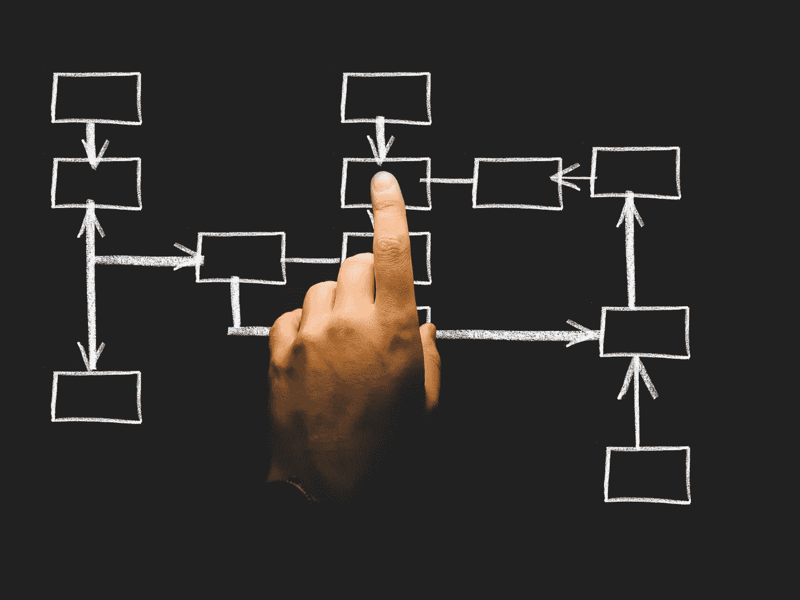

# 为什么定制解决方案比现成的企业解决方案更有效

> 原文：<https://medium.com/hackernoon/why-custom-solutions-work-better-than-off-the-shelf-solutions-for-businesses-e8d94f23f97>

真正的商业问题需要价格合理的定制解决方案。投资相关技术以做出明智决策和自动化手动任务的企业总是见证显著的底线增长。市场有许多资源可以提供所需的解决方案。然而，每个解决方案的设计都考虑到了整个行业或行业集合的需求。这些产品具有许多特性和功能。另一方面，企业的需求通常非常具体。他们通常利用提供商提供的有限数量的功能。太多的功能很难提高效率。

举个例子，一个大型连锁百货商店需要一个广泛的 CRM 软件来跟踪其众多客户的使用模式。另一方面，CRM 需要一个私人的现购自运商店，仅限于管理联系方式和电子邮件集成。在这种情况下，购买相同的软件并支付相同的价格将是不公平和低效的。

显然，最好的解决方案是为你实际使用的东西付费，而不是软件提供的所有东西。

# 定制解决方案

一些软件设计师提供策划解决方案，以迎合客户的特定需求。他们理解手头的业务问题，重组他们的产品，并交付客户可以实际使用的解决方案。当商业利益以这种方式一致时，最终用户的喜悦就成为可能。随着云计算的普及，一些提供商提供直观的现成的基于云的按需付费解决方案。企业必须确保他们知道如何定制这些解决方案来满足自己的需求。实际解决问题的简单解决方案比不能解决问题的花哨软件更有价值。它们将满足客户的期望，并具有实际有用的功能。这将使工作变得容易，并为组织注入灵活性。归根结底，这正是用户想要的。

# 数据训练

在人工智能领域，数据为王。一个解决方案有多好将取决于它所训练的数据类型。它的“预测能力”直接受到“它知道什么”的影响。训练解决方案的数据的性质决定了解决方案的好坏。显然，现成的解决方案是利用公共领域的可用数据制定的。这样的数据是通用的。根据通用数据训练的解决方案的结果对于企业的特定需求没有用处。然而，有相当多的基于人工智能的开发人员在客户端的数据上训练算法。例如，如果优步希望使用人工智能来洞察不满用户的推文，他们就会希望有一种能够理解反馈相关短语的解决方案，如“应用程序很粗糙”、“等了 30 分钟”、“司机不接受现金”等。定制解决方案提供商将专门为客户训练反馈相关数据的算法。

# 支持

投资一个软件很大一部分是集成的过程。为了使集成过程成功，每一步都需要供应商的支持。一个好的支持服务对带来满意的客户大有帮助，从而带来乐观的底线。对于定制解决方案，最好的部分是良好的客户支持服务从一开始就是供应商的目标。整个解决方案旨在满足客户的需求。这使得供应商不可避免地要安排一个专门的团队来确保无缝集成。在这种情况下，客户会发现很容易解决他们的问题，因为帮助将随时可用。这个特性对于定制软件提供商来说是非常特别的，对于他们的客户来说也是一大福音。

# ParallelDots 在定制解决方案领域的领先地位

ParallelDots 的企业服务团队已经成功地跨领域、跨行业部署了 AI 项目。作为深度学习和 NLP 领域的领导者，我们正在将人工智能带到您的指尖。ParallelDots 企业服务的各种功能:

## 非凡的数据科学家团队

ParallelDots 数据科学团队汇集了全国各地最优秀的技术人员。还有一个专门的团队负责数据标记。这样做的目的是构建专有数据，无论客户何时加入，都可以随时使用这些数据。

## 专门的客户成功经理

其目的是提供真正帮助客户简化工作的解决方案。为此，一个由客户成功经理组成的专门团队将确保从集成到试点再到部署，所有流程都能顺利进行。

## 经济高效的解决方案

产品的定位是经济高效的，定价政策是“随用随付”。用户只需为超出空闲层配额的超额使用付费。重点是使产品价格合理且一流。

## 数据隐私至上

客户数据的隐私被列为重中之重。所有用于训练算法的数据都是专有的和许可的。越来越多的数据不断被生成和标记，供不同的客户端使用。

# 最值得信赖的人

包括 ITC 在内的各大快消品巨头目前都在使用 [Karna。](https://www.karna.ai/)[公司的市场研究产品 AI](https://www.paralleldots.com/) 帮助公司自动化人工任务，并从他们的数据中获得有价值的见解。

当谈到寻找合适的定制解决方案时，定制软件开发有很多好处值得考虑。对你的公司来说是正确的选择吗？只有你能决定。但是，如果我们列出的任何原因在您的脑海中成为您需要的东西，我们相信您的业务有很大的机会通过利用定制软件开发来改进和继续前进。

如果您想探索或了解定制解决方案，请在此填写表格[或发送邮件至 contact@paralleldots.com。我们很乐意帮助你！](https://www.paralleldots.com/contact-us)

阅读更多关于最近推出的 Google Sheets 插件的信息，满足你所有的文本分析需求[点击这里](https://blog.paralleldots.com/product/announcing-google-sheets-add-on-for-paralleldots-apis/)。

我们希望你喜欢这篇文章。请[注册](http://user.apis.paralleldots.com/signing-up?utm_source=blog&utm_medium=chat&utm_campaign=paralleldots_blog)一个免费的 ParallelDots 账户，开始你的 AI 之旅。你也可以在这里查看 PrallelDots AI API[的演示。](https://www.paralleldots.com/ai-apis)

这篇文章是经作者许可后发表的。这里可以阅读原文[。](https://blog.paralleldots.com/data-science/artificial-intelligence/difference-between-custom-solutions-and-off-the-shelf-solutions/)