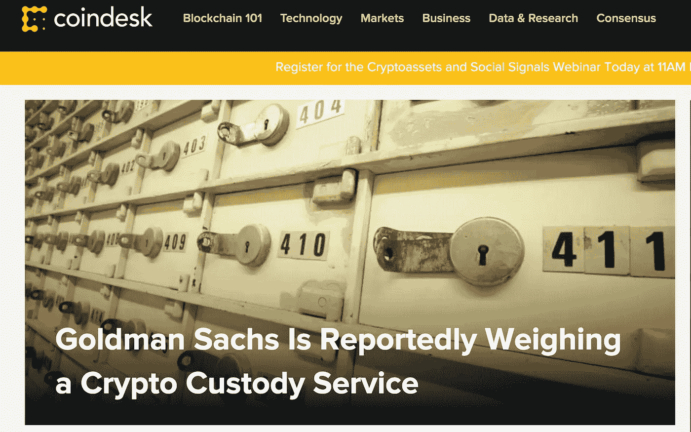
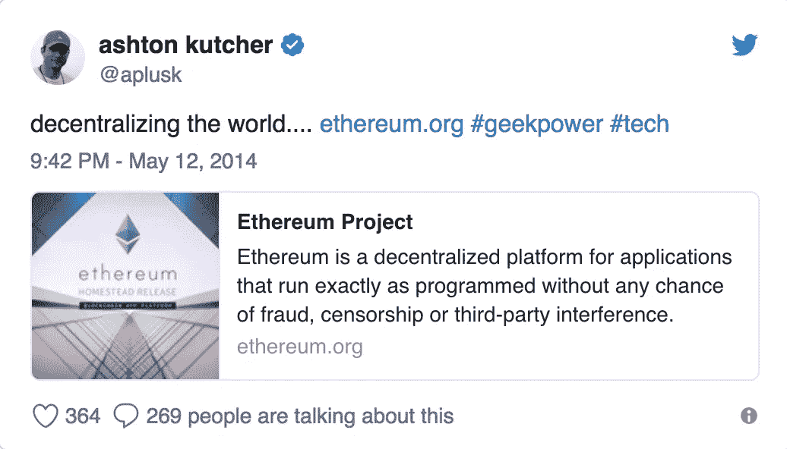
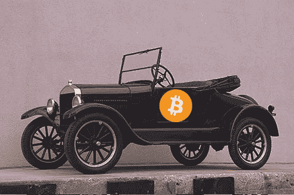

# 为什么密码不会被忽视很久

> 原文：<https://medium.com/hackernoon/why-cyptocurrencies-wont-be-irrelevant-for-long-ec9ccb7d1286>

## 很容易看出区块链的潜力，但不要太快怀疑加密货币

*向我和 Eden Labs 团队询问关于我们* [***电报组***](https://t.me/joinchat/HUw4-U91YX_979g4ki1B3g) *的问题，并接收更新、分析和研究见解。*

在 DLT(分布式账本技术)行业中，除了“Ripple 是一个骗局”之外，你最常遇到的一句话是“我相信区块链，而不是加密货币。”最终，表达这种观点的人没有错；他们只是过分简化了手头的事情。这句话为什么被如此滥用是可以理解的。我甚至承认，我已经成为这个理论家的受害者。**这是很容易的反应。**在当今世界，人们总是急于指出与比特币等数字货币相关的无数障碍、风险和陷阱，通过偏转做出反应总是最容易的。

关于为什么比特币和加密货币目前不相关，有太多有效的论点。政府可能会通过监管进行打击。网络效率低下。采用的障碍是巨大的。另一方面，区块链是金童；这是简单的重定向。政府不会针对区块链，因为他们将使用区块链！每隔一天，就会有另一家财富 500 强公司或数十亿美元的对冲基金宣布有意涉足区块链或数字资产行业。DLT 是围绕集中式数据管理的信任问题的解决方案，是困扰物联网行业的问题的简单答案。老实说，区块链有什么不能做的？

这也是一个不错的论点。今天对数字货币的关注是不幸的。只有当话题从比特币和简单的价值交换转移到可编程信任模型、去中心化生态系统、数据完整性保护和去中心化计算资源的更大含义时，我们才会在为 DLT 开发*实际的、真正的*应用程序方面取得重大进展。争论的焦点无疑是在 [*加密货币*](https://hackernoon.com/tagged/cryptocurrency) 而不是*区块链。因此，重新引导对话的确是一种高尚的努力。*

但事实是，争论不是非黑即白的。这不是比特币对以太坊——加密货币对区块链。我们不应该这么快就怀疑数字货币的影响和潜力。他们需要成为争论的一部分，因为他们是由区块链促成的不可思议的成就。人们实际上应该说，“我相信区块链，但不相信加密货币……*然而*”

> **如今*加密货币在*已经没有必要了。**

加密货币是 DLT 的众多潜在实施领域之一，而且可能是最重要的领域之一。为了理解为什么数字货币有朝一日会成为全球交易的标准价值，我们必须首先研究为什么今天数字货币面临如此大的负面影响。这个问题通常会被引用为缺乏流动性、监管打击、资本利得税、高成本、低效技术、使用障碍以及一系列其他问题。但这些并不是加密货币没有被真正采用的真正原因——它们更像是引入一种新的价值交换形式的早期尝试的症状。

不难想象，人类历史上第一个价值交换手段也面临着类似的症状。携带贝壳的部落希望与交易木材的外国部落进行贸易，他们需要考虑上述许多问题。频繁地重新计算交换价值的需要会导致不稳定和低效的交换手段。流动性也可能很难获得。如果其他人自己在访问 shell 时遇到困难，那么说服他们采用 shell 肯定会很困难。

> “我相信区块链，而不是加密货币，”这是一个简单的回答。

困扰早期价值交换的大部分复杂问题都可以通过后来被广泛接受的使用来解决，原因与大规模采用加密货币可以解决大部分相关问题一样。广泛的用户基础、巨大的交易量和合理的交易速度可能会弥补流动性不足带来的大部分波动和问题。政府监管将反映全球对数字货币的需求，此外，如果加密货币像美元一样波动，而不是像目前的 30%波动，如何对加密货币征税的问题将变得不那么相关。随着需求的增长，克服采用障碍的解决方案肯定会出现。

今天加密货币还没有被采用的原因是因为这个世界还不需要它们。Visa、MasterCard 和 PayPal 在很大程度上弥补了现金的困难。对于一个商业是物理、店内交易和在线、数字互动的混合体的世界来说，它们是不错的解决方案。他们有相关的现金返还津贴和免费墨西哥之旅。[这篇文章](https://hackernoon.com/ten-years-in-nobody-has-come-up-with-a-use-case-for-blockchain-ee98c180100)很好地总结了这一论点([凯·斯廷奇科姆](https://medium.com/u/8eb7fc2c06cb?source=post_page-----ec9ccb7d1286--------------------------------))。他们有很好的安全特性和方便的应用程序和功能，甚至还有名人推广。随着我们的世界变得越来越全球化，汇率当然会带来不便，但国际卡和零外汇交易费在很大程度上解决了这个问题——也许对行业来说不是——但对消费者来说肯定是这样。在一个你跳上车，开车去杂货店，自己购物，然后开车回家的世界里，加密货币并没有真正的一席之地。当合同由律师执行，几乎所有资产都以实物形式存在时，你并不真的需要加密货币。

**如今，加密货币不再是必要的*。但是他们很快就会。当我们的世界被物联网、自动化交互、无人驾驶汽车、无人机送货、数字收藏品和完全数字交互所主导时，加密货币将会有一席之地。当供应链的运作几乎不依赖于人类的汗水，亚马逊将杂货从无人仓库直接送到商店时，我们将重新思考我们交换价值的方式。***

*认为信用卡将继续被用作连接我们的纸质美元和数字世界的低效、昂贵和集中的支付桥梁是不合逻辑的。为什么，如果我抵押数字资产以换取数字货币，我需要美国运通卡吗？**为什么我的无人驾驶汽车需要在自动加油站用*美元支付汽油费？*** 这是一个会很快被消除的摩擦级别。*

**

*这并不是说现金将很快变得无关紧要，尽管我确实认为它最终会变得无关紧要。集中货币和分散货币仍有可能结合使用。中央集权的货币将由中央集权的实体控制——政府、公司、连锁餐馆。它们将取代现金，但操作方式与今天的信用卡和借记卡非常相似。但是也可能会有一些分散的货币——可以在世界范围内使用。我不会惊讶地发现，分散的货币最终取代了集中的货币，一张有价值的纸的概念成了一个笑话。但实际上，这可能是几十年后的事了。中央集权的货币赋予政府的权力不会轻易被放弃，事实上，如果没有中央集权的交换手段，我们的社会可能无法运转。或许，这可能是 DLT 支持者最不切实际的梦想，分散化的货币可能会削弱单个国家的权力，并有朝一日让我们走向更加全球化的人口。*

*物联网、高级人工智能和真正的数字资产将以 Keurig 咖啡壶和智能电视永远无法实现的方式创造对数字货币的需求。我们才刚刚开始向数字化迈进，但它就要来了。到那时，你的银行账户里就不仅仅是美元了。*

*如果这意味着你应该把辛苦挣来的薪水花在比特币上……**我不知道**。数字货币的影响和潜力是显而易见的。但很明显，我们还处在游戏的早期。这个世界还没有为他们做好准备。今天的任何数字货币都像是汽车的第一次实现。效果不是很好。它经常坏*，它很贵*，*使用和*修理*需要广泛的技术和机械知识。老实说，使用马可能更容易和简单，即使马有明显的缺点。但是正如亨利·福特所说，“如果我问人们他们想要什么，他们会说更快的马。”**

> ****今天加密货币还没有被采用的原因是因为这个世界还不需要它们。****

**但是人们购买第一辆汽车是因为它们新颖——它们是幻想家的作品。是的，有些机械在整个世纪都幸存了下来，但是在今天的柏油路上滑行的汽车和它们早期的同类没有什么相似之处。比特币似乎与早期的汽车模型有许多相似之处。它效率低、昂贵、复杂，进入门槛相当高。未来成功的加密货币很可能不会与最初的比特币协议共享什么。无论如何，这并不是要预测比特币的崩溃或最终变得一文不值。**

****

**一个原始的 Model-T 今天之所以有价值，与比特币可能继续有价值的原因是一样的——*因为人们赋予它价值。*比特币很可能被证明是黄金的数字等价物。尤其是当我们在黄金的实际数字化过程中遇到问题时——例如 oracle 问题和类似这样的问题:我们在哪里存储数字资产所代表的物理资产？如果有人窃取实物黄金，哪个中央实体会强制执行数字身份？).但我不指望能很快花掉你在 T4 辛苦开采的比特币。**

**在 Twitter 上关注我:[**@ noamlevinson**](https://twitter.com/noamlevenson)和[**@ eblockventures**](https://twitter.com/eblockventures)**

**附加内容可在[**EdenBlock.com**](http://edenblock.com/)阅读**

**就我们的 [**电报组**](https://t.me/joinchat/HUw4-U91YX_979g4ki1B3g) 向我和 Eden Labs 团队提问，并获得更新、分析和研究见解。**

*****免责声明:这不是投资建议，仅仅是我对这个话题的看法。自己做研究。*****