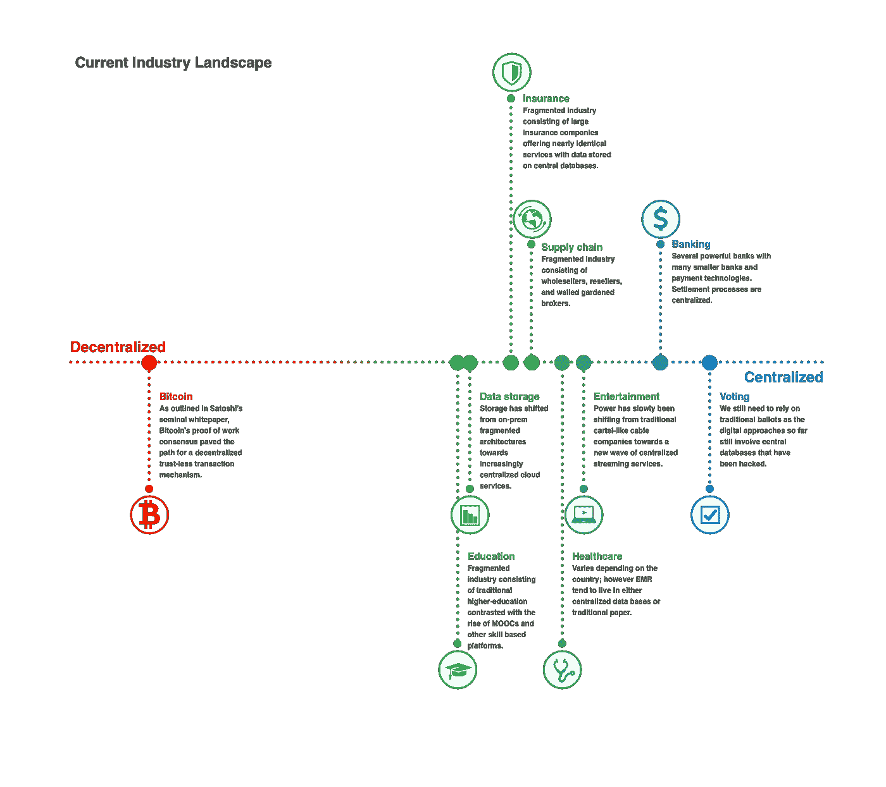
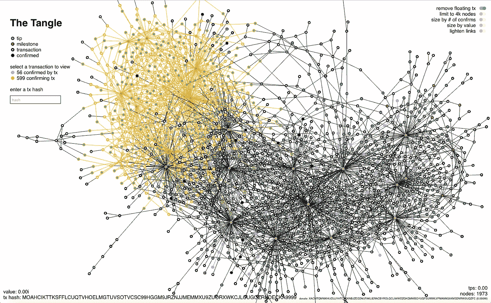
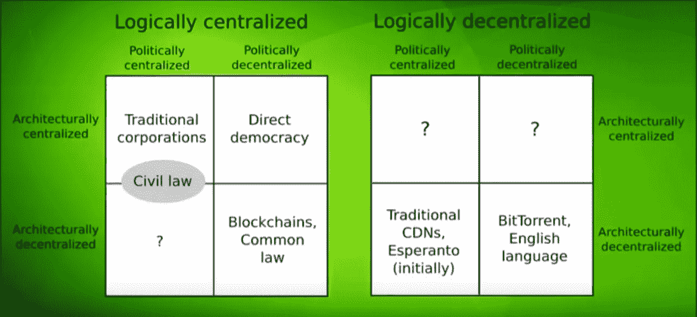
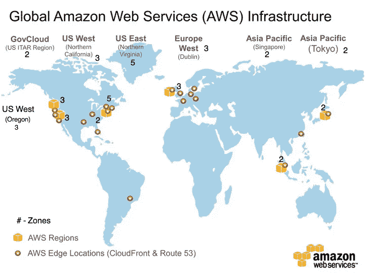
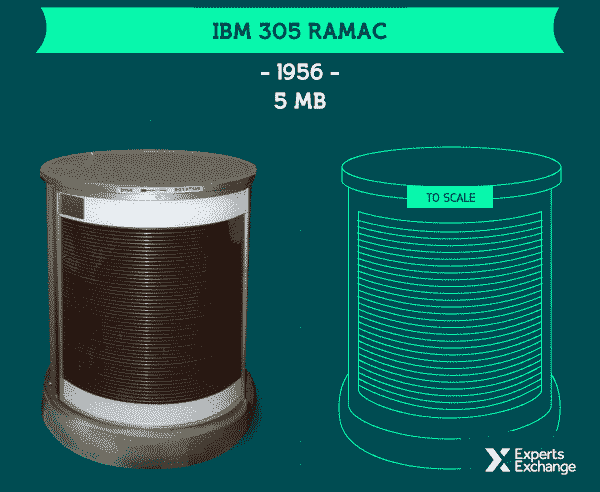

# 为什么分权很重要？外行人的概述

> 原文：<https://medium.com/hackernoon/why-decentralization-matters-a-12-min-overview-for-the-layman-6ec572d35af6>

虽然普通公众听到越来越多关于区块链和加密货币的消息，但去中心化的哲学和政治基础仍然主要保留在社区内部。**在我的书**中，权力下放正在带来一场范式转变，这比价格行为更值得报道。

几个月前，我意识到我并没有真正理解去中心化。我得到了一个高层次的概念，但是我没能把所有的点连接起来，并且**理解它的社会和政治影响。从那以后，我做了我的功课，现在是时候回报我对它的浅显理解了。**

你会说法语？一路顺风。在 est bien。 [*Lien vers la 版法语。*](https://ecocrypto.fr/vulgarisation/la-decentralisation-expliquee-en-15-minutes-pour-monsieur-tout-le-monde/)

# 末日预言者成为焦点

The Simpsons: Season 16, Episode 19 — Thank God it’s Doomsday

权力下放不是一个容易理解的变化。想象一下你自己在互联网早期，比如说 1995 年。你是否想过这项新技术的所有潜在用例，以及它们将如何展开？那时候，甚至有来自科技行业的著名演员预测互联网的无用或失败:

*   罗伯特·梅特卡夫，载于《信息世界》，1995 年

> "我预测互联网将很快成为壮观的超新星，并在 1996 年灾难性地崩溃."

*   **韦林·帕特里奇，《连线》，1995 年:**

> “大多数成功的事情不需要再培训 2.5 亿人。”

现在很容易嘲笑他们，但是问问你自己这个问题:你不是也在做同样的事情吗？

我这篇文章的第一批读者是那些在断定权力下放是愚蠢的之前阅读了两篇主流媒体文章的人。**让我成为第三个和魅力。**

主流媒体在这里宣传让你做出反应的情感内容，所以你注射了多巴胺，然后回来。他们不是来帮助你学习和成长的。他们导致了自己的灭亡。

拿我来说，我只是一个 26 岁的法国人，有写作的诀窍，手上有时间。我没有什么可以卖给你，但只有一个目标:帮助人们意识到正在发生的事情，这样他们就可以成为其中的一部分。

我已经在 20 岁到 60 岁以上的人身上测试过了。这很简单，只要你愿意借我 12 分钟的注意力。你将获得一个框架，让你看清权力下放是什么:新世界秩序的前提。

改变是艰难的，可怕的，令人困惑的。它破坏了你以前的参考资料，让你处于一个你不得不重新考虑所有事情的世界。适应起来有很多工作，但是你开始得越早，就越容易，就像互联网一样。

请随意与你的非集中化怀疑论者和热衷于非集中化的朋友分享这篇文章！

# 分权是多维光谱

对一些人来说，这似乎是显而易见的，但这是一个重要的事实:**去中心化是一个光谱，而不是一个状态**。它从最集中的系统，如我们目前的法定货币系统(**【中央】**银行决定了几乎所有的事情)到最分散的系统，如英语(稍后将详细介绍)。

在我们开始之前，这里有一个有趣的信息图，向您概述了主要行业的集中化:

Thanks to Lillian Wei, [Source](https://hackernoon.com/blockchain-governance-how-decentralized-do-we-need-to-be-799a7988ce84)

现在，您已经了解了分权的范围，第二件要了解的事情是分权的**不同维度。**

难的是，绝对来说，它们不是分权的不同维度的任何类型。为了让事情变得更简单，我将使用 Vitalik Buterin (以太坊的联合创始人，领先的去中心化项目之一)提出的[，它有三个主要方面:](https://www.youtube.com/watch?v=cgStgMyR9sY)

# 1.建筑维度

**这个维度很容易把握，因为关于物理事物**:设备、服务器、东西！架构维度解决了**网络**的基本单元。

为了最大限度地分散架构，你需要增加为你的[网络](https://hackernoon.com/tagged/network)供电的设备，并将它们分布在全球各地。

Graphical representation of the transactions happening on the IOTA Network (Tangle). [Visualizer: Tangle.glumb.be](http://tangle.glumb.de/)

要知道一个系统在架构上是如何分散的，你可以问这些问题:

*   有多少底层设备为网络供电？
*   它们在地理上是分散还是集中在一个区域？

# 2.政治层面

政治关乎权力。这个维度解决了系统的**决策过程。政治上最集中的协议是由唯一的决策者做出所有的决定。另一方面，您将有许多参与者和平均分配的职责。**

在政治上最分散的系统中，影响力最小的节点和影响力最大的节点之间的传播保持最小。完美的政治分散网络将对任何节点产生同样的影响。

这里有一些很好的问题来确定一个系统在政治上有多分散:

*   有多少人/团体参与决策过程？
*   权力再分配是什么样子的？用什么样的标准来衡量每个参与者的影响力？
*   系统中是否有任何追索/上诉机制？

# 3.逻辑维度

逻辑维度是三个维度中最难理解的。第一次读不到就不要放弃！用维塔利克的话来说，是这样的:

> 你的系统是看起来像一个单一的东西还是看起来更像一个无组织的群体？

本质上，这个维度是关于组成网络的每个节点之间的差异。为了最大限度地逻辑分散，你希望他们多样化。

不要让一些花里胡哨的话吓到你，其实没那么难。看例子真的帮助我理解了这一点，所以它们在这里:

**直接民主:**

*   **直接民主的架构相当集中**:有几个地方(议会、议院、警察、军队……)是协议的节点。
*   尽管有架构上的中央集权，但决策权在直接民主中是分散的，所以**协议在政治上是分散的。**
*   **它在逻辑上是集中的**——也就是一个主要的“主体”。只有一个政府执行一套法律。

**国家 vs 联邦**

*   **两者在架构上都是中央集权的，**原因与直接民主制相同:行动发生的地点/机构很少。
*   **两者也都是政治集权**:总统/议会/其他民选或非民选官员掌握大部分权力，不受任何公众监督。你不能在两年内更换总统，你必须等到整个任期，即使总统撒谎，勾结外国势力，不当使用公共资金…嗨，房间里的大象！联邦可能没有国家那么政治集中，但也很相似。
*   逻辑维度是事情变得有趣的地方。虽然一个国家是一个独特的主要“主体”，也就是逻辑上集中的“主体”，但一个联邦是由不同的“部分”组成的，它们承认并保留各自的差异，同时朝着一个共同的目标努力。因此，联邦是逻辑分散系统的一个很好的例子。

Logical centralization overview for common protocols ([Source: Vitalik Buterin](https://www.youtube.com/watch?v=cgStgMyR9sY))

**英语**

*   该架构非常分散。将英语视为一种协议，节点可以是任何说英语的人。好消息是它们数量很多，种类繁多，遍布世界各地！
*   **它的政治层面也相当分散。没有一个单一的管理机构来决定什么是英语，什么不是。是的，例如，有官方机构出版英语语法，但语法不是法律:你可以选择遵守或不遵守。语言学家研究的实际英语，不是语法中描述的英语，而是所有说英语的人所说的英语。**
*   最后，**这也是非常合乎逻辑的分散**。来自不同国家的两个说英语的人可能会说一种彼此非常不同的英语，因为词汇、侧重点，甚至句子结构。世界各地有许多不同的英语:美国英语、英国英语、我最爱的法国英语…

# 使用三维分散光谱

每个维度基本上都是相互独立的。**您可以在一个维度的范围内提供服务，而在另一个维度上提供服务**。

# 案例研究:虚拟主机服务

AWS(亚马逊网络服务)等网络托管服务就是最好的例子:

*   **从架构角度来看，他们希望自己的网络尽可能分散**。作为主机提供商，AWS 需要可靠。为了做到这一点，他们有许多服务器，因此冗余可以增强恢复能力。此外，**出于性能和安全的原因，他们将服务器分布在世界各地**。它减少了延迟并进一步提高了弹性。

Overview of the main AWS datacenters location. Source: [AWS](https://aws.amazon.com/about-aws/global-infrastructure/).

*   然而，从政治角度来看，亚马逊对网络拥有绝对的控制权。他们可以拒绝为你服务，删除你的内容(如果它是非法的)，AWS 用户社区对他们的决定没有发言权。**因此，在政治层面上，AWS 接近最集中的一端。**
*   最后，从逻辑层面来看，AWS 是一家集中化的公司，相当单一。

# 一个不值得麻烦的大麻烦

既然我们已经清楚了去中心化的范围，你可能想知道为什么要经历这些麻烦？事实上，**分散的系统往往比集中的系统更复杂，也更难管理**:它们有许多不同的组成部分，决策权分散在几方之间，还有一个必须履行的责任。

# 分散系统对计算有效吗？

所有这些需求都加重了系统的负担，降低了系统的运行速度，对吗？所以为什么要经历这些麻烦呢？

原来还不止这些！很难找到集中式和分散式系统之间的相关比较，但计算能力的价格可能是最容易理解的。

**目前，以太坊 Word 电脑与传统电脑(如亚马逊 EC2)的计算能力成本之比大约在 100 万美元左右**。吓人的比例吧？([不信任我，去这里查一下](https://www.youtube.com/watch?v=a-xHiI-G_CQ&t=251s))

嗯……是也不是。首先，你必须考虑计算能力在过去几十年里变得多么廉价。我们正在到达这样一个点，即使在 AWS 上花费 1 美元也代表了巨大的计算能力。[本页](http://www.visualcapitalist.com/visualizing-trillion-fold-increase-computing-power/)用简洁的信息图表展示了计算在过去 25 年中的发展:

Hard Disks dramatically increased in capacity while becoming more compact. [Source](http://www.visualcapitalist.com/visualizing-trillion-fold-increase-computing-power/)

我们必须问自己:这种比较有意义吗？了解我们技术的现状可能是有用的，但是它能告诉我们别的什么吗？

选择使系统更加分散化并不是为了性能；这是为去中心化提供的优势而做的。它允许创造新的服务，提供以前不可能的保证。

# 分权的好处:人群的边缘

简而言之，分散式系统提供了一系列独特的优势，开启了广泛的用例。让我们一个一个的来看看主要的优点。

## 效率

**在某些情况下，让系统去中心化是满足您需求的最佳方式**。例如，邮局的实际分布是分散的。如果所有的邮局都在同一个城市，效率会很低。

还有一个概念可以对系统的效率起到很大的作用:**备用容量**。考虑那些已经拥有一种资源(比如一栋房子或一辆车)但只使用 10%时间的人。你不必为你的服务建立一个全新的基础设施，相反，你可以使用已经可用的空闲容量:你好优步或 Airbnb。

## 容错

由于分散式系统是冗余的(没有只存在一次的元素，所有都有许多“副本”)，因此整个系统意外故障的风险比集中式系统要有限得多。这就是为什么虚拟主机服务必须在架构上去中心化的原因。但是许多系统都受益于容错:比如能源生产/分配网络。

还有一个概念非常有助于理解为什么分散系统具有弹性，那就是 **SPOF。单点故障**是网络基础设施中使用的一个术语，用来描述非冗余的元素:它只存在一次。**如果这个元素失效，将会导致整个系统瘫痪，因此得名。**

如果你还在跟踪，你应该能把这些点联系起来:因为在一个架构分散的系统中，一切都是多余的，所以没有 SPOF。如果有一个 SPOF，这意味着在某个地方有一个单一的/中心的元素(可能会打破)，因此它不是一个分散的系统。

## 抗攻击性

抗攻击本质上是一个成本/收益的问题。**不存在不可攻击的系统，存在的是考虑到潜在回报而攻击起来成本太高的系统。**

您还可以考虑恶意行为者，他们破坏协议不是为了直接的经济利益，而是为了其他目的。也许是竞争对手想搞垮你？即使在这种情况下，攻击者也需要投入大量资源才有机会让分散式系统瘫痪。

另一个要考虑的有趣事实是，信息分布在许多设备上。如果攻击者设法控制了一台设备，他只能访问整个数据集的一部分。这使得系统对黑客攻击更有弹性，因为数据暴露更少。可惜 Ashley Madison 在建筑上没有分散化。

## 抗共谋

抵制合谋背后的想法是，让系统中的一个子群很难走到一起，只为自己的最大利益而行动，从而损害整个系统。合谋的极端例子是垄断——它让参与者获得对整个市场的不公平优势，并强加其投标。

**例如，在我们的现代民主国家，对共谋的抵制非常低**:系统的共同利益(国家的改善)经常被特定的子群(如企业)为了他们自己的利益(利润)系统地劫持。

# 结论

分权是一个高层次的概念，对于理解区块链和其他分权分类账至关重要。如果你想进一步探索，你可以看看主要项目的创始人解释他们的愿景的视频，以更好地了解分散式系统能够实现什么:

*   Vitalik Buterin 向外行解释了 ETH 是什么。
*   Charles Hoskinson 解释了 Cardano 团队的方法以及 Cardano 想要实现的目标。[1:02:49]
*   [NEO 由其创始人达·洪飞解释。[16:04]](https://www.youtube.com/watch?v=gA5X69YY3yY)

你可能错过了互联网革命，但你很幸运:它才刚刚开始！**现在是了解这方面知识的时候了，这样你就可以在机会出现时识别和利用它们**。

我希望这篇文章能帮助你更好地理解新发现的大规模开发分散式协议的能力所带来的范式转变，这要感谢区块链。和其他分散协议。

如果你喜欢这篇文章，请告诉我，并查看我的维基以获得更多类似的内容。 **别忘了拍拍它** **帮它传播:**可以一直按👏高达 50 次鼓掌。

本文是一篇原创(法语)EcoCrypto.fr 故事的翻译。