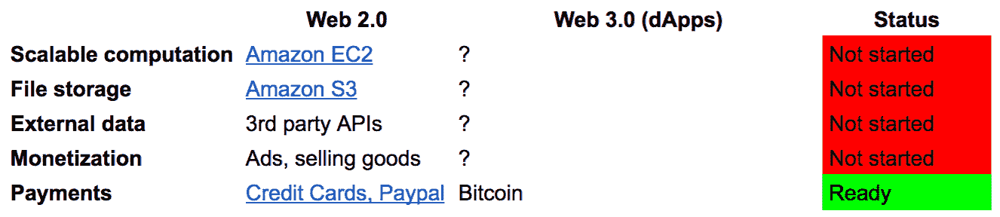
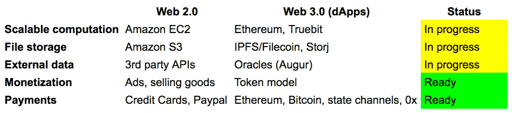

# 为什么分权很重要——为傻瓜解释

> 原文：<https://medium.com/hackernoon/why-decentralization-matters-explained-for-dummies-f75b5d40b2ee>

克里斯·迪克森(Chris Dixon)，一位企业家和私人科技创业投资者，最近发表了一篇名为[“为什么分权很重要”](/@cdixon/why-decentralization-matters-5e3f79f7638e)的媒体文章。这篇文章在加密社区获得了很多关注，因为它给出了一个基本问题的彻底答案，这是理解整个区块链概念的关键。也就是说，为什么加密网络本质上比“四大”——谷歌、苹果、脸书和亚马逊——提供的集中式服务更好？

当前的文章旨在为加密新手提供更详细的主题解释，并通过简单的真实例子说明加密经济网络给 IT 企业家和最终用户带来的好处。

## **集中化的 IT 正在扼杀技术创新**

这篇文章的主要观点是，集中式互联网平台遵循相当可预测的生命周期。当一个平台开始时，它通常会尽最大努力吸引用户和第三方补充，如开发人员、企业和媒体机构，这些都是使产品更有价值所必需的。但是一旦这个平台被广泛采用，它对用户和第三方的影响力就会稳步增长。最终，它开始与这些第三方补充竞争，而不是与他们合作。

因此，初创公司、软件开发商、创造者和互联网经济的其他驱动力不再有兴趣在这些集中式服务的基础上构建创新服务，因为后者可以随时改变游戏规则，击败竞争对手，夺走他们的受众和利润。这种零和游戏的历史例子有[微软 vs 网景](https://www.theguardian.com/global/2015/mar/22/web-browser-came-back-haunt-microsoft)、[谷歌 vs Yelp](https://www.yahoo.com/news/google-vs-yelp-zero-sum-game-191437686.html) 、[脸书 vs Zynga](http://www.businessinsider.com/facebook-basically-owns-zynga-2011-7) 以及 [Twitter vs 其第三方客户端](https://www.digitaltrends.com/mobile/firstworldproblems-twitter-api-and-third-party-problem/)。

加密网络是一种分散的网络，使用区块链等共识机制，并以加密货币激励其参与者，为解决这一问题提供了一种有效的方法。

由于加密网络是由背后的社区而不是任何单一实体来管理的，因此它们对第三方软件开发商和企业家来说极具吸引力，他们不再需要担心游戏规则会突然改变，而是专注于创新技术的开发。

在这个意义上，加密网络非常类似于 20 世纪 80 年代后期的开放协议，后者后来被集中式服务超越并取代。但那又有什么区别呢？为什么历史不会重演？

问题是，分散式网络还以加密货币(硬币或代币)的形式为开发者、维护者和其他网络参与者提供经济激励。长话短说，平台越好，其代币的价值就越高，因此网络参与者有经济利益为共同目标而合作——网络的增长和代币的升值。

## **潜在的 Dmail vs Gmail**

为了更好地理解这种新的经济模式实际上是如何工作的，让我们想象一下一些分散式应用程序的开发过程，看看它与集中式服务的开发过程有什么不同。例如，让我们创建 Dmail——谷歌电子邮件服务 Gmail 的分散版本。

[Gmail](https://mail.google.com/) 建立在 SMTP 等开放协议之上。然而，如果有人试图为 Gmail 开发第三方应用程序，他或她将不可避免地面临被谷歌服务吸收的风险，因为大多数集中式服务都是如此。

现在，让我们看看当邮件服务基于分散式协议——DSMTP(一种 SMTP 模拟协议)时会发生什么(整个案例和命名完全是虚构的)。基本上，有两种方法可以开发这样的协议。

首先是建设一个新的区块链。在这种情况下，人们需要从头开始开发整个网络和共识机制，然后使其对矿工具有足够的吸引力，以投入他们的计算能力，这是一项相当困难的任务，事实上，因为大多数矿工更喜欢维护更成熟的网络，如以太坊或比特币。

第二种方式是使用开箱即用的解决方案开发一个去中心化的应用程序(d app)，比如[以太坊](http://ethereum.org)、 [Neo](https://neo.org/) 、 [Cardano](https://iohk.io/projects/cardano/) (即将推出)等。由于这种方法允许开发人员使用已经存在的、有大量矿工参与的网络，吸引他们的问题就不再重要了。剩下的就是开发一个 app 本身了。

下面是一个 19 行的例子，展示了 SMTP 在以太坊上如何使用 Solidity 语言，[由区块链企业家 Jonathan Brown 提出:](http://jonathanpatrick.me/blog/ethereum-smtp)

> /**
> 
> * @标题邮箱
> 
> * @作者乔纳森·布朗
> 
> */
> 
> 合同邮箱{
> 
> 事件消息(地址索引收件人，字节消息)；
> 
> /**
> 
> * @通知将邮件发送到“收件人”帐户。
> 
> * @param 到要向其发送消息的帐户的地址。
> 
> * @ param message MIME 类型 application/pkcs7-mime 中的消息。
> 
> */
> 
> 函数发送(地址收件人，字节消息){
> 
> //将消息存储在事务日志中。
> 
> 消息(收件人，消息)；
> 
> }
> 
> }

一旦 DSMTP 开发出来，下一步就是发行代币，代币将成为新加密网络的重要组成部分，并将所有网络参与者(包括 DSMTP 开发者、第三方开发者、投资者、服务提供商(矿工)和最终用户)整合到一个统一的经济结构中。

这些令牌不仅是在 ICO 活动期间从私人投资者那里筹集资金的一种手段，而且在使用协议本身时也是必需的，并作为对矿工的经济激励(在使用以太坊的情况下，他们将获得以太)，从而保持网络的健壮性。

这样，愿意在 DSMTP 之上构建自己的应用程序(如 Dmail)的第三方开发人员将需要首先购买协议令牌。作为回报，他们可以确保游戏规则不会一下子改变，因为该协议是建立在区块链技术上的，这意味着在大多数情况下，只有在大多数网络参与者的同意下，才能对其进行任何更改。随着协议采用的增加，它的令牌价值也会上升，从而奖励协议开发者、投资者和矿工，持有他们的令牌部分。

这是关键:与现代集中式服务以及第一个互联网时代的开放协议不同，加密经济网络为其所有参与者提供激励，从而在网络发展中获得既得利益。

## **为什么 51%的攻击其实不成问题**

加密网络的分散性是其最令人钦佩的优点之一，但同时也可能被证明是其脆弱性。这里所指的是所谓的 51%攻击，即[指的是](https://www.investopedia.com/terms/1/51-attack.asp)一群控制了网络 50%以上计算能力的矿工对区块链的攻击。

通过控制网络上的大部分计算能力，攻击者或一组攻击者可以干扰记录新块的过程。这可以用 Bob 和 Ron 使用 DSMTP 协议进行商业结算的假设案例来说明。

假设，鲍勃是一名建筑工人，罗恩为他的工作提供砖块。正常的流程是这样的:鲍勃向罗恩索要砖头，罗恩给他寄去一张账单。鲍勃一给罗恩汇钱(一切都是通过 Dmail app 进行的)，罗恩就把砖头发给鲍勃，就这样。

但是鲍勃也可能是个骗子。假设，如果 Bob 控制了 DSMTP 网络 51%的采矿能力，这是 Dmail 应用程序的基础，那么他将有机会建立最长的区块链，并且网络的最长区块链总是被其余部分采用。

例如，Bob 可以给 Ron 发送一个已付账单，同时开始挖掘一个没有账单的并行区块链。然后，在从罗恩那里得到一块砖之后，鲍勃可以将这些块写到区块链，因为他的链将是最长的，所以事实上，他将免费得到他的砖。

然而，需要注意的是，Bob 不能以某种方式撤销交易或删除写有账单的并行块。他所能做的就是让网络相信他对事件的描述是真实的，这样的事情通常会很快被社区揭露。

此外，51%的攻击风险被没有攻击网络的真正动机这一事实所利用。首先，即使控制了 51%的矿业力量，改变攻击开始前锁定的交易也是极其困难的。交易越往后，改变它们就越困难，所以人们可能只能影响下一两个块。

其次，这种攻击可能会破坏整个系统的完整性，导致价格暴跌。这不是任何对 DSMTP 代币有既得利益的人想要的——鲍勃的利润很大程度上依赖于这些代币的高价格，他自己最终将成为输家。

## **我们现在在哪里**

虽然分散式网络可能不是解决互联网上所有问题的灵丹妙药，但它们确实提供了比集中式系统好得多的方法。加密网络中没有中央机构，这保证了市场的公平竞争，没有空间让大型参与者在一夜之间击败较小的竞争对手，这显然为最佳人才流入该领域创造更先进和真正创新的产品奠定了基础。

然而，加密网络核心基础设施的开发仍有待完成，这也是事实。好消息是，近年来取得了很大进展。以下是 2014 年 dApp 开发者的状况，[前比特币基地联合创始人](/@FEhrsam/the-dapp-developer-stack-the-blockchain-industry-barometer-8d55ec1c7d4) [Fred Ehrsam](/@FEhrsam) 称:

这是它在 2017 年的样子:

这清楚地表明，加密网络目前正以前所未有的速度发展。分散式网络结合了迄今存在的所有协议类型的最佳特征，因为它们是:1)社区管理的；3)安全和健壮；2)为所有网络参与者(包括协议开发者和第三方)提供经济利益。鉴于这一切，它们超越集中式服务并引发世界经济的彻底转变只是时间问题。

## 关于作者:

基里尔·希洛夫——geek forge . io 和 Howtotoken.com 的创始人。采访全球 10，000 名顶尖专家，他们揭示了通往技术奇点的道路上最大的问题。加入我的**# 10k QA challenge:**[geek forge 公式](https://formula.geekforge.io/)。