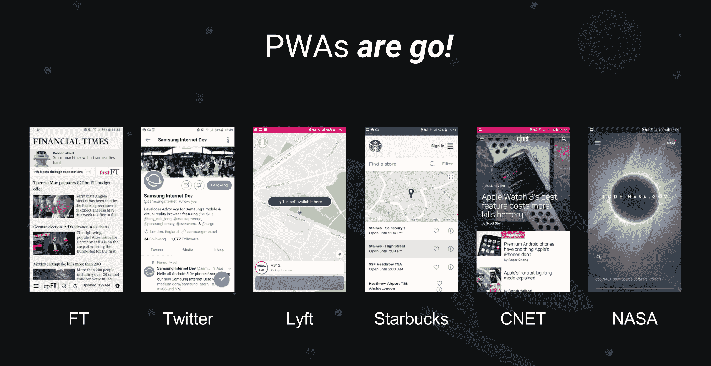
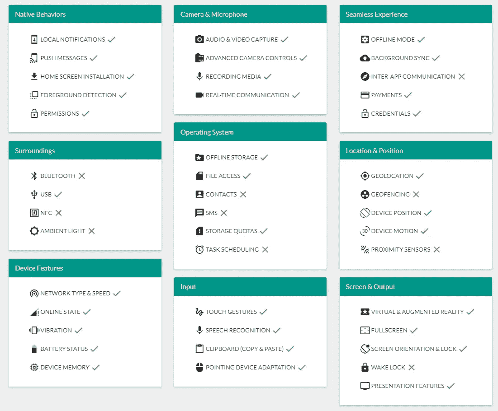
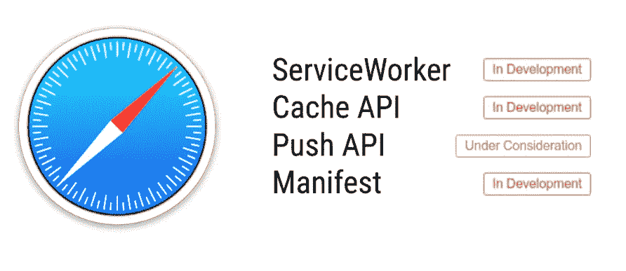

# 为什么开发者喜欢渐进式网络应用

> 原文：<https://medium.com/hackernoon/why-developers-love-progressive-web-apps-2689950ae13>

Slide from “[Progressive WebVR Apps](https://docs.google.com/presentation/d/1b27LiMtxkOgReHEI6FZGc8lyuu0wrKjwgQ2ZbDz6yak/edit#slide=id.g2014fe46a9_4_7) by Samsung”

## 以及为什么它们可能比原生 IOS、Android 甚至 Windows 应用更好

想想吧。大多数原生应用程序不需要应用程序的所有原生功能，如生物计量、接入蓝牙等。，那么为什么不编写一个应用程序，并能够在任何设备上使用它呢？←介绍渐进式网络应用

# 什么是渐进式网络应用

PWAs 基本上是普通的网络应用程序，有一个清单文件和一个 T2 服务人员告诉浏览器如何缓存文件，使用什么图标，启动屏幕，应用程序在主屏幕上的名字等等..服务人员还可以为您的网络应用添加**离线支持**！

## 为什么不直接用原生 app？

例如，除了你的**位置**或**推送通知之外，为什么一个新闻应用程序还需要其他东西呢？你猜怎么着，你的网络浏览器可以请求允许使用这两种浏览器。尽管推送通知需要一个安全连接( **https)** 和一个**服务人员，**为**所有平台**编写一个**单个** **应用**要比不得不为所有不同平台重写和维护代码方便得多。许多公司，如推特、美国国家航空航天局、T21 和星巴克已经在使用 PWAs，它们看起来很棒:**

# PWA 与本机:功能和 API

[what web can do today](http://whatwebcando.today), running on chrome 63, Feb 2018

## PWAs 的优势:

*   **多平台—** 开发者只需开发一个代码库，降低了成本，提高了最终产品的质量
*   **无摩擦** —几乎没有下载时间，浏览网站时提示添加到主屏幕。大约 60%的手机用户每个月都不会下载任何新的应用程序。
*   **易于发现—** 从访问网站到出现安装提示和安装只需不到 10 秒钟
*   **小下载量** —
*   **即时更新—** 服务人员允许新的脚本/样式表在部署到服务器后立即使用，因此用户甚至不需要按更新按钮。
*   在任何装有浏览器的设备上运行

## 原生应用的优势:

*   快速流畅的动画
*   本机外观的用户界面
*   几乎瞬时负载

# PWAs 的平台支持

## 机器人

谷歌一直在积极推动 PWAs 的概念，最近他们开始受到苹果、三星、火狐甚至微软的关注。Android 现在完全支持所有 PWA 功能，并且是第一个这样做的平台。

## ios

Safari 已经在尝试服务人员支持，这可能会在今年晚些时候导致 PWA 支持。虽然你不能在 iOS 上“添加到主屏幕”，但你仍然可以使用**推送通知。**

## Windows 操作系统

微软已经宣布 Edge 将很快支持 PWAs。事实上，最新的内部人士版本已经支持它。然而，只有大约 2%的用户使用 Edge，所以我们需要依靠 Chrome 和 Firefox 来实现这一功能。幸运的是，Chrome canary 已经在 chrome://flags 中包含了一个标志，允许你这样做:

# 开发者视角

## 部署

如果您甚至开发了一个本地应用程序，您就会知道部署过程既痛苦又耗时:

**编译**(量产版)→创建**私钥** → **签名**app→**发布**

使用渐进式网络应用程序，您只需:

**构建**web 应用程序(npm 运行构建)→ **上传**到服务器

## 这是否意味着原生应用将最终消亡？

不，不可能。一些类型的应用程序总是需要更多的功能或更好的性能，因此 PWA 根本不是一个合适的选择。

# 结论

如果你是一名开发人员，并计划在 2018/2019 年建立一个原生应用程序，请考虑为每个平台建立一个 PWA，而不是单独的应用程序。您不必维护每个版本，开发版本可以减少大约 3 倍，并且您不需要学习所有语言。你会喜欢的。我还将有几个关于构建一个功能全面的 PWA 的教程，它具有推送通知、离线支持和缓存功能，同时具有 **angular** 和 **react，**所以如果你想看这个，**请关注我**，这样你就不会错过任何故事。

