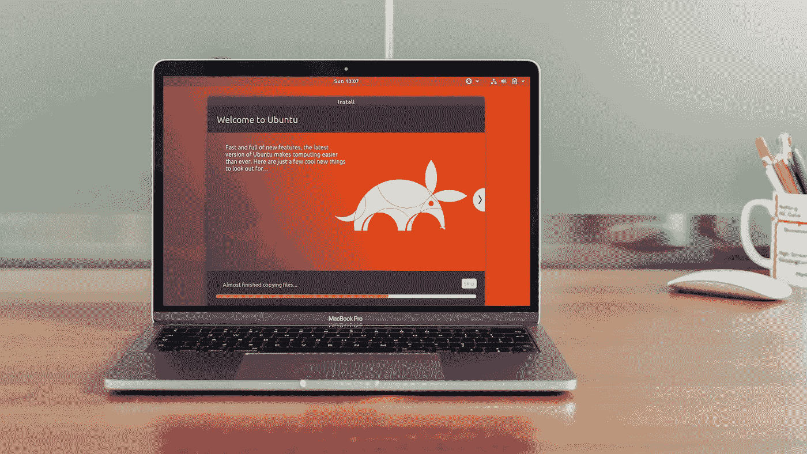

# 为什么开发者不应该使用 MacBook Pro

> 原文：<https://medium.com/hackernoon/why-developers-should-not-use-macbook-pro-3b6a4aeeee64>

大约十年前有一篇文章宣称“每个开发者都应该有一台 MacBook Pro”，列举了一堆理由，比如:

*   更好的硬件/操作系统设计。MacBook Pro 拥有最可用的触摸板，可以完全取代你的鼠标。一些操作系统功能也注重便利性，比如聚光灯。
*   类 Unix。方便的本地终端使得使用 Unix/Linux 的几乎所有软件成为可能。
*   令人惊叹的软件生态系统。OSX 的应用程序通常设计得更好，比 Windows 上的应用程序方便得多，尤其是设计师的应用程序。App Store 也让软件购买变得更加容易。

是的，这些理由都是真的，即使在今天。如果我还在使用我的 MacBook Pro，我仍然会在我的触摸板上快乐地滑动，使用 spotlight 找到我的应用程序，使用 Omnigraffle 制作图表，使用`brew install`安装开发工具。然而，我已经改变了我的偏好，现在我使用 Thinkpad + Ubuntu。我将解释为什么，我觉得这些原因对大多数使用 Linux 的开发者来说是真实的。

这可能是因为我是一名网络开发人员；如果你正在使用微软的 stack，在这种情况下你无论如何都不会使用 macOS，或者你正在制作 iOS 应用程序，在这种情况下你被迫使用 macOS，这篇文章不适合你。

# 黑仔的特色:触摸栏

2016 年底苹果发布了新一代配备“Touch Bar”的 MacBook Pro。我同意 touch bar 是一个伟大的设计概念，并帮助了许多不习惯传统功能键的用户，但我不会像 media 那样将其称为“杀手级功能”，我会说 touch bar 杀死了 MacBook Pro 本身。

我是一个重度 Vim 用户，我相信许多开发人员也是。对于 vim 用户来说，最重要的键是“Esc”键。我需要每隔几秒钟按一次“Esc ”,当然不用看它在哪里，最重要的是，我需要感觉物理按键，这样我就知道按键成功了。但是 touch bar 完全移除了 Esc 键。这使得 vim 更难使用。

Touch bar 还去掉了对调试非常有用的功能键。PyCharm，WebStorm，Android Studio，甚至 Chrome 开发者工具，这些调试工具都是用 F5~F11 作为调试热键。同样，我需要“感觉”物理按键，以确保我按对了键。有了 touch bar，这些都没了。

# 更好的 Linux

Linux 在最近几年有了很大的发展。我用 Ubuntu 一年左右，发布后第二天升级到 Ubuntu 18.04。Ubuntu 满足了我大部分的日常需求。看看我每天都在用什么:

*   IDE: VSCode / PyCharm / WebStorm，或者简称为 Vim
*   浏览器:Chrome / Firefox
*   即时消息:Slack / Skype / Telegram
*   办公室:图书馆办公室

所有这些应用程序都有 Linux 版本，它们和在 Mac OSX 上运行的一样好。LibreOffice 是一个例外，因为 MS Office 不支持 Linux，是的，MS Office 和 iWork 比 LibreOffice 好得多。但是 LibreOffice 今天稳定多了，而且由于我不是每天都做文档，我觉得对我来说已经足够好了。

我在 Linux 中发现的唯一不便是我没有制作图表的应用程序。Omnigraffle 比 Inkscape 好多了。但幸运的是，我也不需要经常这样做，所以我可以只使用 LibreOffice Draw 或 Google Drawings。

# 软件限制

一些应用程序在 Mac OSX 下表现不佳。我迁移到 Ubuntu 的一个最重要的原因是 VirtualBox 的局限性。

VirtualBox 是一款免费的虚拟机软件。在我们的工作场所，我们使用的是流浪者，它本质上是一个 VirtualBox 的包装器。我还在用 MacBook Pro 的时候，在我的 MacBook Pro 上写代码，在 VirtualBox 中运行的 Ubuntu 上运行代码。由于我们使用 webpack 在 VirtualBox 中构建 JavaScript 代码，问题是如何将更改的文件同步到 VirtualBox。我尝试了一些解决方案，但没有一个效果好:

*   在 VirtualBox 中设置 Samba 并远程编辑代码。从技术上来说这是可行的，但是因为我们需要在 VirtualBox 中观察文件的变化来重建项目，所以通过 Samba 保存的变化不会立即触发重建。通常，在项目重建之前，我必须在保存我的更改后等待大约 20 秒。
*   使用 NFS 导出 MacBook Pro 上的代码，并在 VirtualBox 中将它挂载为 NFS 驱动器。但是 NFS 访问速度太慢，重建需要的时间是平时的 3-5 倍。
*   使用 VirtualBox 共享文件夹将代码目录从 MacBook Pro 映射到 VirtualBox。同样，由于访问速度慢，这种方法也不起作用。
*   在 VirtualBox 和 MacBook Pro 上放两个独立的 repos，在 MacBook Pro 上本地运行 webpack。Webpack 开发服务器将代理对 VirtualBox 的 API 访问。似乎是完美的解决方案，重建立即发生，并在几秒钟内完成。然而，另一个问题出现了:我不能在一次提交中同时提交服务器代码和前端代码。我必须分别提交它们，并同步回购。当我需要在一次提交中改变两边时，这让我很不舒服。

我不能责怪 OSX，因为这实际上是 VirtualBox 的问题，但无论如何，根本原因是我们的开发环境不能直接在 OSX 上运行。

最终我在 MacBook Pro 上擦了 OSX，装了 Ubuntu，所有的问题都没了。

# 结论

在这篇文章中，我解释了为什么我认为 MacBook Pro 不再是开发者的好选择。毫无疑问，对于 UI/UX 设计师、产品经理或需要做大量设计/文档工作的人来说，它仍然是一款非常棒的笔记本电脑，但开发者有更好的选择。

那么有什么选择呢？随便用个笔记本电脑，装个 Linux 就行了！

感谢阅读。如果你和我有同样的感受，请鼓掌并考虑分享这篇文章！

*更新*:回答回复中的一些问题。

1.  在 touch bar MacBook 上安装 Linux 并不能解决问题(title image 并不是一个很好的例子)。用别的笔记本电脑，或者买个不带 touchbar 的 MacBook。
2.  当你有数以千计的小文件时，VirtualBox 共享文件夹是缓慢的。一个典型的用例是使用 webpack 编译 JavaScript。NFS 可以提高性能，但也比本地文件访问慢。