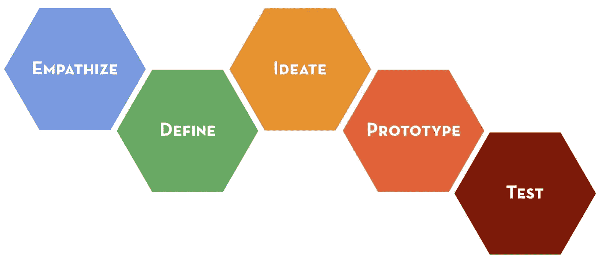
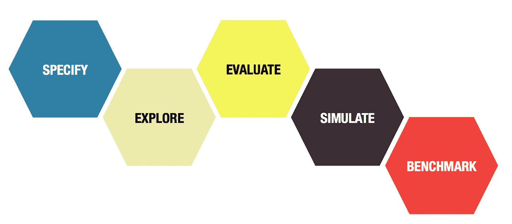
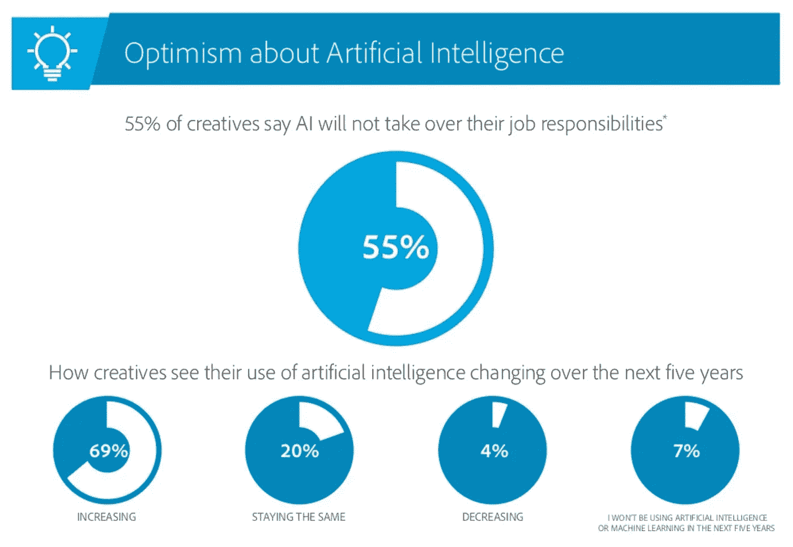

# 为什么颠覆设计会加速人类的进步。

> 原文：<https://medium.com/hackernoon/why-disrupting-design-will-accelerate-humanitys-progress-a6cd177dacf4>

设计是社会进步的基本驱动力。设计过程允许我们找到日益复杂的问题的解决方案，并创造更先进的物理系统和精神结构，这反过来使我们能够成长和繁荣。

纵观历史，设计过程本身一直得到一套不断发展的[工具](https://hackernoon.com/tagged/tools)和方法的支持，从铅笔、纸张和粘土模型，到帮助理解需求和机会的定义明确的定性方法。

Design Thinking, d.School 2010, Hasso Plattner Institute of Design at Stanford University

## 我们如何定义设计？

上图来自斯坦福大学设计学院，展示了由五个步骤组成的高级设计流程:

*   **感同身受:**认清问题。
*   **定义**:以全面清晰的方式描述问题。
*   想法**:根据这个定义，想出许多可能的解决方案。**
*   ****原型**:把这些想法中的一部分转化成可以互动的更实在的东西。**
*   ****测试**:评估这些原型，选出最好的。**

## **算法中断**

**在过去的 18 个月里，我已经开始注意到许多创业团队的一种趋势，即采用设计流程，应用新的计算技术和算法开发。通过这样做，他们证明了自己有能力比人类设计师更快地找到更好的解决方案。**

**这些公司致力于解决许多领域的设计问题。迄今为止，大多数工作都是将这些技术应用于更具吸引力和直观的布局和界面的快速设计，但我们现在看到它们被应用于工程(特定用途的组件)、建筑(新建筑的布局)和生物学(针对特定疾病的分子)等领域的设计问题。**

**那么人们在这里使用什么计算方法呢？让我们再来看一下上面概述的五个步骤:**

*   ****感同身受:**这通常仍由人主导，理解问题的工作仍由设计师承担。**
*   ****定义:**编程框架正在每个领域中被创建，允许设计者通过一组规则或约束以机器可理解的方式对问题定义进行编码。**
*   ****Ideate:** 计算机探索由定义设定的搜索空间，执行潜在解决方案的“强力”生成，并使用包括机器学习算法在内的评估试探法来缩小解决方案的列表。**
*   **原型:解决方案的一个子集可以被原型化，通常是通过构建高级的计算模拟，使你能够可视化它们并分析它们的性能。**
*   ****测试:**通过高级模拟，您通常能够在许多情况或环境下测试您的想法，并生成定量结果，从而允许您对不同的选项进行基准测试。在其他情况下，人们可能仍然依赖人类来评估原型，这是一个可以使用人群测试或 A/B 测试来快速大规模完成这项工作的领域。**

**用某种技术语言总结这个过程，可以说设计是这样一个过程:**探索**由一组规则指定的解决方案空间**,**评估**选项，使用试探法将这个空间缩小到一个短列表，**模拟**这些潜在的解决方案，然后**对它们的性能进行基准测试**以选择一个最佳解决方案。也许这个设计过程看起来更像下面这样:****

****

**我们已经看到使用这些新设计工艺的商业应用，但仍存在许多有趣的挑战和需要改进的地方:**

*   ****创意火花:**虽然设计问题的好解决方案通常存在于最初指定的约束条件中，但一些设计师认为，当你以“创意”的方式打破这些约束时，最佳解决方案就会出现。虽然关于算法是否能够真正具有创造性的辩论仍在进行，但构建这些新系统的人应该考虑如何在生成阶段捕捉到一些创造性的打破规则的本质。**
*   ****问题输入:**今天你得到的结果有多好仍然取决于输入框架和规则允许问题被指定的程度。随着人工智能的能力增强，计算机可能能够更好地理解潜在的问题本身，将问题发现与解决方案生成更紧密地结合起来，以允许对结果空间进行更强大的探索。**
*   ****计算成本:**虽然计算能力的成本持续下降，如今已经很少被考虑，但我很惊讶，在一些应用程序中，我看到创意的产生仍然会耗费很多时间和数千美元。勘探和评估技术的进步可能会改善这一点，这也将允许在设计过程中更快的迭代。**
*   **结果呈现:关于呈现返回结果的最佳方式，用户体验问题仍然存在。那些构建这些系统的人将需要确定有多少内部推理和分析需要与设计者共享，以使他们相信输出的解决方案是好的。**

## **设计师担心吗？**

**Adobe 在 2017 年对“创意人员”(仅限于那些参与可以使用 Adobe 的工具套件解决的设计问题的人)进行的一项调查报告称，69%的受访者认为自己在未来五年将使用更多的人工智能，但 55%的人表示人工智能不会接管他们的责任。**

****

**[The State of Creativity in Business](https://www.slideshare.net/adobe/state-of-creativity-in-business-2017), [的](https://medium.com/u/bc93a5e08bbd#top)[尤里·维特罗夫](https://medium.com/u/86b4a625864d?source=post_page-----a6cd177dacf4--------------------------------)的的【算法驱动的设计:人工智能如何改变设计】和[的](https://uxdesign.cc/how-ai-will-impact-your-routine-as-a-designer-2773a4b1728c)的[法布里西奥·特谢拉](https://medium.com/u/50e39baefa55?source=post_page-----a6cd177dacf4--------------------------------)的【人工智能如何开始影响我们作为设计师的工作】。**

## **为一切而设计**

**将这些新工具应用到设计过程中，可以更快、更低成本地发现更好的解决方案。将这一点发挥到极致，我们不仅可以针对每个问题，还可以针对每个最终应用重复这一过程，将越来越具体的规则和数据输入到指定和基准测试阶段，并为特定用户、环境或情况创建量身定制的输出。**

**以这种方式设计，我们在日常生活中使用的解决方案可以变得更加有效，让我们变得越来越高效，推动社会以更快的速度进步。**

***如果你正在重新设计一个设计流程，我很乐意与你交谈。***