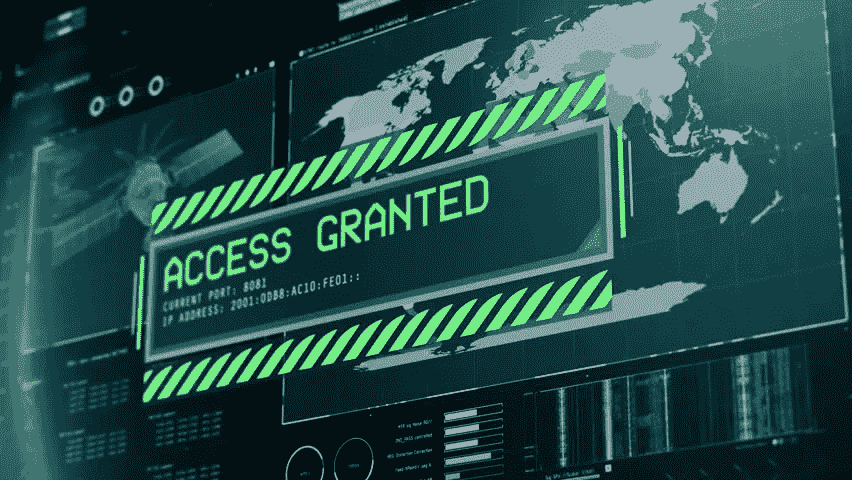
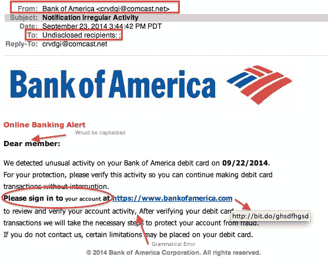
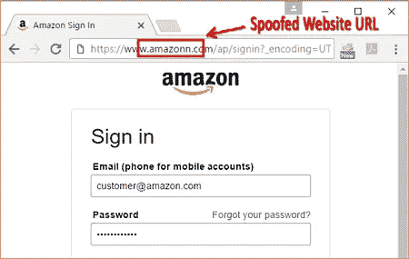
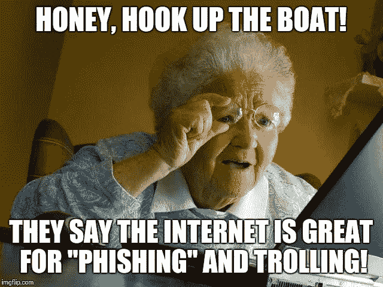
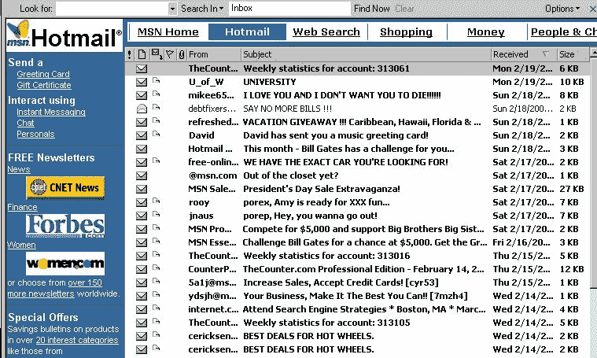
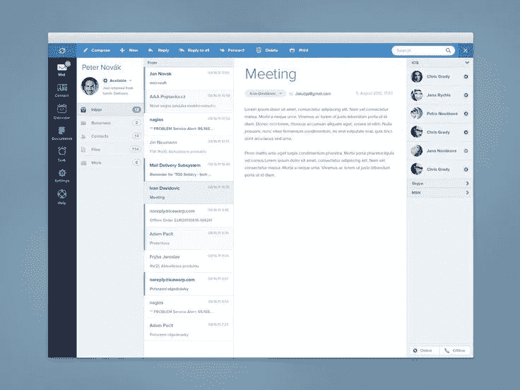

# 为什么加密货币黑客攻击不断发生？

> 原文：<https://medium.com/hackernoon/why-do-cryptocurrency-hacks-keep-happening-19370ba1a356>

忘掉 clickbait 公牛队吧。这就是*其实是*为什么…

hi….

我一直被问及上述问题(似乎是这样)，在过去的几周里，来自更“主流”领域的一些人又问了我一次。

所以本着把我脑子里的东西变成内容，而不必重复 100 遍的精神，我决定写一篇文章。

以上陈述需要考虑 4 个关键因素，这样你就能更好地理解发生了什么。当你读完这篇文章的时候，你就会确切地知道**到**该做什么，以及**不**该做什么…

首先…让我们揭穿一些误解。

# 1.“被黑”是什么意思？

被“黑”是一个如此宽泛的术语。

当人们每天想到被黑客攻击时，他们会想象某个家伙在某个黑暗的房间里，通过敲击键盘以某种方式进入你的电脑或你的在线数据..

Hollywood Bullshit

这与事实相去甚远。事实上，这完全是一派胡言。

如今，大多数“黑客”实际上是以社会工程类型的黑客形式出现的。社会工程被定义为:

*“使用欺骗手段操纵个人泄露可能用于欺诈目的的机密或个人信息。”*

这与黑客获得如上图所示的“访问权限”无关，但更多的是来自善于沟通的人，他们可能会采取以下措施来获取您的个人信息。

## 电话/电子邮件劫持

*   他们去你当地的 Telstra / Vodafone 商店买一张 SIM 卡。
*   他们说“哎呀，我昨天丢了钱包和手机——我只需要拿一张新的 SIM 卡重新激活它。
*   15y/o 工作人员说“当然”，我只需要核对一些个人信息:
*   黑客(模仿者)说，“当然”，并开始给他们；出生日期，地址，母亲的娘家姓，甚至可能还有地址。

等等……你可能会说怎么会？？魔法？？读心术？？不…

facebook，google 和你的邮箱怎么样。

*   手机店工作人员说；“太好了，这是你的新 SIM 卡”。
*   然后，您继续设置 SIM 卡，然后开始访问他们的电子邮件。
*   第一步:忘记密码
*   第 2 步:输入恢复电话/母亲的娘家姓
*   第三步:重置密码
*   第四步:非常感谢——我现在可以查看你的邮件了。
*   既然他们有了密码，他们就可以登录你的任何帐户，点击重置密码，然后离开。

你可能会说；“为什么会有人走进商店&做这一切。他们就不能打电话给你的电话提供商，假装他们是你吗？

嗯……是的——老实说——他们大部分时间都是这么做的。以上只是说明了这是多么容易的人。通过电话甚至更容易。

另一种非常非常普遍的方式，也是社会工程的一种形式:

## 网络钓鱼

这是迄今为止最常见的形式，尤其是在涉及加密货币、ICO 等时。

网络钓鱼的一种形式是，你收到一封来自“可信”公司的电子邮件，如 PayPal、易贝或你的银行，要求你“登录你的账户”，查看余额或更正一些个人信息。电子邮件的品牌看起来是合法的，链接看起来也是合法的，在你点击它之后，登陆页面看起来也是合法的。

Phishing email example.

你像往常一样用你的邮箱和密码登录，却发现你无法登录。大多数人认为“愚蠢的贝宝。要求我登录，然后我甚至不能登录”，所以他们留到以后。

他们没有意识到的是，他们只是将自己的用户名和密码输入到一些黑客的数据库中，这些黑客在后台说“非常感谢”，然后将这些细节输入到你真正的 PayPal(或网上银行，或电子邮件，或其他什么)账户中，更改密码，锁定你，清空你所有的钱/资金/密码/其他。

当普通人在每个服务中使用相同的密码时，问题就更复杂了！！他们的电子邮件密码与他们的网上银行、PayPal、Spotify、facebook、网飞和他们的加密交易所的密码是一样的！

现在——哈克先生或夫人有权使用你所有的东西。除非你很快意识到这一点，否则你就完了。

如今，网络钓鱼诈骗相当先进，甚至会影响到我们中最有安全意识的人。

早些时候，我从一个朋友的笔记本电脑(我身上没带)上谷歌搜索后，点击了一个交易所的链接，损失了大约 20 个比特币。

我在谷歌上搜索我想快速登录的交易所，进行交易。我在谷歌上点击了最上面的结果(我想这是一个谷歌 Adwords 广告)，它把我带到了我认为是交易平台的页面，我输入了我的用户名和密码——还有 viola——它没有登录..

我想了一下..等等——这里怎么了？

所以我刷新页面，回到谷歌，再次点击顶部的链接——这一次，在我不知道的情况下，我实际上进入了正确的网站，登录，一切正常，我放置了我的交易，然后离开了。

我不知道我刚刚放弃了我的用户名和密码。

2 周后，当我试图登录时，我无法登录。我伸出援手，他们验证了是我，他们帮我重置了密码，但一切都太晚了——所有的资金都没了。

The bastards are cheeky. If you don’t triple check, you’ll miss it.

那时候它不太值钱，所以我想我不应该跳楼——但是看看今天的价格&写这篇文章的时候，这是一个 20 万美元的电话..这完全是我的错。

每个行业都有风险。如果你想在网上玩弄金钱或敏感信息，你可能应该学习一些基本的 infosec(信息安全)。像 2FA(双因素认证)这样的东西本来可以救我一命。

同样的道理，在你去盖房子之前，你也应该理解与盖房子相关的风险。或者，如果你要运输 1 吨黄金，你不会用手推车让所有人都看到——你会用装甲卡车，有 4 名警卫。就像你不去银行，取一堆现金，走在街上挥舞着它一样。

在做重要的事情之前了解你在做什么。我希望上面的战争故事服务于它的目的；教导其他人不要做同样的事。

总之。既然我们已经了解了实际的黑客攻击是如何工作的，那么让我们花一点时间来了解 Crypo 领域发生了什么——以及为什么会有很多所谓的黑客攻击在进行(提示……这有些夸张)

# 2.“丢失的比特币”不是“丢失”。

也不应该被贴上“被黑”的标签。

下面这篇文章讲的是“所有比特币的 20%是如何丢失的”。

 [## 报告称 20%的比特币(BTC)不见了，但是“密码猎人”可以帮助恢复数据

### 在加密货币行业存在如此多的安全和盗窃问题的情况下，令人欣慰的是…

bitcoinexchangeguide.com](https://bitcoinexchangeguide.com/reports-say-20-of-all-bitcoin-btc-is-gone-but-crypto-hunters-can-help-recover-data/) 

你不只是“失去”比特币。比特币网络生产的所有比特币仍在网络上。这是失去的一些比特币的“使用权”。

这种访问就是所谓的“私钥”。

私钥类似于密码(只是长了很多)，是解密加密信息的实际“东西”。

公钥和私钥加密，以及今天基本上所有加密货币的加密标准与保护 VISA、MasterCard、每张信用卡、网上银行和个人或敏感信息数据库的标准完全相同——无论在哪里。

不是加密被破坏，而是访问加密数据的密钥管理被管理不当。

你可以把你的数据想象成存储在一个信箱里。这个神奇的数字信箱里面有“东西”(你的比特币、你的个人数据、保存在数据库中的敏感信息等)，没有人能真正看到里面或闯入那个信箱。

进入&查看里面的东西的唯一**方式是用私人钥匙。**

密码通常是对私钥有用的“抽象”,在这里，你不必知道如何使用私钥来签署交易或执行访问数据的功能，你正在使用的程序会给你一个密码(这对你来说更容易记住),当你输入该密码时，应用程序会使用你的权限执行功能，例如“查看数据”或“发送比特币”等(因为你已经登录)。

> **私钥是个神奇的词！**

如果数据是加密的，如果密码、用户名和个人信息存储在加密的数据库中(目前大多数都是这样)，那么数据基本上不可能(或者说极不可能)通过加密被破解的方式被查看。

如果某些东西被泄露或“被黑”,那是因为私钥泄露了，或者代表私钥的密码泄露了。

安全性与加密关系不大，更多的是与用于确保访问代码、密码和/或私钥不被泄露的协议有关。

现在我们明白了这一点，让我们看看这些所谓的“黑客”实际上是如何发生的。

# **3。交换黑客——加密蜜罐**

蜜罐基本上是储存大量有价值的信息/数据/金钱等的隐喻。

黑客这样称呼它，因为如果他们进入，他们就能得到黄金(或蜂蜜)。

ummm…..not that kind of honeypot.

现在，您已经知道了什么是私钥/密码，人们如何被网络钓鱼或他们的详细信息被劫持，以及人们实际上花在考虑 infosec 上的时间有多少，让我们看看这里发生了什么。

1.  **大多数交易所都有糟糕的信息安全协议。**

过去几年建立的大多数密码交易所都是由不懂密码的人建立的。他们不是安全专家，他们通常来自金融行业(围绕金融行业建立了 100 年的监管协议)，根本没有意识到数据泄露是多么容易。

当你听说交易所被“黑”时，通常是因为主密码或访问码不知何故被泄露了，或者一开始就没有得到很好的保护。

当你在交易所持有你的“密码”时，你所做的是将与你的资金相关的私人密钥的安全/存储委托给交易所的所有者/经营者。

他们拿着每个人的私人钥匙。大部分时间是在加密的数据库中。这很好。实际情况是，加密所有数据的密码或私钥通常只有一两个人知道。

如果那个人出了什么事怎么办？

如果他们的个人资料被黑客攻击了怎么办(就像上面的社会工程例子)？如果他们被钓鱼了呢？如果像大多数人一样，他们对公司数据库使用与 facebook 相同的密码，会怎么样？

如果一个关键的员工，他有密码或私人密钥，决定去流氓？或者，即使他没有，但被解雇或辞职，并且对老板有足够的了解，可以执行社会工程类型接管老板的账户..

嗯…那么所有受他们的私钥(或密码)保护的数据现在都被泄露了。

这在正常的世界里经常发生。一直都是。

世界上最大的私人数据持有者 Equifax 泄露了数亿人的个人数据。不是一次，不是两次，但我们不知道有多少次！

 [## Equifax 表示，网络攻击可能影响了美国 1.43 亿人。

### 三大消费者信用报告机构之一的 Equifax 周四表示，黑客已经获得了…

www.nytimes.com](https://www.nytimes.com/2017/09/07/business/equifax-cyberattack.html) 

143 米以上。另外还有 2000 万英镑:

 [## Equifax 漏洞暴露了数百万份驾照、电话号码、电子邮件

### 5 月 7 日，Equifax 的高管向美国证券交易委员会提交了一份“备案声明”。

arstechnica.com](https://arstechnica.com/information-technology/2018/05/equifax-breach-exposed-millions-of-drivers-licenses-phone-numbers-emails/)  [## Equifax 表示，在 2017 年的入侵中，被盗的私人数据比首次披露的要多

### 去年黑客从 Equifax 窃取的数据比最初想象的要多。9 月，位于佐治亚州亚特兰大的…

www.zdnet.com](https://www.zdnet.com/article/hackers-stole-more-equifax-data-than-first-thought/) 

在集中式系统中，数据泄露几乎是不可避免的。

Equifax(或传统业务)和加密交换的区别在于:

*   equifax 泄露意味着黑客获得了人们的个人数据，随之而来的可能是劫持他们的身份，并获得大量其他信息(包括他们的加密交换账户，如果这个人不知道违规的话)。
*   对于加密交换，数据泄露包括直接访问加密货币私钥。在这种情况下，这意味着直接访问资金，这些资金本来就是数字的，可以在互联网上即时移动，一旦它们与一组新的私钥相关联， ***就无法返回。***

**2。大多数*人*都有糟糕的信息安全协议。**

你会读到这里，然后想“你赢不了”。你可能是对的，除了获胜意味着变得更聪明——大多数人可能不应该在太热的时候玩火……但是不管怎样……

许多人被“黑”是因为没有交易所的过错。

他们只是被钓鱼了(就像我上面解释的那样)。

大多数人不知道如何存储他们的密码，在哪里存储他们的密码，他们在网上到处张贴他们的个人信息，他们不知道黑客攻击实际上需要什么，他们认为钓鱼是当你周末去船上抓鱼的时候。

上图看似夸张，但事实上却非常准确。

在加密世界中，35 岁的人实际上是老奶奶以上的人，因为这个空间太新了，他们没有知识或理解来与 18 岁的数字原住民竞争。

丢失密码，或者不小心泄露出去，意味着你已经把你房子的“钥匙”交给了某人，他的意图是拿走你家里的东西。

因为它是数字化的，他们可以随时随地做，相信它会被完成。

你可能会说。“这太荒谬了”，这不可能发生在银行，他们会把我的钱还给我，等等——这基本上是真的，因为钱是可追踪的，所以你可以把它拿回来——但也要注意，实际上泄露你的密码会违反他们的条款和条件，如果他们不愿意，他们不会帮助你，如果他们这样做，会在银行业的资源等方面产生巨大的成本——我们最终会为此付出代价。

为了反驳上述观点，我认为每种技术都有利弊。

同样的论点也适用于最初的汽车。它们是危险的，它们会“杀死人”，并且英国(例如)强制执行的法律抑制了英格兰汽车的发展，例如需要三个操作员才能合法驾驶汽车的法律(红旗法案):

1.  一个在方向盘上
2.  一个在乘客座位上，给汽车加油
3.  一个跑在汽车前面 150 米，挥动红旗通知有汽车在路上。

说真的…wtf…

汽车基本上是在英国发明的，但难怪创新转移到了美国，与福特一起，引领了世界工业革命&中产阶级的产生。

 [## 监管扼杀创新

### 现代汽车是在英国发明的，但在美国被商业化了。这种新的……

thehill.com](http://thehill.com/blogs/congress-blog/technology/253625-regulations-stifle-innovation) 

所有新技术都有利弊。走向这样一个世界，价值本身就是数字的，永远开放，即时，任何人在任何时间任何地点都可以访问——学习一些基本的信息安全是一件小事——通往这个世界的道路肯定会有一些起伏——就像电力、汽车、电话、互联网以及现在的比特币和数字货币一样。

# 4.比特币和加密货币黑客

加密货币从未真正被“黑客攻击”，但如果没有经过适当的思考，或者如果博弈论不健全，它们的核心协议或共识机制可能会被破坏——在这种情况下，网络的规则可以被改变，与某些私钥相关的数据(资金)可以被改变(资金被重新挪用)。

这与上述的“黑客”不同，通常是设计不良的共识协议、不了解博弈论以及非常不分散(即；集中式)系统，可以由多数人控制(网络规则改变)，这并不难实现(越分散，越难获得多数，因此越安全)。

比特币是我们(作为人类)创造的唯一一个 99.9%正常运行的数字网络，或者说从来没有被破坏过。0.01%是早期的一个 bug，当时比特币仍以美分计价(来自 Token Daily):

*趣闻:8 年前比特币被黑***在所谓的* [*价值溢出事件*](https://tokendaily.us17.list-manage.com/track/click?u=7433c1e38910248cbee7d987d&id=6c3621dec5&e=2626f2ddd1) *。”区块 74638 包含一笔交易，为三个不同的地址创造了 1800 亿个比特币。区块链被分叉，因此交易不再存在于最长的链上(它创造的比特币也不存在)。**

*除此之外，它是历史上最安全的数字网络。*

*为什么？*

*这不是因为一些花哨的、不可思议的加密技术，而是因为网络参与者遵守的网络规则。它融合了经济学、博弈论、激励与非激励、密码学、加密等等。*

> *比特币是一个解决社会问题的技术方案，具有深远的政治影响。*

*比特币代表了一种新形式的社会“协议”或“信任”,被用于解决(或改善)最古老的“共享虚构”形式，即我们的物种(智人)曾在其上建立社会；钱。*

*要了解货币多年来是如何演变的，以及我们是如何来到比特币&数字货币的，请点击这里:*

* [## 智人、进化、货币和比特币

### 一种奇怪的猿类物种是如何从易货到比特币的。一篇论文。

hackernoon.com](https://hackernoon.com/homo-sapiens-evolution-money-bitcoin-33f69701de) 

要理解所有的经济学、密码学、博弈论等是如何结合在一起的，请阅读:

 [## 密码经济学=社会工程

### 有点…..TL；灾难恢复版本…

medium.com](/the-mission/cryptoeconomics-social-engineering-bfbaed631633) 

现在…我能听到你在说:

“如果比特币如此“防黑客”，那为什么我总是听说黑客攻击，人们失去资金，钱包被黑等等，嗯，嗯？?"

有一个答案…实际上有几个主要的:

## 1.你弄丢了你的私人钥匙。

这和比特币没有关系。这是一个 PEBKAC 问题(查一下)。

在早期，当比特币还是纯实验性的，没有人真正关心它(包括我)，我们没有私钥卫生的概念，也不知道为什么在那时如此安全地存储 500 美元会如此重要。快进 6 年、7 年、8 年，这 500 美元价值 1000 万美元，你会看到有人将私钥存储在一台旧电脑的硬盘上，最后被扔进了垃圾箱，现在他们走出去，挖掘垃圾箱，寻找那台电脑，希望他们能以某种方式抢救那里的数据…希望…祈祷…他们能得到那把神奇的私人钥匙…那会把他们带到应许之地。

是的…这是真的。

我很早就失去了我的私人钥匙。不知道我把它放在哪里了，因为我每 18/24 个月买一台新电脑，我甚至不知道从哪里开始找。

但是，嘿——这是战争故事的一部分，也是为什么我能体会到个人信息安全在我们日益数字化的世界中是多么重要的一部分。

所以，如果你下载了一个钱包，你把你的私钥写在某个地方，你买了一堆比特币，然后你丢失了私钥，祝你好运。

 [## 报告称 20%的比特币(BTC)不见了，但是“密码猎人”可以帮助恢复数据

### 在加密货币行业存在如此多的安全和盗窃问题的情况下，令人欣慰的是…

bitcoinexchangeguide.com](https://bitcoinexchangeguide.com/reports-say-20-of-all-bitcoin-btc-is-gone-but-crypto-hunters-can-help-recover-data/) 

这篇文章(之前也有链接)谈到人们去找催眠师，希望通过把它从潜意识带到意识中来记住那个私人钥匙。它讲述了人们用损坏的硬盘寻找数据检索专家来找回它，等等。

他们正在这么做，因为正如我前面提到的，所有的比特币仍然在那里，在网络上，与一组私钥相关联。谁控制了密钥，谁就控制了与之相关的比特币。

也许催眠师或其他一些钱包恢复服务可以帮助。不管怎样，祝你好运。

## 2.你的钱包被黑了/坏了

有两种类型的钱包。托管和客户端。

客户端意味着您控制私钥，并且它们不与钱包提供商一起存储。如果这种钱包被破坏，等等——你拿着私人钥匙，建立一个新的钱包，用私人钥匙恢复资金。什么都没丢。

另一方面，托管钱包存储您的私钥。这与交换没有什么不同，因为每个用户的私钥都保存在那里。如果托管钱包服务受到损害(我也遇到过这种情况，在 crypto 中损失了 1 万美元……是的，我运气不好)，那么你就无能为力了。但是…

这些服务都有一席之地！！

大多数人真的真的很讨厌监管和个人信息安全。大多数人(还记得 Ready Player One 中的情况)都把他们奇怪的电脑密码写在便利贴上…写在他们的电脑上！！

Password was on the chair !! wtf….

因此，对于这些人来说，将他们的资金放在一个声誉良好的交易所或一个声誉良好的托管钱包服务上实际上是一个更好的主意。因为如果他们忘记了密码，他们可以识别自己的身份，并重置密码。否则，如果他们丢失了钱包、手机或笔记本电脑，然后去找回钱包(即:他们的资金)，但也失去了他们的私钥，然后再见比特币…基本上没有机会拿回来..

# 最后

数字货币仍是新兴技术。

因为这一切都发生在尖端技术、社会和社会变革以及所有这些事物中最重要的组成部分/共同虚构的交叉点上，即:“钱”，这将是一个疯狂的旅程。

我们刚刚经历了 9 年的全球革命。很可能是我们有生之年见过的最伟大的，如果不是自从互联网(它改变了一切)。

在早期，没有什么是直线运动的(事实上，没有什么是直线运动的)。无论是早还是晚)；但是，我的观点是，我们超级超级早。

当电子邮件第一次出现时，人们不知道他们在做什么。随着技术的发展，像 Hotmail 这样的公司出现了，目的是使电子邮件更容易，采用开始加速。

我们从这个开始:

对此:

到现在这个:

界面、流程和用户体验(UX)在那里发展，它也将在这个新世界中发展。

我们现在像 1984 年一样发送密码。

但这种情况将会改变，这项新生技术将会被全世界数以亿计的人使用。

所以，如果你想来玩，来吧&来吧。

花些时间学习，在做之前先弄清楚你在做什么，对你搞砸的地方负责，不要再犯，并且理解你正在做的事情的利弊和风险。

这和现实世界没什么不同，但这是一个令人兴奋的新世界。这是一个新的领域，有很多风险，也有很多机会。

女士们先生们，注意安全！

**_ _ _ _ _ _ _ _ _ _ _ _ _ _ _ _ _ _ _ _ _ _ _ _ _ _ _ _ _ _ _ _ _ _ _ _ _ _ _ _ _ _ _ _ _ _ _ _ _ _ _ _ _ _**

如果你喜欢这篇文章，请给它一些爱，为它鼓掌(或几下)，并把它传给你认为应该阅读的任何人(我个人认为任何人/所有考虑参与 crypto 的人都应该阅读这篇文章)

我的一些东西有点直截了当，但这样做是为了让人们更清楚/更深入地思考他们在做什么。

希望你得到一些价值&反馈总是受欢迎的！

阿列克斯

联合创始人@琥珀实验室&首席执行官@ Fabric。

**您也可以关注我:**

** [## 亚历山大·斯维特斯基|职业简介| LinkedIn

### 查看 Aleksandar Svetski 在 LinkedIn 上的职业简介。LinkedIn 是世界上最大的商业网络，帮助…

www.linkedin.com](https://www.linkedin.com/in/alekssvetski/)  [## 亚历山大·斯维茨基—中等

### 阅读亚历山大·斯韦茨基在媒介上的作品。试图“思考”的企业家。我所有东西的出口加密…

medium.com](/@AleksandarSvetski)  [## 亚历山大·斯维茨基(@亚历山大·斯维茨基)|推特

### Aleksandar Svetski 的最新推文(@AleksSvetski)。推特 N00b，加密兽医，BTC，人类学，历史…

twitter.com](https://twitter.com/AleksSvetski)  [## 亚历山大·斯维特斯基-黑客正午

### 阅读《黑客正午》中亚历山大·斯维特斯基的文章。首席执行官@织物和共同主持人@ decentralizedpodcast.com.au。我的出路…

hackernoon.com](https://hackernoon.com/@AleksandarSvetski)***